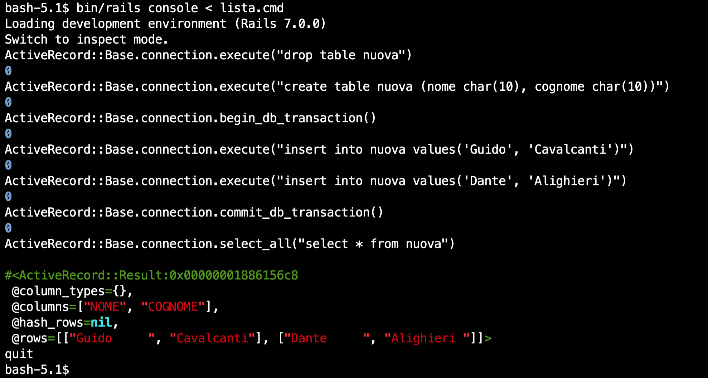
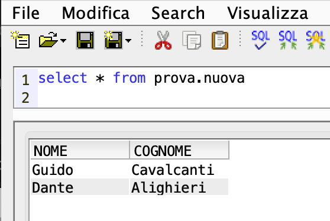
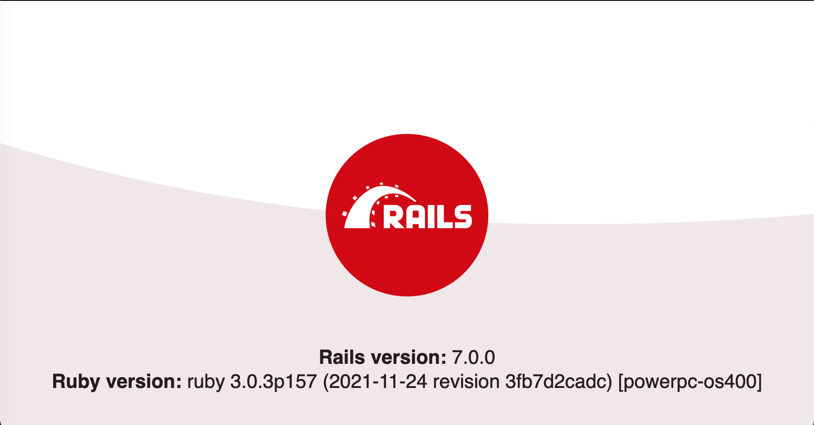

# RIBY
Tips for **Ruby 3.0** in *powerpc-os400*

----
When I was in High School I was quite good at Maths and I was often asked for help by classmates.
My nickname was *Riby*, out of my family name.

That's why I decided to name this GitHub repository **RIBY**: it is here to help the few that would be so courageous to face the hurdles of installing
Ruby gems in **IBM i PASE**.
Riby also has a curious assonance with **Ruby**, the programming language we will leverage on.

I would suggest an [IBM i chroot](https://github.com/IBM/ibmichroot) approach so you do not risk compromising any of your existing PASE configurations.

But let us start from the beginning, I will add content gradually based on the feedback of the... class!

The most recent content will be on top of the README so, if you will join later on, start reading from the bottom (or follow the index).

Let's go!

----
## INDEX

1. [to pave the way](#1-to-pave-the-way)
2. [to refurbish the flat](#2-to-refurbish-the-flat)
3. [to install Ruby 3.0](#3-to-install-ruby-30)
4. [to do everything once again](#4-to-do-everything-once-again)
5. [to study IBM i through PASE with Ruby](#5-to-study-ibm-i-through-pase-with-ruby)
6. [to gain confidence on Ruby language](#6-to-gain-confidence-on-ruby-language)
7. [to get acquainted with QSYS/QC2xx service programs](#7-to-get-acquainted-with-qsysqc2xx-service-programs)
8. [to execute a service program entry call from PASE](#8-to-execute-a-service-program-entry-call-from-pase)
9. [to gather information on space pointers from PASE](#9-to-gather-information-on-space-pointers-from-pase)
10. [to move around tagged pointers](#10-to-move-around-tagged-pointers)
11. [to investigate parameter passing](#11-to-investigate-parameter-passing)
12. [to investigate parameter passing again](#12-to-investigate-parameter-passing-again)
13. [to review the lesson on objects](#13-to-review-the-lesson-on-objects)
14. [to put previous lessons into practice](#14-to-put-previous-lessons-into-practice)
15. [to have fun by reliving old glories](#15-to-have-fun-by-reliving-old-glories)
16. [to have fun with QTEMP](#16-to-have-fun-with-qtemp)
17. [to retrieve job attributes](#17-to-retrieve-job-attributes)
18. [to retrieve command definition](#18-to-retrieve-command-definition)
19. [to pretend we do not care](#19-to-pretend-we-do-not-care)
20. [to increase our confidence](#20-to-increase-our-confidence)
21. [to connect](#21-to-connect)
22. [to get info about the DBMS](#22-to-get-info-about-the-dbms)
23. [to get the current setting of an attribute](#23-to-get-the-current-setting-of-an-attribute)
24. [to manage statements](#24-to-manage-statements)
25. [to diagnose on errors](#25-to-diagnose-on-errors)
26. [to finally execute statements](#26-to-finally-execute-statements)
27. [to commit our statements](#27-to-commit-our-statements)
28. [to design a Ruby gem](#28-to-design-a-ruby-gem)
29. [to document attribute values](#29-to-document-attribute-values)
30. [to set attributes](#30-to-set-attributes)
31. [to let Ruby free handles](#31-to-let-ruby-free-handles)
32. [to work hard for a fix](#32-to-work-hard-for-a-fix)
33. [to find a role for columns](#33-to-find-a-role-for-columns)
34. [to customize descriptors](#34-to-customize-descriptors)
35. [to enjoy DB2 encoding support](#35-to-enjoy-db2-encoding-support)
36. [to refresh the Ruby interpreter](#36-to-refresh-the-ruby-interpreter)
37. [to build Ruby gems requiring compilation](#37-to-build-ruby-gems-requiring-compilation)
38. [to test SQLite3 Ruby integration](#38-to-test-sqlite3-ruby-integration)
39. [to transform plain text into static websites](#39-to-transform-plain-text-into-static-websites)
40. [to install Rails](#40-to-install-rails)
41. [to upgrade Ruby](#41-to-upgrade-ruby)
42. [to install Rails 7](#42-to-install-rails-7)
43. [to fill the gap](#43-to-fill-the-gap)
44. [to understand ActiveRecord basic concepts](#44-to-understand-activerecord-basic-concepts)

<!---
3X. [to customize subsystem](#3X-to-customize-subsystem)

----
### 3X. to customize subsystem

There is [an IBM i Support document](https://www.ibm.com/support/pages/qsqsrvr-subsystem-customization) explaining how
to set up an application specific subsystem for the -otherwise **QSYSWRK**'s- SQL CLI connection jobs.
This obviously holds true only when SERVER MODE is active.

There is a corresponding Environment attribute named **SQL\_ATTR\_SERVERMODE\_SUBSYSTEM** that we were not retrieving 
in previous requests.

--->

----
### 44. to understand ActiveRecord basic concepts

Let us suppose to have a simple Rails 7 project configured for our brand new Rails adapter.
By using Rails console we can get rid of all the infrastructure and use the database 
connection directly. 
The methods I am referring to are directly provided by the `ActiveRecord::Base#connection` class:



We can inspect the content of the table just created:



Why the file named *NUOVA* is created inside the library named *PROVA*? All the database aspects of Rails project are configured by means of the YAML file named *config/database.yml*.
One of the parameters in this file is `default_schema`.
In our example it is set to 'PROVA':

``` yaml
default_schema: 'PROVA'
```

This means that there are other SQL statement that are actually executed. So, for example, in order to implement the `begin_db_transaction` I had to plug in the exact SQL consistent with IBM i DB2 dialect. The provided (ActiveRecord) one does nothing and is expected to be overridden.   

``` ruby
      def begin_db_transaction()    end


      def begin_isolated_db_transaction(isolation)
        raise ActiveRecord::TransactionIsolationError, "adapter does not support setting transaction isolation"
      end

      def commit_db_transaction()   end

```

Following is the current implementation of these method in the development version of my
*pure\-Ruby DB2 for i Rails adapter*:

``` ruby
      #
      # Active Record's default behavior is to autocommit SQL statements. 
      # By using begin_isolated_db_transaction or begin_db_transaction
      # we are suspending this mode (- per connection -) and taking care
      # of re-establishing it once COMMIT (or ROLLBACK) are performed
      #
      # Multiple commit_db_transaction will not work as multiple sql COMMITs:    
      # the autocommit mode will be re-established at the first COMMIT
      # 
          
      def begin_isolated_db_transaction(isolation)                                                              
        @connection.attrs={ :SQL_ATTR_AUTOCOMMIT => :SQL_FALSE }                                               
        execute("SET TRANSACTION ISOLATION LEVEL #{transaction_isolation_levels.fetch(isolation)}")
      end

      def begin_db_transaction  
        @connection.attrs={ :SQL_ATTR_AUTOCOMMIT => :SQL_FALSE }
        execute("SET TRANSACTION ISOLATION LEVEL READ COMMITTED")  
      end
        
      def commit_db_transaction               
        execute("COMMIT")
        set_initial_isolation_autocommit      
      end                                     
                                              
      def exec_rollback_db_transaction             
        execute("ROLLBACK")
        set_initial_isolation_autocommit      
      end            

      def set_initial_isolation_autocommit                             
        @connection.attrs={ :SQL_ATTR_AUTOCOMMIT => :SQL_TRUE }       
        execute("SET TRANSACTION ISOLATION LEVEL NO COMMIT")         
      end      
```

There are two aspects worth mentioning in adopting **READ COMMITTED**:

* SELECT **does see** the effects of previous updates executed within our own transaction **even though they are not yet committed**
* repeated SELECTs within a single transaction **can see different data** if other transactions commit changes after the execution of our first SELECT.

We can specify the desired **isolation level** for each transaction:

``` ruby
bash-5.1$ bin/rails console < lista5.cmd
Loading development environment (Rails 7.0.0)
Switch to inspect mode.
ActiveRecord::Base.connection.select_all("select * from nuova")
   (1.7ms)  SET SCHEMA PROVA
   (33.5ms)  select * from nuova

#<ActiveRecord::Result:0x0000000188398f80
 @column_types={},
 @columns=[],
 @hash_rows=nil,
 @rows=[["Guido     ", "Cavalcanti"], ["Dante     ", "Alighieri "]]>
ActiveRecord::Base.connection.commit_db_transaction()
   (1.1ms)  COMMIT
   (0.8ms)  SET TRANSACTION ISOLATION LEVEL NO COMMIT
0
ActiveRecord::Base.connection.begin_isolated_db_transaction(:serializable)
   (0.7ms)  SET TRANSACTION ISOLATION LEVEL SERIALIZABLE
0
ActiveRecord::Base.connection.execute("drop table nuova")
   (106.7ms)  drop table nuova
0
ActiveRecord::Base.connection.rollback_db_transaction()
   (15.2ms)  ROLLBACK
   (0.6ms)  SET TRANSACTION ISOLATION LEVEL NO COMMIT
0
ActiveRecord::Base.connection.begin_isolated_db_transaction(:serializable)
   (0.4ms)  SET TRANSACTION ISOLATION LEVEL SERIALIZABLE
0
ActiveRecord::Base.connection.execute("insert into nuova values('Francesco', 'Petrarca')")
   (24.0ms)  insert into nuova values('Francesco', 'Petrarca')
0
ActiveRecord::Base.connection.commit_db_transaction()
   (0.7ms)  COMMIT
   (0.7ms)  SET TRANSACTION ISOLATION LEVEL NO COMMIT
0
ActiveRecord::Base.connection.select_all("select * from nuova")
   (33.1ms)  select * from nuova

#<ActiveRecord::Result:0x00000001858a1890
 @column_types={},
 @columns=[],
 @hash_rows=nil,
 @rows=
  [["Guido     ", "Cavalcanti"],
   ["Dante     ", "Alighieri "],
   ["Francesco ", "Petrarca  "]]>
quit
bash-5.1$ 
```

----
### 43. to fill the gap

 *"There is nothing so practical as a good theory"* (Kurt Lewin) is an aphorism that perfectly applies to **ActiveRecord**'s workings.

Today I will investigate how to integrate Rails to IBM i DB2 by means of my previous experiments in using Ruby (and **fiddle**) to access **SQL Wide API**s as provided by IBM i QSQCLI service program. 

The interesting aspect of this integration effort is learning how the abstract class `AbstractAdapter` had been designed by Rails creator (*David Heinemeir Hansson*):
all the actual database Rails adapters follow the interface laid down in that class.

To grasp the idea, let us perform the following grep commands:
 
```
 cd /QOpenSys/pkgs/lib/ruby/gems/3.0.0/gems/activerecord-7.0.0/lib/active_record/connection_adapters/abstract
 echo "**** database_statements.rb ****"              
 grep -1 'raise NotImplementedError' database_statements.rb   
 echo "***** schema_statements.rb *****"            
 grep -1 'raise NotImplementedError' schema_statements.rb
```

This is what we get:

```
**** database_statements.rb ****
      def write_query?(sql)
        raise NotImplementedError
      end
--
      def execute(sql, name = nil)
        raise NotImplementedError
      end
--
      def exec_query(sql, name = "SQL", binds = [], prepare: false)
        raise NotImplementedError
      end
--
      def explain(arel, binds = []) # :nodoc:
        raise NotImplementedError
      end
***** schema_statements.rb *****
      def indexes(table_name)
        raise NotImplementedError, "#indexes is not implemented"
      end
--
      def rename_table(table_name, new_name)
        raise NotImplementedError, "rename_table is not implemented"
      end
--
      def change_column(table_name, column_name, type, **options)
        raise NotImplementedError, "change_column is not implemented"
      end
--
      def change_column_default(table_name, column_name, default_or_changes)
        raise NotImplementedError, "change_column_default is not implemented"
      end
--
      def change_column_null(table_name, column_name, null, default = nil)
        raise NotImplementedError, "change_column_null is not implemented"
      end
--
      def rename_column(table_name, column_name, new_column_name)
        raise NotImplementedError, "rename_column is not implemented"
      end
--
      def foreign_keys(table_name)
        raise NotImplementedError, "foreign_keys is not implemented"
      end
--
      def check_constraints(table_name)
        raise NotImplementedError
      end
--
      def change_table_comment(table_name, comment_or_changes)
        raise NotImplementedError, "#{self.class} does not support changing table comments"
      end
--
      def change_column_comment(table_name, column_name, comment_or_changes)
        raise NotImplementedError, "#{self.class} does not support changing column comments"
      end
--
        def data_source_sql(name = nil, type: nil)
          raise NotImplementedError
        end
--
        def quoted_scope(name = nil, type: nil)
          raise NotImplementedError
        end
```

Writing a Rails adapter for a specific database grossly means:

* defining a new class that inherits its behavior from the *AbstractAdapter* and 
* providing an implementation for the listed methods 

Many other aspects will be required but we have a few days to relax and enjoy using **Rails 7 with IBM i DB2**.

Stay tuned!

[NEXT-44](#44-to-understand-activerecord-basic-concepts)

----
### 42. to install Rails 7



[NEXT-43](#43-to-fill-the-gap)

----
### 41. to upgrade Ruby

A new version of *Ruby* (**3.0.3**) is available:

```
bash-5.1$ ruby -v
ruby 3.0.3p157 (2021-11-24 revision 3fb7d2cadc) [powerpc-os400]
```

Use `yum upgrade ruby ruby-devel`

This release includes [security fixes](https://www.ruby-lang.org/en/news/2021/11/24/ruby-3-0-3-released/).

[NEXT-42](#42-to-install-rails-7)

----
### 40. to install Rails


It is time to finally play with Rails.

The installation is plain, only remember the `export OBJECT_MODE=64` to help the native binary tools adopt the `X64` mode.

Before executing `rails new` command, perform the following patches.


In the `railties` Gemfile templates:

```
/QOpenSys/pkgs/lib/ruby/gems/3.0.0/gems/railties-6.1.4.1/lib/rails/generators/rails/app/templates/Gemfile.tt
/QOpenSys/pkgs/lib/ruby/gems/3.0.0/gems/railties-6.1.4.1/lib/rails/generators/rails/plugin/templates/Gemfile.tt
```

replace:

`gem 'tzinfo-data', platforms: [:mingw, :mswin, :x64_mingw, :jruby]`

with:

`gem 'tzinfo-data', platforms: [:mingw, :mswin, :x64_mingw, :jruby, :ruby]`


Now proceed with `rails new blog`

Then change directory entering the newly created `blog` one and execute:

`bin/rails server -p 3010 -b 0.0.0.0`

Enjoy practicing with Rails on IBM i!

[NEXT-41](#41-to-upgrade-ruby)

----
### 39. to transform plain text into static websites

Ruby ecosystem offers a number of useful utilities. So let us test our most recent build to provide real support in **IBM i PASE**.

We will first learn how to perform a **scratch install** of Ruby.

We know that issuing `yum remove ruby` we will remove *ruby* and *ruby\-devel* as soon as *ruby* is a pre-requisite for *ruby\-devel*. 

The fact is that these operations will not empty the `/QOpenSys/pkgs/lib/ruby` directory: we will find there all the gems installed via `gem install` commands.

To really get rid of everything that has to do with Ruby installation perform:

```
yum remove ruby
```

and

```
rm -r /QOpenSys/pkgs/lib/ruby
``` 

I suggest to proceed this way because the most recent builds I am distributing for IBM i PASE shifted towards a shared **libruby.so** approach (`--enable-shared`). *Important:* be aware that performing a `rm -r` can be **very** dangerous, so be careful!

Once the two steps are performed we can start again a fresh new installation:

```
yum install ruby-devel
```

And now we will install a new set of gems triggered by the dependency chain defined for each of the packages we are interested in. 

**Before** issuing:

```
gem install webrick bundler jekyll
```

we need to consider something we explained for *SQLite3* in previous posts:
some of the required gems could require a real build, i.e. will compile resources from C/C++ source code.

As soon as nobody else than me \-probably\- tried to package a `powerpc-os400` version of the Ruby interpreter, we need to help a bit in order for this kind of magic to succeed.
 
You will proceed this way:

```
export OBJECT_MODE=64
gem install webrick bundler jekyll --no-document
```

The `--no-document` option disable documentation generation saving time in our tests.

We will be amused to notice that the command completes successfully:

```
bash-5.1$ gem install webrick bundler jekyll --no-document
Fetching webrick-1.7.0.gem
Successfully installed webrick-1.7.0
Fetching bundler-2.2.28.gem
Successfully installed bundler-2.2.28
Fetching pathutil-0.16.2.gem
Fetching unicode-display_width-1.8.0.gem
Fetching liquid-4.0.3.gem
Fetching forwardable-extended-2.6.0.gem
Fetching safe_yaml-1.0.5.gem
Fetching rouge-3.26.1.gem
Fetching terminal-table-2.0.0.gem
Fetching mercenary-0.4.0.gem
Fetching kramdown-2.3.1.gem
Fetching kramdown-parser-gfm-1.1.0.gem
Fetching ffi-1.15.4.gem
Fetching rb-inotify-0.10.1.gem
Fetching rb-fsevent-0.11.0.gem
Fetching listen-3.7.0.gem
Fetching jekyll-watch-2.2.1.gem
Fetching sassc-2.4.0.gem
Fetching jekyll-sass-converter-2.1.0.gem
Fetching concurrent-ruby-1.1.9.gem
Fetching i18n-1.8.10.gem
Fetching http_parser.rb-0.6.0.gem
Fetching eventmachine-1.2.7.gem
Fetching em-websocket-0.5.2.gem
Fetching colorator-1.1.0.gem
Fetching public_suffix-4.0.6.gem
Fetching addressable-2.8.0.gem
Fetching jekyll-4.2.1.gem
Successfully installed unicode-display_width-1.8.0
Successfully installed terminal-table-2.0.0
Successfully installed safe_yaml-1.0.5
Successfully installed rouge-3.26.1
Successfully installed forwardable-extended-2.6.0
Successfully installed pathutil-0.16.2
Successfully installed mercenary-0.4.0
Successfully installed liquid-4.0.3
Successfully installed kramdown-2.3.1
Successfully installed kramdown-parser-gfm-1.1.0
Building native extensions. This could take a while...
Successfully installed ffi-1.15.4
Successfully installed rb-inotify-0.10.1
Successfully installed rb-fsevent-0.11.0
Successfully installed listen-3.7.0
Successfully installed jekyll-watch-2.2.1
Building native extensions. This could take a while...
Successfully installed sassc-2.4.0
Successfully installed jekyll-sass-converter-2.1.0
Successfully installed concurrent-ruby-1.1.9
Successfully installed i18n-1.8.10
Building native extensions. This could take a while...
Successfully installed http_parser.rb-0.6.0
Building native extensions. This could take a while...
Successfully installed eventmachine-1.2.7
Successfully installed em-websocket-0.5.2
Successfully installed colorator-1.1.0
Successfully installed public_suffix-4.0.6
Successfully installed addressable-2.8.0
Successfully installed jekyll-4.2.1
28 gems installed
``` 

Everytime we read `Building native extensions. This could take a while...` a C/C++ build occurred having as a final object a **.so** file providing a performant extension for the Ruby language. For each message in the log, the gem involved (`Successfully installed`) is the one that follows.

We can double check this point by listing the powerpc\-os400 gem extensions:

```
ls -la /QOpenSys/pkgs/lib/ruby/gems/3.0.0/extensions/powerpc-os400/3.0.0
total 48
drwxrwxr-x 2 110 0 8192 ott  7 09:30 eventmachine-1.2.7
drwxrwxr-x 2 110 0 8192 ott  7 09:25 ffi-1.15.4
drwxrwxr-x 2 110 0 8192 ott  7 09:30 http_parser.rb-0.6.0
drwxrwxr-x 3 110 0 8192 ott  7 09:29 sassc-2.4.0
drwxrwxr-x 6 110 0 8192 ott  7 09:30 .
drwxrwxr-x 3 110 0 8192 ott  7 09:25 ..
``` 

We have to refrain from using **Jekyll** right now. It is installed but will fail in our environment. Let us first instruct **ffi** gem on the existence of *powerpc\-os400*!

I will brutally adopt these steps (for the moment):

```
cd /QOpenSys/pkgs/lib/ruby/gems/3.0.0/gems/ffi-1.15.4/lib/ffi/platform
mkdir powerpc-os400
cp powerpc-aix/types.conf powerpc-os400/
cd $HOME
```  

We can finally follow the instructions from [Jekyll web site](https://jekyllrb.com)

```
bash-5.1$ jekyll new my-awesome-site
Running bundle install in /home/AndreaRibuoli/my-awesome-site... 
  Bundler: Fetching gem metadata from https://rubygems.org/..........
  Bundler: Resolving dependencies...
  Bundler: Using public_suffix 4.0.6
  Bundler: Using bundler 2.2.28
  Bundler: Using colorator 1.1.0
  Bundler: Using concurrent-ruby 1.1.9
  Bundler: Using eventmachine 1.2.7
  Bundler: Using http_parser.rb 0.6.0
  Bundler: Using ffi 1.15.4
  Bundler: Using forwardable-extended 2.6.0
  Bundler: Using rb-fsevent 0.11.0
  Bundler: Using rexml 3.2.5
  Bundler: Using liquid 4.0.3
  Bundler: Using mercenary 0.4.0
  Bundler: Using rouge 3.26.1
  Bundler: Using safe_yaml 1.0.5
  Bundler: Using unicode-display_width 1.8.0
  Bundler: Using addressable 2.8.0
  Bundler: Using i18n 1.8.10
  Bundler: Using em-websocket 0.5.2
  Bundler: Using pathutil 0.16.2
  Bundler: Using kramdown 2.3.1
  Bundler: Using terminal-table 2.0.0
  Bundler: Using kramdown-parser-gfm 1.1.0
  Bundler: Using sassc 2.4.0
  Bundler: Using rb-inotify 0.10.1
  Bundler: Using jekyll-sass-converter 2.1.0
  Bundler: Using listen 3.7.0
  Bundler: Using jekyll-watch 2.2.1
  Bundler: Using jekyll 4.2.1
  Bundler: Fetching jekyll-feed 0.15.1
  Bundler: Fetching jekyll-seo-tag 2.7.1
  Bundler: Installing jekyll-feed 0.15.1
  Bundler: Installing jekyll-seo-tag 2.7.1
  Bundler: Fetching minima 2.5.1
  Bundler: Installing minima 2.5.1
  Bundler: Bundle complete! 6 Gemfile dependencies, 31 gems now installed.
  Bundler: Use `bundle info [gemname]` to see where a bundled gem is installed.
New jekyll site installed in /home/AndreaRibuoli/my-awesome-site. 
bash-5.1$ 
```

But another failure is waiting. This is a known issue when using Jekyll in Ruby 3.0. Historically Ruby distributions always included **WEBrick** (*a flexible, pure-Ruby HTTP server toolkit*) in the standard library. 

With Ruby 3.0 [from the announcement](https://www.ruby-lang.org/en/news/2020/12/25/ruby-3-0-0-released/):

```
  The following libraries are no longer bundled gems or standard libraries.   
  Install the corresponding gems to use these features.   
  . . . 
  -  webrick
  . . . 
  
```   

This is why we added `webrick` among the gems to be installed with `jekyll`.
But Jekyll also uses **Bundler**. 
Bundler *provides a consistent environment for Ruby projects by tracking and installing the exact gems and versions that are needed*. 
The point is that Bundler prevents you to use a gem if not explicitely declared in the project's **Gemfile**. It actually controls that the version of each dependency matches with that in **Gemfile.lock**.

As soon as WEBrick was part of the standard library distribution it was required by Jekyll without an entry in the Gemfiles it creates.
Right now ([it will possibly be fixed in the near future](https://github.com/jekyll/jekyll/issues/8523)) we will add it manually:

```
cd my-awesome-site
echo 'gem "webrick"' >> Gemfile
bundle install
```

We will notice the number of gems bundled increments by one and webrick is among them:

```
...
Using webrick 1.7.0
...
Using minima 2.5.1
Bundle complete! 7 Gemfile dependencies, 32 gems now installed.
Use `bundle info [gemname]` to see where a bundled gem is installed.
```

We can start serving and enjoy Jekyll clever design.
Connect with a browser using the `--host` and `--port` setting.
Next time we will learn how to integrate Jekyll with native **IBM i** leveraging its **Auto-regenaration** feature.

```
bash-5.1$ bundle exec jekyll serve --host 10.0.0.10 --port 4000
Configuration file: /home/AndreaRibuoli/my-awesome-site/_config.yml
            Source: /home/AndreaRibuoli/my-awesome-site
       Destination: /home/AndreaRibuoli/my-awesome-site/_site
 Incremental build: disabled. Enable with --incremental
      Generating... 
       Jekyll Feed: Generating feed for posts
                    done in 0.979 seconds.
 Auto-regeneration: enabled for '/home/AndreaRibuoli/my-awesome-site'
    Server address: http://10.0.0.10:4000/
  Server running... press ctrl-c to stop.
```

[NEXT-40](#40-to-install-rails)

----
### 38. to test SQLite3 Ruby integration

Executing gems' tests is a fundamental step in verifying the installation of crucial Ruby components.
This is especially true if the platform (i.e. `powerpc-os400`) was unknown to the developers.

Usually testing poses extra requirements. We continue previous post session unpacking the gem content and 
changing the current directory: 

```
bash-5.1$ gem unpack ./sqlite3-1.4.2.gem
Unpacked gem: '/home/ANDREARIB/sqlite3-1.4.2'
bash-5.1$ cd ./sqlite3-1.4.2
```

By executing repeated attempts of the `rake test` command we will experience errors like this:

```
. . .
Caused by:
LoadError: cannot load such file -- hoe
. . .
```

Indirectly we will be instructed to perform the following `gem install` commands:

```
bash-5.1$ gem install hoe
Fetching hoe-3.23.0.gem
Successfully installed hoe-3.23.0
Parsing documentation for hoe-3.23.0
Installing ri documentation for hoe-3.23.0
Done installing documentation for hoe after 0 seconds
1 gem installed
```

```
bash-5.1$ gem install rake-compiler
Fetching rake-compiler-1.1.1.gem
Successfully installed rake-compiler-1.1.1
Parsing documentation for rake-compiler-1.1.1
Installing ri documentation for rake-compiler-1.1.1
Done installing documentation for rake-compiler after 2 seconds
1 gem installed
```

```
bash-5.1$ gem install mini_portile
Fetching mini_portile-0.6.2.gem
Successfully installed mini_portile-0.6.2
Parsing documentation for mini_portile-0.6.2
Installing ri documentation for mini_portile-0.6.2
Done installing documentation for mini_portile after 0 seconds
1 gem installed
```

Now we are finally able to execute the test suite.
Following is the full log, but we are actually looking for this final report:


**267 runs, 440 assertions, 0 failures, 0 errors, 1 skips**


Here's the full log:

```
bash-5.1$ rake test
DEPRECATED: Please switch readme to hash format for urls.
  Only defining 'home' url.
  This will be removed on or after 2020-10-28.
mkdir -p tmp/powerpc-os400/sqlite3_native/3.0.2
cd tmp/powerpc-os400/sqlite3_native/3.0.2
/QOpenSys/pkgs/bin/ruby -I. ../../../../ext/sqlite3/extconf.rb
checking for sqlite3.h... yes
checking for pthread_create() in -lpthread... yes
checking for -ldl... yes
checking for sqlite3_libversion_number() in -lsqlite3... yes
checking for rb_proc_arity()... yes
checking for rb_integer_pack()... yes
checking for sqlite3_initialize()... yes
checking for sqlite3_backup_init()... yes
checking for sqlite3_column_database_name()... yes
checking for sqlite3_enable_load_extension()... yes
checking for sqlite3_load_extension()... yes
checking for sqlite3_open_v2()... yes
checking for sqlite3_prepare_v2()... yes
checking for sqlite3_int64 in sqlite3.h... yes
checking for sqlite3_uint64 in sqlite3.h... yes
creating Makefile
cd -
cd tmp/powerpc-os400/sqlite3_native/3.0.2
/QOpenSys/usr/bin/make
compiling ../../../../ext/sqlite3/aggregator.c
compiling ../../../../ext/sqlite3/backup.c
compiling ../../../../ext/sqlite3/database.c
../../../../ext/sqlite3/database.c: In function 'exec_batch':
../../../../ext/sqlite3/database.c:726:57: warning: passing argument 3 of 'sqlite3_exec' from incompatible pointer type [-Wincompatible-pointer-types]
     status = sqlite3_exec(ctx->db, StringValuePtr(sql), hash_callback_function, callback_ary, &errMsg);
                                                         ^~~~~~~~~~~~~~~~~~~~~~
In file included from ../../../../ext/sqlite3/sqlite3_ruby.h:25:0,
                 from ../../../../ext/sqlite3/database.c:1:
/QOpenSys/pkgs/include/sqlite3.h:402:16: note: expected 'int (*)(void *, int,  char **, char **)' but argument is of type 'int (*)(VALUE,  int,  char **, char **) {aka int (*)(long unsigned int,  int,  char **, char **)}'
 SQLITE_API int sqlite3_exec(
                ^~~~~~~~~~~~
../../../../ext/sqlite3/database.c:726:81: warning: passing argument 4 of 'sqlite3_exec' makes pointer from integer without a cast [-Wint-conversion]
     status = sqlite3_exec(ctx->db, StringValuePtr(sql), hash_callback_function, callback_ary, &errMsg);
                                                                                 ^~~~~~~~~~~~
In file included from ../../../../ext/sqlite3/sqlite3_ruby.h:25:0,
                 from ../../../../ext/sqlite3/database.c:1:
/QOpenSys/pkgs/include/sqlite3.h:402:16: note: expected 'void *' but argument is of type 'VALUE {aka long unsigned int}'
 SQLITE_API int sqlite3_exec(
                ^~~~~~~~~~~~
../../../../ext/sqlite3/database.c:728:57: warning: passing argument 3 of 'sqlite3_exec' from incompatible pointer type [-Wincompatible-pointer-types]
     status = sqlite3_exec(ctx->db, StringValuePtr(sql), regular_callback_function, callback_ary, &errMsg);
                                                         ^~~~~~~~~~~~~~~~~~~~~~~~~
In file included from ../../../../ext/sqlite3/sqlite3_ruby.h:25:0,
                 from ../../../../ext/sqlite3/database.c:1:
/QOpenSys/pkgs/include/sqlite3.h:402:16: note: expected 'int (*)(void *, int,  char **, char **)' but argument is of type 'int (*)(VALUE,  int,  char **, char **) {aka int (*)(long unsigned int,  int,  char **, char **)}'
 SQLITE_API int sqlite3_exec(
                ^~~~~~~~~~~~
../../../../ext/sqlite3/database.c:728:84: warning: passing argument 4 of 'sqlite3_exec' makes pointer from integer without a cast [-Wint-conversion]
     status = sqlite3_exec(ctx->db, StringValuePtr(sql), regular_callback_function, callback_ary, &errMsg);
                                                                                    ^~~~~~~~~~~~
In file included from ../../../../ext/sqlite3/sqlite3_ruby.h:25:0,
                 from ../../../../ext/sqlite3/database.c:1:
/QOpenSys/pkgs/include/sqlite3.h:402:16: note: expected 'void *' but argument is of type 'VALUE {aka long unsigned int}'
 SQLITE_API int sqlite3_exec(
                ^~~~~~~~~~~~
compiling ../../../../ext/sqlite3/exception.c
compiling ../../../../ext/sqlite3/sqlite3.c
compiling ../../../../ext/sqlite3/statement.c
linking shared-object sqlite3/sqlite3_native.so
Target "all" is up to date.
cd -
mkdir -p tmp/powerpc-os400/stage/lib/sqlite3
cp .gemtest tmp/powerpc-os400/stage/.gemtest
cp .travis.yml tmp/powerpc-os400/stage/.travis.yml
cp API_CHANGES.rdoc tmp/powerpc-os400/stage/API_CHANGES.rdoc
cp CHANGELOG.rdoc tmp/powerpc-os400/stage/CHANGELOG.rdoc
cp ChangeLog.cvs tmp/powerpc-os400/stage/ChangeLog.cvs
cp Gemfile tmp/powerpc-os400/stage/Gemfile
cp LICENSE tmp/powerpc-os400/stage/LICENSE
cp Manifest.txt tmp/powerpc-os400/stage/Manifest.txt
cp README.rdoc tmp/powerpc-os400/stage/README.rdoc
cp Rakefile tmp/powerpc-os400/stage/Rakefile
cp appveyor.yml tmp/powerpc-os400/stage/appveyor.yml
mkdir -p tmp/powerpc-os400/stage/ext/sqlite3
cp ext/sqlite3/aggregator.c tmp/powerpc-os400/stage/ext/sqlite3/aggregator.c
cp ext/sqlite3/aggregator.h tmp/powerpc-os400/stage/ext/sqlite3/aggregator.h
cp ext/sqlite3/backup.c tmp/powerpc-os400/stage/ext/sqlite3/backup.c
cp ext/sqlite3/backup.h tmp/powerpc-os400/stage/ext/sqlite3/backup.h
cp ext/sqlite3/database.c tmp/powerpc-os400/stage/ext/sqlite3/database.c
cp ext/sqlite3/database.h tmp/powerpc-os400/stage/ext/sqlite3/database.h
cp ext/sqlite3/exception.c tmp/powerpc-os400/stage/ext/sqlite3/exception.c
cp ext/sqlite3/exception.h tmp/powerpc-os400/stage/ext/sqlite3/exception.h
cp ext/sqlite3/extconf.rb tmp/powerpc-os400/stage/ext/sqlite3/extconf.rb
cp ext/sqlite3/sqlite3.c tmp/powerpc-os400/stage/ext/sqlite3/sqlite3.c
cp ext/sqlite3/sqlite3_ruby.h tmp/powerpc-os400/stage/ext/sqlite3/sqlite3_ruby.h
cp ext/sqlite3/statement.c tmp/powerpc-os400/stage/ext/sqlite3/statement.c
cp ext/sqlite3/statement.h tmp/powerpc-os400/stage/ext/sqlite3/statement.h
mkdir -p tmp/powerpc-os400/stage/faq
cp faq/faq.rb tmp/powerpc-os400/stage/faq/faq.rb
cp faq/faq.yml tmp/powerpc-os400/stage/faq/faq.yml
cp lib/sqlite3.rb tmp/powerpc-os400/stage/lib/sqlite3.rb
cp lib/sqlite3/constants.rb tmp/powerpc-os400/stage/lib/sqlite3/constants.rb
cp lib/sqlite3/database.rb tmp/powerpc-os400/stage/lib/sqlite3/database.rb
cp lib/sqlite3/errors.rb tmp/powerpc-os400/stage/lib/sqlite3/errors.rb
cp lib/sqlite3/pragmas.rb tmp/powerpc-os400/stage/lib/sqlite3/pragmas.rb
cp lib/sqlite3/resultset.rb tmp/powerpc-os400/stage/lib/sqlite3/resultset.rb
cp lib/sqlite3/statement.rb tmp/powerpc-os400/stage/lib/sqlite3/statement.rb
cp lib/sqlite3/translator.rb tmp/powerpc-os400/stage/lib/sqlite3/translator.rb
cp lib/sqlite3/value.rb tmp/powerpc-os400/stage/lib/sqlite3/value.rb
cp lib/sqlite3/version.rb tmp/powerpc-os400/stage/lib/sqlite3/version.rb
mkdir -p tmp/powerpc-os400/stage/rakelib
cp rakelib/faq.rake tmp/powerpc-os400/stage/rakelib/faq.rake
cp rakelib/gem.rake tmp/powerpc-os400/stage/rakelib/gem.rake
cp rakelib/native.rake tmp/powerpc-os400/stage/rakelib/native.rake
cp rakelib/vendor_sqlite3.rake tmp/powerpc-os400/stage/rakelib/vendor_sqlite3.rake
cp setup.rb tmp/powerpc-os400/stage/setup.rb
mkdir -p tmp/powerpc-os400/stage/test
cp test/helper.rb tmp/powerpc-os400/stage/test/helper.rb
cp test/test_backup.rb tmp/powerpc-os400/stage/test/test_backup.rb
cp test/test_collation.rb tmp/powerpc-os400/stage/test/test_collation.rb
cp test/test_database.rb tmp/powerpc-os400/stage/test/test_database.rb
cp test/test_database_flags.rb tmp/powerpc-os400/stage/test/test_database_flags.rb
cp test/test_database_readonly.rb tmp/powerpc-os400/stage/test/test_database_readonly.rb
cp test/test_database_readwrite.rb tmp/powerpc-os400/stage/test/test_database_readwrite.rb
cp test/test_deprecated.rb tmp/powerpc-os400/stage/test/test_deprecated.rb
cp test/test_encoding.rb tmp/powerpc-os400/stage/test/test_encoding.rb
cp test/test_integration.rb tmp/powerpc-os400/stage/test/test_integration.rb
cp test/test_integration_aggregate.rb tmp/powerpc-os400/stage/test/test_integration_aggregate.rb
cp test/test_integration_open_close.rb tmp/powerpc-os400/stage/test/test_integration_open_close.rb
cp test/test_integration_pending.rb tmp/powerpc-os400/stage/test/test_integration_pending.rb
cp test/test_integration_resultset.rb tmp/powerpc-os400/stage/test/test_integration_resultset.rb
cp test/test_integration_statement.rb tmp/powerpc-os400/stage/test/test_integration_statement.rb
cp test/test_result_set.rb tmp/powerpc-os400/stage/test/test_result_set.rb
cp test/test_sqlite3.rb tmp/powerpc-os400/stage/test/test_sqlite3.rb
cp test/test_statement.rb tmp/powerpc-os400/stage/test/test_statement.rb
cp test/test_statement_execute.rb tmp/powerpc-os400/stage/test/test_statement_execute.rb
install -c tmp/powerpc-os400/sqlite3_native/3.0.2/sqlite3_native.so lib/sqlite3/sqlite3_native.so
cp tmp/powerpc-os400/sqlite3_native/3.0.2/sqlite3_native.so tmp/powerpc-os400/stage/lib/sqlite3/sqlite3_native.so
Run options: --seed 19055

# Running:

......./home/ANDREARIB/sqlite3-1.4.2/test/test_database.rb:93:in `test_execute_with_type_translation_and_hash' is calling SQLite3::Database#type_translation=
SQLite3::Database#type_translation= is deprecated and will be removed
in version 2.0.0.
/home/ANDREARIB/sqlite3-1.4.2/lib/sqlite3/translator.rb:75:in `block in register_default_translators' is calling `add_translator`.
Built in translators are deprecated and will be removed in version 2.0.0
/home/ANDREARIB/sqlite3-1.4.2/lib/sqlite3/translator.rb:75:in `block in register_default_translators' is calling `add_translator`.
Built in translators are deprecated and will be removed in version 2.0.0
/home/ANDREARIB/sqlite3-1.4.2/lib/sqlite3/translator.rb:77:in `register_default_translators' is calling `add_translator`.
Built in translators are deprecated and will be removed in version 2.0.0
/home/ANDREARIB/sqlite3-1.4.2/lib/sqlite3/translator.rb:78:in `register_default_translators' is calling `add_translator`.
Built in translators are deprecated and will be removed in version 2.0.0
/home/ANDREARIB/sqlite3-1.4.2/lib/sqlite3/translator.rb:86:in `block in register_default_translators' is calling `add_translator`.
Built in translators are deprecated and will be removed in version 2.0.0
/home/ANDREARIB/sqlite3-1.4.2/lib/sqlite3/translator.rb:86:in `block in register_default_translators' is calling `add_translator`.
Built in translators are deprecated and will be removed in version 2.0.0
/home/ANDREARIB/sqlite3-1.4.2/lib/sqlite3/translator.rb:86:in `block in register_default_translators' is calling `add_translator`.
Built in translators are deprecated and will be removed in version 2.0.0
/home/ANDREARIB/sqlite3-1.4.2/lib/sqlite3/translator.rb:86:in `block in register_default_translators' is calling `add_translator`.
Built in translators are deprecated and will be removed in version 2.0.0
/home/ANDREARIB/sqlite3-1.4.2/lib/sqlite3/translator.rb:86:in `block in register_default_translators' is calling `add_translator`.
Built in translators are deprecated and will be removed in version 2.0.0
/home/ANDREARIB/sqlite3-1.4.2/lib/sqlite3/translator.rb:86:in `block in register_default_translators' is calling `add_translator`.
Built in translators are deprecated and will be removed in version 2.0.0
/home/ANDREARIB/sqlite3-1.4.2/lib/sqlite3/translator.rb:86:in `block in register_default_translators' is calling `add_translator`.
Built in translators are deprecated and will be removed in version 2.0.0
/home/ANDREARIB/sqlite3-1.4.2/lib/sqlite3/translator.rb:92:in `block in register_default_translators' is calling `add_translator`.
Built in translators are deprecated and will be removed in version 2.0.0
/home/ANDREARIB/sqlite3-1.4.2/lib/sqlite3/translator.rb:92:in `block in register_default_translators' is calling `add_translator`.
Built in translators are deprecated and will be removed in version 2.0.0
/home/ANDREARIB/sqlite3-1.4.2/lib/sqlite3/translator.rb:92:in `block in register_default_translators' is calling `add_translator`.
Built in translators are deprecated and will be removed in version 2.0.0
/home/ANDREARIB/sqlite3-1.4.2/lib/sqlite3/translator.rb:92:in `block in register_default_translators' is calling `add_translator`.
Built in translators are deprecated and will be removed in version 2.0.0
/home/ANDREARIB/sqlite3-1.4.2/lib/sqlite3/translator.rb:92:in `block in register_default_translators' is calling `add_translator`.
Built in translators are deprecated and will be removed in version 2.0.0
/home/ANDREARIB/sqlite3-1.4.2/lib/sqlite3/translator.rb:97:in `block in register_default_translators' is calling `add_translator`.
Built in translators are deprecated and will be removed in version 2.0.0
/home/ANDREARIB/sqlite3-1.4.2/lib/sqlite3/translator.rb:97:in `block in register_default_translators' is calling `add_translator`.
Built in translators are deprecated and will be removed in version 2.0.0
/home/ANDREARIB/sqlite3-1.4.2/lib/sqlite3/translator.rb:97:in `block in register_default_translators' is calling `add_translator`.
Built in translators are deprecated and will be removed in version 2.0.0
/home/ANDREARIB/sqlite3-1.4.2/lib/sqlite3/translator.rb:106:in `register_default_translators' is calling `add_translator`.
Built in translators are deprecated and will be removed in version 2.0.0
...................../home/ANDREARIB/sqlite3-1.4.2/test/test_database.rb:87:in `test_get_first_row_with_type_translation_and_hash_results' is calling SQLite3::Database#type_translation=
SQLite3::Database#type_translation= is deprecated and will be removed
in version 2.0.0.
/home/ANDREARIB/sqlite3-1.4.2/lib/sqlite3/translator.rb:75:in `block in register_default_translators' is calling `add_translator`.
Built in translators are deprecated and will be removed in version 2.0.0
/home/ANDREARIB/sqlite3-1.4.2/lib/sqlite3/translator.rb:75:in `block in register_default_translators' is calling `add_translator`.
Built in translators are deprecated and will be removed in version 2.0.0
/home/ANDREARIB/sqlite3-1.4.2/lib/sqlite3/translator.rb:77:in `register_default_translators' is calling `add_translator`.
Built in translators are deprecated and will be removed in version 2.0.0
/home/ANDREARIB/sqlite3-1.4.2/lib/sqlite3/translator.rb:78:in `register_default_translators' is calling `add_translator`.
Built in translators are deprecated and will be removed in version 2.0.0
/home/ANDREARIB/sqlite3-1.4.2/lib/sqlite3/translator.rb:86:in `block in register_default_translators' is calling `add_translator`.
Built in translators are deprecated and will be removed in version 2.0.0
/home/ANDREARIB/sqlite3-1.4.2/lib/sqlite3/translator.rb:86:in `block in register_default_translators' is calling `add_translator`.
Built in translators are deprecated and will be removed in version 2.0.0
/home/ANDREARIB/sqlite3-1.4.2/lib/sqlite3/translator.rb:86:in `block in register_default_translators' is calling `add_translator`.
Built in translators are deprecated and will be removed in version 2.0.0
/home/ANDREARIB/sqlite3-1.4.2/lib/sqlite3/translator.rb:86:in `block in register_default_translators' is calling `add_translator`.
Built in translators are deprecated and will be removed in version 2.0.0
/home/ANDREARIB/sqlite3-1.4.2/lib/sqlite3/translator.rb:86:in `block in register_default_translators' is calling `add_translator`.
Built in translators are deprecated and will be removed in version 2.0.0
/home/ANDREARIB/sqlite3-1.4.2/lib/sqlite3/translator.rb:86:in `block in register_default_translators' is calling `add_translator`.
Built in translators are deprecated and will be removed in version 2.0.0
/home/ANDREARIB/sqlite3-1.4.2/lib/sqlite3/translator.rb:86:in `block in register_default_translators' is calling `add_translator`.
Built in translators are deprecated and will be removed in version 2.0.0
/home/ANDREARIB/sqlite3-1.4.2/lib/sqlite3/translator.rb:92:in `block in register_default_translators' is calling `add_translator`.
Built in translators are deprecated and will be removed in version 2.0.0
/home/ANDREARIB/sqlite3-1.4.2/lib/sqlite3/translator.rb:92:in `block in register_default_translators' is calling `add_translator`.
Built in translators are deprecated and will be removed in version 2.0.0
/home/ANDREARIB/sqlite3-1.4.2/lib/sqlite3/translator.rb:92:in `block in register_default_translators' is calling `add_translator`.
Built in translators are deprecated and will be removed in version 2.0.0
/home/ANDREARIB/sqlite3-1.4.2/lib/sqlite3/translator.rb:92:in `block in register_default_translators' is calling `add_translator`.
Built in translators are deprecated and will be removed in version 2.0.0
/home/ANDREARIB/sqlite3-1.4.2/lib/sqlite3/translator.rb:92:in `block in register_default_translators' is calling `add_translator`.
Built in translators are deprecated and will be removed in version 2.0.0
/home/ANDREARIB/sqlite3-1.4.2/lib/sqlite3/translator.rb:97:in `block in register_default_translators' is calling `add_translator`.
Built in translators are deprecated and will be removed in version 2.0.0
/home/ANDREARIB/sqlite3-1.4.2/lib/sqlite3/translator.rb:97:in `block in register_default_translators' is calling `add_translator`.
Built in translators are deprecated and will be removed in version 2.0.0
/home/ANDREARIB/sqlite3-1.4.2/lib/sqlite3/translator.rb:97:in `block in register_default_translators' is calling `add_translator`.
Built in translators are deprecated and will be removed in version 2.0.0
/home/ANDREARIB/sqlite3-1.4.2/lib/sqlite3/translator.rb:106:in `register_default_translators' is calling `add_translator`.
Built in translators are deprecated and will be removed in version 2.0.0
........................................................./home/ANDREARIB/sqlite3-1.4.2/test/test_statement.rb:130:in `test_bind_blob' is calling SQLite3::ResultSet::ArrayWithTypesAndFields#types.  This method will be removed in
sqlite3 version 2.0.0, please call the `types` method on the SQLite3::ResultSet
object that created this object
................................................................................................./home/ANDREARIB/sqlite3-1.4.2/lib/sqlite3/resultset.rb:65:in `[]' is calling SQLite3::ResultSet::HashWithTypesAndFields#fields.  This method will be removed in
sqlite3 version 2.0.0, please call the `columns` method on the SQLite3::ResultSet
object that created this object
/home/ANDREARIB/sqlite3-1.4.2/lib/sqlite3/resultset.rb:65:in `[]' is calling SQLite3::ResultSet::HashWithTypesAndFields#fields.  This method will be removed in
sqlite3 version 2.0.0, please call the `columns` method on the SQLite3::ResultSet
object that created this object
..............................................................S......................

Finished in 4.090406s, 65.2747 runs/s, 107.5688 assertions/s.

267 runs, 440 assertions, 0 failures, 0 errors, 1 skips

You have skipped tests. Run with --verbose for details.
```

[NEXT-39](#39-to-transform-plain-text-into-static-websites)

----
### 37. to build Ruby gems requiring compilation

In the previous post we created a brand new PASE chroot environment to test the latest Ruby distribution (3.0.2).

Now we would like to introduce support for **SQLite**: *a relational database management system contained in a C library*. 
 
There is already a Ruby gem providing *Ruby bindings for the SQLite3 embedded database*: all we need to test is the ability of our interpreter to smoothly support its installation. The complex aspect here is that **sqlite3 gem** is not a *pure\-Ruby* gem but one of those *requiring compilation of C source code*.

To be effective in our explanations let us focus on the newly created chroot environment 
adapting it **to become a Ruby gems build-capable** one.

By issuing `chroot /QOpenSys/chRootRiby302 /QOpenSys/pkgs/bin/bash` we are entering our chroot with **bash** shell.

Once there, let us perform a `cd $HOME`.

Assuming we will have to fine tune our environment we will first download the gem preventing future data transfers. 
This is performed by issuing:

```
bash-5.1$ export PATH=/QOpenSys/pkgs/bin:$PATH
bash-5.1$ gem fetch sqlite3
Fetching sqlite3-1.4.2.gem
Downloaded sqlite3-1.4.2
```

**first attempt**

Now we simply execute:

```
bash-5.1$ gem install ./sqlite3-1.4.2.gem
Building native extensions. This could take a while...
ERROR:  Error installing ./sqlite3-1.4.2.gem:
        ERROR: Failed to build gem native extension.

    current directory: /QOpenSys/pkgs/lib/ruby/gems/3.0.0/gems/sqlite3-1.4.2/ext/sqlite3
/QOpenSys/pkgs/bin/ruby -I /QOpenSys/pkgs/lib/ruby/3.0.0 -r ./siteconf20210919-691916-2eqcqv.rb extconf.rb
checking for sqlite3.h... *** extconf.rb failed ***
Could not create Makefile due to some reason, probably lack of necessary
libraries and/or headers.  Check the mkmf.log file for more details.  You may
need configuration options.

Provided configuration options:
        --with-opt-dir
        --without-opt-dir
        --with-opt-include
        --without-opt-include=${opt-dir}/include
        --with-opt-lib
        --without-opt-lib=${opt-dir}/lib
        --with-make-prog
        --without-make-prog
        --srcdir=.
        --curdir
        --ruby=/QOpenSys/pkgs/bin/$(RUBY_BASE_NAME)
        --with-sqlcipher
        --without-sqlcipher
        --with-sqlite3-config
        --without-sqlite3-config
        --with-pkg-config
        --without-pkg-config
        --with-sqlcipher
        --without-sqlcipher
        --with-sqlite3-dir
        --without-sqlite3-dir
        --with-sqlite3-include
        --without-sqlite3-include=${sqlite3-dir}/include
        --with-sqlite3-lib
        --without-sqlite3-lib=${sqlite3-dir}/lib
/QOpenSys/pkgs/lib/ruby/3.0.0/mkmf.rb:471:in `try_do': The compiler failed to generate an executable file. (RuntimeError)
You have to install development tools first.
        from /QOpenSys/pkgs/lib/ruby/3.0.0/mkmf.rb:613:in `try_cpp'
        from /QOpenSys/pkgs/lib/ruby/3.0.0/mkmf.rb:1177:in `block in find_header'
        from /QOpenSys/pkgs/lib/ruby/3.0.0/mkmf.rb:971:in `block in checking_for'
        from /QOpenSys/pkgs/lib/ruby/3.0.0/mkmf.rb:361:in `block (2 levels) in postpone'
        from /QOpenSys/pkgs/lib/ruby/3.0.0/mkmf.rb:331:in `open'
        from /QOpenSys/pkgs/lib/ruby/3.0.0/mkmf.rb:361:in `block in postpone'
        from /QOpenSys/pkgs/lib/ruby/3.0.0/mkmf.rb:331:in `open'
        from /QOpenSys/pkgs/lib/ruby/3.0.0/mkmf.rb:357:in `postpone'
        from /QOpenSys/pkgs/lib/ruby/3.0.0/mkmf.rb:970:in `checking_for'
        from /QOpenSys/pkgs/lib/ruby/3.0.0/mkmf.rb:1176:in `find_header'
        from extconf.rb:68:in `<main>'

To see why this extension failed to compile, please check the mkmf.log which can be found here:

  /QOpenSys/pkgs/lib/ruby/gems/3.0.0/extensions/powerpc-unknown/3.0.0-static/sqlite3-1.4.2/mkmf.log

extconf failed, exit code 1

Gem files will remain installed in /QOpenSys/pkgs/lib/ruby/gems/3.0.0/gems/sqlite3-1.4.2 for inspection.
Results logged to /QOpenSys/pkgs/lib/ruby/gems/3.0.0/extensions/powerpc-unknown/3.0.0-static/sqlite3-1.4.2/gem_make.out
```
 In the **mkmf.log** file we read:
 
```
package configuration for sqlite3 is not found
``` 

And in fact we first need to install sqlite as provided by IBM Rochester for IBM i:

```
bash-5.1$ yum list | grep sqlite
libsqlite3-0.ppc64                        3.32.3-1                @ibm          
sqlite3.ppc64                             3.32.3-1                ibm           
sqlite3-devel.ppc64                       3.32.3-1                ibm      
```
 
```
bash-5.1$ yum install libsqlite3 sqlite3-devel
Setting up Install Process
Package libsqlite3-0-3.32.3-1.ppc64 already installed and latest version
Resolving Dependencies
--> Running transaction check
---> Package sqlite3-devel.ppc64 0:3.32.3-1 will be installed
--> Finished Dependency Resolution

Dependencies Resolved

==========================================================================================================
 Package                       Arch                  Version                    Repository           Size
==========================================================================================================
Installing:
 sqlite3-devel                 ppc64                 3.32.3-1                   ibm                 160 k

Transaction Summary
==========================================================================================================
Install       1 Package

Total download size: 160 k
Installed size: 602 k
Is this ok [y/N]: y
Downloading Packages:
sqlite3-devel-3.32.3-1.ibmi7.2.ppc64.rpm                                           | 160 kB  00:00:00     
Running Transaction Check
Running Transaction Test
Transaction Test Succeeded
Running Transaction
  Installing : sqlite3-devel-3.32.3-1.ppc64                                                           1/1 

Installed:
  sqlite3-devel.ppc64 0:3.32.3-1                                                                          

Complete!
``` 

**second attempt**

If we repeat previous attempt (`gem install ./sqlite3-1.4.2.gem`) we will experience the same error.
By executing a `which gcc` we recognize no compiler has been installed!

So let us first proceeed in this way:

```
bash-5.1$ yum install gcc                     
Setting up Install Process
Resolving Dependencies
--> Running transaction check
---> Package gcc.noarch 0:6-2 will be installed
--> Processing Dependency: gcc6 = 6.3.0 for package: gcc-6-2.noarch
--> Running transaction check
---> Package gcc6-aix.fat 0:6.3.0-29 will be installed
ibm/filelists_db                                                                   | 963 kB  00:00:00     
--> Processing Dependency: gcc6-cpp-aix = 6.3.0-29 for package: gcc6-aix-6.3.0-29.fat
--> Processing Dependency: /QOpenSys/pkgs/lib/libatomic.so.1 for package: gcc6-aix-6.3.0-29.fat
andrearibuoli/filelists_db                                                         |  40 kB  00:00:00     
--> Running transaction check
---> Package gcc6-cpp-aix.fat 0:6.3.0-29 will be installed
--> Processing Dependency: lib:/QOpenSys/pkgs/lib/aix/libgmp.a(libgmp.so.10)(ppc) for package: gcc6-cpp-aix-6.3.0-29.fat
--> Processing Dependency: lib:/QOpenSys/pkgs/lib/aix/libmpc.a(libmpc.so.3)(ppc) for package: gcc6-cpp-aix-6.3.0-29.fat
--> Processing Dependency: lib:/QOpenSys/pkgs/lib/aix/libmpfr.a(libmpfr.so.4)(ppc) for package: gcc6-cpp-aix-6.3.0-29.fat
---> Package libatomic1.ppc64 0:6.3.0-29 will be installed
--> Running transaction check
---> Package gmp-aix.fat 0:5.1.3-14 will be installed
--> Processing Dependency: lib:/QOpenSys/pkgs/lib/aix/libstdc++.a(libstdc++.so.6)(ppc) for package: gmp-aix-5.1.3-14.fat
--> Processing Dependency: lib:/QOpenSys/pkgs/lib/aix/libgcc_s.a(shr.o)(ppc) for package: gmp-aix-5.1.3-14.fat
---> Package libmpc-aix.fat 0:1.0.3-15 will be installed
---> Package mpfr-aix.fat 0:3.1.2-13 will be installed
--> Running transaction check
---> Package libgcc-aix.fat 0:6.3.0-29 will be installed
---> Package libstdcplusplus-aix.fat 0:6.3.0-29 will be installed
--> Finished Dependency Resolution

Dependencies Resolved

==========================================================================================================
 Package                           Arch                 Version                   Repository         Size
==========================================================================================================
Installing:
 gcc                               noarch               6-2                       ibm               6.3 k
Installing for dependencies:
 gcc6-aix                          fat                  6.3.0-29                  ibm                25 M
 gcc6-cpp-aix                      fat                  6.3.0-29                  ibm               8.2 M
 gmp-aix                           fat                  5.1.3-14                  ibm               294 k
 libatomic1                        ppc64                6.3.0-29                  ibm                60 k
 libgcc-aix                        fat                  6.3.0-29                  ibm               189 k
 libmpc-aix                        fat                  1.0.3-15                  ibm                63 k
 libstdcplusplus-aix               fat                  6.3.0-29                  ibm               3.3 M
 mpfr-aix                          fat                  3.1.2-13                  ibm               223 k

Transaction Summary
==========================================================================================================
Install       9 Packages

Total download size: 38 M
Installed size: 126 M
Is this ok [y/N]: y
Downloading Packages:
(1/9): gcc-6-2.ibmi7.2.noarch.rpm                                                  | 6.3 kB  00:00:00     
(2/9): gcc6-aix-6.3.0-29.ibmi7.2.fat.rpm                                           |  25 MB  00:00:22     
(3/9): gcc6-cpp-aix-6.3.0-29.ibmi7.2.fat.rpm                                       | 8.2 MB  00:00:07     
(4/9): gmp-aix-5.1.3-14.ibmi7.2.fat.rpm                                            | 294 kB  00:00:00     
(5/9): libatomic1-6.3.0-29.ibmi7.2.ppc64.rpm                                       |  60 kB  00:00:00     
(6/9): libgcc-aix-6.3.0-29.ibmi7.2.fat.rpm                                         | 189 kB  00:00:00     
(7/9): libmpc-aix-1.0.3-15.ibmi7.2.fat.rpm                                         |  63 kB  00:00:00     
(8/9): libstdcplusplus-aix-6.3.0-29.ibmi7.2.fat.rpm                                | 3.3 MB  00:00:02     
(9/9): mpfr-aix-3.1.2-13.ibmi7.2.fat.rpm                                           | 223 kB  00:00:00     
----------------------------------------------------------------------------------------------------------
Total                                                                     1.1 MB/s |  38 MB     00:34     
Running Transaction Check
Running Transaction Test
Transaction Test Succeeded
Running Transaction
  Installing : libgcc-aix-6.3.0-29.fat                                                                1/9 
  Installing : libstdcplusplus-aix-6.3.0-29.fat                                                       2/9 
  Installing : gmp-aix-5.1.3-14.fat                                                                   3/9 
  Installing : mpfr-aix-3.1.2-13.fat                                                                  4/9 
  Installing : libmpc-aix-1.0.3-15.fat                                                                5/9 
  Installing : gcc6-cpp-aix-6.3.0-29.fat                                                              6/9 
  Installing : libatomic1-6.3.0-29.ppc64                                                              7/9 
  Installing : gcc6-aix-6.3.0-29.fat                                                                  8/9 
  Installing : gcc-6-2.noarch                                                                         9/9 

Installed:
  gcc.noarch 0:6-2                                                                                        

Dependency Installed:
  gcc6-aix.fat 0:6.3.0-29                 gcc6-cpp-aix.fat 0:6.3.0-29      gmp-aix.fat 0:5.1.3-14        
  libatomic1.ppc64 0:6.3.0-29             libgcc-aix.fat 0:6.3.0-29        libmpc-aix.fat 0:1.0.3-15     
  libstdcplusplus-aix.fat 0:6.3.0-29      mpfr-aix.fat 0:3.1.2-13         

Complete!
```

**third attempt**

If we repeat previous attempt (`gem install ./sqlite3-1.4.2.gem`) we will experience a new error.

```
collect2: fatal error: library libutil not found
```

We will fix by installing:

```
bash-5.1$ yum install libutil-devel
Setting up Install Process
Resolving Dependencies
--> Running transaction check
---> Package libutil-devel.ppc64 0:0.10.0-1 will be installed
--> Finished Dependency Resolution

Dependencies Resolved

==========================================================================================================
 Package                       Arch                  Version                    Repository           Size
==========================================================================================================
Installing:
 libutil-devel                 ppc64                 0.10.0-1                   ibm                  10 k

Transaction Summary
==========================================================================================================
Install       1 Package

Total download size: 10 k
Installed size: 6.1 k
Is this ok [y/N]: y
Downloading Packages:
libutil-devel-0.10.0-1.ibmi7.2.ppc64.rpm                                           |  10 kB  00:00:00     
Running Transaction Check
Running Transaction Test
Transaction Test Succeeded
Running Transaction
  Installing : libutil-devel-0.10.0-1.ppc64                                                           1/1 

Installed:
  libutil-devel.ppc64 0:0.10.0-1                                                                          

Complete!
```

**forth attempt**

If we repeat previous attempt (`gem install ./sqlite3-1.4.2.gem`) we will experience a new error.

```
collect2: fatal error: library libgmp not found
```

We fix by installing:

```
yum install gmp-devel
```

**fifth attempt**

Now the error is related to missing mkdir

```
bash-5.1$ gem install ./sqlite3-1.4.2.gem 
Building native extensions. This could take a while...
ERROR:  Error installing ./sqlite3-1.4.2.gem:
        ERROR: Failed to build gem native extension.

    current directory: /QOpenSys/pkgs/lib/ruby/gems/3.0.0/gems/sqlite3-1.4.2/ext/sqlite3
/QOpenSys/pkgs/bin/ruby -I /QOpenSys/pkgs/lib/ruby/3.0.0 -r ./siteconf20210919-693143-36t42d.rb extconf.rb
checking for sqlite3.h... yes
checking for pthread_create() in -lpthread... yes
checking for -ldl... yes
checking for sqlite3_libversion_number() in -lsqlite3... yes
checking for rb_proc_arity()... yes
checking for rb_integer_pack()... yes
checking for sqlite3_initialize()... yes
checking for sqlite3_backup_init()... yes
checking for sqlite3_column_database_name()... yes
checking for sqlite3_enable_load_extension()... yes
checking for sqlite3_load_extension()... yes
checking for sqlite3_open_v2()... yes
checking for sqlite3_prepare_v2()... yes
checking for sqlite3_int64 in sqlite3.h... yes
checking for sqlite3_uint64 in sqlite3.h... yes
creating Makefile

current directory: /QOpenSys/pkgs/lib/ruby/gems/3.0.0/gems/sqlite3-1.4.2/ext/sqlite3
make DESTDIR\= clean

current directory: /QOpenSys/pkgs/lib/ruby/gems/3.0.0/gems/sqlite3-1.4.2/ext/sqlite3
make DESTDIR\=
compiling aggregator.c
compiling backup.c
compiling database.c
database.c: In function 'exec_batch':
database.c:726:57: warning: passing argument 3 of 'sqlite3_exec' from incompatible pointer type [-Wincompatible-pointer-types]
     status = sqlite3_exec(ctx->db, StringValuePtr(sql), hash_callback_function, callback_ary, &errMsg);
                                                         ^~~~~~~~~~~~~~~~~~~~~~
In file included from ./sqlite3_ruby.h:25:0,
                 from database.c:1:
/QOpenSys/pkgs/include/sqlite3.h:402:16: note: expected 'int (*)(void *, int,  char **, char **)' but argument is of type 'int (*)(VALUE,  int,  char **, char **) {aka int (*)(long unsigned int,  int,  char **, char **)}'
 SQLITE_API int sqlite3_exec(
                ^~~~~~~~~~~~
database.c:726:81: warning: passing argument 4 of 'sqlite3_exec' makes pointer from integer without a cast [-Wint-conversion]
     status = sqlite3_exec(ctx->db, StringValuePtr(sql), hash_callback_function, callback_ary, &errMsg);
                                                                                 ^~~~~~~~~~~~
In file included from ./sqlite3_ruby.h:25:0,
                 from database.c:1:
/QOpenSys/pkgs/include/sqlite3.h:402:16: note: expected 'void *' but argument is of type 'VALUE {aka long unsigned int}'
 SQLITE_API int sqlite3_exec(
                ^~~~~~~~~~~~
database.c:728:57: warning: passing argument 3 of 'sqlite3_exec' from incompatible pointer type [-Wincompatible-pointer-types]
     status = sqlite3_exec(ctx->db, StringValuePtr(sql), regular_callback_function, callback_ary, &errMsg);
                                                         ^~~~~~~~~~~~~~~~~~~~~~~~~
In file included from ./sqlite3_ruby.h:25:0,
                 from database.c:1:
/QOpenSys/pkgs/include/sqlite3.h:402:16: note: expected 'int (*)(void *, int,  char **, char **)' but argument is of type 'int (*)(VALUE,  int,  char **, char **) {aka int (*)(long unsigned int,  int,  char **, char **)}'
 SQLITE_API int sqlite3_exec(
                ^~~~~~~~~~~~
database.c:728:84: warning: passing argument 4 of 'sqlite3_exec' makes pointer from integer without a cast [-Wint-conversion]
     status = sqlite3_exec(ctx->db, StringValuePtr(sql), regular_callback_function, callback_ary, &errMsg);
                                                                                    ^~~~~~~~~~~~
In file included from ./sqlite3_ruby.h:25:0,
                 from database.c:1:
/QOpenSys/pkgs/include/sqlite3.h:402:16: note: expected 'void *' but argument is of type 'VALUE {aka long unsigned int}'
 SQLITE_API int sqlite3_exec(
                ^~~~~~~~~~~~
compiling exception.c
compiling sqlite3.c
compiling statement.c
linking shared-object sqlite3/sqlite3_native.so
Target "all" is up to date.

current directory: /QOpenSys/pkgs/lib/ruby/gems/3.0.0/gems/sqlite3-1.4.2/ext/sqlite3
make DESTDIR\= install
/QOpenSys/pkgs/bin/mkdir: not found

make: The error code from the last command is 1.


Stop.

make install failed, exit code 2

Gem files will remain installed in /QOpenSys/pkgs/lib/ruby/gems/3.0.0/gems/sqlite3-1.4.2 for inspection.
Results logged to /QOpenSys/pkgs/lib/ruby/gems/3.0.0/extensions/powerpc-unknown/3.0.0-static/sqlite3-1.4.2/gem_make.out
```
 
To solve this king of issues a useful trick is using `provides` yum sub\-command:

```
bash-5.1$ yum provides /QOpenSys/pkgs/bin/mkdir
coreutils-gnu-8.25-6.ppc64 : GNU coreutils
Repo        : ibm
Matched from:
Filename    : /QOpenSys/pkgs/bin/mkdir
```  
 
so we perform a `yum install coreutils-gnu`

**sixth attempt**

And we finally have a successful install:

```
bash-5.1$ gem install ./sqlite3-1.4.2.gem
Building native extensions. This could take a while...
Successfully installed sqlite3-1.4.2
Parsing documentation for sqlite3-1.4.2
Installing ri documentation for sqlite3-1.4.2
Done installing documentation for sqlite3 after 1 seconds
1 gem installed
```

[NEXT-38](#38-to-test-sqlite3-ruby-integration)
 
----
### 36. to refresh the Ruby interpreter

A new version of *Ruby* (**3.0.2**) is available:

```
bash-5.0$ ruby -v
ruby 3.0.2p107 (2021-07-07 revision 0db68f0233) [powerpc-os400]
```

Easily installable from the repository. 

Following is the log file obtained while creating a brand new chroot dedicated to Ruby 3.0.2. Refer to [post #4](#4-to-do-everything-once-again) to get acquainted with **onceAgain** script.

```
bash-5.1$ RIBY/onceAgain chRootRiby302 ruby-devel
ibm                                                         | 3.6 kB  00:00     
Setting up Install Process
Package ibmichroot-2.1.3-1.noarch already installed and latest version
Nothing to do

  #####  #     # ######  ####### ####### ####### 
 #     # #     # #     # #     # #     #    #    
 #       #     # #     # #     # #     #    #    
 #       ####### ######  #     # #     #    #    
 #       #     # #   #   #     # #     #    #    
 #     # #     # #    #  #     # #     #    #    
  #####  #     # #     # ####### #######    #    
                                                 
  #####  ####### ####### #     # ######          
 #     # #          #    #     # #     #         
 #       #          #    #     # #     #         
  #####  #####      #    #     # ######          
       # #          #    #     # #               
 #     # #          #    #     # #               
  #####  #######    #     #####  #


**********************
Live IBM i session (changes made).
**********************
/QOpenSys/chRootRiby302
/QOpenSys/chRootRiby302 Does not Exist
+++/QOpenSys/chRootRiby302 creation was successful!+++
=====================================
setting up based on /QOpenSys/pkgs/lib/ibmichroot/config/chroot_includes.lst
=====================================
action = :tar_dir
mkdir -p /QOpenSys/chRootRiby302/QOpenSys/usr/include
Using existing /QOpenSys/pkgs/lib/ibmichroot/config/include.tar
PWD is: /QOpenSys/chRootRiby302/QOpenSys/usr
Extracting the tar file  /QOpenSys/pkgs/lib/ibmichroot/config/include.tar
=====================================
setting up based on /QOpenSys/pkgs/lib/ibmichroot/config/chroot_minimal.lst
=====================================
action = :file
action = :mkdir
mkdir -p /QOpenSys/chRootRiby302/QOpenSys/usr/sbin
mkdir -p /QOpenSys/chRootRiby302/QOpenSys/usr/bin
mkdir -p /QOpenSys/chRootRiby302/QOpenSys/usr/lib
mkdir -p /QOpenSys/chRootRiby302/QOpenSys/usr/include
mkdir -p /QOpenSys/chRootRiby302/QOpenSys/usr/bin/X11
mkdir -p /QOpenSys/chRootRiby302/QOpenSys/usr/lib/X11
mkdir -p /QOpenSys/chRootRiby302/QOpenSys/var
mkdir -p /QOpenSys/chRootRiby302/dev/pts
mkdir -p /QOpenSys/chRootRiby302/dev/xti
mkdir -p /QOpenSys/chRootRiby302/tmp
mkdir -p /QOpenSys/chRootRiby302/home
mkdir -p /QOpenSys/chRootRiby302/usr
mkdir -p /QOpenSys/chRootRiby302/QOpenSys/usr/icu4c/lib
mkdir -p /QOpenSys/chRootRiby302/QOpenSys/usr/lib/lex
mkdir -p /QOpenSys/chRootRiby302/QOpenSys/usr/ccs/bin
mkdir -p /QOpenSys/chRootRiby302/QOpenSys/usr/ccs/lib
action = :mknod
mknod /QOpenSys/chRootRiby302/dev/tty c 32945 0
mknod /QOpenSys/chRootRiby302/dev/null c 32769 1
mknod /QOpenSys/chRootRiby302/dev/zero c 32769 2
mknod /QOpenSys/chRootRiby302/dev/urandom c 32954 0
mknod /QOpenSys/chRootRiby302/dev/pts/0 c 32947 0
mknod /QOpenSys/chRootRiby302/dev/pts/1 c 32947 1
mknod /QOpenSys/chRootRiby302/dev/pts/2 c 32947 2
mknod /QOpenSys/chRootRiby302/dev/pts/3 c 32947 3
mknod /QOpenSys/chRootRiby302/dev/pts/4 c 32947 4
mknod /QOpenSys/chRootRiby302/dev/pts/5 c 32947 5
mknod /QOpenSys/chRootRiby302/dev/pts/6 c 32947 6
mknod /QOpenSys/chRootRiby302/dev/pts/7 c 32947 7
mknod /QOpenSys/chRootRiby302/dev/pts/8 c 32947 8
mknod /QOpenSys/chRootRiby302/dev/pts/9 c 32947 9
action = :cp
cp /QOpenSys/usr/sbin/chroot /QOpenSys/chRootRiby302/QOpenSys/usr/sbin/chroot
cp /QOpenSys/usr/sbin/dbx_server /QOpenSys/chRootRiby302/QOpenSys/usr/sbin/dbx_server
cp /QOpenSys/usr/sbin/dump /QOpenSys/chRootRiby302/QOpenSys/usr/sbin/dump
cp /QOpenSys/usr/sbin/execerror /QOpenSys/chRootRiby302/QOpenSys/usr/sbin/execerror
cp /QOpenSys/usr/sbin/mknod /QOpenSys/chRootRiby302/QOpenSys/usr/sbin/mknod
cp /QOpenSys/usr/sbin/restbyname /QOpenSys/chRootRiby302/QOpenSys/usr/sbin/restbyname
cp /QOpenSys/usr/sbin/restore /QOpenSys/chRootRiby302/QOpenSys/usr/sbin/restore
cp /QOpenSys/usr/sbin/slibclean /QOpenSys/chRootRiby302/QOpenSys/usr/sbin/slibclean
cp /QOpenSys/usr/sbin/snapcore /QOpenSys/chRootRiby302/QOpenSys/usr/sbin/snapcore
cp /QOpenSys/usr/sbin/syslogd /QOpenSys/chRootRiby302/QOpenSys/usr/sbin/syslogd
cp /QOpenSys/usr/sbin/trace /QOpenSys/chRootRiby302/QOpenSys/usr/sbin/trace
cp /QOpenSys/usr/bin/Rfile /QOpenSys/chRootRiby302/QOpenSys/usr/bin/Rfile
cp /QOpenSys/usr/bin/admin /QOpenSys/chRootRiby302/QOpenSys/usr/bin/admin
cp /QOpenSys/usr/bin/alias /QOpenSys/chRootRiby302/QOpenSys/usr/bin/alias
cp /QOpenSys/usr/bin/apply /QOpenSys/chRootRiby302/QOpenSys/usr/bin/apply
cp /QOpenSys/usr/bin/ar /QOpenSys/chRootRiby302/QOpenSys/usr/bin/ar
cp /QOpenSys/usr/bin/as /QOpenSys/chRootRiby302/QOpenSys/usr/bin/as
cp /QOpenSys/usr/bin/awk /QOpenSys/chRootRiby302/QOpenSys/usr/bin/awk
cp /QOpenSys/usr/bin/banner /QOpenSys/chRootRiby302/QOpenSys/usr/bin/banner
cp /QOpenSys/usr/bin/basename /QOpenSys/chRootRiby302/QOpenSys/usr/bin/basename
cp /QOpenSys/usr/bin/bc /QOpenSys/chRootRiby302/QOpenSys/usr/bin/bc
cp /QOpenSys/usr/bin/bdiff /QOpenSys/chRootRiby302/QOpenSys/usr/bin/bdiff
cp /QOpenSys/usr/bin/bfs /QOpenSys/chRootRiby302/QOpenSys/usr/bin/bfs
cp /QOpenSys/usr/bin/bsh /QOpenSys/chRootRiby302/QOpenSys/usr/bin/bsh
cp /QOpenSys/usr/bin/cat /QOpenSys/chRootRiby302/QOpenSys/usr/bin/cat
cp /QOpenSys/usr/bin/cb /QOpenSys/chRootRiby302/QOpenSys/usr/bin/cb
cp /QOpenSys/usr/bin/chgrp /QOpenSys/chRootRiby302/QOpenSys/usr/bin/chgrp
cp /QOpenSys/usr/bin/chmod /QOpenSys/chRootRiby302/QOpenSys/usr/bin/chmod
cp /QOpenSys/usr/bin/chown /QOpenSys/chRootRiby302/QOpenSys/usr/bin/chown
cp /QOpenSys/usr/bin/cksum /QOpenSys/chRootRiby302/QOpenSys/usr/bin/cksum
cp /QOpenSys/usr/bin/clear /QOpenSys/chRootRiby302/QOpenSys/usr/bin/clear
cp /QOpenSys/usr/bin/cmp /QOpenSys/chRootRiby302/QOpenSys/usr/bin/cmp
cp /QOpenSys/usr/bin/colrm /QOpenSys/chRootRiby302/QOpenSys/usr/bin/colrm
cp /QOpenSys/usr/bin/comb /QOpenSys/chRootRiby302/QOpenSys/usr/bin/comb
cp /QOpenSys/usr/bin/comm /QOpenSys/chRootRiby302/QOpenSys/usr/bin/comm
cp /QOpenSys/usr/bin/compress /QOpenSys/chRootRiby302/QOpenSys/usr/bin/compress
cp /QOpenSys/usr/bin/cp /QOpenSys/chRootRiby302/QOpenSys/usr/bin/cp
cp /QOpenSys/usr/bin/cpio /QOpenSys/chRootRiby302/QOpenSys/usr/bin/cpio
cp /QOpenSys/usr/bin/csh /QOpenSys/chRootRiby302/QOpenSys/usr/bin/csh
cp /QOpenSys/usr/bin/csplit /QOpenSys/chRootRiby302/QOpenSys/usr/bin/csplit
cp /QOpenSys/usr/bin/cut /QOpenSys/chRootRiby302/QOpenSys/usr/bin/cut
cp /QOpenSys/usr/bin/date /QOpenSys/chRootRiby302/QOpenSys/usr/bin/date
cp /QOpenSys/usr/bin/dbx /QOpenSys/chRootRiby302/QOpenSys/usr/bin/dbx
cp /QOpenSys/usr/bin/dc /QOpenSys/chRootRiby302/QOpenSys/usr/bin/dc
cp /QOpenSys/usr/bin/dd /QOpenSys/chRootRiby302/QOpenSys/usr/bin/dd
cp /QOpenSys/usr/bin/delta /QOpenSys/chRootRiby302/QOpenSys/usr/bin/delta
cp /QOpenSys/usr/bin/df /QOpenSys/chRootRiby302/QOpenSys/usr/bin/df
cp /QOpenSys/usr/bin/diff /QOpenSys/chRootRiby302/QOpenSys/usr/bin/diff
cp /QOpenSys/usr/bin/diff3 /QOpenSys/chRootRiby302/QOpenSys/usr/bin/diff3
cp /QOpenSys/usr/bin/dircmp /QOpenSys/chRootRiby302/QOpenSys/usr/bin/dircmp
cp /QOpenSys/usr/bin/dirname /QOpenSys/chRootRiby302/QOpenSys/usr/bin/dirname
cp /QOpenSys/usr/bin/dspcat /QOpenSys/chRootRiby302/QOpenSys/usr/bin/dspcat
cp /QOpenSys/usr/bin/dspmsg /QOpenSys/chRootRiby302/QOpenSys/usr/bin/dspmsg
cp /QOpenSys/usr/bin/du /QOpenSys/chRootRiby302/QOpenSys/usr/bin/du
cp /QOpenSys/usr/bin/echo /QOpenSys/chRootRiby302/QOpenSys/usr/bin/echo
cp /QOpenSys/usr/bin/ed /QOpenSys/chRootRiby302/QOpenSys/usr/bin/ed
cp /QOpenSys/usr/bin/env /QOpenSys/chRootRiby302/QOpenSys/usr/bin/env
cp /QOpenSys/usr/bin/ex /QOpenSys/chRootRiby302/QOpenSys/usr/bin/ex
cp /QOpenSys/usr/bin/expand /QOpenSys/chRootRiby302/QOpenSys/usr/bin/expand
cp /QOpenSys/usr/bin/expr /QOpenSys/chRootRiby302/QOpenSys/usr/bin/expr
cp /QOpenSys/usr/bin/false /QOpenSys/chRootRiby302/QOpenSys/usr/bin/false
cp /QOpenSys/usr/bin/file /QOpenSys/chRootRiby302/QOpenSys/usr/bin/file
cp /QOpenSys/usr/bin/find /QOpenSys/chRootRiby302/QOpenSys/usr/bin/find
cp /QOpenSys/usr/bin/fold /QOpenSys/chRootRiby302/QOpenSys/usr/bin/fold
cp /QOpenSys/usr/bin/gencat /QOpenSys/chRootRiby302/QOpenSys/usr/bin/gencat
cp /QOpenSys/usr/bin/get /QOpenSys/chRootRiby302/QOpenSys/usr/bin/get
cp /QOpenSys/usr/bin/getconf /QOpenSys/chRootRiby302/QOpenSys/usr/bin/getconf
cp /QOpenSys/usr/bin/getopt /QOpenSys/chRootRiby302/QOpenSys/usr/bin/getopt
cp /QOpenSys/usr/bin/grep /QOpenSys/chRootRiby302/QOpenSys/usr/bin/grep
cp /QOpenSys/usr/bin/head /QOpenSys/chRootRiby302/QOpenSys/usr/bin/head
cp /QOpenSys/usr/bin/hostname /QOpenSys/chRootRiby302/QOpenSys/usr/bin/hostname
cp /QOpenSys/usr/bin/iconv /QOpenSys/chRootRiby302/QOpenSys/usr/bin/iconv
cp /QOpenSys/usr/bin/id /QOpenSys/chRootRiby302/QOpenSys/usr/bin/id
cp /QOpenSys/usr/bin/indent /QOpenSys/chRootRiby302/QOpenSys/usr/bin/indent
cp /QOpenSys/usr/bin/install /QOpenSys/chRootRiby302/QOpenSys/usr/bin/install
cp /QOpenSys/usr/bin/java /QOpenSys/chRootRiby302/QOpenSys/usr/bin/java
cp /QOpenSys/usr/bin/join /QOpenSys/chRootRiby302/QOpenSys/usr/bin/join
cp /QOpenSys/usr/bin/kill /QOpenSys/chRootRiby302/QOpenSys/usr/bin/kill
cp /QOpenSys/usr/bin/ksh /QOpenSys/chRootRiby302/QOpenSys/usr/bin/ksh
cp /QOpenSys/usr/bin/ksh93 /QOpenSys/chRootRiby302/QOpenSys/usr/bin/ksh93
cp /QOpenSys/usr/bin/ld /QOpenSys/chRootRiby302/QOpenSys/usr/bin/ld
cp /QOpenSys/usr/bin/ldedit /QOpenSys/chRootRiby302/QOpenSys/usr/bin/ldedit
cp /QOpenSys/usr/bin/lex /QOpenSys/chRootRiby302/QOpenSys/usr/bin/lex
cp /QOpenSys/usr/bin/line /QOpenSys/chRootRiby302/QOpenSys/usr/bin/line
cp /QOpenSys/usr/bin/ln /QOpenSys/chRootRiby302/QOpenSys/usr/bin/ln
cp /QOpenSys/usr/bin/locale /QOpenSys/chRootRiby302/QOpenSys/usr/bin/locale
cp /QOpenSys/usr/bin/locale64 /QOpenSys/chRootRiby302/QOpenSys/usr/bin/locale64
cp /QOpenSys/usr/bin/logger /QOpenSys/chRootRiby302/QOpenSys/usr/bin/logger
cp /QOpenSys/usr/bin/logname /QOpenSys/chRootRiby302/QOpenSys/usr/bin/logname
cp /QOpenSys/usr/bin/look /QOpenSys/chRootRiby302/QOpenSys/usr/bin/look
cp /QOpenSys/usr/bin/lorder /QOpenSys/chRootRiby302/QOpenSys/usr/bin/lorder
cp /QOpenSys/usr/bin/ls /QOpenSys/chRootRiby302/QOpenSys/usr/bin/ls
cp /QOpenSys/usr/bin/m4 /QOpenSys/chRootRiby302/QOpenSys/usr/bin/m4
cp /QOpenSys/usr/bin/make /QOpenSys/chRootRiby302/QOpenSys/usr/bin/make
cp /QOpenSys/usr/bin/makekey /QOpenSys/chRootRiby302/QOpenSys/usr/bin/makekey
cp /QOpenSys/usr/bin/mkcatdefs /QOpenSys/chRootRiby302/QOpenSys/usr/bin/mkcatdefs
cp /QOpenSys/usr/bin/mkdir /QOpenSys/chRootRiby302/QOpenSys/usr/bin/mkdir
cp /QOpenSys/usr/bin/mkfifo /QOpenSys/chRootRiby302/QOpenSys/usr/bin/mkfifo
cp /QOpenSys/usr/bin/more /QOpenSys/chRootRiby302/QOpenSys/usr/bin/more
cp /QOpenSys/usr/bin/mv /QOpenSys/chRootRiby302/QOpenSys/usr/bin/mv
cp /QOpenSys/usr/bin/newform /QOpenSys/chRootRiby302/QOpenSys/usr/bin/newform
cp /QOpenSys/usr/bin/nice /QOpenSys/chRootRiby302/QOpenSys/usr/bin/nice
cp /QOpenSys/usr/bin/nl /QOpenSys/chRootRiby302/QOpenSys/usr/bin/nl
cp /QOpenSys/usr/bin/nm /QOpenSys/chRootRiby302/QOpenSys/usr/bin/nm
cp /QOpenSys/usr/bin/nohup /QOpenSys/chRootRiby302/QOpenSys/usr/bin/nohup
cp /QOpenSys/usr/bin/od /QOpenSys/chRootRiby302/QOpenSys/usr/bin/od
cp /QOpenSys/usr/bin/pack /QOpenSys/chRootRiby302/QOpenSys/usr/bin/pack
cp /QOpenSys/usr/bin/pagesize /QOpenSys/chRootRiby302/QOpenSys/usr/bin/pagesize
cp /QOpenSys/usr/bin/paste /QOpenSys/chRootRiby302/QOpenSys/usr/bin/paste
cp /QOpenSys/usr/bin/patch /QOpenSys/chRootRiby302/QOpenSys/usr/bin/patch
cp /QOpenSys/usr/bin/pax /QOpenSys/chRootRiby302/QOpenSys/usr/bin/pax
cp /QOpenSys/usr/bin/pcat /QOpenSys/chRootRiby302/QOpenSys/usr/bin/pcat
cp /QOpenSys/usr/bin/pg /QOpenSys/chRootRiby302/QOpenSys/usr/bin/pg
cp /QOpenSys/usr/bin/pr /QOpenSys/chRootRiby302/QOpenSys/usr/bin/pr
cp /QOpenSys/usr/bin/printf /QOpenSys/chRootRiby302/QOpenSys/usr/bin/printf
cp /QOpenSys/usr/bin/prs /QOpenSys/chRootRiby302/QOpenSys/usr/bin/prs
cp /QOpenSys/usr/bin/ps /QOpenSys/chRootRiby302/QOpenSys/usr/bin/ps
cp /QOpenSys/usr/bin/pwd /QOpenSys/chRootRiby302/QOpenSys/usr/bin/pwd
cp /QOpenSys/usr/bin/qsh /QOpenSys/chRootRiby302/QOpenSys/usr/bin/qsh
cp /QOpenSys/usr/bin/qsh_out /QOpenSys/chRootRiby302/QOpenSys/usr/bin/qsh_out
cp /QOpenSys/usr/bin/ranlib /QOpenSys/chRootRiby302/QOpenSys/usr/bin/ranlib
cp /QOpenSys/usr/bin/regcmp /QOpenSys/chRootRiby302/QOpenSys/usr/bin/regcmp
cp /QOpenSys/usr/bin/rev /QOpenSys/chRootRiby302/QOpenSys/usr/bin/rev
cp /QOpenSys/usr/bin/rm /QOpenSys/chRootRiby302/QOpenSys/usr/bin/rm
cp /QOpenSys/usr/bin/rmdel /QOpenSys/chRootRiby302/QOpenSys/usr/bin/rmdel
cp /QOpenSys/usr/bin/rtl_enable /QOpenSys/chRootRiby302/QOpenSys/usr/bin/rtl_enable
cp /QOpenSys/usr/bin/runcat /QOpenSys/chRootRiby302/QOpenSys/usr/bin/runcat
cp /QOpenSys/usr/bin/sccs /QOpenSys/chRootRiby302/QOpenSys/usr/bin/sccs
cp /QOpenSys/usr/bin/sccsdiff /QOpenSys/chRootRiby302/QOpenSys/usr/bin/sccsdiff
cp /QOpenSys/usr/bin/sdiff /QOpenSys/chRootRiby302/QOpenSys/usr/bin/sdiff
cp /QOpenSys/usr/bin/sed /QOpenSys/chRootRiby302/QOpenSys/usr/bin/sed
cp /QOpenSys/usr/bin/setmaps /QOpenSys/chRootRiby302/QOpenSys/usr/bin/setmaps
cp /QOpenSys/usr/bin/size /QOpenSys/chRootRiby302/QOpenSys/usr/bin/size
cp /QOpenSys/usr/bin/sleep /QOpenSys/chRootRiby302/QOpenSys/usr/bin/sleep
cp /QOpenSys/usr/bin/sort /QOpenSys/chRootRiby302/QOpenSys/usr/bin/sort
cp /QOpenSys/usr/bin/split /QOpenSys/chRootRiby302/QOpenSys/usr/bin/split
cp /QOpenSys/usr/bin/strings /QOpenSys/chRootRiby302/QOpenSys/usr/bin/strings
cp /QOpenSys/usr/bin/strip /QOpenSys/chRootRiby302/QOpenSys/usr/bin/strip
cp /QOpenSys/usr/bin/stty /QOpenSys/chRootRiby302/QOpenSys/usr/bin/stty
cp /QOpenSys/usr/bin/sum /QOpenSys/chRootRiby302/QOpenSys/usr/bin/sum
cp /QOpenSys/usr/bin/system /QOpenSys/chRootRiby302/QOpenSys/usr/bin/system
cp /QOpenSys/usr/bin/tab /QOpenSys/chRootRiby302/QOpenSys/usr/bin/tab
cp /QOpenSys/usr/bin/tabs /QOpenSys/chRootRiby302/QOpenSys/usr/bin/tabs
cp /QOpenSys/usr/bin/tail /QOpenSys/chRootRiby302/QOpenSys/usr/bin/tail
cp /QOpenSys/usr/bin/tar /QOpenSys/chRootRiby302/QOpenSys/usr/bin/tar
cp /QOpenSys/usr/bin/tee /QOpenSys/chRootRiby302/QOpenSys/usr/bin/tee
cp /QOpenSys/usr/bin/termdef /QOpenSys/chRootRiby302/QOpenSys/usr/bin/termdef
cp /QOpenSys/usr/bin/test /QOpenSys/chRootRiby302/QOpenSys/usr/bin/test
cp /QOpenSys/usr/bin/tic /QOpenSys/chRootRiby302/QOpenSys/usr/bin/tic
cp /QOpenSys/usr/bin/time /QOpenSys/chRootRiby302/QOpenSys/usr/bin/time
cp /QOpenSys/usr/bin/touch /QOpenSys/chRootRiby302/QOpenSys/usr/bin/touch
cp /QOpenSys/usr/bin/tput /QOpenSys/chRootRiby302/QOpenSys/usr/bin/tput
cp /QOpenSys/usr/bin/tr /QOpenSys/chRootRiby302/QOpenSys/usr/bin/tr
cp /QOpenSys/usr/bin/true /QOpenSys/chRootRiby302/QOpenSys/usr/bin/true
cp /QOpenSys/usr/bin/tset /QOpenSys/chRootRiby302/QOpenSys/usr/bin/tset
cp /QOpenSys/usr/bin/tsort /QOpenSys/chRootRiby302/QOpenSys/usr/bin/tsort
cp /QOpenSys/usr/bin/tty /QOpenSys/chRootRiby302/QOpenSys/usr/bin/tty
cp /QOpenSys/usr/bin/uname /QOpenSys/chRootRiby302/QOpenSys/usr/bin/uname
cp /QOpenSys/usr/bin/unexpand /QOpenSys/chRootRiby302/QOpenSys/usr/bin/unexpand
cp /QOpenSys/usr/bin/unget /QOpenSys/chRootRiby302/QOpenSys/usr/bin/unget
cp /QOpenSys/usr/bin/unifdef /QOpenSys/chRootRiby302/QOpenSys/usr/bin/unifdef
cp /QOpenSys/usr/bin/uniq /QOpenSys/chRootRiby302/QOpenSys/usr/bin/uniq
cp /QOpenSys/usr/bin/unpack /QOpenSys/chRootRiby302/QOpenSys/usr/bin/unpack
cp /QOpenSys/usr/bin/val /QOpenSys/chRootRiby302/QOpenSys/usr/bin/val
cp /QOpenSys/usr/bin/vc /QOpenSys/chRootRiby302/QOpenSys/usr/bin/vc
cp /QOpenSys/usr/bin/wc /QOpenSys/chRootRiby302/QOpenSys/usr/bin/wc
cp /QOpenSys/usr/bin/what /QOpenSys/chRootRiby302/QOpenSys/usr/bin/what
cp /QOpenSys/usr/bin/which /QOpenSys/chRootRiby302/QOpenSys/usr/bin/which
cp /QOpenSys/usr/bin/xargs /QOpenSys/chRootRiby302/QOpenSys/usr/bin/xargs
cp /QOpenSys/usr/bin/yacc /QOpenSys/chRootRiby302/QOpenSys/usr/bin/yacc
cp /QOpenSys/usr/bin/yes /QOpenSys/chRootRiby302/QOpenSys/usr/bin/yes
cp /QOpenSys/usr/lib/as400_libc.exp /QOpenSys/chRootRiby302/QOpenSys/usr/lib/as400_libc.exp
cp /QOpenSys/usr/lib/crt0.o /QOpenSys/chRootRiby302/QOpenSys/usr/lib/crt0.o
cp /QOpenSys/usr/lib/crt0_64.o /QOpenSys/chRootRiby302/QOpenSys/usr/lib/crt0_64.o
cp /QOpenSys/usr/lib/crti.o /QOpenSys/chRootRiby302/QOpenSys/usr/lib/crti.o
cp /QOpenSys/usr/lib/crti_64.o /QOpenSys/chRootRiby302/QOpenSys/usr/lib/crti_64.o
cp /QOpenSys/usr/lib/glink.o /QOpenSys/chRootRiby302/QOpenSys/usr/lib/glink.o
cp /QOpenSys/usr/lib/glink64.o /QOpenSys/chRootRiby302/QOpenSys/usr/lib/glink64.o
cp /QOpenSys/usr/lib/lib.b /QOpenSys/chRootRiby302/QOpenSys/usr/lib/lib.b
cp /QOpenSys/usr/lib/libC.a /QOpenSys/chRootRiby302/QOpenSys/usr/lib/libC.a
cp /QOpenSys/usr/lib/libC128.a /QOpenSys/chRootRiby302/QOpenSys/usr/lib/libC128.a
cp /QOpenSys/usr/lib/libICE.a /QOpenSys/chRootRiby302/QOpenSys/usr/lib/libICE.a
cp /QOpenSys/usr/lib/libIM.a /QOpenSys/chRootRiby302/QOpenSys/usr/lib/libIM.a
cp /QOpenSys/usr/lib/libMrm.a /QOpenSys/chRootRiby302/QOpenSys/usr/lib/libMrm.a
cp /QOpenSys/usr/lib/libPW.a /QOpenSys/chRootRiby302/QOpenSys/usr/lib/libPW.a
cp /QOpenSys/usr/lib/libSM.a /QOpenSys/chRootRiby302/QOpenSys/usr/lib/libSM.a
cp /QOpenSys/usr/lib/libUil.a /QOpenSys/chRootRiby302/QOpenSys/usr/lib/libUil.a
cp /QOpenSys/usr/lib/libX11.a /QOpenSys/chRootRiby302/QOpenSys/usr/lib/libX11.a
cp /QOpenSys/usr/lib/libXaw.a /QOpenSys/chRootRiby302/QOpenSys/usr/lib/libXaw.a
cp /QOpenSys/usr/lib/libXext.a /QOpenSys/chRootRiby302/QOpenSys/usr/lib/libXext.a
cp /QOpenSys/usr/lib/libXi.a /QOpenSys/chRootRiby302/QOpenSys/usr/lib/libXi.a
cp /QOpenSys/usr/lib/libXm.a /QOpenSys/chRootRiby302/QOpenSys/usr/lib/libXm.a
cp /QOpenSys/usr/lib/libXmu.a /QOpenSys/chRootRiby302/QOpenSys/usr/lib/libXmu.a
cp /QOpenSys/usr/lib/libXp.a /QOpenSys/chRootRiby302/QOpenSys/usr/lib/libXp.a
cp /QOpenSys/usr/lib/libXpm.a /QOpenSys/chRootRiby302/QOpenSys/usr/lib/libXpm.a
cp /QOpenSys/usr/lib/libXrender.a /QOpenSys/chRootRiby302/QOpenSys/usr/lib/libXrender.a
cp /QOpenSys/usr/lib/libXt.a /QOpenSys/chRootRiby302/QOpenSys/usr/lib/libXt.a
cp /QOpenSys/usr/lib/libXtst.a /QOpenSys/chRootRiby302/QOpenSys/usr/lib/libXtst.a
cp /QOpenSys/usr/lib/libbind.a /QOpenSys/chRootRiby302/QOpenSys/usr/lib/libbind.a
cp /QOpenSys/usr/lib/libbsd.a /QOpenSys/chRootRiby302/QOpenSys/usr/lib/libbsd.a
cp /QOpenSys/usr/lib/libc.a /QOpenSys/chRootRiby302/QOpenSys/usr/lib/libc.a
cp /QOpenSys/usr/lib/libc128.a /QOpenSys/chRootRiby302/QOpenSys/usr/lib/libc128.a
cp /QOpenSys/usr/lib/libcdebug.a /QOpenSys/chRootRiby302/QOpenSys/usr/lib/libcdebug.a
cp /QOpenSys/usr/lib/libcrypt.a /QOpenSys/chRootRiby302/QOpenSys/usr/lib/libcrypt.a
cp /QOpenSys/usr/lib/libcur.a /QOpenSys/chRootRiby302/QOpenSys/usr/lib/libcur.a
cp /QOpenSys/usr/lib/libdb400.a /QOpenSys/chRootRiby302/QOpenSys/usr/lib/libdb400.a
cp /QOpenSys/usr/lib/libdb400.exp /QOpenSys/chRootRiby302/QOpenSys/usr/lib/libdb400.exp
cp /QOpenSys/usr/lib/libdbm.a /QOpenSys/chRootRiby302/QOpenSys/usr/lib/libdbm.a
cp /QOpenSys/usr/lib/libdbx.a /QOpenSys/chRootRiby302/QOpenSys/usr/lib/libdbx.a
cp /QOpenSys/usr/lib/libdecNumber.a /QOpenSys/chRootRiby302/QOpenSys/usr/lib/libdecNumber.a
cp /QOpenSys/usr/lib/libdl.a /QOpenSys/chRootRiby302/QOpenSys/usr/lib/libdl.a
cp /QOpenSys/usr/lib/libg.a /QOpenSys/chRootRiby302/QOpenSys/usr/lib/libg.a
cp /QOpenSys/usr/lib/libg.exp /QOpenSys/chRootRiby302/QOpenSys/usr/lib/libg.exp
cp /QOpenSys/usr/lib/libgaimisc.a /QOpenSys/chRootRiby302/QOpenSys/usr/lib/libgaimisc.a
cp /QOpenSys/usr/lib/libgair4.a /QOpenSys/chRootRiby302/QOpenSys/usr/lib/libgair4.a
cp /QOpenSys/usr/lib/libi18n.a /QOpenSys/chRootRiby302/QOpenSys/usr/lib/libi18n.a
cp /QOpenSys/usr/lib/libiconv.a /QOpenSys/chRootRiby302/QOpenSys/usr/lib/libiconv.a
cp /QOpenSys/usr/lib/libl.a /QOpenSys/chRootRiby302/QOpenSys/usr/lib/libl.a
cp /QOpenSys/usr/lib/libld.a /QOpenSys/chRootRiby302/QOpenSys/usr/lib/libld.a
cp /QOpenSys/usr/lib/libm.a /QOpenSys/chRootRiby302/QOpenSys/usr/lib/libm.a
cp /QOpenSys/usr/lib/libnsl.a /QOpenSys/chRootRiby302/QOpenSys/usr/lib/libnsl.a
cp /QOpenSys/usr/lib/libpmapi.a /QOpenSys/chRootRiby302/QOpenSys/usr/lib/libpmapi.a
cp /QOpenSys/usr/lib/libpthdebug.a /QOpenSys/chRootRiby302/QOpenSys/usr/lib/libpthdebug.a
cp /QOpenSys/usr/lib/libpthreads.a /QOpenSys/chRootRiby302/QOpenSys/usr/lib/libpthreads.a
cp /QOpenSys/usr/lib/libpthreads_compat.a /QOpenSys/chRootRiby302/QOpenSys/usr/lib/libpthreads_compat.a
cp /QOpenSys/usr/lib/librtl.a /QOpenSys/chRootRiby302/QOpenSys/usr/lib/librtl.a
cp /QOpenSys/usr/lib/libta400.a /QOpenSys/chRootRiby302/QOpenSys/usr/lib/libta400.a
cp /QOpenSys/usr/lib/libthread.a /QOpenSys/chRootRiby302/QOpenSys/usr/lib/libthread.a
cp /QOpenSys/usr/lib/libtli.a /QOpenSys/chRootRiby302/QOpenSys/usr/lib/libtli.a
cp /QOpenSys/usr/lib/libxcurses.a /QOpenSys/chRootRiby302/QOpenSys/usr/lib/libxcurses.a
cp /QOpenSys/usr/lib/libxlf90_r.a /QOpenSys/chRootRiby302/QOpenSys/usr/lib/libxlf90_r.a
cp /QOpenSys/usr/lib/libxlfpthrds_compat.a /QOpenSys/chRootRiby302/QOpenSys/usr/lib/libxlfpthrds_compat.a
cp /QOpenSys/usr/lib/libxlomp_ser.a /QOpenSys/chRootRiby302/QOpenSys/usr/lib/libxlomp_ser.a
cp /QOpenSys/usr/lib/libxlsmp.a /QOpenSys/chRootRiby302/QOpenSys/usr/lib/libxlsmp.a
cp /QOpenSys/usr/lib/libxti.a /QOpenSys/chRootRiby302/QOpenSys/usr/lib/libxti.a
cp /QOpenSys/usr/lib/liby.a /QOpenSys/chRootRiby302/QOpenSys/usr/lib/liby.a
cp /QOpenSys/usr/lib/yaccpar /QOpenSys/chRootRiby302/QOpenSys/usr/lib/yaccpar
cp /QOpenSys/usr/lib/X11/XKeysymDB /QOpenSys/chRootRiby302/QOpenSys/usr/lib/X11/XKeysymDB
cp /QOpenSys/usr/lib/X11/XErrorDB /QOpenSys/chRootRiby302/QOpenSys/usr/lib/X11/XErrorDB
cp /QOpenSys/usr/lib/bind /QOpenSys/chRootRiby302/QOpenSys/usr/lib/bind
cp /QOpenSys/usr/lib/expreserve /QOpenSys/chRootRiby302/QOpenSys/usr/lib/expreserve
cp /QOpenSys/usr/lib/exrecover /QOpenSys/chRootRiby302/QOpenSys/usr/lib/exrecover
cp /QOpenSys/usr/lib/start32 /QOpenSys/chRootRiby302/QOpenSys/usr/lib/start32
cp /QOpenSys/usr/lib/start64 /QOpenSys/chRootRiby302/QOpenSys/usr/lib/start64
cp /QOpenSys/usr/lib/lex/ncform /QOpenSys/chRootRiby302/QOpenSys/usr/lib/lex/ncform
cp /QOpenSys/usr/icu4c/lib/libicudata.a /QOpenSys/chRootRiby302/QOpenSys/usr/icu4c/lib/libicudata.a
cp /QOpenSys/usr/icu4c/lib/libicui18n.a /QOpenSys/chRootRiby302/QOpenSys/usr/icu4c/lib/libicui18n.a
cp /QOpenSys/usr/icu4c/lib/libicuio.a /QOpenSys/chRootRiby302/QOpenSys/usr/icu4c/lib/libicuio.a
cp /QOpenSys/usr/icu4c/lib/libicule.a /QOpenSys/chRootRiby302/QOpenSys/usr/icu4c/lib/libicule.a
cp /QOpenSys/usr/icu4c/lib/libiculx.a /QOpenSys/chRootRiby302/QOpenSys/usr/icu4c/lib/libiculx.a
cp /QOpenSys/usr/icu4c/lib/libicutest.a /QOpenSys/chRootRiby302/QOpenSys/usr/icu4c/lib/libicutest.a
cp /QOpenSys/usr/icu4c/lib/libicutu.a /QOpenSys/chRootRiby302/QOpenSys/usr/icu4c/lib/libicutu.a
cp /QOpenSys/usr/icu4c/lib/libicuuc.a /QOpenSys/chRootRiby302/QOpenSys/usr/icu4c/lib/libicuuc.a
cp /QOpenSys/usr/bin/X11/X /QOpenSys/chRootRiby302/QOpenSys/usr/bin/X11/X
cp /QOpenSys/usr/bin/X11/aixterm /QOpenSys/chRootRiby302/QOpenSys/usr/bin/X11/aixterm
cp /QOpenSys/usr/bin/X11/mkfontdir /QOpenSys/chRootRiby302/QOpenSys/usr/bin/X11/mkfontdir
cp /QOpenSys/usr/bin/X11/mwm /QOpenSys/chRootRiby302/QOpenSys/usr/bin/X11/mwm
cp /QOpenSys/usr/bin/X11/resize /QOpenSys/chRootRiby302/QOpenSys/usr/bin/X11/resize
cp /QOpenSys/usr/bin/X11/rgb /QOpenSys/chRootRiby302/QOpenSys/usr/bin/X11/rgb
cp /QOpenSys/usr/bin/X11/xauth /QOpenSys/chRootRiby302/QOpenSys/usr/bin/X11/xauth
cp /QOpenSys/usr/bin/X11/xfs /QOpenSys/chRootRiby302/QOpenSys/usr/bin/X11/xfs
cp /QOpenSys/usr/bin/X11/xhost /QOpenSys/chRootRiby302/QOpenSys/usr/bin/X11/xhost
cp /QOpenSys/usr/bin/X11/xlsfonts /QOpenSys/chRootRiby302/QOpenSys/usr/bin/X11/xlsfonts
cp /QOpenSys/usr/bin/X11/xmodmap /QOpenSys/chRootRiby302/QOpenSys/usr/bin/X11/xmodmap
cp /QOpenSys/usr/bin/X11/xset /QOpenSys/chRootRiby302/QOpenSys/usr/bin/X11/xset
cp /QOpenSys/usr/bin/X11/xterm /QOpenSys/chRootRiby302/QOpenSys/usr/bin/X11/xterm
cp /QOpenSys/usr/bin/X11/xwd /QOpenSys/chRootRiby302/QOpenSys/usr/bin/X11/xwd
cp /QOpenSys/usr/bin/X11/xwininfo /QOpenSys/chRootRiby302/QOpenSys/usr/bin/X11/xwininfo
cp /QOpenSys/usr/bin/X11/xwud /QOpenSys/chRootRiby302/QOpenSys/usr/bin/X11/xwud
cp /QOpenSys/usr/ccs/lib/aix.mk /QOpenSys/chRootRiby302/QOpenSys/usr/ccs/lib/aix.mk
cp /QOpenSys/usr/ccs/lib/posix.mk /QOpenSys/chRootRiby302/QOpenSys/usr/ccs/lib/posix.mk
cp /QOpenSys/usr/lib/libz.a /QOpenSys/chRootRiby302/QOpenSys/usr/lib/libz.a
cp /QOpenSys/usr/lib/libz.so /QOpenSys/chRootRiby302/QOpenSys/usr/lib/libz.so
cp /QOpenSys/usr/lib/libssl.a /QOpenSys/chRootRiby302/QOpenSys/usr/lib/libssl.a
cp /QOpenSys/usr/lib/libcrypto.a /QOpenSys/chRootRiby302/QOpenSys/usr/lib/libcrypto.a
action = :cp_dir
action = :tar_dir
action = :ln_rel
action = :ln
chroot /QOpenSys/chRootRiby302 ln -sf /QOpenSys/usr/sbin /sbin
chroot /QOpenSys/chRootRiby302 ln -sf /QOpenSys/usr/bin /bin
chroot /QOpenSys/chRootRiby302 ln -sf /QOpenSys/usr/lib /lib
chroot /QOpenSys/chRootRiby302 ln -sf /QOpenSys/usr/sbin /usr/sbin
chroot /QOpenSys/chRootRiby302 ln -sf /QOpenSys/usr/bin /usr/bin
chroot /QOpenSys/chRootRiby302 ln -sf /QOpenSys/usr/lib /usr/lib
chroot /QOpenSys/chRootRiby302 ln -sf /QOpenSys/usr/include /usr/include
chroot /QOpenSys/chRootRiby302 ln -sf /QOpenSys/usr/ccs /usr/ccs
chroot /QOpenSys/chRootRiby302 ln -sf /QOpenSys/usr/sbin /QOpenSys/sbin
chroot /QOpenSys/chRootRiby302 ln -sf /QOpenSys/usr/bin /QOpenSys/bin
chroot /QOpenSys/chRootRiby302 ln -sf /QOpenSys/usr/lib /QOpenSys/lib
chroot /QOpenSys/chRootRiby302 ln -sf /QOpenSys/usr/bin/alias /QOpenSys/usr/bin/
chroot /QOpenSys/chRootRiby302 ln -sf /QOpenSys/usr/bin/alias /QOpenSys/usr/bin/bg
chroot /QOpenSys/chRootRiby302 ln -sf /QOpenSys/usr/bin/alias /QOpenSys/usr/bin/cd
chroot /QOpenSys/chRootRiby302 ln -sf /QOpenSys/usr/bin/alias /QOpenSys/usr/bin/command
chroot /QOpenSys/chRootRiby302 ln -sf /QOpenSys/usr/bin/alias /QOpenSys/usr/bin/fc
chroot /QOpenSys/chRootRiby302 ln -sf /QOpenSys/usr/bin/alias /QOpenSys/usr/bin/fg
chroot /QOpenSys/chRootRiby302 ln -sf /QOpenSys/usr/bin/alias /QOpenSys/usr/bin/getopts
chroot /QOpenSys/chRootRiby302 ln -sf /QOpenSys/usr/bin/alias /QOpenSys/usr/bin/hash
chroot /QOpenSys/chRootRiby302 ln -sf /QOpenSys/usr/bin/alias /QOpenSys/usr/bin/jobs
chroot /QOpenSys/chRootRiby302 ln -sf /QOpenSys/usr/bin/alias /QOpenSys/usr/bin/read
chroot /QOpenSys/chRootRiby302 ln -sf /QOpenSys/usr/bin/alias /QOpenSys/usr/bin/type
chroot /QOpenSys/chRootRiby302 ln -sf /QOpenSys/usr/bin/alias /QOpenSys/usr/bin/ulimit
chroot /QOpenSys/chRootRiby302 ln -sf /QOpenSys/usr/bin/alias /QOpenSys/usr/bin/umask
chroot /QOpenSys/chRootRiby302 ln -sf /QOpenSys/usr/bin/alias /QOpenSys/usr/bin/unalias
chroot /QOpenSys/chRootRiby302 ln -sf /QOpenSys/usr/bin/alias /QOpenSys/usr/bin/wait
chroot /QOpenSys/chRootRiby302 ln -sf /QOpenSys/usr/bin/ksh /QOpenSys/usr/bin/sh
chroot /QOpenSys/chRootRiby302 ln -sf /QOpenSys/usr/bin/rm /QOpenSys/usr/bin/rmdir
chroot /QOpenSys/chRootRiby302 ln -sf /QOpenSys/usr/sbin/chroot /QOpenSys/usr/bin/chroot
chroot /QOpenSys/chRootRiby302 ln -sf /QOpenSys/usr/sbin/dump /QOpenSys/usr/bin/dump
chroot /QOpenSys/chRootRiby302 ln -sf /QOpenSys/usr/sbin/trace /QOpenSys/usr/bin/trace
chroot /QOpenSys/chRootRiby302 ln -sf /QOpenSys/usr/sbin/trcoff /QOpenSys/usr/bin/trace
chroot /QOpenSys/chRootRiby302 ln -sf /QOpenSys/usr/sbin/trcon /QOpenSys/usr/bin/trace
chroot /QOpenSys/chRootRiby302 ln -sf /QOpenSys/usr/sbin/trcstop /QOpenSys/usr/bin/trace
chroot /QOpenSys/chRootRiby302 ln -sf /QOpenSys/usr/lib/libC128.a /QOpenSys/usr/lib/libC128_r.a
chroot /QOpenSys/chRootRiby302 ln -sf /QOpenSys/usr/lib/libC.a /QOpenSys/usr/lib/libC_r.a
chroot /QOpenSys/chRootRiby302 ln -sf /QOpenSys/usr/lib/libbsd.a /QOpenSys/usr/lib/libbsd_r.a
chroot /QOpenSys/chRootRiby302 ln -sf /QOpenSys/usr/lib/libc128.a /QOpenSys/usr/lib/libc_r.a
chroot /QOpenSys/chRootRiby302 ln -sf /QOpenSys/usr/lib/libc.a /QOpenSys/usr/lib/libc_r.a
chroot /QOpenSys/chRootRiby302 ln -sf /QOpenSys/usr/lib/libc.a /QOpenSys/usr/lib/libc_t.a
chroot /QOpenSys/chRootRiby302 ln -sf /QOpenSys/usr/lib/libxcurses.a /QOpenSys/usr/lib/libcurses.a
chroot /QOpenSys/chRootRiby302 ln -sf /QOpenSys/usr/lib/libm.a /QOpenSys/usr/lib/libm_r.a
chroot /QOpenSys/chRootRiby302 ln -sf /QOpenSys/usr/lib/libpthreads.a /QOpenSys/usr/lib/libpthread.a
chroot /QOpenSys/chRootRiby302 ln -sf /QOpenSys/usr/lib/libc.a /QOpenSys/usr/lib/libs.a
chroot /QOpenSys/chRootRiby302 ln -sf /QOpenSys/usr/lib/libtli.a /QOpenSys/usr/lib/libtli_r.a
chroot /QOpenSys/chRootRiby302 ln -sf /QOpenSys/usr/icu4c/lib/libicudata.a /QOpenSys/usr/lib/libicudata.a
chroot /QOpenSys/chRootRiby302 ln -sf /QOpenSys/usr/icu4c/lib/libicui18n.a /QOpenSys/usr/lib/libicui18n.a
chroot /QOpenSys/chRootRiby302 ln -sf /QOpenSys/usr/icu4c/lib/libicuio.a /QOpenSys/usr/lib/libicuio.a
chroot /QOpenSys/chRootRiby302 ln -sf /QOpenSys/usr/icu4c/lib/libicule.a /QOpenSys/usr/lib/libicule.a
chroot /QOpenSys/chRootRiby302 ln -sf /QOpenSys/usr/icu4c/lib/libiculx.a /QOpenSys/usr/lib/libiculx.a
chroot /QOpenSys/chRootRiby302 ln -sf /QOpenSys/usr/icu4c/lib/libicutest.a /QOpenSys/usr/lib/libicutest.a
chroot /QOpenSys/chRootRiby302 ln -sf /QOpenSys/usr/icu4c/lib/libicutu.a /QOpenSys/usr/lib/libicutu.a
chroot /QOpenSys/chRootRiby302 ln -sf /QOpenSys/usr/icu4c/lib/libicuuc.a /QOpenSys/usr/lib/libicuuc.a
chroot /QOpenSys/chRootRiby302 ln -sf /QOpenSys/usr/bin/ar /QOpenSys/usr/ccs/bin/ar
chroot /QOpenSys/chRootRiby302 ln -sf /QOpenSys/usr/bin/as /QOpenSys/usr/ccs/bin/as
chroot /QOpenSys/chRootRiby302 ln -sf /QOpenSys/usr/lib/bind /QOpenSys/usr/ccs/bin/bind
chroot /QOpenSys/chRootRiby302 ln -sf /QOpenSys/usr/bin/cb /QOpenSys/usr/ccs/bin/cb
chroot /QOpenSys/chRootRiby302 ln -sf /QOpenSys/usr/bin/dbx /QOpenSys/usr/ccs/bin/dbx
chroot /QOpenSys/chRootRiby302 ln -sf /QOpenSys/usr/bin/indent /QOpenSys/usr/ccs/bin/indent
chroot /QOpenSys/chRootRiby302 ln -sf /QOpenSys/usr/bin/ld /QOpenSys/usr/ccs/bin/ld
chroot /QOpenSys/chRootRiby302 ln -sf /QOpenSys/usr/bin/ldedit /QOpenSys/usr/ccs/bin/ldedit
chroot /QOpenSys/chRootRiby302 ln -sf /QOpenSys/usr/lib/lex /QOpenSys/usr/ccs/bin/lex
chroot /QOpenSys/chRootRiby302 ln -sf /QOpenSys/usr/bin/lorder /QOpenSys/usr/ccs/bin/lorder
chroot /QOpenSys/chRootRiby302 ln -sf /QOpenSys/usr/bin/m4 /QOpenSys/usr/ccs/bin/m4
chroot /QOpenSys/chRootRiby302 ln -sf /QOpenSys/usr/bin/make /QOpenSys/usr/ccs/bin/make
chroot /QOpenSys/chRootRiby302 ln -sf /QOpenSys/usr/bin/makekey /QOpenSys/usr/ccs/bin/makekey
chroot /QOpenSys/chRootRiby302 ln -sf /QOpenSys/usr/bin/nm /QOpenSys/usr/ccs/bin/nm
chroot /QOpenSys/chRootRiby302 ln -sf /QOpenSys/usr/bin/ranlib /QOpenSys/usr/ccs/bin/ranlib
chroot /QOpenSys/chRootRiby302 ln -sf /QOpenSys/usr/bin/regcmp /QOpenSys/usr/ccs/bin/regcmp
chroot /QOpenSys/chRootRiby302 ln -sf /QOpenSys/usr/bin/rtl_enable /QOpenSys/usr/ccs/bin/rtl_enable
chroot /QOpenSys/chRootRiby302 ln -sf /QOpenSys/usr/bin/size /QOpenSys/usr/ccs/bin/size
chroot /QOpenSys/chRootRiby302 ln -sf /QOpenSys/usr/bin/strings /QOpenSys/usr/ccs/bin/strings
chroot /QOpenSys/chRootRiby302 ln -sf /QOpenSys/usr/bin/strip /QOpenSys/usr/ccs/bin/strip
chroot /QOpenSys/chRootRiby302 ln -sf /QOpenSys/usr/bin/tsort /QOpenSys/usr/ccs/bin/tsort
chroot /QOpenSys/chRootRiby302 ln -sf /QOpenSys/usr/bin/yacc /QOpenSys/usr/ccs/bin/yacc
chroot /QOpenSys/chRootRiby302 ln -sf /QOpenSys/usr/ccs/lib/aix.mk /QOpenSys/usr/lib/aix.mk
chroot /QOpenSys/chRootRiby302 ln -sf /QOpenSys/usr/lib/crt0.o /QOpenSys/usr/ccs/lib/crt0.o
chroot /QOpenSys/chRootRiby302 ln -sf /QOpenSys/usr/lib/crt0_64.o /QOpenSys/usr/ccs/lib/crt0_64.o
chroot /QOpenSys/chRootRiby302 ln -sf /QOpenSys/usr/lib/crt0_r.o /QOpenSys/usr/ccs/lib/crt0_r.o
chroot /QOpenSys/chRootRiby302 ln -sf /QOpenSys/usr/lib/crti.o /QOpenSys/usr/ccs/lib/crti.o
chroot /QOpenSys/chRootRiby302 ln -sf /QOpenSys/usr/lib/crti_64.o /QOpenSys/usr/ccs/lib/crti_64.o
chroot /QOpenSys/chRootRiby302 ln -sf /QOpenSys/usr/lib/lex /QOpenSys/usr/ccs/lib/lex
chroot /QOpenSys/chRootRiby302 ln -sf /QOpenSys/usr/lib/libIM.a /QOpenSys/usr/ccs/lib/libIM.a
chroot /QOpenSys/chRootRiby302 ln -sf /QOpenSys/usr/lib/libc.a /QOpenSys/usr/ccs/lib/libc.a
chroot /QOpenSys/chRootRiby302 ln -sf /QOpenSys/usr/lib/libc_r.a /QOpenSys/usr/ccs/lib/libc_r.a
chroot /QOpenSys/chRootRiby302 ln -sf /QOpenSys/usr/lib/libxcurses.a /QOpenSys/usr/ccs/lib/libcurses.a
chroot /QOpenSys/chRootRiby302 ln -sf /QOpenSys/usr/lib/libdbm.a /QOpenSys/usr/ccs/lib/libdbm.a
chroot /QOpenSys/chRootRiby302 ln -sf /QOpenSys/usr/lib/libdbx.a /QOpenSys/usr/ccs/lib/libdbx.a
chroot /QOpenSys/chRootRiby302 ln -sf /QOpenSys/usr/lib/libdl.a /QOpenSys/usr/ccs/lib/libdl.a
chroot /QOpenSys/chRootRiby302 ln -sf /QOpenSys/usr/lib/libi18n.a /QOpenSys/usr/ccs/lib/libi18n.a
chroot /QOpenSys/chRootRiby302 ln -sf /QOpenSys/usr/lib/libl.a /QOpenSys/usr/ccs/lib/libl.a
chroot /QOpenSys/chRootRiby302 ln -sf /QOpenSys/usr/lib/libld.a /QOpenSys/usr/ccs/lib/libld.a
chroot /QOpenSys/chRootRiby302 ln -sf /QOpenSys/usr/lib/libm.a /QOpenSys/usr/ccs/lib/libm.a
chroot /QOpenSys/chRootRiby302 ln -sf /QOpenSys/usr/lib/libm_r.a /QOpenSys/usr/ccs/lib/libm_r.a
chroot /QOpenSys/chRootRiby302 ln -sf /QOpenSys/usr/lib/libpthdebug.a /QOpenSys/usr/ccs/lib/libpthdebug.a
chroot /QOpenSys/chRootRiby302 ln -sf /QOpenSys/usr/lib/libpthread.a /QOpenSys/usr/ccs/lib/libpthread.a
chroot /QOpenSys/chRootRiby302 ln -sf /QOpenSys/usr/lib/libpthreads.a /QOpenSys/usr/ccs/lib/libpthreads.a
chroot /QOpenSys/chRootRiby302 ln -sf /QOpenSys/usr/lib/libpthreads_compat.a /QOpenSys/usr/ccs/lib/libpthreads_compat.a
chroot /QOpenSys/chRootRiby302 ln -sf /QOpenSys/usr/lib/librtl.a /QOpenSys/usr/ccs/lib/librtl.a
chroot /QOpenSys/chRootRiby302 ln -sf /QOpenSys/usr/lib/libthread.a /QOpenSys/usr/ccs/lib/libthread.a
chroot /QOpenSys/chRootRiby302 ln -sf /QOpenSys/usr/lib/libxcurses.a /QOpenSys/usr/ccs/lib/libxcurses.a
chroot /QOpenSys/chRootRiby302 ln -sf /QOpenSys/usr/lib/liby.a /QOpenSys/usr/ccs/lib/liby.a
chroot /QOpenSys/chRootRiby302 ln -sf /QOpenSys/usr/ccs/lib/posix.mk /QOpenSys/usr/lib/posix.mk
chroot /QOpenSys/chRootRiby302 ln -sf /QOpenSys/usr/lib/yaccpar /QOpenSys/usr/ccs/lib/yaccpar
chroot /QOpenSys/chRootRiby302 ln -sf /QOpenSys/var /var
action = :sh
action = :chmod_dir
chroot /QOpenSys/chRootRiby302 /QOpenSys/usr/bin/bsh -c "chmod -R 0666 /dev/*"
chroot /QOpenSys/chRootRiby302 /QOpenSys/usr/bin/bsh -c "chmod -R 0766 /dev/pts/*"
action = :chmod
action = :chown_dir
action = :chown
action = :system

To enter Your Chroot
RUN: chroot /QOpenSys/chRootRiby302 /QOpenSys/usr/bin/sh


DONE!
ibm                                                         | 3.6 kB  00:00     
ibm/primary_db                                              | 470 kB  00:00     
Setting up Install Process
Resolving Dependencies
--> Running transaction check
---> Package ca-certificates-mozilla.noarch 0:2019.2.32-0 will be installed
--> Processing Dependency: /bin/sh for package: ca-certificates-mozilla-2019.2.32-0.noarch
--> Processing Dependency: /QOpenSys/pkgs/bin/update-ca-certificates for package: ca-certificates-mozilla-2019.2.32-0.noarch
---> Package yum.noarch 0:3.4.3-19 will be installed
--> Processing Dependency: python(abi) = 2.7 for package: yum-3.4.3-19.noarch
--> Processing Dependency: python2-iniparse for package: yum-3.4.3-19.noarch
--> Processing Dependency: python2-urlgrabber for package: yum-3.4.3-19.noarch
--> Processing Dependency: yum-metadata-parser for package: yum-3.4.3-19.noarch
--> Processing Dependency: python2-rpm for package: yum-3.4.3-19.noarch
--> Processing Dependency: /QOpenSys/pkgs/bin/python2 for package: yum-3.4.3-19.noarch
--> Running transaction check
---> Package ca-certificates.noarch 0:2_git20170807.10b2785-2 will be installed
--> Processing Dependency: /QOpenSys/pkgs/bin/perl for package: ca-certificates-2_git20170807.10b2785-2.noarch
--> Processing Dependency: /QOpenSys/pkgs/bin/bash for package: ca-certificates-2_git20170807.10b2785-2.noarch
--> Processing Dependency: /QOpenSys/pkgs/bin/bash for package: ca-certificates-2_git20170807.10b2785-2.noarch
--> Processing Dependency: p11-kit-trust for package: ca-certificates-2_git20170807.10b2785-2.noarch
---> Package coreutils-pase-dummy.ppc 0:7.2-0 will be installed
--> Processing Dependency: pase-libs = 7.2 for package: coreutils-pase-dummy-7.2-0.ppc
---> Package python2.ppc64 0:2.7.18-5 will be installed
--> Processing Dependency: libutil2 >= 0.7 for package: python2-2.7.18-5.ppc64
--> Processing Dependency: lib:/QOpenSys/pkgs/lib/libssl.so.1.1(shr_64.o)(ppc64) for package: python2-2.7.18-5.ppc64
--> Processing Dependency: update-alternatives for package: python2-2.7.18-5.ppc64
--> Processing Dependency: lib:/QOpenSys/pkgs/lib/libsqlite3.so.0(shr_64.o)(ppc64) for package: python2-2.7.18-5.ppc64
--> Processing Dependency: lib:/QOpenSys/pkgs/lib/libbz2.so.1(shr_64.o)(ppc64) for package: python2-2.7.18-5.ppc64
--> Processing Dependency: lib:/QOpenSys/pkgs/lib/libexpat.so.1(shr_64.o)(ppc64) for package: python2-2.7.18-5.ppc64
--> Processing Dependency: lib:/QOpenSys/pkgs/lib/libcrypto.so.1.1(shr_64.o)(ppc64) for package: python2-2.7.18-5.ppc64
--> Processing Dependency: lib:/QOpenSys/pkgs/lib/libreadline.so.6(shr_64.o)(ppc64) for package: python2-2.7.18-5.ppc64
--> Processing Dependency: lib:/QOpenSys/pkgs/lib/libffi.so.6(shr_64.o)(ppc64) for package: python2-2.7.18-5.ppc64
--> Processing Dependency: lib:/QOpenSys/pkgs/lib/libncursesw.so.6(shr_64.o)(ppc64) for package: python2-2.7.18-5.ppc64
--> Processing Dependency: lib:/QOpenSys/pkgs/lib/libz.so.1(shr_64.o)(ppc64) for package: python2-2.7.18-5.ppc64
--> Processing Dependency: lib:/QOpenSys/pkgs/lib/libpanelw.so.6(shr_64.o)(ppc64) for package: python2-2.7.18-5.ppc64
--> Processing Dependency: lib:/QOpenSys/pkgs/lib/libutil.so.2(shr_64.o)(ppc64) for package: python2-2.7.18-5.ppc64
--> Processing Dependency: update-alternatives for package: python2-2.7.18-5.ppc64
---> Package python2-iniparse.noarch 0:0.4-2 will be installed
---> Package python2-rpm.ppc64 0:4.13.1-12 will be installed
--> Processing Dependency: rpm = 4.13.1-12 for package: python2-rpm-4.13.1-12.ppc64
--> Processing Dependency: lib:/QOpenSys/pkgs/lib/librpmbuild.so.7(shr_64.o)(ppc64) for package: python2-rpm-4.13.1-12.ppc64
--> Processing Dependency: lib:/QOpenSys/pkgs/lib/librpmsign.so.7(shr_64.o)(ppc64) for package: python2-rpm-4.13.1-12.ppc64
--> Processing Dependency: lib:/QOpenSys/pkgs/lib/librpmio.so.7(shr_64.o)(ppc64) for package: python2-rpm-4.13.1-12.ppc64
--> Processing Dependency: lib:/QOpenSys/pkgs/lib/librpm.so.7(shr_64.o)(ppc64) for package: python2-rpm-4.13.1-12.ppc64
---> Package python2-urlgrabber.noarch 0:3.10.2-3 will be installed
--> Processing Dependency: python2-pycurl for package: python2-urlgrabber-3.10.2-3.noarch
---> Package yum-metadata-parser.ppc64 0:1.1.4-2 will be installed
--> Processing Dependency: lib:/QOpenSys/pkgs/lib/libxml2.so.2(shr_64.o)(ppc64) for package: yum-metadata-parser-1.1.4-2.ppc64
--> Processing Dependency: lib:/QOpenSys/pkgs/lib/libglib-2.0.so.0(shr_64.o)(ppc64) for package: yum-metadata-parser-1.1.4-2.ppc64
--> Running transaction check
---> Package bash.ppc64 0:5.1-1 will be installed
--> Processing Dependency: lib:/QOpenSys/pkgs/lib/libiconv.so.2(shr_64.o)(ppc64) for package: bash-5.1-1.ppc64
---> Package libbz2-1.ppc64 0:1.0.6-15 will be installed
--> Processing Dependency: lib:/QOpenSys/pkgs/lib/libgcc_s.so.1(shr_64.o)(ppc64) for package: libbz2-1-1.0.6-15.ppc64
---> Package libexpat1.ppc64 0:2.2.9-1 will be installed
---> Package libffi6.ppc64 0:3.2.1-2 will be installed
---> Package libglib-2_0-0.ppc64 0:2.52.0-4 will be installed
--> Processing Dependency: lib:/QOpenSys/pkgs/lib/libpcre.so.1(shr_64.o)(ppc64) for package: libglib-2_0-0-2.52.0-4.ppc64
--> Processing Dependency: lib:/QOpenSys/pkgs/lib/libintl.so.9(shr_64.o)(ppc64) for package: libglib-2_0-0-2.52.0-4.ppc64
---> Package libncurses6.ppc64 0:6.0-8 will be installed
--> Processing Dependency: lib:/QOpenSys/pkgs/lib/libstdc++.so.6(shr_64.o)(ppc64) for package: libncurses6-6.0-8.ppc64
--> Processing Dependency: ncurses-terminfo for package: libncurses6-6.0-8.ppc64
---> Package libopenssl1_1.ppc64 0:1.1.1k-1 will be installed
---> Package libreadline6.ppc64 0:6.3-5 will be installed
---> Package libsqlite3-0.ppc64 0:3.32.3-1 will be installed
---> Package libutil2.ppc64 0:0.10.0-1 will be installed
---> Package libxml2-2.ppc64 0:2.9.4-5 will be installed
--> Processing Dependency: lib:/QOpenSys/pkgs/lib/liblzma.so.5(shr_64.o)(ppc64) for package: libxml2-2-2.9.4-5.ppc64
---> Package libz1.ppc64 0:1.2.11-3 will be installed
---> Package p11-kit-trust.ppc64 0:0.23.14-1 will be installed
--> Processing Dependency: lib:/QOpenSys/pkgs/lib/libp11-kit.so.0(shr_64.o)(ppc64) for package: p11-kit-trust-0.23.14-1.ppc64
--> Processing Dependency: lib:/QOpenSys/pkgs/lib/libtasn1.so.6(shr_64.o)(ppc64) for package: p11-kit-trust-0.23.14-1.ppc64
---> Package pase-libs-dummy.fat 0:7.2-0 will be installed
---> Package perl.ppc64 0:5.24.1-4 will be installed
---> Package python2-pycurl.ppc64 0:7.43.0-4 will be installed
--> Processing Dependency: libcurl4 >= 7.65.3 for package: python2-pycurl-7.43.0-4.ppc64
--> Processing Dependency: lib:/QOpenSys/pkgs/lib/libcurl.so.4(shr_64.o)(ppc64) for package: python2-pycurl-7.43.0-4.ppc64
---> Package rpm.ppc64 0:4.13.1-12 will be installed
--> Processing Dependency: lib:/QOpenSys/pkgs/lib/liblua.so.5.3(shr_64.o)(ppc64) for package: rpm-4.13.1-12.ppc64
--> Processing Dependency: lib:/QOpenSys/pkgs/lib/libdb.so.4.8(shr_64.o)(ppc64) for package: rpm-4.13.1-12.ppc64
--> Processing Dependency: lib:/QOpenSys/pkgs/lib/libpopt.so.0(shr_64.o)(ppc64) for package: rpm-4.13.1-12.ppc64
--> Processing Dependency: curl for package: rpm-4.13.1-12.ppc64
--> Processing Dependency: lib:/QOpenSys/pkgs/lib/libmagic.so.1(shr_64.o)(ppc64) for package: rpm-4.13.1-12.ppc64
--> Processing Dependency: lib:/QOpenSys/pkgs/lib/libarchive.so.13(shr_64.o)(ppc64) for package: rpm-4.13.1-12.ppc64
--> Processing Dependency: lib:/QOpenSys/pkgs/lib/libnss3.so(ppc64) for package: rpm-4.13.1-12.ppc64
---> Package update-alternatives.ppc64 0:1.19.7-1 will be installed
--> Running transaction check
---> Package curl.ppc64 0:7.76.1-1 will be installed
---> Package libarchive13.ppc64 0:3.3.3-1 will be installed
---> Package libcurl4.ppc64 0:7.76.1-1 will be installed
--> Processing Dependency: lib:/QOpenSys/pkgs/lib/libssh2.so.1(shr_64.o)(ppc64) for package: libcurl4-7.76.1-1.ppc64
--> Processing Dependency: lib:/QOpenSys/pkgs/lib/libbrotlidec.so.1(shr_64.o)(ppc64) for package: libcurl4-7.76.1-1.ppc64
--> Processing Dependency: lib:/QOpenSys/pkgs/lib/libidn2.so.0(shr_64.o)(ppc64) for package: libcurl4-7.76.1-1.ppc64
---> Package libdb48.ppc64 0:4.8.30-3 will be installed
---> Package libgcc_s1.ppc64 0:6.3.0-29 will be installed
---> Package libiconv2.ppc64 0:1.14-4 will be installed
---> Package libintl9.ppc64 0:0.19.8-1 will be installed
---> Package liblua5_3.ppc64 0:5.3.4-3 will be installed
---> Package liblzma5.ppc64 0:5.2.3-4 will be installed
---> Package libmagic1.ppc64 0:5.32-6 will be installed
--> Processing Dependency: file-magic = 5.32 for package: libmagic1-5.32-6.ppc64
---> Package libp11-kit0.ppc64 0:0.23.14-1 will be installed
---> Package libpcre1.ppc64 0:8.43-0 will be installed
---> Package libpopt0.ppc64 0:1.16-2 will be installed
---> Package libstdcplusplus6.ppc64 0:6.3.0-29 will be installed
---> Package libtasn1-6.ppc64 0:4.10-4 will be installed
---> Package ncurses-terminfo.ppc64 0:6.0-8 will be installed
---> Package nss.ppc64 0:3.30-6 will be installed
--> Processing Dependency: nspr >= 4.13.0 for package: nss-3.30-6.ppc64
--> Processing Dependency: lib:/QOpenSys/pkgs/lib/libnspr4.so(ppc64) for package: nss-3.30-6.ppc64
--> Processing Dependency: lib:/QOpenSys/pkgs/lib/libplds4.so(ppc64) for package: nss-3.30-6.ppc64
--> Processing Dependency: lib:/QOpenSys/pkgs/lib/libplc4.so(ppc64) for package: nss-3.30-6.ppc64
--> Running transaction check
---> Package file-magic.ppc64 0:5.32-6 will be installed
---> Package libbrotlidec1.ppc64 0:1.0.9-1 will be installed
--> Processing Dependency: lib:/QOpenSys/pkgs/lib/libbrotlicommon.so.1(shr_64.o)(ppc64) for package: libbrotlidec1-1.0.9-1.ppc64
---> Package libidn2-0.ppc64 0:2.3.0-2 will be installed
---> Package libssh2-1.ppc64 0:1.9.0-3 will be installed
---> Package nspr.ppc64 0:4.13.1-4 will be installed
--> Running transaction check
---> Package libbrotlicommon1.ppc64 0:1.0.9-1 will be installed
--> Finished Dependency Resolution

Dependencies Resolved

================================================================================
 Package                    Arch      Version                      Repository
                                                                           Size
================================================================================
Installing:
 ca-certificates-mozilla    noarch    2019.2.32-0                  ibm    394 k
 yum                        noarch    3.4.3-19                     ibm    1.2 M
Installing for dependencies:
 bash                       ppc64     5.1-1                        ibm    2.3 M
 ca-certificates            noarch    2_git20170807.10b2785-2      ibm     12 k
 coreutils-pase-dummy       ppc       7.2-0                        ibm     14 k
 curl                       ppc64     7.76.1-1                     ibm    121 k
 file-magic                 ppc64     5.32-6                       ibm    258 k
 libarchive13               ppc64     3.3.3-1                      ibm    1.1 M
 libbrotlicommon1           ppc64     1.0.9-1                      ibm     69 k
 libbrotlidec1              ppc64     1.0.9-1                      ibm     34 k
 libbz2-1                   ppc64     1.0.6-15                     ibm     89 k
 libcurl4                   ppc64     7.76.1-1                     ibm    432 k
 libdb48                    ppc64     4.8.30-3                     ibm    942 k
 libexpat1                  ppc64     2.2.9-1                      ibm    202 k
 libffi6                    ppc64     3.2.1-2                      ibm     34 k
 libgcc_s1                  ppc64     6.3.0-29                     ibm    198 k
 libglib-2_0-0              ppc64     2.52.0-4                     ibm    2.0 M
 libiconv2                  ppc64     1.14-4                       ibm    827 k
 libidn2-0                  ppc64     2.3.0-2                      ibm    266 k
 libintl9                   ppc64     0.19.8-1                     ibm     40 k
 liblua5_3                  ppc64     5.3.4-3                      ibm    250 k
 liblzma5                   ppc64     5.2.3-4                      ibm    267 k
 libmagic1                  ppc64     5.32-6                       ibm    204 k
 libncurses6                ppc64     6.0-8                        ibm    1.5 M
 libopenssl1_1              ppc64     1.1.1k-1                     ibm    2.0 M
 libp11-kit0                ppc64     0.23.14-1                    ibm    2.1 M
 libpcre1                   ppc64     8.43-0                       ibm    712 k
 libpopt0                   ppc64     1.16-2                       ibm     72 k
 libreadline6               ppc64     6.3-5                        ibm    477 k
 libsqlite3-0               ppc64     3.32.3-1                     ibm    1.7 M
 libssh2-1                  ppc64     1.9.0-3                      ibm    327 k
 libstdcplusplus6           ppc64     6.3.0-29                     ibm    3.3 M
 libtasn1-6                 ppc64     4.10-4                       ibm    101 k
 libutil2                   ppc64     0.10.0-1                     ibm     19 k
 libxml2-2                  ppc64     2.9.4-5                      ibm    1.9 M
 libz1                      ppc64     1.2.11-3                     ibm     71 k
 ncurses-terminfo           ppc64     6.0-8                        ibm    583 k
 nspr                       ppc64     4.13.1-4                     ibm    646 k
 nss                        ppc64     3.30-6                       ibm    6.6 M
 p11-kit-trust              ppc64     0.23.14-1                    ibm    624 k
 pase-libs-dummy            fat       7.2-0                        ibm    172 k
 perl                       ppc64     5.24.1-4                     ibm     24 M
 python2                    ppc64     2.7.18-5                     ibm     26 M
 python2-iniparse           noarch    0.4-2                        ibm     29 k
 python2-pycurl             ppc64     7.43.0-4                     ibm    220 k
 python2-rpm                ppc64     4.13.1-12                    ibm    276 k
 python2-urlgrabber         noarch    3.10.2-3                     ibm     73 k
 rpm                        ppc64     4.13.1-12                    ibm    2.1 M
 update-alternatives        ppc64     1.19.7-1                     ibm     84 k
 yum-metadata-parser        ppc64     1.1.4-2                      ibm    217 k

Transaction Summary
================================================================================
Install      50 Packages

Total download size: 87 M
Installed size: 328 M
Downloading Packages:
(1/50): bash-5.1-1.ibmi7.2.ppc64.rpm                        | 2.3 MB  00:01     
(2/50): ca-certificates-2_git20170807.10b2785-2.ibmi7.2.noa |  12 kB  00:00     
(3/50): ca-certificates-mozilla-2019.2.32-0.ibmi7.2.noarch. | 394 kB  00:00     
(4/50): coreutils-pase-dummy-7.2-0.ibmi7.2.ppc.rpm          |  14 kB  00:00     
(5/50): curl-7.76.1-1.ibmi7.2.ppc64.rpm                     | 121 kB  00:00     
(6/50): file-magic-5.32-6.ibmi7.2.ppc64.rpm                 | 258 kB  00:00     
(7/50): libarchive13-3.3.3-1.ibmi7.2.ppc64.rpm              | 1.1 MB  00:00     
(8/50): libbrotlicommon1-1.0.9-1.ibmi7.2.ppc64.rpm          |  69 kB  00:00     
(9/50): libbrotlidec1-1.0.9-1.ibmi7.2.ppc64.rpm             |  34 kB  00:00     
(10/50): libbz2-1-1.0.6-15.ibmi7.2.ppc64.rpm                |  89 kB  00:00     
(11/50): libcurl4-7.76.1-1.ibmi7.2.ppc64.rpm                | 432 kB  00:00     
(12/50): libdb48-4.8.30-3.ibmi7.2.ppc64.rpm                 | 942 kB  00:00     
(13/50): libexpat1-2.2.9-1.ibmi7.2.ppc64.rpm                | 202 kB  00:00     
(14/50): libffi6-3.2.1-2.ibmi7.2.ppc64.rpm                  |  34 kB  00:00     
(15/50): libgcc_s1-6.3.0-29.ibmi7.2.ppc64.rpm               | 198 kB  00:00     
(16/50): libglib-2_0-0-2.52.0-4.ibmi7.2.ppc64.rpm           | 2.0 MB  00:01     
(17/50): libiconv2-1.14-4.ibmi7.2.ppc64.rpm                 | 827 kB  00:00     
(18/50): libidn2-0-2.3.0-2.ibmi7.2.ppc64.rpm                | 266 kB  00:00     
(19/50): libintl9-0.19.8-1.ibmi7.2.ppc64.rpm                |  40 kB  00:00     
(20/50): liblua5_3-5.3.4-3.ibmi7.2.ppc64.rpm                | 250 kB  00:00     
(21/50): liblzma5-5.2.3-4.ibmi7.2.ppc64.rpm                 | 267 kB  00:00     
(22/50): libmagic1-5.32-6.ibmi7.2.ppc64.rpm                 | 204 kB  00:00     
(23/50): libncurses6-6.0-8.ibmi7.2.ppc64.rpm                | 1.5 MB  00:01     
(24/50): libopenssl1_1-1.1.1k-1.ibmi7.2.ppc64.rpm           | 2.0 MB  00:01     
(25/50): libp11-kit0-0.23.14-1.ibmi7.2.ppc64.rpm            | 2.1 MB  00:01     
(26/50): libpcre1-8.43-0.ibmi7.2.ppc64.rpm                  | 712 kB  00:00     
(27/50): libpopt0-1.16-2.ibmi7.2.ppc64.rpm                  |  72 kB  00:00     
(28/50): libreadline6-6.3-5.ibmi7.2.ppc64.rpm               | 477 kB  00:00     
(29/50): libsqlite3-0-3.32.3-1.ibmi7.2.ppc64.rpm            | 1.7 MB  00:01     
(30/50): libssh2-1-1.9.0-3.ibmi7.2.ppc64.rpm                | 327 kB  00:00     
(31/50): libstdcplusplus6-6.3.0-29.ibmi7.2.ppc64.rpm        | 3.3 MB  00:02     
(32/50): libtasn1-6-4.10-4.ibmi7.2.ppc64.rpm                | 101 kB  00:00     
(33/50): libutil2-0.10.0-1.ibmi7.2.ppc64.rpm                |  19 kB  00:00     
(34/50): libxml2-2-2.9.4-5.ibmi7.2.ppc64.rpm                | 1.9 MB  00:01     
(35/50): libz1-1.2.11-3.ibmi7.2.ppc64.rpm                   |  71 kB  00:00     
(36/50): ncurses-terminfo-6.0-8.ibmi7.2.ppc64.rpm           | 583 kB  00:00     
(37/50): nspr-4.13.1-4.ibmi7.2.ppc64.rpm                    | 646 kB  00:00     
(38/50): nss-3.30-6.ibmi7.2.ppc64.rpm                       | 6.6 MB  00:05     
(39/50): p11-kit-trust-0.23.14-1.ibmi7.2.ppc64.rpm          | 624 kB  00:00     
(40/50): pase-libs-dummy-7.2-0.ibmi7.2.fat.rpm              | 172 kB  00:00     
(41/50): perl-5.24.1-4.ibmi7.2.ppc64.rpm                    |  24 MB  00:19     
(42/50): python2-2.7.18-5.ibmi7.2.ppc64.rpm                 |  26 MB  00:20     
(43/50): python2-iniparse-0.4-2.ibmi7.2.noarch.rpm          |  29 kB  00:00     
(44/50): python2-pycurl-7.43.0-4.ibmi7.2.ppc64.rpm          | 220 kB  00:00     
(45/50): python2-rpm-4.13.1-12.ibmi7.2.ppc64.rpm            | 276 kB  00:00     
(46/50): python2-urlgrabber-3.10.2-3.ibmi7.2.noarch.rpm     |  73 kB  00:00     
(47/50): rpm-4.13.1-12.ibmi7.2.ppc64.rpm                    | 2.1 MB  00:01     
(48/50): update-alternatives-1.19.7-1.ibmi7.2.ppc64.rpm     |  84 kB  00:00     
(49/50): yum-3.4.3-19.ibmi7.2.noarch.rpm                    | 1.2 MB  00:00     
(50/50): yum-metadata-parser-1.1.4-2.ibmi7.2.ppc64.rpm      | 217 kB  00:00     
--------------------------------------------------------------------------------
Total                                           1.2 MB/s |  87 MB     01:11     
Running Transaction Check
Running Transaction Test
Transaction Test Succeeded
Running Transaction
  Installing : pase-libs-dummy-7.2-0.fat                                   1/50 
  Installing : libgcc_s1-6.3.0-29.ppc64                                    2/50 
  Installing : libz1-1.2.11-3.ppc64                                        3/50 
  Installing : coreutils-pase-dummy-7.2-0.ppc                              4/50 
  Installing : libiconv2-1.14-4.ppc64                                      5/50 
  Installing : libopenssl1_1-1.1.1k-1.ppc64                                6/50 
  Installing : libutil2-0.10.0-1.ppc64                                     7/50 
  Installing : libsqlite3-0-3.32.3-1.ppc64                                 8/50 
  Installing : libbz2-1-1.0.6-15.ppc64                                     9/50 
  Installing : liblzma5-5.2.3-4.ppc64                                     10/50 
  Installing : libffi6-3.2.1-2.ppc64                                      11/50 
  Installing : libp11-kit0-0.23.14-1.ppc64                                12/50 
  Installing : libxml2-2-2.9.4-5.ppc64                                    13/50 
  Installing : libarchive13-3.3.3-1.ppc64                                 14/50 
  Installing : libssh2-1-1.9.0-3.ppc64                                    15/50 
  Installing : libidn2-0-2.3.0-2.ppc64                                    16/50 
  Installing : libpopt0-1.16-2.ppc64                                      17/50 
  Installing : libtasn1-6-4.10-4.ppc64                                    18/50 
  Installing : p11-kit-trust-0.23.14-1.ppc64                              19/50 
  Installing : libstdcplusplus6-6.3.0-29.ppc64                            20/50 
  Installing : libdb48-4.8.30-3.ppc64                                     21/50 
  Installing : libpcre1-8.43-0.ppc64                                      22/50 
  Installing : liblua5_3-5.3.4-3.ppc64                                    23/50 
  Installing : libexpat1-2.2.9-1.ppc64                                    24/50 
  Installing : perl-5.24.1-4.ppc64                                        25/50 
  Installing : libintl9-0.19.8-1.ppc64                                    26/50 
  Installing : libglib-2_0-0-2.52.0-4.ppc64                               27/50 
  Installing : libbrotlicommon1-1.0.9-1.ppc64                             28/50 
  Installing : libbrotlidec1-1.0.9-1.ppc64                                29/50 
  Installing : libcurl4-7.76.1-1.ppc64                                    30/50 
  Installing : curl-7.76.1-1.ppc64                                        31/50 
  Installing : update-alternatives-1.19.7-1.ppc64                         32/50 
  Installing : nspr-4.13.1-4.ppc64                                        33/50 
  Installing : nss-3.30-6.ppc64                                           34/50 
  Installing : file-magic-5.32-6.ppc64                                    35/50 
  Installing : libmagic1-5.32-6.ppc64                                     36/50 
  Installing : ncurses-terminfo-6.0-8.ppc64                               37/50 
  Installing : libncurses6-6.0-8.ppc64                                    38/50 
  Installing : bash-5.1-1.ppc64                                           39/50 
  Installing : ca-certificates-2_git20170807.10b2785-2.noarch             40/50 
  Installing : rpm-4.13.1-12.ppc64                                        41/50 
  Installing : libreadline6-6.3-5.ppc64                                   42/50 
  Installing : python2-2.7.18-5.ppc64                                     43/50 
update-alternatives: using /QOpenSys/pkgs/bin/python2.7 to provide /QOpenSys/pkgs/bin/python (python) in auto mode
  Installing : python2-rpm-4.13.1-12.ppc64                                44/50 
  Installing : python2-pycurl-7.43.0-4.ppc64                              45/50 
  Installing : python2-urlgrabber-3.10.2-3.noarch                         46/50 
  Installing : yum-metadata-parser-1.1.4-2.ppc64                          47/50 
  Installing : python2-iniparse-0.4-2.noarch                              48/50 
  Installing : yum-3.4.3-19.noarch                                        49/50 
  Installing : ca-certificates-mozilla-2019.2.32-0.noarch                 50/50 

Installed:
  ca-certificates-mozilla.noarch 0:2019.2.32-0       yum.noarch 0:3.4.3-19      

Dependency Installed:
  bash.ppc64 0:5.1-1                                                            
  ca-certificates.noarch 0:2_git20170807.10b2785-2                              
  coreutils-pase-dummy.ppc 0:7.2-0                                              
  curl.ppc64 0:7.76.1-1                                                         
  file-magic.ppc64 0:5.32-6                                                     
  libarchive13.ppc64 0:3.3.3-1                                                  
  libbrotlicommon1.ppc64 0:1.0.9-1                                              
  libbrotlidec1.ppc64 0:1.0.9-1                                                 
  libbz2-1.ppc64 0:1.0.6-15                                                     
  libcurl4.ppc64 0:7.76.1-1                                                     
  libdb48.ppc64 0:4.8.30-3                                                      
  libexpat1.ppc64 0:2.2.9-1                                                     
  libffi6.ppc64 0:3.2.1-2                                                       
  libgcc_s1.ppc64 0:6.3.0-29                                                    
  libglib-2_0-0.ppc64 0:2.52.0-4                                                
  libiconv2.ppc64 0:1.14-4                                                      
  libidn2-0.ppc64 0:2.3.0-2                                                     
  libintl9.ppc64 0:0.19.8-1                                                     
  liblua5_3.ppc64 0:5.3.4-3                                                     
  liblzma5.ppc64 0:5.2.3-4                                                      
  libmagic1.ppc64 0:5.32-6                                                      
  libncurses6.ppc64 0:6.0-8                                                     
  libopenssl1_1.ppc64 0:1.1.1k-1                                                
  libp11-kit0.ppc64 0:0.23.14-1                                                 
  libpcre1.ppc64 0:8.43-0                                                       
  libpopt0.ppc64 0:1.16-2                                                       
  libreadline6.ppc64 0:6.3-5                                                    
  libsqlite3-0.ppc64 0:3.32.3-1                                                 
  libssh2-1.ppc64 0:1.9.0-3                                                     
  libstdcplusplus6.ppc64 0:6.3.0-29                                             
  libtasn1-6.ppc64 0:4.10-4                                                     
  libutil2.ppc64 0:0.10.0-1                                                     
  libxml2-2.ppc64 0:2.9.4-5                                                     
  libz1.ppc64 0:1.2.11-3                                                        
  ncurses-terminfo.ppc64 0:6.0-8                                                
  nspr.ppc64 0:4.13.1-4                                                         
  nss.ppc64 0:3.30-6                                                            
  p11-kit-trust.ppc64 0:0.23.14-1                                               
  pase-libs-dummy.fat 0:7.2-0                                                   
  perl.ppc64 0:5.24.1-4                                                         
  python2.ppc64 0:2.7.18-5                                                      
  python2-iniparse.noarch 0:0.4-2                                               
  python2-pycurl.ppc64 0:7.43.0-4                                               
  python2-rpm.ppc64 0:4.13.1-12                                                 
  python2-urlgrabber.noarch 0:3.10.2-3                                          
  rpm.ppc64 0:4.13.1-12                                                         
  update-alternatives.ppc64 0:1.19.7-1                                          
  yum-metadata-parser.ppc64 0:1.1.4-2                                           

Complete!
andrearibuoli                                               | 2.9 kB  00:00     
andrearibuoli/primary_db                                    |  14 kB  00:00     
ibm                                                         | 3.6 kB  00:00     
Setting up Install Process
Resolving Dependencies
--> Running transaction check
---> Package ruby-devel.ppc64 0:3.0.2-1 will be installed
--> Processing Dependency: ruby = 3.0.2-1 for package: ruby-devel-3.0.2-1.ppc64
--> Running transaction check
---> Package ruby.ppc64 0:3.0.2-1 will be installed
--> Processing Dependency: libgdbm6 >= 1.18.1-1 for package: ruby-3.0.2-1.ppc64
--> Processing Dependency: libgmp10 >= 5.1.3-13 for package: ruby-3.0.2-1.ppc64
--> Processing Dependency: libyaml-0-2 >= 0.2.5-1 for package: ruby-3.0.2-1.ppc64
--> Processing Dependency: libreadline8 >= 8.0-1 for package: ruby-3.0.2-1.ppc64
--> Processing Dependency: lib:/QOpenSys/pkgs/lib/libyaml-0.so.2(shr_64.o)(ppc64) for package: ruby-3.0.2-1.ppc64
--> Processing Dependency: lib:/QOpenSys/pkgs/lib/libreadline.so.8(shr_64.o)(ppc64) for package: ruby-3.0.2-1.ppc64
--> Processing Dependency: lib:/QOpenSys/pkgs/lib/libgdbm.so.6(shr_64.o)(ppc64) for package: ruby-3.0.2-1.ppc64
--> Processing Dependency: lib:/QOpenSys/pkgs/lib/libgmp.so.10(shr_64.o)(ppc64) for package: ruby-3.0.2-1.ppc64
--> Running transaction check
---> Package libgdbm6.ppc64 0:1.18.1-1 will be installed
---> Package libgmp10.ppc64 0:5.1.3-13 will be installed
---> Package libreadline8.ppc64 0:8.1-2 will be installed
---> Package libyaml-0-2.ppc64 0:0.2.5-1 will be installed
--> Finished Dependency Resolution

Dependencies Resolved

================================================================================
 Package             Arch         Version            Repository            Size
================================================================================
Installing:
 ruby-devel          ppc64        3.0.2-1            andrearibuoli        336 k
Installing for dependencies:
 libgdbm6            ppc64        1.18.1-1           ibm                   61 k
 libgmp10            ppc64        5.1.3-13           ibm                  664 k
 libreadline8        ppc64        8.1-2              ibm                  533 k
 libyaml-0-2         ppc64        0.2.5-1            ibm                  128 k
 ruby                ppc64        3.0.2-1            andrearibuoli         24 M

Transaction Summary
================================================================================
Install       6 Packages

Total download size: 26 M
Installed size: 104 M
Downloading Packages:
(1/6): libgdbm6-1.18.1-1.ibmi7.2.ppc64.rpm                  |  61 kB  00:00     
(2/6): libgmp10-5.1.3-13.ibmi7.2.ppc64.rpm                  | 664 kB  00:00     
(3/6): libreadline8-8.1-2.ibmi7.2.ppc64.rpm                 | 533 kB  00:00     
(4/6): libyaml-0-2-0.2.5-1.ibmi7.2.ppc64.rpm                | 128 kB  00:00     
(5/6): ruby-3.0.2-1.ibmi7.3.ppc64.rpm                       |  24 MB  00:13     
(6/6): ruby-devel-3.0.2-1.ibmi7.3.ppc64.rpm                 | 336 kB  00:00     
--------------------------------------------------------------------------------
Total                                           1.8 MB/s |  26 MB     00:14     
Running Transaction Check
Running Transaction Test
Transaction Test Succeeded
Running Transaction
  Installing : libyaml-0-2-0.2.5-1.ppc64                                    1/6 
  Installing : libreadline8-8.1-2.ppc64                                     2/6 
  Installing : libgdbm6-1.18.1-1.ppc64                                      3/6 
  Installing : libgmp10-5.1.3-13.ppc64                                      4/6 
  Installing : ruby-3.0.2-1.ppc64                                           5/6 
  Installing : ruby-devel-3.0.2-1.ppc64                                     6/6 

Installed:
  ruby-devel.ppc64 0:3.0.2-1                                                    

Dependency Installed:
  libgdbm6.ppc64 0:1.18.1-1              libgmp10.ppc64 0:5.1.3-13              
  libreadline8.ppc64 0:8.1-2             libyaml-0-2.ppc64 0:0.2.5-1            
  ruby.ppc64 0:3.0.2-1                  

Complete!
ruby 3.0.2p107 (2021-07-07 revision 0db68f0233) [powerpc-os400]
bash-5.1$ 
```

[NEXT-37](#37-to-build-ruby-gems-requiring-compilation)

----
### 35. to enjoy DB2 encoding support

I thank *Kevin Adler* (IBM) for providing a subtle hint on how to interpret the quite obscure **SQL\_ATTR\_UCS2** connection attribute.
I thought it was useless for me as I was using Wide APIs but it revealed itself crucial in supporting string **parameter markers** transcoding.
 
In a previous post I explained how I leveraged Ruby's support for YAML files.
One of the yaml file I created describes the nature of attributes (*SQL\_ATTR\_xxx*) and the actual options.
I adopted Ruby **convention-over-configuration** approach in structuring its content.

The definition of Ruby **Symbol** `:SQL_ATTR_UCS2` is inside the `:VALATTR_DECO` one that groups the options requiring decoding (implicitly instructing Ruby code). This means that having read these YAML file the driver can handle Symbols rather than numbers or constants:

``` yaml
:VALATTR_DECO:
  :SQL_ATTR_UCS2:
    :SQL_FALSE: 0
    :SQL_TRUE: 1
``` 

Although public documentation still mentions `SQL_FALSE` (0) and `SQL_TRUE` (1) as possible options a third one plays the crucial role: **SQL\_UNIC\_DATA**

``` yaml
:VALATTR_DECO:
  :SQL_ATTR_UCS2:
    :SQL_FALSE: 0
    :SQL_TRUE: 1
    :SQL_UNIC_DATA: 99
``` 

This value is so relevant that I decided to hardcode its setting in *Connect* class *initialize* function:

``` ruby
class Connect
  include RibyCli
  def initialize(henv, dsn = '*LOCAL')
    @hdbc = SQLhandle.malloc
    . . .
    rc = SQLAllocHandle(SQL_HANDLE_DBC, henv.handle, @hdbc)
    . . .  
    SQLSetConnectAttrW(ATTRS[:SQL_ATTR_UCS2], 99)
  end
```

and consistently to forbid further setting (silently ignoring any attempt with public method):

``` ruby
  def attrs= hattrs
    hattrs.each { |k,v|
      next if (k == :SQL_ATTR_UCS2)
      lis = SQLAttrVals[:VALATTR_DECO][k]
      if lis != nil then
        SQLSetConnectAttrW(ATTRS[k], lis[v])
      . . . 
    }
  end
```

The code is now independent from the specific CCSID of the record fields and of parameter markers.

In the previous post we noticed that the implementation descriptor for columns offers an **SQL\_DESC\_NAME** 

```
:SQL_DESC_NAME=>"SALARY",
```

I wondered if parameters can also be passed a name so that they can be referenced in SQL statements.
We are used to specify question marks (**?**) to denote values we can update after binding.
The standard for *parameter markers* specify an alternative notation:

``` sql
select * from sample.employee where firstnme = :name
```

that generates this intriguing error during `prepare`:

```
 "42618",
 -312,
 "Variabile NAME non definita o non utilizzabile per il codice causa 8."
```

We can reproduce the same error from QM query:
  
```  
                     Ulteriori informazioni sui messaggi                      
                                                                              
ID messaggio . . . . . :   SQL0312                                            
Data invio . . . . . . :   07/05/21      Ora invio  . . . . . . :   08:53:50  
                                                                              
Messaggio . . . :   Variabile NAME non definita o non utilizzabile per il     
  codice causa 8.                                                             
                                                                              
Causa  . . . : La variabile NAME appare nell'istruzione SQL, ma non è         
  utilizzabile per il codice causa 8:                                         

    8 -- La variabile host è specificata nell'SQL dinamico. Le variabili host 
  non sono valide nell'SQL dinamico. Devono essere utilizzati, invece,        
  contrassegni parametro.                                                     
```

To check in your preferred spoken language use `DSPMSGD RANGE(SQL0312) MSGF(QSYS/QSQLMSG)`.

[NEXT-36](#36-to-refresh-the-ruby-interpreter)

----
### 34. to customize descriptors

There are many overlapping APIs in this area. 
So I revised my evolving implementation introducing a `Desc` class. 
Every statement that has been prepared offers the ability to collect 4 different handles to descriptors: two of them focus on parameters while the other two on columns.
Although other APIs are available for columns I modified the code to adopt the same building blocks.

The descriptor handles are identified by means of 4 different statement attributes:

* **SQL\_ATTR\_APP\_PARAM\_DESC**
* **SQL\_ATTR\_IMP\_PARAM\_DESC**
* **SQL\_ATTR\_APP\_ROW\_DESC**
* **SQL\_ATTR\_IMP\_ROW\_DESC**

Given the following implementation:

``` ruby
class Desc
  include RibyCli
  def initialize(hstmt, param = true, app = true)
    @hstmt = hstmt
    @param = param
    @app = app
    sa = hstmt.attrs
    case
      when param == true && app == true
        @hdesc = sa[:SQL_ATTR_APP_PARAM_DESC]
      when param == true && app == false
        @hdesc = sa[:SQL_ATTR_IMP_PARAM_DESC]
      when param == false && app == true
        @hdesc = sa[:SQL_ATTR_APP_ROW_DESC]
      when param == false && app == false
        @hdesc = sa[:SQL_ATTR_IMP_ROW_DESC]
    end
  end
  . . . 
end
```

to initialize each of them we will pass the following arguments:

``` ruby
dpa = Desc.new(s)
dpi = Desc.new(s, true, false)
dca = Desc.new(s, false)
dci = Desc.new(s, false, false)
```

|            | **APP** | **IMPL** |
| ---------- |:-------:|:--------:|
| **param**  |  *dpa*  |  *dpi*   | 
| **column** |  *dca*  |  *dci*   |


The following script tests the implementation offering support for a parameter of SQL_CHAR type. It writes a **CSV** file with header based on the query result columns.

``` ruby
#! /QOpenSys/pkgs/bin/ruby
require_relative 'riby_qsqcli'
require 'csv'
                                                                       
raise "Usage: #{__FILE__} <user> <password> <sql> <val> [BIND]" if ARGV.length < 4
                                                                       
e = Env.new
e.attrs = { :SQL_ATTR_SERVER_MODE => :SQL_TRUE,
            :SQL_ATTR_NON_HEXCCSID => :SQL_TRUE }
c = Connect.new(e)
c.empower(ARGV[0], ARGV[1])
s = Stmt.new(c)
s.attrs = { :SQL_ATTR_EXTENDED_COL_INFO => :SQL_TRUE }
s.prepare(ARGV[2])
n = s.numcols
cols = []
dca = Desc.new(s, false)
dci = Desc.new(s, false, false)
head = []
n.times {|i|
  seq = i+1
  da = dca.desc_data(seq)
  di = dci.desc_data(seq)
  head << di[:SQL_DESC_NAME]
  cols << Column.new(s, seq, da, di)
}
cols.each { |f| f.bind } if ARGV[4] == 'BIND'
m = s.numparams
pars = []
dpa = Desc.new(s)
dpi = Desc.new(s, true, false)
m.times {|i|
  seq = i+1
  da = dpa.desc_data(seq)
  di = dpi.desc_data(seq)
  pars << Param.new(s, seq, da, di)
}
pars.each { |f| f.bind }
pars[0].buffer= ARGV[3].encode('IBM280')
pars[0].pcbValue= ARGV[3].length
s.execute
records = [head]
while s.fetch == 0
  row = []
  cols.each { |f|
    if ARGV[4] == 'BIND'
      row << f.buffer.to_s
    else
      row << f.get.to_s
    end
  }
  records << row
end
CSV.open("../demo.csv", "w") do |csv|
  records.each do |row|
    csv << row
  end
end
``` 

By running:

```
bash-4.4$ riby_testB.rb andrearib champion 'select * from sample.employee where salary > 29000 and job = ?' CLERK 
bash-4.4$
```

we get the following csv content:

``` csv
EMPNO,FIRSTNME,MIDINIT,LASTNAME,WORKDEPT,PHONENO,HIREDATE,JOB,EDLEVEL,SEX,BIRTHDATE,SALARY,BONUS,COMM
000120,SEAN, ,O'CONNELL,A00,2167,1963-12-05,CLERK   ,14,M,1942-10-18,29250.0,600.0,2340.0
200120,GREG, ,ORLANDO,A00,2167,1972-05-05,CLERK   ,14,M,1942-10-18,29250.0,600.0,2340.0
```

Executing with `-w` using the following query:

``` sql
select lastname, salary from sample.employee where salary > 29000 and job = ?
```

we get a lot of information about the descriptors involved (note the `:SQL_DESC_NAME=>"SALARY"`):

``` ruby
. . .
[{:SQL_DESC_ALLOC_TYPE=>:SQL_DESC_ALLOC_AUTO,
  :SQL_DESC_COUNT=>2,
  :SQL_DESC_CCSID=>0,
  :SQL_DESC_DATA_PTR=>"00000000000000000000000000000000",
  :SQL_DESC_DATETIME_INTERVAL_CODE=>nil,
  :SQL_DESC_INDICATOR_PTR=>"00000000000000000000000000000000",
  :SQL_DESC_LENGTH_PTR=>"00000000000000000000000000000000",
  :SQL_DESC_LENGTH=>5,
  :SQL_DESC_NAME=>"",
  :SQL_DESC_NULLABLE=>:SQL_NULLABLE,
  :SQL_DESC_PRECISION=>9,
  :SQL_DESC_SCALE=>2,
  :SQL_DESC_TYPE=>:SQL_DECIMAL,
  :SQL_DESC_UNNAMED=>1},
 {:SQL_DESC_ALLOC_TYPE=>:SQL_DESC_ALLOC_AUTO,
  :SQL_DESC_COUNT=>2,
  :SQL_DESC_CCSID=>0,
  :SQL_DESC_DATA_PTR=>"00000000000000000000000000000000",
  :SQL_DESC_DATETIME_INTERVAL_CODE=>nil,
  :SQL_DESC_INDICATOR_PTR=>"00000000000000000000000000000000",
  :SQL_DESC_LENGTH_PTR=>"00000000000000000000000000000000",
  :SQL_DESC_LENGTH=>5,
  :SQL_DESC_NAME=>"SALARY",
  :SQL_DESC_NULLABLE=>:SQL_NULLABLE,
  :SQL_DESC_PRECISION=>9,
  :SQL_DESC_SCALE=>2,
  :SQL_DESC_TYPE=>:SQL_DECIMAL,
  :SQL_DESC_UNNAMED=>0}]
```

By adding an explicit

``` ruby
cols.each { |f| f.bind } if ARGV[4] == 'BIND'
pp dca.desc_data(1)
pp dci.desc_data(1)
```

operating in BIND mode we will notice the **\*\_PTR** descriptor attributes are set in the APPLICATION descriptor for the column **EMPNO**:


``` ruby
bash-4.4$ riby_testB.rb andrearib champion 'select empno from sample.employee where job = ?' OPERATOR BIND
{:SQL_DESC_ALLOC_TYPE=>:SQL_DESC_ALLOC_AUTO,
 :SQL_DESC_COUNT=>1,
 :SQL_DESC_CCSID=>0,
 :SQL_DESC_DATA_PTR=>"800000000000000000008016b2935710",
 :SQL_DESC_DATETIME_INTERVAL_CODE=>nil,
 :SQL_DESC_INDICATOR_PTR=>"800000000000000000008016b268d470",
 :SQL_DESC_LENGTH_PTR=>"800000000000000000008016b268d470",
 :SQL_DESC_LENGTH=>4096,
 :SQL_DESC_NAME=>"",
 :SQL_DESC_NULLABLE=>:SQL_NULLABLE,
 :SQL_DESC_PRECISION=>4096,
 :SQL_DESC_SCALE=>0,
 :SQL_DESC_TYPE=>:SQL_CHAR,
 :SQL_DESC_UNNAMED=>1}
{:SQL_DESC_ALLOC_TYPE=>:SQL_DESC_ALLOC_AUTO,
 :SQL_DESC_COUNT=>1,
 :SQL_DESC_CCSID=>280,
 :SQL_DESC_DATA_PTR=>"00000000000000000000000000000000",
 :SQL_DESC_DATETIME_INTERVAL_CODE=>nil,
 :SQL_DESC_INDICATOR_PTR=>"00000000000000000000000000000000",
 :SQL_DESC_LENGTH_PTR=>"00000000000000000000000000000000",
 :SQL_DESC_LENGTH=>6,
 :SQL_DESC_NAME=>"EMPNO",
 :SQL_DESC_NULLABLE=>:SQL_NO_NULLS,
 :SQL_DESC_PRECISION=>6,
 :SQL_DESC_SCALE=>0,
 :SQL_DESC_TYPE=>:SQL_CHAR,
 :SQL_DESC_UNNAMED=>0}
```

What occurs if after the bind we modify the application `SQL_DESC_TYPE` to `SQL_WCHAR`?

``` ruby
cols.each { |f| f.bind } if ARGV[4] == 'BIND'
dca.set(1, :SQL_DESC_TYPE, :SQL_WCHAR)
pp dca.desc_data(1)
pp dci.desc_data(1)
```

* the previously bound memory positions are reset (and the csv file does not receive data anymore)
* the `SQL_DESC_TYPE` is actually set to `SQL_WCHAR` but
* the `SQL_DESC_CCSID` is changed to **13488** CCSID (*CCSID 13488 and code page 1200 both refer to UTF-16 and are handled the same way, except for the value of their "double-byte" (DBCS) space*)

``` ruby
{:SQL_DESC_ALLOC_TYPE=>:SQL_DESC_ALLOC_AUTO,
 :SQL_DESC_COUNT=>1,
 :SQL_DESC_CCSID=>13488,
 :SQL_DESC_DATA_PTR=>"00000000000000000000000000000000",
 :SQL_DESC_DATETIME_INTERVAL_CODE=>nil,
 :SQL_DESC_INDICATOR_PTR=>"00000000000000000000000000000000",
 :SQL_DESC_LENGTH_PTR=>"00000000000000000000000000000000",
 :SQL_DESC_LENGTH=>4096,
 :SQL_DESC_NAME=>"",
 :SQL_DESC_NULLABLE=>:SQL_NO_NULLS,
 :SQL_DESC_PRECISION=>4096,
 :SQL_DESC_SCALE=>0,
 :SQL_DESC_TYPE=>:SQL_WCHAR,
 :SQL_DESC_UNNAMED=>1}
{:SQL_DESC_ALLOC_TYPE=>:SQL_DESC_ALLOC_AUTO,
 :SQL_DESC_COUNT=>1,
 :SQL_DESC_CCSID=>280,
 :SQL_DESC_DATA_PTR=>"00000000000000000000000000000000",
 :SQL_DESC_DATETIME_INTERVAL_CODE=>nil,
 :SQL_DESC_INDICATOR_PTR=>"00000000000000000000000000000000",
 :SQL_DESC_LENGTH_PTR=>"00000000000000000000000000000000",
 :SQL_DESC_LENGTH=>6,
 :SQL_DESC_NAME=>"EMPNO",
 :SQL_DESC_NULLABLE=>:SQL_NO_NULLS,
 :SQL_DESC_PRECISION=>6,
 :SQL_DESC_SCALE=>0,
 :SQL_DESC_TYPE=>:SQL_CHAR,
 :SQL_DESC_UNNAMED=>0}
```

Further investigation is required!

[NEXT-35](#35-to-enjoy-db2-encoding-support)

----
### 33. to find a role for columns

The development of a **pure-Ruby DB2 for i driver** is proceeding. 
It is still open to radical changes but I have introduced initial support for handling result sets returned by queries (or more specific requests like SQLColumns). 
Practically this meant introducing a `Column` class.
The initializer requires three arguments:

* the `Stmt` instance
* the sequence number of the column in the result set (starting from 1)
* the *Hash* with all the **SQL\_DESC\_xxx** attributes
 
``` ruby
Column.new(s, seq, s.column_data(seq))
```

The `bind` method allocates and bind the data areas required for `fetch` to retrieve records.
A `buffer` method returns the content.

The `SQLBindCol` is performed internally specifying a default conversion to UTF-16 strings: this way simplyfing the logic (we will have the time to rework this implementation). 


Let us demonstrate what we have accomplished until now. 

**Note**. For the sake of future consistency I have frozen a version of 3 files (the current sources will be free to evolve in future development). 
This documentation will remain consistent with the current phase in the development. 

The files are:

* **[sqlattrvals\_01.yaml](sqlattrvals\_01.yaml)** 
* **[sqldescvals\_01.yaml](sqldescvals\_01.yaml)**
* **[riby\_qsqcli\_01.rb](riby\_qsqcli\_01.rb)**


Let us use an *ever-green* utility: [DB2 for i sample tables](https://www.ibm.com/docs/en/i/7.4?topic=reference-db2-i-sample-tables). We will play with **irb** (**i**nteractive **r**u**b**y):

``` ruby
bash-4.4$ irb
irb(main):001:0> require './riby_qsqcli_01'
=> true
irb(main):002:0> e = Env.new
=> #<Env:0x0000000182eb9488 @henv=#<RibyCli::SQLhandle:0x0000000182eb9348 @...
irb(main):003:0> c = Connect.new e
=> #<Connect:0x0000000182d9ea80 @hdbc=#<RibyCli::SQLhandle:0x0000000182d9e9...
irb(main):004:0> c.empower('*CURRENT','')
=> 0
irb(main):005:0> s = Stmt.new c
=> #<Stmt:0x0000000182a64540 @hstmt=#<RibyCli::SQLhandle:0x0000000182a64338...
irb(main):006:0> s.execdirect "CALL QSYS.CREATE_SQL_SAMPLE ('SAMPLE')"
=> 0
```

We have created the **SAMPLE** collection and we can soon collect useful informations.

If we cut&paste the following instructions in a new irb session 


``` ruby
require './riby_qsqcli_01'
e = Env.new
c = Connect.new e
c.empower('*CURRENT','')
s = Stmt.new c
s.tables('SAMPLE', 'E%', 'ALL')
n = s.columns_count[:SQL_DESC_COUNT]
cols = []
n.times {|i| seq = i+1; cols << Column.new(s, seq, s.column_data(seq)) }
cols.each { |f| f.bind }
while s.fetch == 0
  row = ''
  cols.each { |f| row << f.buffer.to_s << ', ' }
  pp row
end
```

we get:

```
. . .
irb(main):011:1* while s.fetch == 0
irb(main):012:1*   row = ''
irb(main):013:1*   cols.each { |f| row << f.buffer.to_s << ', ' }
irb(main):014:1*   pp row
irb(main):015:0> end
"S78xxxxx, SAMPLE, EMP, ALIAS, , "
"S78xxxxx, SAMPLE, EMP_ACT, ALIAS, , "
"S78xxxxx, SAMPLE, EMPACT, ALIAS, , "
"S78xxxxx, SAMPLE, EMP_PHOTO, TABLE, , "
"S78xxxxx, SAMPLE, EMP_RESUME, TABLE, , "
"S78xxxxx, SAMPLE, EMPLOYEE, TABLE, , "
"S78xxxxx, SAMPLE, EMPPROJACT, TABLE, , "
"S78xxxxx, SAMPLE, EMP_PHOTO_RESUME, VIEW, , "
=> nil
```

If we cut&paste the following instructions in a new irb session 


``` ruby
require './riby_qsqcli_01'
e = Env.new
c = Connect.new e
c.empower('*CURRENT','')
s = Stmt.new c
s.columns('SAMPLE', 'EMP_P%', '%')
n = s.columns_count[:SQL_DESC_COUNT]
cols = []
n.times {|i| seq = i+1; cols << Column.new(s, seq, s.column_data(seq)) }
cols.each { |f| f.bind }
while s.fetch == 0
  row = ''
  cols.each { |f| row << f.buffer.to_s << ', ' }
  pp row
end
```

we get:

```
irb(main):011:1* while s.fetch == 0
irb(main):012:1*   row = ''
irb(main):013:1*   cols.each { |f| row << f.buffer.to_s << ', ' }
irb(main):014:1*   pp row
irb(main):015:0> end
"S78xxxxx, SAMPLE, EMP_PHOTO, EMPNO, 1, CHAR, 6, 6, , , 0, , , 1, , 6, 1, NO, "
"S78xxxxx, SAMPLE, EMP_PHOTO, PHOTO_FORMAT, 12, VARCHAR, 10, 10, , , 0, , , 12, , 10, 2, NO, "
"S78xxxxx, SAMPLE, EMP_PHOTO, PICTURE, 13, BLOB, 102400, 102400, , , 1, , , -98, , 102400, 3, YES, "
"S78xxxxx, SAMPLE, EMP_PHOTO, EMP_ROWID, 1, CHAR, 40, 40, , , 0, , '', 1, , 40, 4, NO, "
"S78xxxxx, SAMPLE, EMP_PHOTO, DL_PICTURE, 16, DATALINK, 1000, 1000, , , 1, , , 70, , 1000, 5, YES, "
"S78xxxxx, SAMPLE, EMP_PHOTO_RESUME, EMPNO, 1, CHAR, 6, 6, , , 0, , , 1, , 6, 1, NO, "
"S78xxxxx, SAMPLE, EMP_PHOTO_RESUME, EMP_ROWID, 1, CHAR, 40, 40, , , 0, , , 1, , 40, 2, NO, "
"S78xxxxx, SAMPLE, EMP_PHOTO_RESUME, DL_PICTURE, 16, DATALINK, 1000, 1000, , , 1, , , 70, , 1000, 3, YES, "
"S78xxxxx, SAMPLE, EMP_PHOTO_RESUME, DL_RESUME, 16, DATALINK, 1000, 1000, , , 1, , , 70, , 1000, 4, YES, "
=> nil
irb(main):016:0>
```
[NEXT-34](#34-to-customize-descriptors)


### 32. to work hard for a fix

I discovered an error that I fixed. 

Following are the logging reports confirming expected behaviour.
The fix **reverts the idea that it is possible to execute a synchronous SQLDisconnect**.

*SQLDisconnect* performs **implicit SQLFreeHandle's on the statement handles involved** in the Connect.
As soon as we wanted to trigger SQLFreeHandle inside Stmt class instances deallocation (GC) we would end up freeing random statement handles (because of frequent reallocation and SQL CLI's reuse of handles). 

We keep `disconnect` method but log (*\-W2*) the decision to ignore it: we pay in terms of a delay in actual SQLDisconnect as in the example:
 
```
["00000002"] 1618824424.2520299 ## SYNCHRONOUS SQLDisconnect IGNORED!!! ##
["00000002"] 1618824424.3810189 Disconnect (0)
```
 
##### Statements ordered by handle, timestamp 

```
$ ruby -W2 riby_test8.rb andrea password | grep Stmt | sort
["00000002"] 1618823828.8903732 Alloc Stmt (0)
["00000002"] 1618823828.9582231 Free Stmt (0)
["00000002"] 1618823829.1668911 Alloc Stmt (0)
["00000002"] 1618823829.1895978 Free Stmt (0)
["00000003"] 1618823828.8166552 Alloc Stmt (0)
["00000003"] 1618823828.8684990 Free Stmt (0)
["00000003"] 1618823828.9779069 Alloc Stmt (0)
["00000003"] 1618823829.0581870 Free Stmt (0)
["00000003"] 1618823829.1046550 Alloc Stmt (0)
["00000003"] 1618823829.1477461 Free Stmt (0)
["00000004"] 1618823828.9157331 Alloc Stmt (0)
["00000004"] 1618823828.9582760 Free Stmt (0)
["00000004"] 1618823829.0826449 Alloc Stmt (0)
["00000004"] 1618823829.1212192 Free Stmt (0)
["00000005"] 1618823828.8199410 Alloc Stmt (0)
["00000005"] 1618823828.8685460 Free Stmt (0)
["00000005"] 1618823829.0068760 Alloc Stmt (0)
["00000005"] 1618823829.0463181 Free Stmt (0)
["00000005"] 1618823829.1717172 Alloc Stmt (0)
["00000005"] 1618823829.1890550 Free Stmt (0)
["00000006"] 1618823828.9054661 Alloc Stmt (0)
["00000006"] 1618823828.9459450 Free Stmt (0)
["00000006"] 1618823829.0657740 Alloc Stmt (0)
["00000006"] 1618823829.1478519 Free Stmt (0)
["00000007"] 1618823828.8229172 Alloc Stmt (0)
["00000007"] 1618823828.8561790 Free Stmt (0)
["00000007"] 1618823828.9945431 Alloc Stmt (0)
["00000007"] 1618823829.0345750 Free Stmt (0)
["00000007"] 1618823829.0858619 Alloc Stmt (0)
["00000007"] 1618823829.1214609 Free Stmt (0)
["00000008"] 1618823828.9085751 Alloc Stmt (0)
["00000008"] 1618823828.9462230 Free Stmt (0)
["00000008"] 1618823829.1749740 Alloc Stmt (0)
["00000008"] 1618823829.1885362 Free Stmt (0)
["00000009"] 1618823828.8258629 Alloc Stmt (0)
["00000009"] 1618823828.8562400 Free Stmt (0)
["00000009"] 1618823828.9976361 Alloc Stmt (0)
["00000009"] 1618823829.0350239 Free Stmt (0)
["00000009"] 1618823829.0887549 Alloc Stmt (0)
["00000009"] 1618823829.1218491 Free Stmt (0)
["0000000a"] 1618823828.9115150 Alloc Stmt (0)
["0000000a"] 1618823828.9466650 Free Stmt (0)
["0000000a"] 1618823829.1790149 Alloc Stmt (0)
["0000000a"] 1618823829.1880739 Free Stmt (0)
["0000000b"] 1618823828.8292770 Alloc Stmt (0)
["0000000b"] 1618823828.8562911 Free Stmt (0)
["0000000b"] 1618823829.0004930 Alloc Stmt (0)
["0000000b"] 1618823829.0350761 Free Stmt (0)
["0000000b"] 1618823829.0944901 Alloc Stmt (0)
["0000000b"] 1618823829.1330431 Free Stmt (0)
["0000000b"] 1618823829.1835480 Alloc Stmt (0)
["0000000b"] 1618823829.1877031 Free Stmt (0)
["0000000c"] 1618823829.0165582 Alloc Stmt (0)
["0000000c"] 1618823829.0578911 Free Stmt (0)
["0000000d"] 1618823828.8326132 Alloc Stmt (0)
["0000000d"] 1618823828.8808379 Free Stmt (0)
["0000000d"] 1618823828.9294500 Alloc Stmt (0)
["0000000d"] 1618823828.9694431 Free Stmt (0)
["0000000e"] 1618823829.0611730 Alloc Stmt (0)
["0000000e"] 1618823829.1009459 Free Stmt (0)
["0000000e"] 1618823829.1387930 Alloc Stmt (0)
["0000000e"] 1618823829.1780989 Free Stmt (0)
["0000000f"] 1618823828.8357639 Alloc Stmt (0)
["0000000f"] 1618823828.8684001 Free Stmt (0)
["0000000f"] 1618823828.9365129 Alloc Stmt (0)
["0000000f"] 1618823828.9766490 Free Stmt (0)
["00000010"] 1618823828.9192362 Alloc Stmt (0)
["00000010"] 1618823828.9585600 Free Stmt (0)
["00000010"] 1618823829.0976052 Alloc Stmt (0)
["00000010"] 1618823829.1332870 Free Stmt (0)
["00000010"] 1618823829.1865759 Alloc Stmt (0)
["00000010"] 1618823829.1873100 Free Stmt (0)
["00000011"] 1618823828.8388400 Alloc Stmt (0)
["00000011"] 1618823828.8684511 Free Stmt (0)
["00000011"] 1618823829.0100479 Alloc Stmt (0)
["00000011"] 1618823829.0465720 Free Stmt (0)
["00000012"] 1618823828.9601901 Alloc Stmt (0)
["00000012"] 1618823828.9899340 Free Stmt (0)
["00000012"] 1618823829.0354471 Alloc Stmt (0)
["00000012"] 1618823829.0656869 Free Stmt (0)
["00000013"] 1618823828.8431842 Alloc Stmt (0)
["00000013"] 1618823828.9124460 Free Stmt (0)
["00000014"] 1618823829.1145530 Alloc Stmt (0)
["00000014"] 1618823829.1514828 Free Stmt (0)
["00000015"] 1618823828.8461680 Alloc Stmt (0)
["00000015"] 1618823828.8901582 Free Stmt (0)
["00000015"] 1618823828.9396660 Alloc Stmt (0)
["00000015"] 1618823828.9769239 Free Stmt (0)
["00000015"] 1618823829.0255570 Alloc Stmt (0)
["00000015"] 1618823829.0647528 Free Stmt (0)
["00000016"] 1618823829.1177421 Alloc Stmt (0)
["00000016"] 1618823829.1517272 Free Stmt (0)
["00000017"] 1618823828.8493061 Alloc Stmt (0)
["00000017"] 1618823828.8902111 Free Stmt (0)
["00000017"] 1618823828.9426439 Alloc Stmt (0)
["00000017"] 1618823828.9773519 Free Stmt (0)
["00000017"] 1618823829.0286698 Alloc Stmt (0)
["00000017"] 1618823829.0650072 Free Stmt (0)
["00000018"] 1618823829.1205912 Alloc Stmt (0)
["00000018"] 1618823829.1521420 Free Stmt (0)
["00000019"] 1618823828.8526962 Alloc Stmt (0)
["00000019"] 1618823828.8902662 Free Stmt (0)
["00000019"] 1618823828.9471149 Alloc Stmt (0)
["00000019"] 1618823828.9777920 Free Stmt (0)
["00000019"] 1618823829.0315380 Alloc Stmt (0)
["00000019"] 1618823829.0652449 Free Stmt (0)
["0000001a"] 1618823829.1262321 Alloc Stmt (0)
["0000001a"] 1618823829.1659000 Free Stmt (0)
["0000001b"] 1618823828.8556778 Alloc Stmt (0)
["0000001b"] 1618823828.8903198 Free Stmt (0)
["0000001b"] 1618823828.9519451 Alloc Stmt (0)
["0000001b"] 1618823828.9893141 Free Stmt (0)
["0000001b"] 1618823829.0399940 Alloc Stmt (0)
["0000001b"] 1618823829.0769391 Free Stmt (0)
["0000001c"] 1618823829.1293349 Alloc Stmt (0)
["0000001c"] 1618823829.1661439 Free Stmt (0)
["0000001d"] 1618823828.8591931 Alloc Stmt (0)
["0000001d"] 1618823828.9007711 Free Stmt (0)
["0000001d"] 1618823828.9550879 Alloc Stmt (0)
["0000001d"] 1618823828.9895561 Free Stmt (0)
["0000001d"] 1618823829.0431271 Alloc Stmt (0)
["0000001d"] 1618823829.0771761 Free Stmt (0)
["0000001e"] 1618823829.1322470 Alloc Stmt (0)
["0000001e"] 1618823829.1665349 Free Stmt (0)
["0000001f"] 1618823828.8620930 Alloc Stmt (0)
["0000001f"] 1618823828.9012051 Free Stmt (0)
["0000001f"] 1618823828.9656949 Alloc Stmt (0)
["0000001f"] 1618823829.0016260 Free Stmt (0)
["0000001f"] 1618823829.0515280 Alloc Stmt (0)
["0000001f"] 1618823829.0891352 Free Stmt (0)
["0000001f"] 1618823829.1419990 Alloc Stmt (0)
["0000001f"] 1618823829.1783600 Free Stmt (0)
["00000021"] 1618823828.8651688 Alloc Stmt (0)
["00000021"] 1618823828.9013021 Free Stmt (0)
["00000021"] 1618823828.9688170 Alloc Stmt (0)
["00000021"] 1618823829.0020721 Free Stmt (0)
["00000021"] 1618823829.0546141 Alloc Stmt (0)
["00000021"] 1618823829.0893881 Free Stmt (0)
["00000021"] 1618823829.1448319 Alloc Stmt (0)
["00000021"] 1618823829.1786151 Free Stmt (0)
["00000023"] 1618823828.8680670 Alloc Stmt (0)
["00000023"] 1618823828.8898439 Free Stmt (0)
["00000023"] 1618823828.9728100 Alloc Stmt (0)
["00000023"] 1618823829.0136750 Free Stmt (0)
["00000023"] 1618823829.0574551 Alloc Stmt (0)
["00000023"] 1618823829.0897019 Free Stmt (0)
["00000023"] 1618823829.1478951 Alloc Stmt (0)
["00000023"] 1618823829.1789892 Free Stmt (0)
["00000024"] 1618823829.1080389 Alloc Stmt (0)
["00000024"] 1618823829.1478040 Free Stmt (0)
["00000025"] 1618823828.8716002 Alloc Stmt (0)
["00000025"] 1618823828.9123390 Free Stmt (0)
["00000025"] 1618823828.9826939 Alloc Stmt (0)
["00000025"] 1618823829.0204501 Free Stmt (0)
["00000026"] 1618823829.0704780 Alloc Stmt (0)
["00000026"] 1618823829.1089139 Free Stmt (0)
["00000026"] 1618823829.1565640 Alloc Stmt (0)
["00000026"] 1618823829.1947949 Free Stmt (0)
["00000027"] 1618823828.8747399 Alloc Stmt (0)
["00000027"] 1618823828.9123929 Free Stmt (0)
["00000027"] 1618823828.9859431 Alloc Stmt (0)
["00000027"] 1618823829.0206962 Free Stmt (0)
["00000028"] 1618823829.0735130 Alloc Stmt (0)
["00000028"] 1618823829.1092899 Free Stmt (0)
["00000028"] 1618823829.1596999 Alloc Stmt (0)
["00000028"] 1618823829.1942000 Free Stmt (0)
["00000029"] 1618823828.8776598 Alloc Stmt (0)
["00000029"] 1618823828.9127162 Free Stmt (0)
["00000029"] 1618823828.9888141 Alloc Stmt (0)
["00000029"] 1618823829.0210810 Free Stmt (0)
["0000002a"] 1618823829.1004701 Alloc Stmt (0)
["0000002a"] 1618823829.1336670 Free Stmt (0)
["0000002b"] 1618823828.8805640 Alloc Stmt (0)
["0000002b"] 1618823828.9002571 Free Stmt (0)
["0000002b"] 1618823829.0130129 Alloc Stmt (0)
["0000002b"] 1618823829.0468092 Free Stmt (0)
["0000002d"] 1618823828.8836620 Alloc Stmt (0)
["0000002d"] 1618823828.9258308 Free Stmt (0)
["0000002d"] 1618823829.0196631 Alloc Stmt (0)
["0000002d"] 1618823829.0579441 Free Stmt (0)
["0000002e"] 1618823829.1506979 Alloc Stmt (0)
["0000002e"] 1618823829.1872482 Free Stmt (0)
["0000002f"] 1618823828.8865180 Alloc Stmt (0)
["0000002f"] 1618823828.9261000 Free Stmt (0)
["0000002f"] 1618823829.0460002 Alloc Stmt (0)
["0000002f"] 1618823829.0775621 Free Stmt (0)
["0000002f"] 1618823829.1625988 Alloc Stmt (0)
["0000002f"] 1618823829.1935959 Free Stmt (0)
["00000031"] 1618823828.8936069 Alloc Stmt (0)
["00000031"] 1618823828.9306870 Free Stmt (0)
["00000031"] 1618823829.0763509 Alloc Stmt (0)
["00000031"] 1618823829.1096950 Free Stmt (0)
["00000033"] 1618823828.8966150 Alloc Stmt (0)
["00000033"] 1618823828.9313269 Free Stmt (0)
["00000035"] 1618823828.8996010 Alloc Stmt (0)
["00000035"] 1618823828.9317570 Free Stmt (0)
["00000037"] 1618823828.9223199 Alloc Stmt (0)
["00000037"] 1618823828.9591889 Free Stmt (0)
["00000039"] 1618823828.9253819 Alloc Stmt (0)
["00000039"] 1618823828.9596710 Free Stmt (0)
```

##### Connections ordered by handle, timestamp 

```
bash-4.4$ ruby -W2 riby_test8.rb andrea password | grep onnect | sort
["00000002"] 1618824423.7922120 Alloc Connect (0)
["00000002"] 1618824423.8035121 Connect: 384763/QUSER/QSQSRVR
["00000002"] 1618824423.8037131 ## SYNCHRONOUS SQLDisconnect IGNORED!!! ##
["00000002"] 1618824423.9194181 Disconnect (0)
["00000002"] 1618824423.9196780 Free Connect (0)
["00000002"] 1618824424.1044281 Alloc Connect (0)
["00000002"] 1618824424.1121659 Connect: 388046/QUSER/QSQSRVR
["00000002"] 1618824424.1123390 ## SYNCHRONOUS SQLDisconnect IGNORED!!! ##
["00000002"] 1618824424.2431440 Disconnect (0)
["00000002"] 1618824424.2433369 Free Connect (0)
["00000002"] 1618824424.2451708 Alloc Connect (0)
["00000002"] 1618824424.2518589 Connect: 384202/QUSER/QSQSRVR
["00000002"] 1618824424.2520299 ## SYNCHRONOUS SQLDisconnect IGNORED!!! ##
["00000002"] 1618824424.3810189 Disconnect (0)
["00000002"] 1618824424.3812261 Free Connect (0)
["00000003"] 1618824423.9253650 Alloc Connect (0)
["00000003"] 1618824423.9298711 Connect: 384763/QUSER/QSQSRVR
["00000003"] 1618824423.9300349 ## SYNCHRONOUS SQLDisconnect IGNORED!!! ##
["00000003"] 1618824424.0580008 Disconnect (0)
["00000003"] 1618824424.0583291 Free Connect (0)
["00000003"] 1618824424.0603678 Alloc Connect (0)
["00000003"] 1618824424.0671759 Connect: 388027/QUSER/QSQSRVR
["00000003"] 1618824424.0673549 ## SYNCHRONOUS SQLDisconnect IGNORED!!! ##
["00000003"] 1618824424.2623370 Disconnect (0)
["00000003"] 1618824424.2625160 Free Connect (0)
["00000003"] 1618824424.2627730 Alloc Connect (0)
["00000003"] 1618824424.2676742 Connect: 388046/QUSER/QSQSRVR
["00000003"] 1618824424.2678459 ## SYNCHRONOUS SQLDisconnect IGNORED!!! ##
["00000003"] 1618824424.3998070 Disconnect (0)
["00000003"] 1618824424.4000089 Free Connect (0)
["00000004"] 1618824423.8040020 Alloc Connect (0)
["00000004"] 1618824423.8089590 Connect: 388045/QUSER/QSQSRVR
["00000004"] 1618824423.8091149 ## SYNCHRONOUS SQLDisconnect IGNORED!!! ##
["00000004"] 1618824423.9606180 Disconnect (0)
["00000004"] 1618824423.9608560 Free Connect (0)
["00000004"] 1618824423.9612532 Alloc Connect (0)
["00000004"] 1618824423.9661970 Connect: 388028/QUSER/QSQSRVR
["00000004"] 1618824423.9663732 ## SYNCHRONOUS SQLDisconnect IGNORED!!! ##
["00000004"] 1618824424.1012230 Disconnect (0)
["00000004"] 1618824424.1014011 Free Connect (0)
["00000004"] 1618824424.3832059 Alloc Connect (0)
["00000004"] 1618824424.3898740 Connect: 388056/QUSER/QSQSRVR
["00000004"] 1618824424.3900449 ## SYNCHRONOUS SQLDisconnect IGNORED!!! ##
["00000004"] 1618824424.4015779 Disconnect (0)
["00000004"] 1618824424.4018571 Free Connect (0)
["00000005"] 1618824424.1125760 Alloc Connect (0)
["00000005"] 1618824424.1170959 Connect: 388045/QUSER/QSQSRVR
["00000005"] 1618824424.1172469 ## SYNCHRONOUS SQLDisconnect IGNORED!!! ##
["00000005"] 1618824424.2435589 Disconnect (0)
["00000005"] 1618824424.2437382 Free Connect (0)
["00000005"] 1618824424.2522728 Alloc Connect (0)
["00000005"] 1618824424.2567689 Connect: 384145/QUSER/QSQSRVR
["00000005"] 1618824424.2569220 ## SYNCHRONOUS SQLDisconnect IGNORED!!! ##
["00000005"] 1618824424.3815620 Disconnect (0)
["00000005"] 1618824424.3817410 Free Connect (0)
["00000006"] 1618824423.8094232 Alloc Connect (0)
["00000006"] 1618824423.8141880 Connect: 388028/QUSER/QSQSRVR
["00000006"] 1618824423.8143401 ## SYNCHRONOUS SQLDisconnect IGNORED!!! ##
["00000006"] 1618824423.9408269 Disconnect (0)
["00000006"] 1618824423.9410932 Free Connect (0)
["00000006"] 1618824423.9430900 Alloc Connect (0)
["00000006"] 1618824423.9498260 Connect: 388050/QUSER/QSQSRVR
["00000006"] 1618824423.9499991 ## SYNCHRONOUS SQLDisconnect IGNORED!!! ##
["00000006"] 1618824424.0818560 Disconnect (0)
["00000006"] 1618824424.0820611 Free Connect (0)
["00000006"] 1618824424.2022169 Alloc Connect (0)
["00000006"] 1618824424.2092810 Connect: 388056/QUSER/QSQSRVR
["00000006"] 1618824424.2094569 ## SYNCHRONOUS SQLDisconnect IGNORED!!! ##
["00000006"] 1618824424.3379090 Disconnect (0)
["00000006"] 1618824424.3381078 Free Connect (0)
["00000006"] 1618824424.3401861 Alloc Connect (0)
["00000006"] 1618824424.3475599 Connect: 388037/QUSER/QSQSRVR
["00000006"] 1618824424.3477499 ## SYNCHRONOUS SQLDisconnect IGNORED!!! ##
["00000006"] 1618824424.4120781 Disconnect (0)
["00000006"] 1618824424.4124899 Free Connect (0)
["00000007"] 1618824424.0840199 Alloc Connect (0)
["00000007"] 1618824424.0906351 Connect: 388029/QUSER/QSQSRVR
["00000007"] 1618824424.0908029 ## SYNCHRONOUS SQLDisconnect IGNORED!!! ##
["00000007"] 1618824424.2240961 Disconnect (0)
["00000007"] 1618824424.2243011 Free Connect (0)
["00000008"] 1618824423.8146551 Alloc Connect (0)
["00000008"] 1618824423.8192000 Connect: 384202/QUSER/QSQSRVR
["00000008"] 1618824423.8193479 ## SYNCHRONOUS SQLDisconnect IGNORED!!! ##
["00000008"] 1618824423.9413261 Disconnect (0)
["00000008"] 1618824423.9415610 Free Connect (0)
["00000008"] 1618824423.9502370 Alloc Connect (0)
["00000008"] 1618824423.9547100 Connect: 388046/QUSER/QSQSRVR
["00000008"] 1618824423.9548669 ## SYNCHRONOUS SQLDisconnect IGNORED!!! ##
["00000008"] 1618824424.0822940 Disconnect (0)
["00000008"] 1618824424.0824740 Free Connect (0)
["00000008"] 1618824424.2263281 Alloc Connect (0)
["00000008"] 1618824424.2330251 Connect: 388047/QUSER/QSQSRVR
["00000008"] 1618824424.2331970 ## SYNCHRONOUS SQLDisconnect IGNORED!!! ##
["00000008"] 1618824424.3582420 Disconnect (0)
["00000008"] 1618824424.3584430 Free Connect (0)
["00000009"] 1618824424.0910389 Alloc Connect (0)
["00000009"] 1618824424.0957000 Connect: 384202/QUSER/QSQSRVR
["00000009"] 1618824424.0958521 ## SYNCHRONOUS SQLDisconnect IGNORED!!! ##
["00000009"] 1618824424.2245350 Disconnect (0)
["00000009"] 1618824424.2247171 Free Connect (0)
["00000009"] 1618824424.3667781 Alloc Connect (0)
["00000009"] 1618824424.3713238 Connect: 388029/QUSER/QSQSRVR
["00000009"] 1618824424.3714869 ## SYNCHRONOUS SQLDisconnect IGNORED!!! ##
["00000009"] 1618824424.4065459 Disconnect (0)
["00000009"] 1618824424.4069719 Free Connect (0)
["0000000a"] 1618824423.8196290 Alloc Connect (0)
["0000000a"] 1618824423.8249691 Connect: 388046/QUSER/QSQSRVR
["0000000a"] 1618824423.8251169 ## SYNCHRONOUS SQLDisconnect IGNORED!!! ##
["0000000a"] 1618824423.9418409 Disconnect (0)
["0000000a"] 1618824423.9421949 Free Connect (0)
["0000000a"] 1618824423.9550972 Alloc Connect (0)
["0000000a"] 1618824423.9593511 Connect: 384202/QUSER/QSQSRVR
["0000000a"] 1618824423.9609978 ## SYNCHRONOUS SQLDisconnect IGNORED!!! ##
["0000000a"] 1618824424.0827520 Disconnect (0)
["0000000a"] 1618824424.0830421 Free Connect (0)
["0000000a"] 1618824424.2334311 Alloc Connect (0)
["0000000a"] 1618824424.2378931 Connect: 388050/QUSER/QSQSRVR
["0000000a"] 1618824424.2380459 ## SYNCHRONOUS SQLDisconnect IGNORED!!! ##
["0000000a"] 1618824424.3586712 Disconnect (0)
["0000000a"] 1618824424.3588469 Free Connect (0)
["0000000b"] 1618824424.0960929 Alloc Connect (0)
["0000000b"] 1618824424.1003530 Connect: 388050/QUSER/QSQSRVR
["0000000b"] 1618824424.1039529 ## SYNCHRONOUS SQLDisconnect IGNORED!!! ##
["0000000b"] 1618824424.2249961 Disconnect (0)
["0000000b"] 1618824424.2252889 Free Connect (0)
["0000000b"] 1618824424.3717189 Alloc Connect (0)
["0000000b"] 1618824424.3760130 Connect: 388050/QUSER/QSQSRVR
["0000000b"] 1618824424.3761642 ## SYNCHRONOUS SQLDisconnect IGNORED!!! ##
["0000000b"] 1618824424.4056361 Disconnect (0)
["0000000b"] 1618824424.4060218 Free Connect (0)
["0000000c"] 1618824423.8255339 Alloc Connect (0)
["0000000c"] 1618824423.8302221 Connect: 388038/QUSER/QSQSRVR
["0000000c"] 1618824423.8303711 ## SYNCHRONOUS SQLDisconnect IGNORED!!! ##
["0000000c"] 1618824423.9769390 Disconnect (0)
["0000000c"] 1618824423.9771891 Free Connect (0)
["0000000c"] 1618824424.3902788 Alloc Connect (0)
["0000000c"] 1618824424.3948438 Connect: 388045/QUSER/QSQSRVR
["0000000c"] 1618824424.3949959 ## SYNCHRONOUS SQLDisconnect IGNORED!!! ##
["0000000c"] 1618824424.4009659 Disconnect (0)
["0000000c"] 1618824424.4012380 Free Connect (0)
["0000000d"] 1618824423.9828639 Alloc Connect (0)
["0000000d"] 1618824423.9874640 Connect: 388047/QUSER/QSQSRVR
["0000000d"] 1618824423.9908741 ## SYNCHRONOUS SQLDisconnect IGNORED!!! ##
["0000000d"] 1618824424.1931441 Disconnect (0)
["0000000d"] 1618824424.1933210 Free Connect (0)
["0000000d"] 1618824424.1937740 Alloc Connect (0)
["0000000d"] 1618824424.1986380 Connect: 388037/QUSER/QSQSRVR
["0000000d"] 1618824424.2017820 ## SYNCHRONOUS SQLDisconnect IGNORED!!! ##
["0000000d"] 1618824424.3305550 Disconnect (0)
["0000000d"] 1618824424.3307531 Free Connect (0)
["0000000d"] 1618824424.3315070 Alloc Connect (0)
["0000000d"] 1618824424.3365519 Connect: 388048/QUSER/QSQSRVR
["0000000d"] 1618824424.3368230 ## SYNCHRONOUS SQLDisconnect IGNORED!!! ##
["0000000d"] 1618824424.4127948 Disconnect (0)
["0000000d"] 1618824424.4132710 Free Connect (0)
["0000000e"] 1618824423.8306870 Alloc Connect (0)
["0000000e"] 1618824423.8353541 Connect: 384136/QUSER/QSQSRVR
["0000000e"] 1618824423.8355031 ## SYNCHRONOUS SQLDisconnect IGNORED!!! ##
["0000000e"] 1618824423.9774139 Disconnect (0)
["0000000e"] 1618824423.9776440 Free Connect (0)
["0000000f"] 1618824423.9913118 Alloc Connect (0)
["0000000f"] 1618824423.9988520 Connect: 388038/QUSER/QSQSRVR
["0000000f"] 1618824423.9990289 ## SYNCHRONOUS SQLDisconnect IGNORED!!! ##
["0000000f"] 1618824424.1319671 Disconnect (0)
["0000000f"] 1618824424.1321652 Free Connect (0)
["0000000f"] 1618824424.3479879 Alloc Connect (0)
["0000000f"] 1618824424.3525620 Connect: 386822/QUSER/QSQSRVR
["0000000f"] 1618824424.3527229 ## SYNCHRONOUS SQLDisconnect IGNORED!!! ##
["0000000f"] 1618824424.4110551 Disconnect (0)
["0000000f"] 1618824424.4115291 Free Connect (0)
["00000010"] 1618824423.8357818 Alloc Connect (0)
["00000010"] 1618824423.8402109 Connect: 388052/QUSER/QSQSRVR
["00000010"] 1618824423.8403630 ## SYNCHRONOUS SQLDisconnect IGNORED!!! ##
["00000010"] 1618824423.9599848 Disconnect (0)
["00000010"] 1618824423.9602780 Free Connect (0)
["00000010"] 1618824423.9666231 Alloc Connect (0)
["00000010"] 1618824423.9712980 Connect: 384145/QUSER/QSQSRVR
["00000010"] 1618824423.9714561 ## SYNCHRONOUS SQLDisconnect IGNORED!!! ##
["00000010"] 1618824424.1015890 Disconnect (0)
["00000010"] 1618824424.1018722 Free Connect (0)
["00000010"] 1618824424.1174669 Alloc Connect (0)
["00000010"] 1618824424.1217449 Connect: 384145/QUSER/QSQSRVR
["00000010"] 1618824424.1221261 ## SYNCHRONOUS SQLDisconnect IGNORED!!! ##
["00000010"] 1618824424.2440209 Disconnect (0)
["00000010"] 1618824424.2443011 Free Connect (0)
["00000010"] 1618824424.2571468 Alloc Connect (0)
["00000010"] 1618824424.2614400 Connect: 388045/QUSER/QSQSRVR
["00000010"] 1618824424.2625411 ## SYNCHRONOUS SQLDisconnect IGNORED!!! ##
["00000010"] 1618824424.3819258 Disconnect (0)
["00000010"] 1618824424.3822191 Free Connect (0)
["00000011"] 1618824424.3952119 Alloc Connect (0)
["00000011"] 1618824424.3994470 Connect: 384202/QUSER/QSQSRVR
["00000011"] 1618824424.4001720 ## SYNCHRONOUS SQLDisconnect IGNORED!!! ##
["00000011"] 1618824424.4004271 Disconnect (0)
["00000011"] 1618824424.4006810 Free Connect (0)
["00000012"] 1618824423.8406470 Alloc Connect (0)
["00000012"] 1618824423.8471630 Connect: 388037/QUSER/QSQSRVR
["00000012"] 1618824423.8473101 ## SYNCHRONOUS SQLDisconnect IGNORED!!! ##
["00000012"] 1618824424.0316439 Disconnect (0)
["00000012"] 1618824424.0320032 Free Connect (0)
["00000012"] 1618824424.0335569 Alloc Connect (0)
["00000012"] 1618824424.0407219 Connect: 384137/QUSER/QSQSRVR
["00000012"] 1618824424.0408928 ## SYNCHRONOUS SQLDisconnect IGNORED!!! ##
["00000012"] 1618824424.1699820 Disconnect (0)
["00000012"] 1618824424.1701810 Free Connect (0)
["00000013"] 1618824424.1785579 Alloc Connect (0)
["00000013"] 1618824424.1831942 Connect: 384141/QUSER/QSQSRVR
["00000013"] 1618824424.1833532 ## SYNCHRONOUS SQLDisconnect IGNORED!!! ##
["00000013"] 1618824424.3119380 Disconnect (0)
["00000013"] 1618824424.3121438 Free Connect (0)
["00000014"] 1618824423.8476300 Alloc Connect (0)
["00000014"] 1618824423.8520010 Connect: 384123/QUSER/QSQSRVR
["00000014"] 1618824423.8521559 ## SYNCHRONOUS SQLDisconnect IGNORED!!! ##
["00000014"] 1618824423.9882071 Disconnect (0)
["00000014"] 1618824423.9885960 Free Connect (0)
["00000014"] 1618824424.1341288 Alloc Connect (0)
["00000014"] 1618824424.1408160 Connect: 388028/QUSER/QSQSRVR
["00000014"] 1618824424.1409850 ## SYNCHRONOUS SQLDisconnect IGNORED!!! ##
["00000014"] 1618824424.2687991 Disconnect (0)
["00000014"] 1618824424.2691131 Free Connect (0)
["00000014"] 1618824424.2710280 Alloc Connect (0)
["00000014"] 1618824424.2777460 Connect: 388027/QUSER/QSQSRVR
["00000014"] 1618824424.2779241 ## SYNCHRONOUS SQLDisconnect IGNORED!!! ##
["00000014"] 1618824424.4292779 Disconnect (0)
["00000014"] 1618824424.4298229 Free Connect (0)
["00000015"] 1618824423.9992671 Alloc Connect (0)
["00000015"] 1618824424.0038130 Connect: 388039/QUSER/QSQSRVR
["00000015"] 1618824424.0039680 ## SYNCHRONOUS SQLDisconnect IGNORED!!! ##
["00000015"] 1618824424.1323829 Disconnect (0)
["00000015"] 1618824424.1325629 Free Connect (0)
["00000016"] 1618824423.8524389 Alloc Connect (0)
["00000016"] 1618824423.8568552 Connect: 388036/QUSER/QSQSRVR
["00000016"] 1618824423.8570089 ## SYNCHRONOUS SQLDisconnect IGNORED!!! ##
["00000016"] 1618824423.9888289 Disconnect (0)
["00000016"] 1618824423.9890640 Free Connect (0)
["00000016"] 1618824424.1412139 Alloc Connect (0)
["00000016"] 1618824424.1456790 Connect: 388036/QUSER/QSQSRVR
["00000016"] 1618824424.1458309 ## SYNCHRONOUS SQLDisconnect IGNORED!!! ##
["00000016"] 1618824424.2695072 Disconnect (0)
["00000016"] 1618824424.2698090 Free Connect (0)
["00000016"] 1618824424.2781560 Alloc Connect (0)
["00000016"] 1618824424.2827001 Connect: 388038/QUSER/QSQSRVR
["00000016"] 1618824424.2828622 ## SYNCHRONOUS SQLDisconnect IGNORED!!! ##
["00000016"] 1618824424.4267688 Disconnect (0)
["00000016"] 1618824424.4272320 Free Connect (0)
["00000017"] 1618824424.0041921 Alloc Connect (0)
["00000017"] 1618824424.0085042 Connect: 388036/QUSER/QSQSRVR
["00000017"] 1618824424.0122180 ## SYNCHRONOUS SQLDisconnect IGNORED!!! ##
["00000017"] 1618824424.1328421 Disconnect (0)
["00000017"] 1618824424.1331160 Free Connect (0)
["00000018"] 1618824423.8572869 Alloc Connect (0)
["00000018"] 1618824423.8616130 Connect: 384199/QUSER/QSQSRVR
["00000018"] 1618824423.8618119 ## SYNCHRONOUS SQLDisconnect IGNORED!!! ##
["00000018"] 1618824423.9893470 Disconnect (0)
["00000018"] 1618824423.9897020 Free Connect (0)
["00000018"] 1618824424.1460621 Alloc Connect (0)
["00000018"] 1618824424.1504488 Connect: 388038/QUSER/QSQSRVR
["00000018"] 1618824424.1506100 ## SYNCHRONOUS SQLDisconnect IGNORED!!! ##
["00000018"] 1618824424.2701781 Disconnect (0)
["00000018"] 1618824424.2705669 Free Connect (0)
["00000018"] 1618824424.2830889 Alloc Connect (0)
["00000018"] 1618824424.2873709 Connect: 388036/QUSER/QSQSRVR
["00000018"] 1618824424.2875240 ## SYNCHRONOUS SQLDisconnect IGNORED!!! ##
["00000018"] 1618824424.4259069 Disconnect (0)
["00000018"] 1618824424.4264388 Free Connect (0)
["00000019"] 1618824424.0126982 Alloc Connect (0)
["00000019"] 1618824424.0205009 Connect: 384123/QUSER/QSQSRVR
["00000019"] 1618824424.0206771 ## SYNCHRONOUS SQLDisconnect IGNORED!!! ##
["00000019"] 1618824424.1510510 Disconnect (0)
["00000019"] 1618824424.1512520 Free Connect (0)
["00000019"] 1618824424.1527638 Alloc Connect (0)
["00000019"] 1618824424.1594701 Connect: 388039/QUSER/QSQSRVR
["00000019"] 1618824424.1596429 ## SYNCHRONOUS SQLDisconnect IGNORED!!! ##
["00000019"] 1618824424.2922618 Disconnect (0)
["00000019"] 1618824424.2924669 Free Connect (0)
["00000019"] 1618824424.2950389 Alloc Connect (0)
["00000019"] 1618824424.3019679 Connect: 388052/QUSER/QSQSRVR
["00000019"] 1618824424.3021419 ## SYNCHRONOUS SQLDisconnect IGNORED!!! ##
["00000019"] 1618824424.4234619 Disconnect (0)
["00000019"] 1618824424.4239471 Free Connect (0)
["0000001a"] 1618824423.8620951 Alloc Connect (0)
["0000001a"] 1618824423.8666580 Connect: 388039/QUSER/QSQSRVR
["0000001a"] 1618824423.8677220 ## SYNCHRONOUS SQLDisconnect IGNORED!!! ##
["0000001a"] 1618824423.9900620 Disconnect (0)
["0000001a"] 1618824423.9904280 Free Connect (0)
["0000001b"] 1618824424.0209160 Alloc Connect (0)
["0000001b"] 1618824424.0256250 Connect: 388051/QUSER/QSQSRVR
["0000001b"] 1618824424.0257800 ## SYNCHRONOUS SQLDisconnect IGNORED!!! ##
["0000001b"] 1618824424.1514812 Disconnect (0)
["0000001b"] 1618824424.1516590 Free Connect (0)
["0000001b"] 1618824424.1598790 Alloc Connect (0)
["0000001b"] 1618824424.1643951 Connect: 388030/QUSER/QSQSRVR
["0000001b"] 1618824424.1645498 ## SYNCHRONOUS SQLDisconnect IGNORED!!! ##
["0000001b"] 1618824424.2927010 Disconnect (0)
["0000001b"] 1618824424.2928810 Free Connect (0)
["0000001b"] 1618824424.3023748 Alloc Connect (0)
["0000001b"] 1618824424.3069429 Connect: 388051/QUSER/QSQSRVR
["0000001b"] 1618824424.3070920 ## SYNCHRONOUS SQLDisconnect IGNORED!!! ##
["0000001b"] 1618824424.4215739 Disconnect (0)
["0000001b"] 1618824424.4220901 Free Connect (0)
["0000001c"] 1618824423.8680100 Alloc Connect (0)
["0000001c"] 1618824423.8723259 Connect: 388049/QUSER/QSQSRVR
["0000001c"] 1618824423.8724749 ## SYNCHRONOUS SQLDisconnect IGNORED!!! ##
["0000001c"] 1618824424.0094669 Disconnect (0)
["0000001c"] 1618824424.0097010 Free Connect (0)
["0000001d"] 1618824424.0260081 Alloc Connect (0)
["0000001d"] 1618824424.0303080 Connect: 388030/QUSER/QSQSRVR
["0000001d"] 1618824424.0331950 ## SYNCHRONOUS SQLDisconnect IGNORED!!! ##
["0000001d"] 1618824424.1519330 Disconnect (0)
["0000001d"] 1618824424.1522150 Free Connect (0)
["0000001d"] 1618824424.1647789 Alloc Connect (0)
["0000001d"] 1618824424.1690860 Connect: 384123/QUSER/QSQSRVR
["0000001d"] 1618824424.1692340 ## SYNCHRONOUS SQLDisconnect IGNORED!!! ##
["0000001d"] 1618824424.2930679 Disconnect (0)
["0000001d"] 1618824424.2933571 Free Connect (0)
["0000001d"] 1618824424.3073120 Alloc Connect (0)
["0000001d"] 1618824424.3135519 Connect: 388030/QUSER/QSQSRVR
["0000001d"] 1618824424.3138330 ## SYNCHRONOUS SQLDisconnect IGNORED!!! ##
["0000001d"] 1618824424.4202881 Disconnect (0)
["0000001d"] 1618824424.4207649 Free Connect (0)
["0000001e"] 1618824423.8727710 Alloc Connect (0)
["0000001e"] 1618824423.8773739 Connect: 384137/QUSER/QSQSRVR
["0000001e"] 1618824423.8775251 ## SYNCHRONOUS SQLDisconnect IGNORED!!! ##
["0000001e"] 1618824424.0099850 Disconnect (0)
["0000001e"] 1618824424.0104609 Free Connect (0)
["0000001e"] 1618824424.3141830 Alloc Connect (0)
["0000001e"] 1618824424.3207669 Connect: 388039/QUSER/QSQSRVR
["0000001e"] 1618824424.3209350 ## SYNCHRONOUS SQLDisconnect IGNORED!!! ##
["0000001e"] 1618824424.4181530 Disconnect (0)
["0000001e"] 1618824424.4186041 Free Connect (0)
["0000001f"] 1618824424.0411232 Alloc Connect (0)
["0000001f"] 1618824424.0457029 Connect: 388048/QUSER/QSQSRVR
["0000001f"] 1618824424.0458539 ## SYNCHRONOUS SQLDisconnect IGNORED!!! ##
["0000001f"] 1618824424.1704059 Disconnect (0)
["0000001f"] 1618824424.1705830 Free Connect (0)
["00000020"] 1618824423.8778410 Alloc Connect (0)
["00000020"] 1618824423.8824329 Connect: 388030/QUSER/QSQSRVR
["00000020"] 1618824423.8825870 ## SYNCHRONOUS SQLDisconnect IGNORED!!! ##
["00000020"] 1618824424.0108328 Disconnect (0)
["00000020"] 1618824424.0111980 Free Connect (0)
["00000020"] 1618824424.1835849 Alloc Connect (0)
["00000020"] 1618824424.1879330 Connect: 388048/QUSER/QSQSRVR
["00000020"] 1618824424.1880808 ## SYNCHRONOUS SQLDisconnect IGNORED!!! ##
["00000020"] 1618824424.3123810 Disconnect (0)
["00000020"] 1618824424.3125620 Free Connect (0)
["00000020"] 1618824424.3211808 Alloc Connect (0)
["00000020"] 1618824424.3256471 Connect: 384137/QUSER/QSQSRVR
["00000020"] 1618824424.3257971 ## SYNCHRONOUS SQLDisconnect IGNORED!!! ##
["00000020"] 1618824424.4170339 Disconnect (0)
["00000020"] 1618824424.4175141 Free Connect (0)
["00000021"] 1618824424.0460780 Alloc Connect (0)
["00000021"] 1618824424.0505731 Connect: 384141/QUSER/QSQSRVR
["00000021"] 1618824424.0518100 ## SYNCHRONOUS SQLDisconnect IGNORED!!! ##
["00000021"] 1618824424.1708531 Disconnect (0)
["00000021"] 1618824424.1711428 Free Connect (0)
["00000022"] 1618824423.8828681 Alloc Connect (0)
["00000022"] 1618824423.8877940 Connect: 388051/QUSER/QSQSRVR
["00000022"] 1618824423.8882940 ## SYNCHRONOUS SQLDisconnect IGNORED!!! ##
["00000022"] 1618824424.0115740 Disconnect (0)
["00000022"] 1618824424.0120671 Free Connect (0)
["00000022"] 1618824424.1883020 Alloc Connect (0)
["00000022"] 1618824424.1933780 Connect: 384137/QUSER/QSQSRVR
["00000022"] 1618824424.1935401 ## SYNCHRONOUS SQLDisconnect IGNORED!!! ##
["00000022"] 1618824424.3128419 Disconnect (0)
["00000022"] 1618824424.3131351 Free Connect (0)
["00000022"] 1618824424.3260219 Alloc Connect (0)
["00000022"] 1618824424.3302321 Connect: 384141/QUSER/QSQSRVR
["00000022"] 1618824424.3312671 ## SYNCHRONOUS SQLDisconnect IGNORED!!! ##
["00000022"] 1618824424.4136560 Disconnect (0)
["00000022"] 1618824424.4141350 Free Connect (0)
["00000023"] 1618824424.0520499 Alloc Connect (0)
["00000023"] 1618824424.0569990 Connect: 388056/QUSER/QSQSRVR
["00000023"] 1618824424.0571699 ## SYNCHRONOUS SQLDisconnect IGNORED!!! ##
["00000023"] 1618824424.1928179 Disconnect (0)
["00000023"] 1618824424.1930151 Free Connect (0)
["00000024"] 1618824423.8886189 Alloc Connect (0)
["00000024"] 1618824423.8929250 Connect: 388056/QUSER/QSQSRVR
["00000024"] 1618824423.8930769 ## SYNCHRONOUS SQLDisconnect IGNORED!!! ##
["00000024"] 1618824424.0308371 Disconnect (0)
["00000024"] 1618824424.0310960 Free Connect (0)
["00000024"] 1618824424.2096908 Alloc Connect (0)
["00000024"] 1618824424.2142580 Connect: 384763/QUSER/QSQSRVR
["00000024"] 1618824424.2144179 ## SYNCHRONOUS SQLDisconnect IGNORED!!! ##
["00000024"] 1618824424.3383451 Disconnect (0)
["00000024"] 1618824424.3385239 Free Connect (0)
["00000024"] 1618824424.3529458 Alloc Connect (0)
["00000024"] 1618824424.3573000 Connect: 388032/QUSER/QSQSRVR
["00000024"] 1618824424.3574519 ## SYNCHRONOUS SQLDisconnect IGNORED!!! ##
["00000024"] 1618824424.4099572 Disconnect (0)
["00000024"] 1618824424.4104531 Free Connect (0)
["00000026"] 1618824423.8933592 Alloc Connect (0)
["00000026"] 1618824423.8980379 Connect: 384141/QUSER/QSQSRVR
["00000026"] 1618824423.8981912 ## SYNCHRONOUS SQLDisconnect IGNORED!!! ##
["00000026"] 1618824424.0312290 Disconnect (0)
["00000026"] 1618824424.0314670 Free Connect (0)
["00000026"] 1618824424.0675998 Alloc Connect (0)
["00000026"] 1618824424.0722151 Connect: 386822/QUSER/QSQSRVR
["00000026"] 1618824424.0723772 ## SYNCHRONOUS SQLDisconnect IGNORED!!! ##
["00000026"] 1618824424.1995149 Disconnect (0)
["00000026"] 1618824424.1998122 Free Connect (0)
["00000027"] 1618824424.2146449 Alloc Connect (0)
["00000027"] 1618824424.2188890 Connect: 388032/QUSER/QSQSRVR
["00000027"] 1618824424.2190399 ## SYNCHRONOUS SQLDisconnect IGNORED!!! ##
["00000027"] 1618824424.3388059 Disconnect (0)
["00000027"] 1618824424.3390911 Free Connect (0)
["00000027"] 1618824424.3576801 Alloc Connect (0)
["00000027"] 1618824424.3663590 Connect: 384763/QUSER/QSQSRVR
["00000027"] 1618824424.3665400 ## SYNCHRONOUS SQLDisconnect IGNORED!!! ##
["00000027"] 1618824424.4076800 Disconnect (0)
["00000027"] 1618824424.4081438 Free Connect (0)
["00000028"] 1618824423.8984730 Alloc Connect (0)
["00000028"] 1618824423.9027851 Connect: 388048/QUSER/QSQSRVR
["00000028"] 1618824423.9029372 ## SYNCHRONOUS SQLDisconnect IGNORED!!! ##
["00000028"] 1618824424.0325160 Disconnect (0)
["00000028"] 1618824424.0328939 Free Connect (0)
["00000028"] 1618824424.0726039 Alloc Connect (0)
["00000028"] 1618824424.0768640 Connect: 388032/QUSER/QSQSRVR
["00000028"] 1618824424.0770171 ## SYNCHRONOUS SQLDisconnect IGNORED!!! ##
["00000028"] 1618824424.2002571 Disconnect (0)
["00000028"] 1618824424.2006631 Free Connect (0)
["00000029"] 1618824424.2192650 Alloc Connect (0)
["00000029"] 1618824424.2256901 Connect: 386822/QUSER/QSQSRVR
["00000029"] 1618824424.2259688 ## SYNCHRONOUS SQLDisconnect IGNORED!!! ##
["00000029"] 1618824424.3394611 Disconnect (0)
["00000029"] 1618824424.3397510 Free Connect (0)
["00000029"] 1618824424.3763840 Alloc Connect (0)
["00000029"] 1618824424.3825679 Connect: 388047/QUSER/QSQSRVR
["00000029"] 1618824424.3828459 ## SYNCHRONOUS SQLDisconnect IGNORED!!! ##
["00000029"] 1618824424.4022200 Disconnect (0)
["00000029"] 1618824424.4051590 Free Connect (0)
["0000002a"] 1618824423.9032180 Alloc Connect (0)
["0000002a"] 1618824423.9081450 Connect: 386823/QUSER/QSQSRVR
["0000002a"] 1618824423.9082870 ## SYNCHRONOUS SQLDisconnect IGNORED!!! ##
["0000002a"] 1618824424.0090618 Disconnect (0)
["0000002a"] 1618824424.0093231 Free Connect (0)
["0000002a"] 1618824424.0772390 Alloc Connect (0)
["0000002a"] 1618824424.0833862 Connect: 384763/QUSER/QSQSRVR
["0000002a"] 1618824424.0836630 ## SYNCHRONOUS SQLDisconnect IGNORED!!! ##
["0000002a"] 1618824424.2010319 Disconnect (0)
["0000002a"] 1618824424.2013969 Free Connect (0)
["0000002a"] 1618824424.2382689 Alloc Connect (0)
["0000002a"] 1618824424.2429280 Connect: 388029/QUSER/QSQSRVR
["0000002a"] 1618824424.2447948 ## SYNCHRONOUS SQLDisconnect IGNORED!!! ##
["0000002a"] 1618824424.3591199 Disconnect (0)
["0000002a"] 1618824424.3594592 Free Connect (0)
["0000002c"] 1618824423.9085660 Alloc Connect (0)
["0000002c"] 1618824423.9129269 Connect: 388027/QUSER/QSQSRVR
["0000002c"] 1618824423.9130712 ## SYNCHRONOUS SQLDisconnect IGNORED!!! ##
["0000002c"] 1618824424.0508769 Disconnect (0)
["0000002c"] 1618824424.0511401 Free Connect (0)
["0000002c"] 1618824424.1223459 Alloc Connect (0)
["0000002c"] 1618824424.1266329 Connect: 388052/QUSER/QSQSRVR
["0000002c"] 1618824424.1267772 ## SYNCHRONOUS SQLDisconnect IGNORED!!! ##
["0000002c"] 1618824424.2618189 Disconnect (0)
["0000002c"] 1618824424.2620201 Free Connect (0)
["0000002d"] 1618824424.2877491 Alloc Connect (0)
["0000002d"] 1618824424.2944009 Connect: 388028/QUSER/QSQSRVR
["0000002d"] 1618824424.2946770 ## SYNCHRONOUS SQLDisconnect IGNORED!!! ##
["0000002d"] 1618824424.4243178 Disconnect (0)
["0000002d"] 1618824424.4248099 Free Connect (0)
["0000002e"] 1618824423.9133661 Alloc Connect (0)
["0000002e"] 1618824423.9179368 Connect: 388029/QUSER/QSQSRVR
["0000002e"] 1618824423.9180841 ## SYNCHRONOUS SQLDisconnect IGNORED!!! ##
["0000002e"] 1618824424.0513721 Disconnect (0)
["0000002e"] 1618824424.0516071 Free Connect (0)
["0000002e"] 1618824424.1269991 Alloc Connect (0)
["0000002e"] 1618824424.1334860 Connect: 388043/QUSER/QSQSRVR
["0000002e"] 1618824424.1337652 ## SYNCHRONOUS SQLDisconnect IGNORED!!! ##
["0000002e"] 1618824424.3309810 Disconnect (0)
["0000002e"] 1618824424.3311601 Free Connect (0)
["00000030"] 1618824423.9184000 Alloc Connect (0)
["00000030"] 1618824423.9248390 Connect: 388043/QUSER/QSQSRVR
["00000030"] 1618824423.9250948 ## SYNCHRONOUS SQLDisconnect IGNORED!!! ##
["00000030"] 1618824424.1008341 Disconnect (0)
["00000030"] 1618824424.1010921 Free Connect (0)
["00000030"] 1618824424.1694579 Alloc Connect (0)
["00000030"] 1618824424.1781499 Connect: 388051/QUSER/QSQSRVR
["00000030"] 1618824424.1783199 ## SYNCHRONOUS SQLDisconnect IGNORED!!! ##
["00000030"] 1618824424.2937222 Disconnect (0)
["00000030"] 1618824424.2940090 Free Connect (0)
["00000032"] 1618824423.9303339 Alloc Connect (0)
["00000032"] 1618824423.9353609 Connect: 388032/QUSER/QSQSRVR
["00000032"] 1618824423.9355230 ## SYNCHRONOUS SQLDisconnect IGNORED!!! ##
["00000032"] 1618824424.0587430 Disconnect (0)
["00000032"] 1618824424.0591140 Free Connect (0)
["00000034"] 1618824423.9358909 Alloc Connect (0)
["00000034"] 1618824423.9403241 Connect: 386822/QUSER/QSQSRVR
["00000034"] 1618824423.9427369 ## SYNCHRONOUS SQLDisconnect IGNORED!!! ##
["00000034"] 1618824424.0594771 Disconnect (0)
["00000034"] 1618824424.0598359 Free Connect (0)
["00000036"] 1618824423.9717481 Alloc Connect (0)
["00000036"] 1618824423.9761350 Connect: 388052/QUSER/QSQSRVR
["00000036"] 1618824423.9762890 ## SYNCHRONOUS SQLDisconnect IGNORED!!! ##
["00000036"] 1618824424.1022401 Disconnect (0)
["00000036"] 1618824424.1026061 Free Connect (0)
["00000038"] 1618824423.9765670 Alloc Connect (0)
["00000038"] 1618824423.9824450 Connect: 388045/QUSER/QSQSRVR
["00000038"] 1618824423.9826181 ## SYNCHRONOUS SQLDisconnect IGNORED!!! ##
["00000038"] 1618824424.1029911 Disconnect (0)
["00000038"] 1618824424.1034620 Free Connect (0)
```
[NEXT-33](#33-to-find-a-role-for-columns)


----
### 31. to let Ruby free handles


In our study of object oriented development in Ruby we would like to ignore caring for all the `SQLFreeHandle` operations usually required. We would like to move this task to Ruby garbage collector (GC).

How can we require Ruby GC to trigger a method before de-allocating an object?

First of all, having created links among the 3 Class instances, the GC will take care of the appropriate order of deallocation. It would be nice to be able to plug our `SQLFreeHandle` statements...

The following code does the trick in class **Env** (similar `initialize` methods are in *Connect* and *Stmt* classes): 

``` ruby
  def initialize
    @henv = SQLhandle.malloc
    rc = SQLAllocHandle(SQL_HANDLE_ENV, SQL_NULL_HANDLE, @henv)
     . . .
    ObjectSpace.define_finalizer(self, proc {
             rc = SQLFreeHandle(SQL_HANDLE_ENV, @henv[0,4])
             puts "Free Env (#{rc})" if $-W >= 2
                                            })
     . . .                                       
  end
```

The `ObjectSpace#define_finalizer` method adds a procedure as a finalizer that will be called when the object instance is about to be destroyed. As soon as we are referring to the actual object instance being destroyed we are warned with many massages stating: 

```
warning: finalizer references object to be finalized
```

Being aware, we will avoid the warnings with a common trick:

``` ruby
  def initialize
    @henv = SQLhandle.malloc
    rc = SQLAllocHandle(SQL_HANDLE_ENV, SQL_NULL_HANDLE, @henv)
     . . .
    old_verbose = $VERBOSE
    $VERBOSE = nil
    ObjectSpace.define_finalizer(self, proc {
             rc = SQLFreeHandle(SQL_HANDLE_ENV, @henv[0,4])
             puts "Free Env (#{rc})" if $-W >= 2
                                            })
    $VERBOSE = old_verbose
  end
```

We will also provide a message reporting the return code of the `SQLFreeHandle` operation, but only when the user activates 
a warning level greater or equal 2.

The following script:

``` ruby
#! /QOpenSys/pkgs/bin/ruby
require_relative 'riby_qsqcli'
require 'pp'

raise "Usage: #{__FILE__} <user> <password>" if ARGV.length != 2

h = Env.new
h.attrs=({:SQL_ATTR_SERVER_MODE => :SQL_TRUE})
d1 = Connect.new(h, '*LOCAL')
d1.empower(ARGV[0],ARGV[1])
s1 = Stmt.new(d1)
puts s1.handle.unpack('l')
begin
  d2 = Connect.new(h, '*LOCAL')
  d2.empower(ARGV[0],ARGV[1])
  s2 = Stmt.new(d2)
  puts s2.handle.unpack('l')
end
s3 = Stmt.new(d1)
puts s3.handle.unpack('l')
s4 = Stmt.new(d1)
puts s4.handle.unpack('l')
```

has the following standard behaviour:

```
bash-4.4$ ruby riby_test3.rb 'ANDREA' 'password'
3
5
6
7
```

or this one when option `-W2` is passed to Ruby interpreter:

```
bash-4.4$ ruby -W2 riby_test3.rb 'ANDREA' 'password'
3
5
6
7
Free Stmt (0)
Free Stmt (0)
Free Stmt (0)
Free Connect (0)
Free Stmt (0)
Free Connect (0)
Free Env (0)
```

Unfortunately our design requires much more work if we would like to have the garbage collector (**GC**) able to free the resources not needed *while* executing. 

The warning message we were silencing was actually telling us that the GC cannot automatically free our class instances because we created a self-reference. There is [an enjoyable presentation](https://www.youtube.com/watch?v=qXo3fqjY50o) by *Colin Fulton* that explains where our initial error was located.
This is the revised version:

``` ruby
  def initialize
    @henv = SQLhandle.malloc
    rc = SQLAllocHandle(SQL_HANDLE_ENV, SQL_NULL_HANDLE, @henv)
    temp = @henv[0,4]
    puts "Alloc Env #{temp.unpack('l')[0]} (#{rc})" if $-W >= 2
    SQLSetEnvAttr(ATTRS[:SQL_ATTR_INCLUDE_NULL_IN_LEN], 0)
    ObjectSpace.define_finalizer(self, Env.finalizer_proc(temp))
    return rc
  end
  def self.finalizer_proc(h)
    proc {
      rc = RibyCli::SQLFreeHandle(SQL_HANDLE_ENV, h)
      puts "Free Env #{h.unpack('l')[0]} (#{rc})" if $-W >= 2
    }
  end
```

Note that we had to:

* define SQLFreeHandle as self.SQLFreeHandle (i.e. as a module/class method) and 
* call it from the `proc` using its qualified name `RibyCli::SQLFreeHandle`

Omitting any of these steps compromizes the goal.

In order to test GC activity we will use **`GC.stress = true`** statement: it will force a run of the GC every time Ruby allocates a new object. 

``` ruby
#! /QOpenSys/pkgs/bin/ruby
require_relative 'riby_qsqcli'
require 'pp'

raise "Usage: #{__FILE__} <user> <password>" if ARGV.length != 2

h = Env.new
h.attrs=({:SQL_ATTR_SERVER_MODE => :SQL_TRUE})
d1 = Connect.new(h, '*LOCAL')
d1.empower(ARGV[0],ARGV[1])
Stmt.new(d1)
Stmt.new(d1)
GC.stress = true
10.times {
  di = Connect.new(h, '*LOCAL')
  di.empower(ARGV[0],ARGV[1])
  Stmt.new(di)
}
Stmt.new(d1)
```

With the required changes we are now able to have all the `SQLFreeHandle`s executed by the finalizers:

```
Alloc Env 1 (0)
 Alloc Connect 2 (0)
  Alloc Stmt 3 (0)
  Alloc Stmt 4 (0)
  Free Stmt 3 (0)
  Free Stmt 4 (0)
 Alloc Connect 5 (0)
  Alloc Stmt 6 (0)
  Free Stmt 6 (0)
 Free Connect 5 (0)
 Alloc Connect 7 (0)
  Alloc Stmt 8 (0)
  Free Stmt 8 (0)
 Alloc Connect 9 (0)
  . . . 
 Free Connect 21 (0)
  Alloc Stmt 24 (0)
 Free Connect 23 (0)
  Free Stmt 24 (0)
  Alloc Stmt 3 (0)
  Free Stmt 3 (0)
 Free Connect 2 (0)
Free Env 1 (0)
```

Assigning a Stmt object to a variable keeps it allocated. 

``` ruby
#! /QOpenSys/pkgs/bin/ruby
require_relative 'riby_qsqcli'
require 'pp'

raise "Usage: #{__FILE__} <user> <password>" if ARGV.length != 2

h = Env.new
h.attrs=({:SQL_ATTR_SERVER_MODE => :SQL_TRUE})
d1 = Connect.new(h, '*LOCAL')
d1.empower(ARGV[0],ARGV[1])
s1 =Stmt.new(d1)
s2 =Stmt.new(d1)
GC.stress = true
10.times {
  di = Connect.new(h, '*LOCAL')
  di.empower(ARGV[0],ARGV[1])
  Stmt.new(di)
}
s3 =Stmt.new(d1)
puts "Statements #{s1.handle.unpack('l')[0]}, #{s2.handle.unpack('l')[0]} and #{s3.handle.unpack('l')[0]} are still allocated"
```

The garbage collector will behave differently:

```
Alloc Env 1 (0)
 Alloc Connect 2 (0)
  Alloc Stmt 3 (0)
  Alloc Stmt 4 (0)
 Alloc Connect 5 (0)
  Alloc Stmt 6 (0)
  Free Stmt 6 (0)
 Free Connect 5 (0)
 Alloc Connect 7 (0)
  Alloc Stmt 8 (0)
  Free Stmt 8 (0)
 Alloc Connect 9 (0)
  . . . 
 Free Connect 23 (0)
  Free Stmt 24 (0)
  Alloc Stmt 25 (0)
Statements 3, 4 and 25 are still allocated
  Free Stmt 25 (0)
  Free Stmt 4 (0)
  Free Stmt 3 (0)
 Free Connect 2 (0)
Free Env 1 (0)
```

This has been a long chapter... but there is still something to manage if we would like to consider it completed!
In a previous one we introduced `SQLGetInfoW` and now we will integrate that support in our `Connect` class in order 
to collect the **SQL\_CONNECTION\_JOB\_NAME** value (the method introduced is named `Connect#jobname`). 

Adding this support we discover that an `SQLFreeHandle` for a Connect does not release the **QSQSRVR** jobs.
In order for those jobs to be reused an `SQLDisconnect` is required.
The following implementation inside the **Connect** class introduces the API observing the previous notes to prevent self\-referencing:

``` ruby
  def initialize(henv, dsn)
    @hdbc = SQLhandle.malloc
    @dsn  = dsn
    rc = SQLAllocHandle(SQL_HANDLE_DBC, henv.handle, @hdbc)
    temp = @hdbc[0,4]
    puts " Alloc Connect #{temp.unpack('l')[0]} (#{rc})" if $-W >= 2
    ObjectSpace.define_finalizer(self, Connect.finalizer_proc(temp))
  end
  def self.finalizer_proc(h)
    proc {
      rc = RibyCli::SQLDisconnect(h)
      puts " Disconnect #{h.unpack('l')[0]} (#{rc})"  if $-W >= 2
      rc = RibyCli::SQLFreeHandle(SQL_HANDLE_DBC, h)
      puts " Free Connect #{h.unpack('l')[0]} (#{rc})"  if $-W >= 2
    }
  end
```

So, in order to implement real reuse of **QSQSRVR** jobs we need an `SQLDisconnect`.

The following script:

``` ruby
#! /QOpenSys/pkgs/bin/ruby
require_relative 'riby_qsqcli'
require 'pp'

raise "Usage: #{__FILE__} <user> <password>" if ARGV.length != 2

h = Env.new
h.attrs=({:SQL_ATTR_SERVER_MODE => :SQL_TRUE})
d1 = Connect.new(h, '*LOCAL')
d1.empower(ARGV[0],ARGV[1])
s1 =Stmt.new(d1)
s2 =Stmt.new(d1)
GC.stress = true
5.times {
  di = Connect.new(h, '*LOCAL')
  di.empower(ARGV[0],ARGV[1])
  Stmt.new(di)
  puts "Connect #{di.handle.unpack('l')[0]}: #{di.jobname}"
}
s3 =Stmt.new(d1)
puts "Statements #{s1.handle.unpack('l')[0]}, #{s2.handle.unpack('l')[0]} and #{s3.handle.unpack('l')[0]} are still allocated"
```

produces (\-W2) the following log: 

```
Alloc Env 1 (0)
 Alloc Connect 2 (0)
  Alloc Stmt 3 (0)
  Alloc Stmt 4 (0)
 Alloc Connect 5 (0)
  Alloc Stmt 6 (0)
  Free Stmt 6 (0)
Connect 5: 357949/QUSER/QSQSRVR
 Disconnect 5 (0)
 Free Connect 5 (0)
 Alloc Connect 5 (0)
  Alloc Stmt 6 (0)
  Free Stmt 6 (0)
Connect 5: 357949/QUSER/QSQSRVR
 Disconnect 5 (0)
 Free Connect 5 (0)
 Alloc Connect 5 (0)
  Alloc Stmt 6 (0)
  Free Stmt 6 (0)
Connect 5: 357949/QUSER/QSQSRVR
 Disconnect 5 (0)
 Free Connect 5 (0)
 Alloc Connect 5 (0)
  Alloc Stmt 6 (0)
  Free Stmt 6 (0)
Connect 5: 357949/QUSER/QSQSRVR
 Disconnect 5 (0)
 Free Connect 5 (0)
 Alloc Connect 5 (0)
  Alloc Stmt 6 (0)
  Free Stmt 6 (0)
Connect 5: 357949/QUSER/QSQSRVR
 Disconnect 5 (0)
 Free Connect 5 (0)
  Alloc Stmt 5 (0)
Statements 3, 4 and 5 are still allocated
  Free Stmt 5 (0)
  Free Stmt 4 (0)
  Free Stmt 3 (0)
 Disconnect 2 (0)
 Free Connect 2 (0)
Free Env 1 (0)
```

Once we remove the testing trick (`GC.stress = true`) the effectiveness in reuse of **QSQSRVR** jobs is statistically relevant (less that 20 jobs execute the 100 requests):

``` ruby
#! /QOpenSys/pkgs/bin/ruby
require_relative 'riby_qsqcli'
raise "Usage: #{__FILE__} <user> <password>" if ARGV.length != 2
h = Env.new
h.attrs=({:SQL_ATTR_SERVER_MODE => :SQL_TRUE})
100.times {
  di = Connect.new(h, '*LOCAL')
  di.empower(ARGV[0],ARGV[1])
  Stmt.new(di)
  puts "#{di.jobname} : Connect #{di.handle.unpack('H*')[0]}"
}                                                                      
```

```
$ riby_test7.rb andrea password | sort
271506/QUSER/QSQSRVR : Connect 0000000f
271506/QUSER/QSQSRVR : Connect 00000012
271506/QUSER/QSQSRVR : Connect 00000014
271506/QUSER/QSQSRVR : Connect 00000014
271506/QUSER/QSQSRVR : Connect 00000014
271506/QUSER/QSQSRVR : Connect 00000019
309632/QUSER/QSQSRVR : Connect 0000001a
309632/QUSER/QSQSRVR : Connect 0000001a
309632/QUSER/QSQSRVR : Connect 0000001e
309641/QUSER/QSQSRVR : Connect 00000002
309641/QUSER/QSQSRVR : Connect 00000004
309641/QUSER/QSQSRVR : Connect 00000015
309641/QUSER/QSQSRVR : Connect 00000016
309641/QUSER/QSQSRVR : Connect 00000018
309641/QUSER/QSQSRVR : Connect 0000001c
309641/QUSER/QSQSRVR : Connect 0000001c
319045/QUSER/QSQSRVR : Connect 00000008
319045/QUSER/QSQSRVR : Connect 00000015
319045/QUSER/QSQSRVR : Connect 00000016
319045/QUSER/QSQSRVR : Connect 00000016
319045/QUSER/QSQSRVR : Connect 00000018
319045/QUSER/QSQSRVR : Connect 0000001b
319045/QUSER/QSQSRVR : Connect 0000001c
324936/QUSER/QSQSRVR : Connect 00000003
324936/QUSER/QSQSRVR : Connect 0000000e
324936/QUSER/QSQSRVR : Connect 00000011
324936/QUSER/QSQSRVR : Connect 00000011
324936/QUSER/QSQSRVR : Connect 00000013
324936/QUSER/QSQSRVR : Connect 00000014
324937/QUSER/QSQSRVR : Connect 00000002
324937/QUSER/QSQSRVR : Connect 00000003
324937/QUSER/QSQSRVR : Connect 00000006
324937/QUSER/QSQSRVR : Connect 0000000a
324937/QUSER/QSQSRVR : Connect 0000000a
324937/QUSER/QSQSRVR : Connect 0000000c
324937/QUSER/QSQSRVR : Connect 00000010
324939/QUSER/QSQSRVR : Connect 00000008
324939/QUSER/QSQSRVR : Connect 00000009
324939/QUSER/QSQSRVR : Connect 0000000f
324939/QUSER/QSQSRVR : Connect 0000001b
324939/QUSER/QSQSRVR : Connect 0000001e
324946/QUSER/QSQSRVR : Connect 00000004
324946/QUSER/QSQSRVR : Connect 00000005
324946/QUSER/QSQSRVR : Connect 00000006
324946/QUSER/QSQSRVR : Connect 0000000a
324946/QUSER/QSQSRVR : Connect 0000000a
324946/QUSER/QSQSRVR : Connect 0000000d
324946/QUSER/QSQSRVR : Connect 0000000e
324946/QUSER/QSQSRVR : Connect 0000000e
324953/QUSER/QSQSRVR : Connect 00000004
324953/QUSER/QSQSRVR : Connect 00000005
324953/QUSER/QSQSRVR : Connect 00000005
324953/QUSER/QSQSRVR : Connect 00000012
324953/QUSER/QSQSRVR : Connect 0000001e
325864/QUSER/QSQSRVR : Connect 00000003
325867/QUSER/QSQSRVR : Connect 00000008
325867/QUSER/QSQSRVR : Connect 00000009
325867/QUSER/QSQSRVR : Connect 00000016
325867/QUSER/QSQSRVR : Connect 00000016
325867/QUSER/QSQSRVR : Connect 00000017
325867/QUSER/QSQSRVR : Connect 00000018
325867/QUSER/QSQSRVR : Connect 0000001a
325876/QUSER/QSQSRVR : Connect 00000002
325876/QUSER/QSQSRVR : Connect 00000002
325876/QUSER/QSQSRVR : Connect 00000007
325876/QUSER/QSQSRVR : Connect 00000008
325876/QUSER/QSQSRVR : Connect 00000009
325876/QUSER/QSQSRVR : Connect 0000000f
325876/QUSER/QSQSRVR : Connect 00000012
325888/QUSER/QSQSRVR : Connect 00000006
325888/QUSER/QSQSRVR : Connect 0000000f
325888/QUSER/QSQSRVR : Connect 00000011
325888/QUSER/QSQSRVR : Connect 00000012
325888/QUSER/QSQSRVR : Connect 00000013
325888/QUSER/QSQSRVR : Connect 00000013
325888/QUSER/QSQSRVR : Connect 0000001a
326197/QUSER/QSQSRVR : Connect 00000006
326197/QUSER/QSQSRVR : Connect 00000009
326197/QUSER/QSQSRVR : Connect 0000000a
326197/QUSER/QSQSRVR : Connect 0000000c
326197/QUSER/QSQSRVR : Connect 00000017
326197/QUSER/QSQSRVR : Connect 00000018
326197/QUSER/QSQSRVR : Connect 00000018
326198/QUSER/QSQSRVR : Connect 00000006
326198/QUSER/QSQSRVR : Connect 00000007
326198/QUSER/QSQSRVR : Connect 0000000f
326198/QUSER/QSQSRVR : Connect 00000010
331848/QUSER/QSQSRVR : Connect 0000000a
331848/QUSER/QSQSRVR : Connect 0000000c
331848/QUSER/QSQSRVR : Connect 0000000c
331848/QUSER/QSQSRVR : Connect 0000001c
331848/QUSER/QSQSRVR : Connect 00000020
331849/QUSER/QSQSRVR : Connect 00000007
331849/QUSER/QSQSRVR : Connect 0000000a
331849/QUSER/QSQSRVR : Connect 0000000b
331849/QUSER/QSQSRVR : Connect 0000000c
331849/QUSER/QSQSRVR : Connect 0000000c
331849/QUSER/QSQSRVR : Connect 0000000c
331849/QUSER/QSQSRVR : Connect 0000000e
331849/QUSER/QSQSRVR : Connect 0000000e
```

Now let us suppose the sequence of user actions includes an explicit `Connect#disconnect` so that we close DB connection synchronously (letting Connect `SQLFreeHandle` occur during garbage collection):

``` ruby
h = Env.new
h.attrs=({:SQL_ATTR_SERVER_MODE => :SQL_TRUE})
100.times {
  di = Connect.new(h, '*LOCAL')
  di.empower(ARGV[0],ARGV[1])
  Stmt.new(di)
  puts "#{di.jobname} : Connect #{di.handle.unpack('H*')[0]}"
  di.disconnect
}                                                             
``` 

The enhancement is a dramatic one: only **two QSQSRVR jobs** (344070/QUSER/QSQSRVR and 344071/QUSER/QSQSRVR in the example) handle all the 100 requests:

```
$ riby_test8.rb andrea password | sort
344070/QUSER/QSQSRVR : Connect 00000002
344070/QUSER/QSQSRVR : Connect 00000002
344070/QUSER/QSQSRVR : Connect 00000003
344070/QUSER/QSQSRVR : Connect 00000003
344070/QUSER/QSQSRVR : Connect 00000003
344070/QUSER/QSQSRVR : Connect 00000004
344070/QUSER/QSQSRVR : Connect 00000004
344070/QUSER/QSQSRVR : Connect 00000004
344070/QUSER/QSQSRVR : Connect 00000004
344070/QUSER/QSQSRVR : Connect 00000004
344070/QUSER/QSQSRVR : Connect 00000004
344070/QUSER/QSQSRVR : Connect 00000005
344070/QUSER/QSQSRVR : Connect 00000005
344070/QUSER/QSQSRVR : Connect 00000005
344070/QUSER/QSQSRVR : Connect 00000006
344070/QUSER/QSQSRVR : Connect 00000006
344070/QUSER/QSQSRVR : Connect 00000006
344070/QUSER/QSQSRVR : Connect 00000006
344070/QUSER/QSQSRVR : Connect 00000006
344070/QUSER/QSQSRVR : Connect 00000007
344070/QUSER/QSQSRVR : Connect 00000007
344070/QUSER/QSQSRVR : Connect 00000008
344070/QUSER/QSQSRVR : Connect 00000008
344070/QUSER/QSQSRVR : Connect 00000008
344070/QUSER/QSQSRVR : Connect 00000008
344070/QUSER/QSQSRVR : Connect 00000009
344070/QUSER/QSQSRVR : Connect 00000009
344070/QUSER/QSQSRVR : Connect 0000000a
344070/QUSER/QSQSRVR : Connect 0000000a
344070/QUSER/QSQSRVR : Connect 0000000a
344070/QUSER/QSQSRVR : Connect 0000000a
344070/QUSER/QSQSRVR : Connect 0000000a
344070/QUSER/QSQSRVR : Connect 0000000b
344070/QUSER/QSQSRVR : Connect 0000000b
344070/QUSER/QSQSRVR : Connect 0000000b
344070/QUSER/QSQSRVR : Connect 0000000c
344070/QUSER/QSQSRVR : Connect 0000000c
344070/QUSER/QSQSRVR : Connect 0000000c
344070/QUSER/QSQSRVR : Connect 0000000c
344070/QUSER/QSQSRVR : Connect 0000000d
344070/QUSER/QSQSRVR : Connect 0000000d
344070/QUSER/QSQSRVR : Connect 0000000d
344070/QUSER/QSQSRVR : Connect 0000000e
344070/QUSER/QSQSRVR : Connect 0000000e
344070/QUSER/QSQSRVR : Connect 0000000e
344070/QUSER/QSQSRVR : Connect 0000000e
344070/QUSER/QSQSRVR : Connect 0000000f
344070/QUSER/QSQSRVR : Connect 0000000f
344070/QUSER/QSQSRVR : Connect 0000000f
344070/QUSER/QSQSRVR : Connect 00000010
344071/QUSER/QSQSRVR : Connect 00000002
344071/QUSER/QSQSRVR : Connect 00000002
344071/QUSER/QSQSRVR : Connect 00000002
344071/QUSER/QSQSRVR : Connect 00000002
344071/QUSER/QSQSRVR : Connect 00000002
344071/QUSER/QSQSRVR : Connect 00000002
344071/QUSER/QSQSRVR : Connect 00000003
344071/QUSER/QSQSRVR : Connect 00000003
344071/QUSER/QSQSRVR : Connect 00000003
344071/QUSER/QSQSRVR : Connect 00000003
344071/QUSER/QSQSRVR : Connect 00000003
344071/QUSER/QSQSRVR : Connect 00000004
344071/QUSER/QSQSRVR : Connect 00000004
344071/QUSER/QSQSRVR : Connect 00000005
344071/QUSER/QSQSRVR : Connect 00000005
344071/QUSER/QSQSRVR : Connect 00000005
344071/QUSER/QSQSRVR : Connect 00000005
344071/QUSER/QSQSRVR : Connect 00000005
344071/QUSER/QSQSRVR : Connect 00000005
344071/QUSER/QSQSRVR : Connect 00000006
344071/QUSER/QSQSRVR : Connect 00000006
344071/QUSER/QSQSRVR : Connect 00000006
344071/QUSER/QSQSRVR : Connect 00000007
344071/QUSER/QSQSRVR : Connect 00000007
344071/QUSER/QSQSRVR : Connect 00000007
344071/QUSER/QSQSRVR : Connect 00000008
344071/QUSER/QSQSRVR : Connect 00000009
344071/QUSER/QSQSRVR : Connect 00000009
344071/QUSER/QSQSRVR : Connect 00000009
344071/QUSER/QSQSRVR : Connect 00000009
344071/QUSER/QSQSRVR : Connect 00000009
344071/QUSER/QSQSRVR : Connect 00000009
344071/QUSER/QSQSRVR : Connect 0000000a
344071/QUSER/QSQSRVR : Connect 0000000a
344071/QUSER/QSQSRVR : Connect 0000000b
344071/QUSER/QSQSRVR : Connect 0000000b
344071/QUSER/QSQSRVR : Connect 0000000b
344071/QUSER/QSQSRVR : Connect 0000000b
344071/QUSER/QSQSRVR : Connect 0000000c
344071/QUSER/QSQSRVR : Connect 0000000c
344071/QUSER/QSQSRVR : Connect 0000000c
344071/QUSER/QSQSRVR : Connect 0000000d
344071/QUSER/QSQSRVR : Connect 0000000d
344071/QUSER/QSQSRVR : Connect 0000000d
344071/QUSER/QSQSRVR : Connect 0000000d
344071/QUSER/QSQSRVR : Connect 0000000e
344071/QUSER/QSQSRVR : Connect 0000000e
344071/QUSER/QSQSRVR : Connect 0000000f
344071/QUSER/QSQSRVR : Connect 00000010
344071/QUSER/QSQSRVR : Connect 00000010
```
[NEXT-32](#32-to-work-hard-for-a-fix)

----
### 30. to set attributes

Given the **YAML** file, named [sqlattrvals.yaml](sqlattrvals.yaml) and introduced (and later refined) in previous chapter, we are now ready to use it to implement a simple attribute setting interface.

The idea is to support a new method for each of the classes named `attrs=`. This method will accept a hash as parameter.
The hash has to be consistent with the output of `attrs` result but will contain only the attributes we would like to set.

``` ruby
require_relative 'riby_qsqcli'
require 'pp'

raise "Usage: invoke_SQLGetConnectAttrW.rb <user> <password>" if ARGV.length != 2

h = Env.new
h.attrs=({:SQL_ATTR_DATE_FMT    => :SQL_FMT_EUR,
          :SQL_ATTR_ESCAPE_CHAR => '@',
          :SQL_ATTR_DEFAULT_LIB => 'INTELLIGEN'
         })
d = Connect.new(h, '*LOCAL')
d.empower(ARGV[0],ARGV[1])
d.attrs=({:SQL_ATTR_TIME_FMT        => :SQL_FMT_EUR,
          :SQL_ATTR_DBC_DEFAULT_LIB => 'PROVAPIENA',
          :SQL_ATTR_MAX_PRECISION   => 63
         })
s = Stmt.new(d)
s.attrs=({:SQL_ATTR_FOR_FETCH_ONLY => :SQL_TRUE})
pp h.attrs
pp d.attrs
pp s.attrs
```

The changes are reflected in the pretty print of the list of current settings for Env attributes:

``` ruby
bash-4.4$ riby_test2.rb 'ANDREA' 'password'
{:SQL_ATTR_OUTPUT_NTS=>:SQL_TRUE,
 :SQL_ATTR_SYS_NAMING=>:SQL_FALSE,
 :SQL_ATTR_DEFAULT_LIB=>"INTELLIGEN",
 :SQL_ATTR_SERVER_MODE=>:SQL_FALSE,
 :SQL_ATTR_JOB_SORT_SEQUENCE=>:SQL_FALSE,
 :SQL_ATTR_ENVHNDL_COUNTER=>:SQL_FALSE,
 :SQL_ATTR_ESCAPE_CHAR=>"@",
 :SQL_ATTR_DATE_FMT=>:SQL_FMT_EUR,
 :SQL_ATTR_DATE_SEP=>:SQL_SEP_SLASH,
 :SQL_ATTR_TIME_FMT=>:SQL_FMT_ISO,
 :SQL_ATTR_TIME_SEP=>:SQL_SEP_COLON,
 :SQL_ATTR_DECIMAL_SEP=>:SQL_SEP_PERIOD,
 :SQL_ATTR_INCLUDE_NULL_IN_LEN=>:SQL_FALSE,
 :SQL_ATTR_UTF8=>:SQL_FALSE}
{:SQL_ATTR_TXN_ISOLATION=>:SQL_TXN_READ_COMMITTED_MASK,
 :SQL_ATTR_XML_DECLARATION=>[:PREPENDED_BOM, :MINIMAL_XML, :ENCODING_ATTR],
 :SQL_ATTR_CURRENT_IMPLICIT_XMLPARSE_OPTION=>"",
 :SQL_ATTR_CONCURRENT_ACCESS_RESOLUTION=>
  :SQL_CONCURRENT_ACCESS_RESOLUTION_UNSET,
 :SQL_ATTR_AUTO_IPD=>:SQL_FALSE,
 :SQL_ATTR_ACCESS_MODE=>:SQL_TRUE,
 :SQL_ATTR_AUTOCOMMIT=>:SQL_FALSE,
 :SQL_ATTR_DBC_SYS_NAMING=>:SQL_FALSE,
 :SQL_ATTR_DBC_DEFAULT_LIB=>"PROVAPIENA",
 :SQL_ATTR_ADOPT_OWNER_AUTH=>:SQL_FALSE,
 :SQL_ATTR_SYSBAS_CMT=>:SQL_FALSE,
 :SQL_ATTR_DATE_FMT=>:SQL_FMT_EUR,
 :SQL_ATTR_DATE_SEP=>:SQL_SEP_SLASH,
 :SQL_ATTR_TIME_FMT=>:SQL_FMT_EUR,
 :SQL_ATTR_TIME_SEP=>:SQL_SEP_COLON,
 :SQL_ATTR_DECIMAL_SEP=>:SQL_SEP_PERIOD,
 :SQL_ATTR_TXN_EXTERNAL=>:SQL_FALSE,
 :SQL_ATTR_SAVEPOINT_NAME=>"",
 :SQL_ATTR_INCLUDE_NULL_IN_LEN=>:SQL_FALSE,
 :SQL_ATTR_UTF8=>:SQL_FALSE,
 :SQL_ATTR_UCS2=>:SQL_FALSE,
 :SQL_ATTR_MAX_PRECISION=>63,
 :SQL_ATTR_MAX_SCALE=>31,
 :SQL_ATTR_MIN_DIVIDE_SCALE=>0,
 :SQL_ATTR_HEX_LITERALS=>:SQL_HEX_IS_CHAR,
 :SQL_ATTR_CORRELATOR=>:SQL_FALSE,
 :SQL_ATTR_CONN_SORT_SEQUENCE=>:SQL_HEX_SORT_SEQUENCE,
 :SQL_ATTR_INFO_USERID=>"",
 :SQL_ATTR_INFO_WRKSTNNAME=>"",
 :SQL_ATTR_INFO_APPLNAME=>"",
 :SQL_ATTR_INFO_ACCTSTR=>"",
 :SQL_ATTR_INFO_PROGRAMID=>"",
 :SQL_ATTR_DECFLOAT_ROUNDING_MODE=>:ROUND_HALF_EVEN}
{:SQL_ATTR_APP_ROW_DESC=>0,
 :SQL_ATTR_APP_PARAM_DESC=>0,
 :SQL_ATTR_IMP_ROW_DESC=>0,
 :SQL_ATTR_IMP_PARAM_DESC=>0,
 :SQL_ATTR_FOR_FETCH_ONLY=>:SQL_TRUE,
 :SQL_ATTR_CURSOR_SCROLLABLE=>:SQL_FALSE,
 :SQL_ATTR_ROWSET_SIZE=>1,
 :SQL_ATTR_CURSOR_HOLD=>:SQL_FALSE,
 :SQL_ATTR_FULL_OPEN=>:SQL_FALSE,
 :SQL_ATTR_EXTENDED_COL_INFO=>:SQL_FALSE,
 :SQL_ATTR_BIND_TYPE=>:SQL_BIND_BY_ROW,
 :SQL_ATTR_CURSOR_TYPE=>:SQL_CURSOR_FORWARD_ONLY,
 :SQL_ATTR_CURSOR_SENSITIVITY=>:SQL_UNSPECIFIED,
 :SQL_ATTR_ROW_BIND_TYPE=>:SQL_BIND_BY_ROW,
 :SQL_ATTR_PARAM_BIND_TYPE=>:SQL_BIND_BY_ROW,
 :SQL_ATTR_PARAMSET_SIZE=>1}
 ```
 
[NEXT-31](#31-to-let-ruby-free-handles)

----
### 29. to document attribute values

The **YAML** library (part of the Ruby Standard Library) helps serializing and deserializing Ruby object trees.
It accomplishes this to and from an external plain-text format we can read (and -why not?- manually edit).

So let us imagine we have a structure like this:

``` ruby
 SQL_ATTR_VALUES = { :SQL_ATTR_TXN_ISOLATION => {
                       :SQL_TXN_NO_COMMIT                      => 0,
                       :SQL_TXN_READ_UNCOMMITTED_MASK          => 1,
                       :SQL_TXN_READ_COMMITTED_MASK            => 2,
                       :SQL_TXN_REPEATABLE_READ_MASK           => 4,
                       :SQL_TXN_SERIALIZABLE_MASK              => 8 },
                     :SQL_ATTR_CONCURRENT_ACCESS_RESOLUTION => {
                       :SQL_CONCURRENT_ACCESS_RESOLUTION_UNSET => 0,
                       :SQL_USE_CURRENTLY_COMMITTED            => 1,
                       :SQL_WAIT_FOR_OUTCOME                   => 2,
                       :SQL_SKIP_LOCKED_DATA                   => 3 } }
```

If we execute the following dump:

```
File.open("sqlattrvals.yaml", "w") {|f| YAML.dump(SQL_ATTR_VALUES, f)}
```

We obtain the *yaml* equivalent:


``` yaml
---
:SQL_ATTR_TXN_ISOLATION:
  :SQL_TXN_NO_COMMIT: 0 
  :SQL_TXN_READ_UNCOMMITTED_MASK: 1
  :SQL_TXN_READ_COMMITTED_MASK: 2
  :SQL_TXN_REPEATABLE_READ_MASK: 4
  :SQL_TXN_SERIALIZABLE_MASK: 8
:SQL_ATTR_CONCURRENT_ACCESS_RESOLUTION:
  :SQL_CONCURRENT_ACCESS_RESOLUTION_UNSET: 0
  :SQL_USE_CURRENTLY_COMMITTED: 1
  :SQL_WAIT_FOR_OUTCOME: 2
  :SQL_SKIP_LOCKED_DATA: 3
```

Let us suppose to extend the content writing down the *SQL\_ATTR\_DATE\_FMT*'s optional values:

``` yaml
---
:SQL_ATTR_TXN_ISOLATION:
  :SQL_TXN_NO_COMMIT: 0 
  :SQL_TXN_READ_UNCOMMITTED_MASK: 1
  :SQL_TXN_READ_COMMITTED_MASK: 2
  :SQL_TXN_REPEATABLE_READ_MASK: 4
  :SQL_TXN_SERIALIZABLE_MASK: 8
:SQL_ATTR_CONCURRENT_ACCESS_RESOLUTION:
  :SQL_CONCURRENT_ACCESS_RESOLUTION_UNSET: 0
  :SQL_USE_CURRENTLY_COMMITTED: 1
  :SQL_WAIT_FOR_OUTCOME: 2
  :SQL_SKIP_LOCKED_DATA: 3
:SQL_ATTR_DATE_FMT:
  :SQL_FMT_ISO: 1
  :SQL_FMT_USA: 2
  :SQL_FMT_EUR: 3
  :SQL_FMT_JIS: 4
  :SQL_FMT_MDY: 5
  :SQL_FMT_DMY: 6
  :SQL_FMT_YMD: 7
  :SQL_FMT_JUL: 8
  :SQL_FMT_JOB: 10
```

Starting from this idea we extended the support: now we render all coded values the attributes can be set to:

``` ruby
$ riby_test.rb
{:SQL_ATTR_OUTPUT_NTS=>:SQL_TRUE,
 :SQL_ATTR_SYS_NAMING=>:SQL_FALSE,
 :SQL_ATTR_SERVER_MODE=>:SQL_FALSE,
 :SQL_ATTR_JOB_SORT_SEQUENCE=>:SQL_FALSE,
 :SQL_ATTR_ENVHNDL_COUNTER=>:SQL_FALSE,
 :SQL_ATTR_DATE_FMT=>:SQL_FMT_ISO,
 :SQL_ATTR_DATE_SEP=>:SQL_SEP_SLASH,
 :SQL_ATTR_TIME_FMT=>:SQL_FMT_ISO,
 :SQL_ATTR_TIME_SEP=>:SQL_SEP_COLON,
 :SQL_ATTR_DECIMAL_SEP=>:SQL_SEP_PERIOD,
 :SQL_ATTR_INCLUDE_NULL_IN_LEN=>:SQL_TRUE,
 :SQL_ATTR_UTF8=>:SQL_FALSE,
 :SQL_ATTR_DEFAULT_LIB=>"",
 :SQL_ATTR_ESCAPE_CHAR=>""}
{:SQL_ATTR_TXN_ISOLATION=>:SQL_TXN_READ_COMMITTED_MASK,
 :SQL_ATTR_XML_DECLARATION=>[:PREPENDED_BOM, :MINIMAL_XML, :ENCODING_ATTR],
 :SQL_ATTR_CONCURRENT_ACCESS_RESOLUTION=>
  :SQL_CONCURRENT_ACCESS_RESOLUTION_UNSET,
 :SQL_ATTR_AUTO_IPD=>:SQL_FALSE,
 :SQL_ATTR_ACCESS_MODE=>:SQL_TRUE,
 :SQL_ATTR_AUTOCOMMIT=>:SQL_FALSE,
 :SQL_ATTR_DBC_SYS_NAMING=>:SQL_FALSE,
 :SQL_ATTR_ADOPT_OWNER_AUTH=>:SQL_FALSE,
 :SQL_ATTR_SYSBAS_CMT=>:SQL_FALSE,
 :SQL_ATTR_DATE_FMT=>:SQL_FMT_ISO,
 :SQL_ATTR_DATE_SEP=>:SQL_SEP_SLASH,
 :SQL_ATTR_TIME_FMT=>:SQL_FMT_ISO,
 :SQL_ATTR_TIME_SEP=>:SQL_SEP_COLON,
 :SQL_ATTR_DECIMAL_SEP=>:SQL_SEP_PERIOD,
 :SQL_ATTR_TXN_EXTERNAL=>:SQL_FALSE,
 :SQL_ATTR_INCLUDE_NULL_IN_LEN=>:SQL_TRUE,
 :SQL_ATTR_UTF8=>:SQL_FALSE,
 :SQL_ATTR_UCS2=>:SQL_FALSE,
 :SQL_ATTR_MAX_PRECISION=>31,
 :SQL_ATTR_MAX_SCALE=>0,
 :SQL_ATTR_MIN_DIVIDE_SCALE=>0,
 :SQL_ATTR_HEX_LITERALS=>:SQL_HEX_IS_CHAR,
 :SQL_ATTR_CORRELATOR=>:SQL_FALSE,
 :SQL_ATTR_CONN_SORT_SEQUENCE=>:SQL_HEX_SORT_SEQUENCE,
 :SQL_ATTR_DECFLOAT_ROUNDING_MODE=>:ROUND_HALF_EVEN,
 :SQL_ATTR_CURRENT_IMPLICIT_XMLPARSE_OPTION=>"",
 :SQL_ATTR_DBC_DEFAULT_LIB=>"",
 :SQL_ATTR_SAVEPOINT_NAME=>"",
 :SQL_ATTR_INFO_USERID=>"",
 :SQL_ATTR_INFO_WRKSTNNAME=>"",
 :SQL_ATTR_INFO_APPLNAME=>"",
 :SQL_ATTR_INFO_ACCTSTR=>"",
 :SQL_ATTR_INFO_PROGRAMID=>""}
{:SQL_ATTR_APP_ROW_DESC=>0,
 :SQL_ATTR_APP_PARAM_DESC=>0,
 :SQL_ATTR_IMP_ROW_DESC=>0,
 :SQL_ATTR_IMP_PARAM_DESC=>0,
 :SQL_ATTR_FOR_FETCH_ONLY=>:SQL_FALSE,
 :SQL_ATTR_CURSOR_SCROLLABLE=>:SQL_FALSE,
 :SQL_ATTR_ROWSET_SIZE=>1,
 :SQL_ATTR_CURSOR_HOLD=>:SQL_FALSE,
 :SQL_ATTR_FULL_OPEN=>:SQL_FALSE,
 :SQL_ATTR_EXTENDED_COL_INFO=>:SQL_FALSE,
 :SQL_ATTR_BIND_TYPE=>:SQL_BIND_BY_ROW,
 :SQL_ATTR_CURSOR_TYPE=>:SQL_CURSOR_FORWARD_ONLY,
 :SQL_ATTR_CURSOR_SENSITIVITY=>:SQL_UNSPECIFIED,
 :SQL_ATTR_ROW_BIND_TYPE=>:SQL_BIND_BY_ROW,
 :SQL_ATTR_PARAM_BIND_TYPE=>:SQL_BIND_BY_ROW,
 :SQL_ATTR_PARAMSET_SIZE=>1}
```

Having a **Hash** object for visualizing Env, Connect and Stmt attribute settings sounds clever, but using this technique to update the same values is definitevely great! 
Next time we will build on this last idea. 

[NEXT-30](#30-to-set-attributes)

----
### 28. to design a Ruby gem

If we execute [riby_test.rb script](riby_test.rb) we get:

```
$ riby_test.rb
1
2
3
```

1, 2, 3 are -respectively- the handles of Environment, DB Connection, and Statement generated in our simple script:

``` ruby
#! /QOpenSys/pkgs/bin/ruby
require_relative 'riby_qsqcli'

h = Env.new
d = Connect.new(h, '*LOCAL')
d.empower('*CURRENT','')
s = Stmt.new(d)

puts h::handle.unpack("l")
puts d::handle.unpack("l")
puts s::handle.unpack("l")
```

We were able to hide all the details of `Fiddle` and `_ILECALLX` inside a *proto*\-gem: i.e. a script we simply refer to by using a **require** variant. The Ruby interpreter tries adding various extentions to the name provided: one of these is `.rb` so that `riby_qsqcli.rb` will be loaded.
By using **require_relative** we are asking Ruby to limit the search to the path containing the call.

How was `riby_qsqcli.rb` designed?

First of all we have the following general structure:

``` ruby
module RibyCli
  def SQLAllocHandle(htype, ihandle, handle)
    . . .
  end    
end

class Env
  include RibyCli
  def initialize
    . . .
  end
  def handle
    . . .
  end
end

class Connect
  include RibyCli
  def initialize(henv, dsn)
    . . .
  end
  def handle
    . . .
  end
  def empower(user, pass)
    . . .
  end
end

class Stmt
  include RibyCli
  def initialize(hdbc)
    . . .
  end
  def handle
    . . .
  end
end

```

So we have a *module* named **RibyCli** we are including in the three classes provided: **Env**, **Connect**, and **Stmt**.
This allow us to write *SQLAllocHandle* once and use it in the 3 classes.
The **new** methods we are using accept the parameters we are declaring in the **initialize** methods (*initialize* is just a part of the actions performed by *new*)
  

``` ruby
h = Env.new
d = Connect.new(h, '*LOCAL')
s = Stmt.new(d)
```

We can introduce `*LOCAL` as a default in the `Connect#initialize` method:

``` ruby
class Connect
  include RibyCli
  def initialize(henv, dsn='*LOCAL')
    . . .
  end
  def handle
    . . .
  end
  def empower(user, pass)
    . . .
  end
end
```

this way simplifying standard use:

``` ruby
h = Env.new
d = Connect.new(h)
d.empower('*CURRENT','')
s = Stmt.new(d)
```

Now the task is clear: we have to enrich functionality in each of the classes.

##### querying attributes

Having introduced a service to show current settings of attributes we get:

``` ruby
bash-4.4$ riby_test.rb
1
2
{:SQL_ATTR_TXN_ISOLATION=>2,
 :SQL_ATTR_XML_DECLARATION=>7,
 :SQL_ATTR_CURRENT_IMPLICIT_XMLPARSE_OPTION=>0,
 :SQL_ATTR_CONCURRENT_ACCESS_RESOLUTION=>0,
 :SQL_ATTR_AUTO_IPD=>0,
 :SQL_ATTR_ACCESS_MODE=>1,
 :SQL_ATTR_AUTOCOMMIT=>0,
 :SQL_ATTR_DBC_SYS_NAMING=>0,
 :SQL_ATTR_ADOPT_OWNER_AUTH=>0,
 :SQL_ATTR_SYSBAS_CMT=>0,
 :SQL_ATTR_DATE_FMT=>1,
 :SQL_ATTR_DATE_SEP=>1,
 :SQL_ATTR_TIME_FMT=>1,
 :SQL_ATTR_TIME_SEP=>6,
 :SQL_ATTR_DECIMAL_SEP=>3,
 :SQL_ATTR_TXN_EXTERNAL=>0,
 :SQL_ATTR_INCLUDE_NULL_IN_LEN=>1,
 :SQL_ATTR_UTF8=>0,
 :SQL_ATTR_UCS2=>0,
 :SQL_ATTR_MAX_PRECISION=>31,
 :SQL_ATTR_MAX_SCALE=>0,
 :SQL_ATTR_MIN_DIVIDE_SCALE=>0,
 :SQL_ATTR_HEX_LITERALS=>1,
 :SQL_ATTR_CORRELATOR=>0,
 :SQL_ATTR_CONN_SORT_SEQUENCE=>0,
 :SQL_ATTR_DECFLOAT_ROUNDING_MODE=>0,
 :SQL_ATTR_DBC_DEFAULT_LIB=>"",
 :SQL_ATTR_SAVEPOINT_NAME=>"",
 :SQL_ATTR_INFO_USERID=>"",
 :SQL_ATTR_INFO_WRKSTNNAME=>"",
 :SQL_ATTR_INFO_APPLNAME=>"",
 :SQL_ATTR_INFO_ACCTSTR=>"",
 :SQL_ATTR_INFO_PROGRAMID=>""}
3
{:SQL_ATTR_APP_ROW_DESC=>0,
 :SQL_ATTR_APP_PARAM_DESC=>0,
 :SQL_ATTR_IMP_ROW_DESC=>0,
 :SQL_ATTR_IMP_PARAM_DESC=>0,
 :SQL_ATTR_FOR_FETCH_ONLY=>0,
 :SQL_ATTR_CURSOR_SCROLLABLE=>0,
 :SQL_ATTR_ROWSET_SIZE=>1,
 :SQL_ATTR_CURSOR_HOLD=>0,
 :SQL_ATTR_FULL_OPEN=>0,
 :SQL_ATTR_EXTENDED_COL_INFO=>0,
 :SQL_ATTR_BIND_TYPE=>0,
 :SQL_ATTR_CURSOR_TYPE=>0,
 :SQL_ATTR_CURSOR_SENSITIVITY=>0,
 :SQL_ATTR_ROW_BIND_TYPE=>0,
 :SQL_ATTR_PARAM_BIND_TYPE=>0,
 :SQL_ATTR_PARAMSET_SIZE=>1}
```

This is the Ruby script:

``` ruby
#! /QOpenSys/pkgs/bin/ruby
require_relative 'riby_qsqcli'
require 'pp'

h = Env.new
d = Connect.new(h, '*LOCAL')
d.empower('*CURRENT','')
s = Stmt.new(d)

puts h.handle.unpack("l")
# pp h.attrs
puts d.handle.unpack("l")
pp d.attrs
puts s.handle.unpack("l")
pp s.attrs
```

The same method name (`attrs`) activate different methods depending on the class of the object... this is where object oriented programming is really useful.
As soon as a lot of integers returned (e.g. **2** in `:SQL_ATTR_TXN_ISOLATION=>2`) should be decoded to simplify programming tasks, in the next chapter we will introduce data structures that could help us (learning about **yaml**). 

[NEXT-29](#29-to-document-attribute-values)

----
### 27. to commit our statements

In a previous chapter we verified the DB connection attribute `SQL_ATTR_AUTOCOMMIT` (10003) was set to SQL\_FALSE.
This explains why our last statements:

1. *CREATE TABLE QGPL.RIBY_TBL (NOME CHAR(20))* 
2. *DROP TABLE QGPL.RIBY_TBL*

seemed to be non consistent: every time the Ruby process ends, all un-committed changes are rolled back.
So that there is no RIBY\_TBL file in QGPL when DROP request is executed!

Let us introduce *AUTOCOMMIT* in [a variant of our original script](invoke_SQLExecDirectW_wAC.rb).
We need `SQLSetConnectAttrW`. We also integrate the request for SERVER MODE (that is why we ask for user and password).

```
bash-4.4$ invoke_SQLExecDirectW_wAC.rb 'CREATE TABLE QGPL.RIBY_TBL (NOME CHAR(20))' 'ANDREA' 'password'
RC=0;
SQLSTATE=01567
ERROR=7905
MSG=La tabella RIBY_TBL in QGPL è stata creata ma non registrata su giornale.

bash-4.4$ invoke_SQLExecDirectW_wAC.rb 'DROP TABLE QGPL.RIBY_TBL' 'ANDREA' 'password'
```

##### Commitment Control


To reach a finer commitment control we will need to introduce a new API: [`SQLEndTran` API](https://www.ibm.com/docs/en/i/7.4?topic=functions-sqlendtran-commit-roll-back-transaction). 

``` C
SQLRETURN SQLEndTran (SQLSMALLINT    hType,
                      SQLHENV        handle,
                      SQLSMALLINT    fType);
```

| type         | value | hex     |
| ------------ |:-----:| ------- |
|  ARG_INT16   | -3    |  0xFFFD |  
|  ARG_INT32   | -5    |  0xFFFB | 
|  ARG_INT16   | -3    |  0xFFFD |  
|  ARG_END     | 0     |  0x0000 | 


```
     | 0 | 1 | 2 | 3 | 4 | 5 | 6 | 7 | 8 | 9 | A | B | C | D | E | F |
| 2x | hType |-------|  henv / hdbc  | fType |-----------------------|
```

| fType mnemonic                 | v |
| ------------------------------ |:-:|
| SQL\_COMMIT                    | 0 |     
| SQL\_ROLLBACK                  | 1 |   
| SQL\_COMMIT\_HOLD              | 2 |   
| SQL\_ROLLBACK\_HOLD            | 3 |   
| SQL\_SAVEPOINT\_NAME\_RELEASE  | 4 |
| SQL\_SAVEPOINT\_NAME\_ROLLBACK | 5 |

```
bash-5.0$ invoke_SQLExecDirectW_wCommit.rb 'CREATE TABLE QGPL.RIBY_TBL (NOME CHAR(20))' 'ANDREA' 'password'
RC=0;
SQLSTATE=01567
ERROR=7905
MSG=La tabella RIBY_TBL in QGPL è stata creata ma non registrata su giornale.

bash-5.0$ invoke_SQLExecDirectW_wCommit.rb 'DROP TABLE QGPL.RIBY_TBL' 'ANDREA' 'password'
```

With autocommit 

```
$ invoke_SQLExecDirectW_wAC.rb "INSERT INTO QGPL.RIBY_TBL VALUES('PROVA')" 'ANDREA' 'password'
RC=-1;
SQLSTATE=55019
ERROR=-7008
MSG=RIBY_TBL in QGPL non valido per l'operazione.
```

or with manual commit (SQLEndTran) 

```
$ invoke_SQLExecDirectW_wCommit.rb "INSERT INTO QGPL.RIBY_TBL VALUES('PROVA')" 'ANDREA' 'password'
RC=-1;
SQLSTATE=55019
ERROR=-7008
MSG=RIBY_TBL in QGPL non valido per l'operazione.
```

files involved (with default setting) require journalling. 


Among the info we can collect with `SQLGetInfo` there is:

``` C
#define SQL_DEFAULT_TXN_ISOLATION   49
```

``` C
/*                                               
 * Output values for SQL_DEFAULT_TXN_ISOLATION   
 * info type in SQLGetInfo                       
 */                                              
#define SQL_TXN_READ_UNCOMMITTED_MASK 0x00000001 
#define SQL_TXN_READ_COMMITTED_MASK   0x00000002 
#define SQL_TXN_REPEATABLE_READ_MASK  0x00000004 
#define SQL_TXN_SERIALIZABLE_MASK     0x00000008 
```

In a previous script we also collected the value of **SQL\_ATTR\_TXN\_ISOLATION** that we could set to the IBM i specific

```
SQL_ATTR_TXN_ISOLATION (0): 0x00000002 0x00000000
```

There are 3 aliases for the *SQL\_TXN\_READ\_UNCOMMITTED\_MASK* 

``` C
#define SQL_COMMIT_NONE             1
#define SQL_TXN_NO_COMMIT           1
#define SQL_TXN_NOCOMMIT            1
```

by setting **1** as the *SQL\_ATTR\_TXN\_ISOLATION* level we have the ability to INSERT/UPDATE in non-journalled files.

##### More general considerations

In the field of DB2 integration it is now appropriate to arrange what we have learnt by experiments into something more structured. As always this is the most difficult part and will probably require time.

* We rarely used Ruby `pack`/`unpack` options except **H\*** and it is probably the right time to refine our knowledge on the options available to handle big-endian signed integers of various sizes.
* The mnemonics for Env/Connect/Stmt attribute values could be structured for the benefit of the programmer. 
* The relationships between Env, Connect and Stmt could be better handled in an object oriented fashion: why don't we introduce Ruby classes with specialized methods? 

[NEXT-28](#28-to-design-a-ruby-gem)

----
### 26. to finally execute statements


We collected enough information to start using our statement handles. 
Let's begin with the simplest API: `SQLExecDirectW`

``` C
SQLRETURN SQLExecDirectW (SQLHSTMT      hstmt,
                          SQLWCHAR      *szSqlStr,
                          SQLINTEGER    cbSqlStr);
```

| type         | value | hex     |
| ------------ |:-----:| ------- |
|  ARG_INT32   | -5    |  0xFFFB |  
|  ARG_MEMPTR  | -11   |  0xFFF5 | 
|  ARG_INT32   | -5    |  0xFFFB |  
|  ARG_END     | 0     |  0x0000 | 

We will test for returned errors by means of `SQLErrorW` (specifying the `hstmt` parameter).

```
bash-4.4$ invoke_SQLExecDirectW.rb 'ADD SOMETHING'
RC=-1;
SQLSTATE=42601
ERROR=-199
MSG=Parola chiave ADD non prevista. Token validi: ( CL END GET SET TAG CALL DROP FREE HOLD LOCK OPEN WITH ALTER.

bash-4.4$ invoke_SQLExecDirectW.rb 'SELECT'
RC=-1;
SQLSTATE=42601
ERROR=-104
MSG=Token <FINE-ISTRUZIONI> non valido. Token validi: ( + * - ? : DAY INF LAG NAN RID ROW.

bash-4.4$ invoke_SQLExecDirectW.rb 'SELECT * FROM PIPPO'
RC=-1;
SQLSTATE=42704
ERROR=-204
MSG=PIPPO in ANDREA di tipo *FILE non trovato.

bash-4.4$ invoke_SQLExecDirectW.rb 'SELECT * FROM PIPPO/PIPPO'
RC=-1;
SQLSTATE=42833
ERROR=-5016
MSG=Nome oggetto qualificato PIPPO non valido.

bash-4.4$ invoke_SQLExecDirectW.rb 'SELECT * FROM QGPL.NONEXIST'
RC=-1;
SQLSTATE=42704
ERROR=-204
MSG=NONEXIST in QGPL di tipo *FILE non trovato.

bash-4.4$ invoke_SQLExecDirectW.rb 'SELECT * FROM QGPL.QCLSRC'
RC=-1;
SQLSTATE=42704
ERROR=-204
MSG=*FIRST in *N di tipo *MEM non trovato.

bash-4.4$ invoke_SQLExecDirectW.rb 'SELECT * FROM QGPL.PASERIE'
RC=-1;
SQLSTATE=42851
ERROR=-7011
MSG=PASERIE in QGPL non file tabella, vista o fisico.

bash-4.4$ invoke_SQLExecDirectW.rb 'CREATE TABLE QGPL.RIBY_TBL (NOME CHAR(20))'
RC=0;
SQLSTATE=01567
ERROR=7905
MSG=La tabella RIBY_TBL in QGPL è stata creata ma non registrata su giornale.

bash-4.4$ invoke_SQLExecDirectW.rb 'DROP TABLE QGPL.RIBY_TBL'
RC=-1;
SQLSTATE=42704
ERROR=-204
MSG=RIBY_TBL in QGPL di tipo *FILE non trovato.
```

The last 2 statements require an explanation. 
We will explain commit logic in the next chapter!

[NEXT-27](#27-to-commit-our-statements)

----
### 25. to diagnose on errors

Some chapters ago we planned for support when SQL errors occur.
Now we will introduce [another Wide-API](https://www.ibm.com/docs/en/i/7.4?topic=functions-sqlerror-retrieve-error-information) that will help in the retrieval of error information.
 
``` C
SQLRETURN SQLErrorW (SQLHENV       henv,
                     SQLHDBC       hdbc,
                     SQLHSTMT      hstmt,
                     SQLWCHAR      *szSqlState,
                     SQLINTEGER    *pfNativeError,
                     SQLWCHAR      *szErrorMsg,
                     SQLSMALLINT   cbErrorMsgMax,
                     SQLSMALLINT   *pcbErrorMsg);
```

| type         | value | hex     |
| ------------ |:-----:| ------- |
|  ARG_INT32   | -5    |  0xFFFB |  
|  ARG_INT32   | -5    |  0xFFFB |  
|  ARG_INT32   | -5    |  0xFFFB |  
|  ARG_MEMPTR  | -11   |  0xFFF5 | 
|  ARG_MEMPTR  | -11   |  0xFFF5 | 
|  ARG_MEMPTR  | -11   |  0xFFF5 | 
|  ARG_INT16   | -3    |  0xFFFD |  
|  ARG_MEMPTR  | -11   |  0xFFF5 | 
|  ARG_END     | 0     |  0x0000 | 

We will excercize the API on possible errors received when directly passing the 3 parameters of the `SQLConnectW` API as received from the script argument list.

We are building on the knowledge acquired in previous scripts.

```
     | 0 | 1 | 2 | 3 | 4 | 5 | 6 | 7 | 8 | 9 | A | B | C | D | E | F |
| 2x |    h e n v    |    h d b c    |   h s t m t   |---------------|
| 3x |                   * s z S q l S t a t e                       |
| 4x |                * p f N a t i v e E r r o r                    |
| 5x |                   * s z E r r o r M s g                       |
| 6x | cbEMx |-------------------------------------------------------|
| 7x |                  * p c b E r r o r M s g                      |

```

```
bash-4.4$ invoke_SQLConnectW_wErrorMsg.rb 'PROVA' '' ''
RC=-1;
SQLSTATE=42705
ERROR=-950
MSG=Il database relazionale PROVA non si trova nell'indirizzario del database relazionale.

bash-4.4$ invoke_SQLConnectW_wErrorMsg.rb '*LOCAL' '' '' 
RC=-1;
SQLSTATE=42977
ERROR=-7022
MSG=Utente *N diverso dall'utente corrente ANDREA.

bash-4.4$ invoke_SQLConnectW_wErrorMsg.rb '*LOCAL' '*CURRENT' '' 

bash-4.4$ 
```

[NEXT-26](#26-to-finally-execute-statements)

----
### 24. to manage statements


Actual interaction with the DBMS occurs within *statements*. 
Inside an active connection we can open multiple statements.

This is the output of [invoke_SQLGetStmtAttrW.rb script](invoke_SQLGetStmtAttrW.rb) with the statement attributes that appear to be working with IBM DB2 for i 7.4:

```
$ invoke_SQLGetStmtAttrW.rb 
Environment handle 0x00000001
DB Connection handle 0x00000002
Statement handle 0x00000003
SQL_ATTR_APP_ROW_DESC (10010): 0x00000000
SQL_ATTR_APP_PARAM_DESC (10011): 0x00000000
SQL_ATTR_IMP_ROW_DESC (10012): 0x00000000
SQL_ATTR_IMP_PARAM_DESC (10013): 0x00000000
SQL_ATTR_FOR_FETCH_ONLY (10014): 0x00000000
SQL_ATTR_CURSOR_SCROLLABLE (10015): 0x00000000
SQL_ATTR_ROWSET_SIZE (10016): 0x00000001
SQL_ATTR_CURSOR_HOLD (10017): 0x00000000
SQL_ATTR_FULL_OPEN (10018): 0x00000000
SQL_ATTR_EXTENDED_COL_INFO (10019): 0x00000000
SQL_ATTR_BIND_TYPE (10049): 0x00000000
SQL_ATTR_CURSOR_TYPE (10050): 0x00000000
SQL_ATTR_CURSOR_SENSITIVITY (10051): 0x00000000
SQL_ATTR_ROW_BIND_TYPE (10056): 0x00000000
SQL_ATTR_PARAM_BIND_TYPE (10057): 0x00000000
SQL_ATTR_PARAMSET_SIZE (10058): 0x00000001
Attribute 10062 unknown
Attribute 10063 unknown
Attribute 10064 unknown
Attribute 10065 unknown
Attribute 10066 unknown
```


##### SERVER MODE

The most fundamental setting is the adoption of **SERVER MODE**. 
The IBM documentation introduces the concept this way:

 *The reason for running in SQL server mode is that many applications need to act as database servers. This means that a single job performs SQL requests on behalf of multiple users.*
 
The limitations encountered **without** adopting SQL server mode are:

* Only **one commit transaction** per activation group per single job.
* Only **one connection** to a relational database (RDB) per single job.
* All SQL statements run under **one user profile only**: the job user (regardless of the user ID passed on connect!). 

In one of the previous chapters we received:

```
SQL_ATTR_SERVER_MODE (10004): 0x00000000
```

So the default for *SQL\_ATTR\_SERVER\_MODE* is **SQL_FALSE (0)**. 
In order to adopt SERVER MODE we need to use another SQL CLI API: [`SQLSetEnvAttr`](https://www.ibm.com/docs/en/i/7.4?topic=functions-sqlsetenvattr-set-environment-attribute).

We will revisit previous Ruby scripts for collecting *Connect* and *Stmt* attributes when SERVER MODE is set (before DB connections are established).

##### SQLGetConnectAttrW (SERVER MODE)

```
Environment handle 0x00000001
SQL_ATTR_OUTPUT_NTS (10001): 0x00000001
SQL_ATTR_SYS_NAMING (10002): 0x00000000
SQL_ATTR_DEFAULT_LIB (10003): 0x00000000
SQL_ATTR_SERVER_MODE (10004): 0x00000001
SQL_ATTR_JOB_SORT_SEQUENCE (10005): 0x00000000
SQL_ATTR_ENVHNDL_COUNTER (10009): 0x00000000
SQL_ATTR_ESCAPE_CHAR (10010): 0x00004040
SQL_ATTR_DATE_FMT (10020): 0x00000001
SQL_ATTR_DATE_SEP (10021): 0x00000001
SQL_ATTR_TIME_FMT (10022): 0x00000001
SQL_ATTR_TIME_SEP (10023): 0x00000006
SQL_ATTR_DECIMAL_SEP (10024): 0x00000003
SQL_ATTR_INCLUDE_NULL_IN_LEN (10031): 0x00000001
SQL_ATTR_UTF8 (10032): 0x00000000
DB Connection handle 0x00000002
SQL_ATTR_TXN_ISOLATION (0): 0x00000002 0x00000000
SQL_ATTR_XML_DECLARATION (2552): 0x00000007 0x00000000
SQL_ATTR_CURRENT_IMPLICIT_XMLPARSE_OPTION (2553): 0x00000000 0x00000000
SQL_ATTR_CONCURRENT_ACCESS_RESOLUTION (2595): 0x00000000 0x00000000
SQL_ATTR_AUTO_IPD (10001): 0x00000000 0x00000000
SQL_ATTR_ACCESS_MODE (10002): 0x00000001 0x00000000
SQL_ATTR_AUTOCOMMIT (10003): 0x00000000 0x00000000
SQL_ATTR_DBC_SYS_NAMING (10004): 0x00000000 0x00000000
SQL_ATTR_DBC_DEFAULT_LIB (10005): 0x00000000 0x00000002
SQL_ATTR_ADOPT_OWNER_AUTH (10006): 0x00000000 0x00000000
SQL_ATTR_SYSBAS_CMT (10007): 0x00000000 0x00000000
SQL_ATTR_DATE_FMT (10020): 0x00000001 0x00000000
SQL_ATTR_DATE_SEP (10021): 0x00000001 0x00000000
SQL_ATTR_TIME_FMT (10022): 0x00000001 0x00000000
SQL_ATTR_TIME_SEP (10023): 0x00000006 0x00000000
SQL_ATTR_DECIMAL_SEP (10024): 0x00000003 0x00000000
SQL_ATTR_TXN_EXTERNAL (10026): 0x00000000 0x00000000
SQL_ATTR_SAVEPOINT_NAME (10028): 0x00000000 0x00000002
SQL_ATTR_INCLUDE_NULL_IN_LEN (10031): 0x00000001 0x00000000
SQL_ATTR_UTF8 (10032): 0x00000000 0x00000000
SQL_ATTR_UCS2 (10035): 0x00000000 0x00000000
SQL_ATTR_MAX_PRECISION (10040): 0x0000001f 0x00000000
SQL_ATTR_MAX_SCALE (10041): 0x00000000 0x00000000
SQL_ATTR_MIN_DIVIDE_SCALE (10042): 0x00000000 0x00000000
SQL_ATTR_HEX_LITERALS (10043): 0x00000001 0x00000000
SQL_ATTR_CORRELATOR (10044): 0x00000000 0x00000000
SQL_ATTR_CONN_SORT_SEQUENCE (10046): 0x00000000 0x00000000
SQL_ATTR_INFO_USERID (10103): 0x00000000 0x00000002
SQL_ATTR_INFO_WRKSTNNAME (10104): 0x00000000 0x00000002
SQL_ATTR_INFO_APPLNAME (10105): 0x00000000 0x00000002
SQL_ATTR_INFO_ACCTSTR (10106): 0x00000000 0x00000002
SQL_ATTR_INFO_PROGRAMID (10107): 0x00000000 0x00000002
SQL_ATTR_DECFLOAT_ROUNDING_MODE (10112): 0x00000000 0x00000000
```

Note that we are also reporting the returned length that is set to 2 for all wide-char empty strings.

##### SQLGetStmtAttrW (SERVER MODE)

```
Environment handle 0x00000001
SQL_ATTR_OUTPUT_NTS (10001): 0x00000001
SQL_ATTR_SYS_NAMING (10002): 0x00000000
SQL_ATTR_DEFAULT_LIB (10003): 0x00000000
SQL_ATTR_SERVER_MODE (10004): 0x00000001
SQL_ATTR_JOB_SORT_SEQUENCE (10005): 0x00000000
SQL_ATTR_ENVHNDL_COUNTER (10009): 0x00000000
SQL_ATTR_ESCAPE_CHAR (10010): 0x00004040
SQL_ATTR_DATE_FMT (10020): 0x00000001
SQL_ATTR_DATE_SEP (10021): 0x00000001
SQL_ATTR_TIME_FMT (10022): 0x00000001
SQL_ATTR_TIME_SEP (10023): 0x00000006
SQL_ATTR_DECIMAL_SEP (10024): 0x00000003
SQL_ATTR_INCLUDE_NULL_IN_LEN (10031): 0x00000001
SQL_ATTR_UTF8 (10032): 0x00000000
DB Connection handle 0x00000002
Statement handle 0x00000003
SQL_ATTR_APP_ROW_DESC (10010): 0x00000000
SQL_ATTR_APP_PARAM_DESC (10011): 0x00000000
SQL_ATTR_IMP_ROW_DESC (10012): 0x00000000
SQL_ATTR_IMP_PARAM_DESC (10013): 0x00000000
SQL_ATTR_FOR_FETCH_ONLY (10014): 0x00000000
SQL_ATTR_CURSOR_SCROLLABLE (10015): 0x00000000
SQL_ATTR_ROWSET_SIZE (10016): 0x00000001
SQL_ATTR_CURSOR_HOLD (10017): 0x00000000
SQL_ATTR_FULL_OPEN (10018): 0x00000000
SQL_ATTR_EXTENDED_COL_INFO (10019): 0x00000000
SQL_ATTR_BIND_TYPE (10049): 0x00000000
SQL_ATTR_CURSOR_TYPE (10050): 0x00000000
SQL_ATTR_CURSOR_SENSITIVITY (10051): 0x00000000
SQL_ATTR_ROW_BIND_TYPE (10056): 0x00000000
SQL_ATTR_PARAM_BIND_TYPE (10057): 0x00000000
SQL_ATTR_PARAMSET_SIZE (10058): 0x00000001
Attribute 10062 unknown
Attribute 10063 unknown
Attribute 10064 unknown
Attribute 10065 unknown
Attribute 10066 unknown
```
[NEXT-25](#25-to-diagnose-on-errors)

----
### 23. to get the current setting of an attribute

There are three sets of attributes (with some overlaps) that are queried with three different APIs. 
Two of which present an *SQL\-Wide* variant:

* [`SQLGetEnvAttr` API](https://www.ibm.com/docs/en/i/7.4?topic=functions-sqlgetenvattr-return-current-setting-environment-attribute)
* [`SQLGetConnectAttrW` API](https://www.ibm.com/docs/en/i/7.4?topic=functions-sqlgetconnectattr-get-value-connection-attribute)
* [`SQLGetStmtAttrW` API](https://www.ibm.com/docs/en/i/7.4?topic=functions-sqlgetstmtattr-get-value-statement-attribute)

They share a similar parameter list:

| type         | value | hex     |
| ------------ |:-----:| ------- |
|  ARG_INT32   | -5    |  0xFFFB |  
|  ARG_INT32   | -5    |  0xFFFB |  
|  ARG_MEMPTR  | -11   |  0xFFF5 | 
|  ARG_INT32   | -5    |  0xFFFB |  
|  ARG_MEMPTR  | -11   |  0xFFF5 | 
|  ARG_END     | 0     |  0x0000 | 


##### SQLGetEnvAttr

``` C
SQLRETURN SQLGetEnvAttr (SQLHENV      henv,
                         SQLINTEGER   Attribute,
                         SQLPOINTER   Value,
                         SQLINTEGER   BufferLength,
                         SQLINTEGER   *StringLength);
```

Surprisingly *SQLGetEnvAttr* offers two attributes that are character strings (*SQL\_ATTR\_DEFAULT\_LIB*) but there is no evidence they are still working. 


This is the output of [invoke_SQLGetEnvAttr.rb script](invoke_SQLGetEnvAttr.rb) with the environment attributes that appear to be working with IBM DB2 for i 7.4:

```
$ invoke_SQLGetEnvAttr.rb
Environment handle 0x00000001
SQL_ATTR_OUTPUT_NTS (10001): 0x00000001
SQL_ATTR_SYS_NAMING (10002): 0x00000000
SQL_ATTR_DEFAULT_LIB (10003): 0x00000000
SQL_ATTR_SERVER_MODE (10004): 0x00000000
SQL_ATTR_JOB_SORT_SEQUENCE (10005): 0x00000000
SQL_ATTR_ENVHNDL_COUNTER (10009): 0x00000000
SQL_ATTR_ESCAPE_CHAR (10010): 0x00004040
SQL_ATTR_DATE_FMT (10020): 0x00000001
SQL_ATTR_DATE_SEP (10021): 0x00000001
SQL_ATTR_TIME_FMT (10022): 0x00000001
SQL_ATTR_TIME_SEP (10023): 0x00000006
SQL_ATTR_DECIMAL_SEP (10024): 0x00000003
SQL_ATTR_INCLUDE_NULL_IN_LEN (10031): 0x00000001
SQL_ATTR_UTF8 (10032): 0x00000000
Attribute 10120 unknown
```

##### SQLGetConnectAttrW

``` C
SQLRETURN SQLGetConnectAttrW(   SQLHDBC      hdbc,
                                SQLINTEGER   fAttr,
                                SQLPOINTER   pvParam),;
                                SQLINTEGER   bLen,
                                SQLINTEGER   *sLen);
```

Without SERVER MODE we get the following list of active attribute, output of [invoke_SQLGetConnectAttrW.rb script](invoke_SQLGetConnectAttrW.rb):


```
$ invoke_SQLGetConnectAttrW.rb '*CURRENT' ''
Environment handle 0x00000001
DB Connection handle 0x00000002
SQL_ATTR_TXN_ISOLATION (0): 0x00000002
SQL_ATTR_XML_DECLARATION (2552): 0x00000007
SQL_ATTR_CURRENT_IMPLICIT_XMLPARSE_OPTION (2553): 0x00000000
SQL_ATTR_CONCURRENT_ACCESS_RESOLUTION (2595): 0x00000000
SQL_ATTR_AUTO_IPD (10001): 0x00000000
SQL_ATTR_ACCESS_MODE (10002): 0x00000001
SQL_ATTR_AUTOCOMMIT (10003): 0x00000000
SQL_ATTR_DBC_SYS_NAMING (10004): 0x00000000
SQL_ATTR_DBC_DEFAULT_LIB (10005): 0x00000000
SQL_ATTR_ADOPT_OWNER_AUTH (10006): 0x00000000
SQL_ATTR_SYSBAS_CMT (10007): 0x00000000
SQL_ATTR_DATE_FMT (10020): 0x00000001
SQL_ATTR_DATE_SEP (10021): 0x00000001
SQL_ATTR_TIME_FMT (10022): 0x00000001
SQL_ATTR_TIME_SEP (10023): 0x00000006
SQL_ATTR_DECIMAL_SEP (10024): 0x00000003
SQL_ATTR_TXN_EXTERNAL (10026): 0x00000000
SQL_ATTR_SAVEPOINT_NAME (10028): 0x00000000
SQL_ATTR_INCLUDE_NULL_IN_LEN (10031): 0x00000001
SQL_ATTR_UTF8 (10032): 0x00000000
SQL_ATTR_UCS2 (10035): 0x00000000
SQL_ATTR_MAX_PRECISION (10040): 0x0000001f
SQL_ATTR_MAX_SCALE (10041): 0x00000000
SQL_ATTR_MIN_DIVIDE_SCALE (10042): 0x00000000
SQL_ATTR_HEX_LITERALS (10043): 0x00000001
SQL_ATTR_CORRELATOR (10044): 0x00000000
SQL_ATTR_CONN_SORT_SEQUENCE (10046): 0x00000000
SQL_ATTR_INFO_USERID (10103): 0x00000000
SQL_ATTR_INFO_WRKSTNNAME (10104): 0x00000000
SQL_ATTR_INFO_APPLNAME (10105): 0x00000000
SQL_ATTR_INFO_ACCTSTR (10106): 0x00000000
SQL_ATTR_INFO_PROGRAMID (10107): 0x00000000
SQL_ATTR_DECFLOAT_ROUNDING_MODE (10112): 0x00000000
Attribute 0 unknown
```
[NEXT-24](#24-to-manage-statements)

----
### 22. to get info about the DBMS

The [`SQLGetInfoW` API](https://www.ibm.com/docs/en/i/7.4?topic=functions-sqlgetinfo-get-general-information) is another useful Wide API.
It allows collecting various elements about the *DataBase Management System* we are connected to.

``` C
SQLRETURN SQLGetInfoW (SQLHDBC        hdbc,
                       SQLSMALLINT    fInfoType,
                       SQLPOINTER     rgbInfoValue,
                       SQLSMALLINT    cbInfoValueMax,
                       SQLSMALLINT    *pcbInfoValue);
```

We will focus on four information types that are returning null-terminated character strings:

``` C
#define SQL_DRIVER_NAME            6
#define SQL_DBMS_NAME             17
#define SQL_DBMS_VER              18
#define SQL_KEYWORDS             201
```

In the previous example we converted the DNS into *UTF\-16BE* to pass it as an input parameter. This time we will receive content as output. We know it will be encoded in *UTF\-16BE* and we will use Ruby `String#force_encoding('UTF-16BE')` to consistently tag the String object. Then we will apply `String#encode('utf-8')`.

| type         | value | hex     |
| ------------ |:-----:| ------- |
|  ARG_INT32   | -5    |  0xFFFB |  
|  ARG_INT16   | -3    |  0xFFFD |  
|  ARG_MEMPTR  | -11   |  0xFFF5 | 
|  ARG_INT16   | -3    |  0xFFFD |  
|  ARG_MEMPTR  | -11   |  0xFFF5 | 
|  ARG_END     | 0     |  0x0000 | 


The [latest script](invoke_SQLGetInfoW.rb) builds (again) on top of the previous one adding the second example of a Wide API. 

```
bash-4.4$ invoke_SQLGetInfoW.rb '*CURRENT' ''
Environment handle 0x00000001
DB Connection handle 0x00000002
SQL_DRIVER_NAME: QSQCLI.SRVPGM
SQL_DBMS_NAME: AS
SQL_DBMS_VER: 07040
SQL_KEYWORDS: ["AFTER", "ALIAS", "ALLOW", "APPLICATION", "ASSOCIATE", "ASUTIME", "AUDIT", "AUX", "AUXILIARY", "BEFORE", "BINARY", "BUFFERPOOL", "CACHE", "CALL", "CALLED", "CAPTURE", "CARDINALITY", "CCSID", "CLUSTER", "COLLECTION", "COLLID", "COMMENT", "CONCAT", "CONDITION", "CONTAINS", "COUNT_BIG", "CURRENT_LC_CTYPE", "CURRENT_PATH", "CURRENT_SERVER", "CURRENT_TIMEZONE", "CYCLE", "DATA", "DATABASE", "DAYS", "DB2GENERAL", "DB2GENRL", "DB2SQL", "DBINFO", "DEFAULTS", "DEFINITION", "DETERMINISTIC", "DISALLOW", "DO", "DSNHATTR", "DSSIZE", "DYNAMIC", "EACH", "EDITPROC", "ELSEIF", "ENCODING", "END-EXEC1", "ERASE", "EXCLUDING", "EXIT", "FENCED", "FIELDPROC", "FILE", "FINAL", "FREE", "FUNCTION", "GENERAL", "GENERATED", "GRAPHIC", "HANDLER", "HOLD", "HOURS", "IF", "INCLUDING", "INCREMENT", "INHERIT", "INOUT", "INTEGRITY", "ISOBID", "ITERATE", "JAR", "JAVA", "LABEL", "LC_CTYPE", "LEAVE", "LINKTYPE", "LOCALE", "LOCATOR", "LOCATORS", "LOCK", "LOCKMAX", "LOCKSIZE", "LONG", "LOOP", "MAXVALUE", "MICROSECOND", "MICROSECONDS", "MINUTES", "MINVALUE", "MODE", "MODIFIES", "MONTHS", "NEW", "NEW_TABLE", "NOCACHE", "NOCYCLE", "NODENAME", "NODENUMBER", "NOMAXVALUE", "NOMINVALUE", "NOORDER", "NULLS", "NUMPARTS", "OBID", "OLD", "OLD_TABLE", "OPTIMIZATION", "OPTIMIZE", "OUT", "OVERRIDING", "PACKAGE", "PARAMETER", "PART", "PARTITION", "PATH", "PIECESIZE", "PLAN", "PRIQTY", "PROGRAM", "PSID", "QUERYNO", "READS", "RECOVERY", "REFERENCING", "RELEASE", "RENAME", "REPEAT", "RESET", "RESIGNAL", "RESTART", "RESULT", "RESULT_SET_LOCATOR", "RETURN", "RETURNS", "ROUTINE", "ROW", "RRN", "RUN", "SAVEPOINT", "SCRATCHPAD", "SECONDS", "SECQTY", "SECURITY", "SENSITIVE", "SIGNAL", "SIMPLE", "SOURCE", "SPECIFIC", "SQLID", "STANDARD", "START", "STATIC", "STAY", "STOGROUP", "STORES", "STYLE", "SUBPAGES", "SYNONYM", "SYSFUN", "SYSIBM", "SYSPROC", "SYSTEM", "TABLESPACE", "TRIGGER", "TYPE", "UNDO", "UNTIL", "VALIDPROC", "VARIABLE", "VARIANT", "VCAT", "VOLUMES", "WHILE", "WLM", "YEARS"]
```
[NEXT-23](#23-to-get-the-current-setting-of-an-attribute)

----
### 21. to connect

CLI API functions have suffixes to indicate the format of their string arguments: those that accept Unicode end in W, and those that accept EBCDIC have no suffix.
This is how we have to interpret the [`SQLConnectW` API](https://www.ibm.com/docs/en/i/7.4?topic=functions-sqlconnect-connect-data-source):

``` C
SQLRETURN SQLConnectW (SQLHDBC          hdbc,
                       SQLWCHAR         *szDSN,
                       SQLSMALLINT      cbDSN,
                       SQLWCHAR         *szUID,
                       SQLSMALLINT      cbUID,
                       SQLWCHAR         *szAuthStr,
                       SQLSMALLINT      cbAuthStr);
```

Note that passing **SQL_NTS** (-3 = 0xFFFD) stands for *Null Terminated String* and could be passed for the SQLSMALLINTs required.

One of the aspects that I prefers of Ruby is the support for different encodings.
The **UTF\-16BE** one will directly support our needs with SQL Wide APIs.

Let us prepare the argument list types:
 
| type         | value | hex     |
| ------------ |:-----:| ------- |
|  ARG_INT32   | -5    |  0xFFFB |  
|  ARG_MEMPTR  | -11   |  0xFFF5 | 
|  ARG_INT16   | -3    |  0xFFFD |  
|  ARG_MEMPTR  | -11   |  0xFFF5 | 
|  ARG_INT16   | -3    |  0xFFFD |  
|  ARG_MEMPTR  | -11   |  0xFFF5 | 
|  ARG_INT16   | -3    |  0xFFFD |  
|  ARG_END     | 0     |  0x0000 | 

 
The use of memory for argument list with alignments follows:

```
     | 0 | 1 | 2 | 3 | 4 | 5 | 6 | 7 | 8 | 9 | A | B | C | D | E | F |
| 2x |    h d b c    |-----------------------------------------------|
| 3x |                   *   s   z   D   S   N                       |
| 4x | cbDSN |-------------------------------------------------------|
| 5x |                   *   s   z   U   I   D                       |
| 6x | cbUID |-------------------------------------------------------|
| 7x |                   * s z A u t h S t r                         |
| 8x | cbAut |-------------------------------------------------------|

```

The [new script](invoke_SQLConnectW.rb) builds on top of the previous one adding the first usage of a Wide API. 

A crucial role has the setting of the DNS that is simply a matter of proper encoding: 

``` ruby
dsn = '*LOCAL'.encode('UTF-16BE')
ILEarguments[   0, 32] = ['0'.rjust(64,'0')].pack("H*")
ILEarguments[  32,  4] = dbc_handle[ 0, 4]               # hdbc
ILEarguments[  36, 12] = ['0'.rjust(24,'0')].pack("H*")  # padding
ILEarguments[  48, 16] = [Fiddle::Pointer[dsn].to_i.to_s(16).rjust(32,'0')].pack("H*")
ILEarguments[  64,  2] = ['FFFD'].pack("H*")             # SQL_NTS
```

```
bash-4.4$ invoke_SQLConnectW.rb
Environment handle 0x00000001
DB Connection handle 0x00000002
 0 1 2 3 4 5 6 7 8 9 A B C D E F
00000000000000000000000000000000
00000000000000000000000000000000
00000002000000000000000000000000
800000000000000000008016b26766f0
fffd0000000000000000000000000000
80000000000000000000000000000000
fffd0000000000000000000000000000
80000000000000000000000000000000
fffd0000000000000000000000000000
```

[NEXT-22](#22-to-get-info-about-the-dbms)

----
### 20. to increase our confidence

Our plan is to access DB2 by means of ILE SQL CLI APIs as provided by QSYS/QSQCLI service program preferring Wide APIs when available.
This means -for example- that as soon as in the previous chapter sorted listing we got:

```
QSQCLI    QSYS      *NO       SQLColAttribute
QSQCLI    QSYS      *NO       SQLColAttributeW
```

we will prefer adopting `SQLColAttributeW` rather than `SQLColAttribute`. 
It is obvious that for those APIs that are not handling strings of chars there will only be one template (e.g.: `SQLAllocHandle`).

We will also focus -pretty soon- on a solid error message handling because it will be very useful in inspecting our DB2 integration attempts.

Given these initial objectives let us start by studying the [SQLAllocHandle API](https://www.ibm.com/docs/en/i/7.4?topic=functions-sqlallochandle-allocate-handle). 

``` C
SQLRETURN SQLAllocHandle (SQLSMALLINT htype,
                          SQLINTEGER ihandle,
                          SQLINTEGER *handle);
```

It will offer a valid alternative to SQLAllocEnv(), SQLAllocConnect(), and SQLAllocStmt() functions.

The *htype* is a **SQLSMALLINT**. To identify the actual values associated to the constants in IBM documents we can browse the **QSYSINC/H(SQLCLI)** member source file:

```
 Columns . . . :    1  71           Browse                            QSYSINC/H
 SEU==>                                                                  SQLCLI
 FMT **  ...+... 1 ...+... 2 ...+... 3 ...+... 4 ...+... 5 ...+... 6 ...+... 7 
        *************** Beginning of data *************************************
  . . .      
0008.14 #define SQL_HANDLE_ENV                         1   
0008.15 #define SQL_HANDLE_DBC                         2   
0008.16 #define SQL_HANDLE_STMT                        3   
0008.17 #define SQL_HANDLE_DESC                        4   
0008.18 #define SQL_NULL_HANDLE                        0           
```

We can derive this useful table:

| handle type       | value | alternative        |
| ----------------- |:-----:| ------------------ |
| SQL\_HANDLE\_ENV  |   1   | SQLAllocEnv()      |
| SQL\_HANDLE\_DBC  |   2   | SQLAllocConnect()  |
| SQL\_HANDLE\_STMT |   3   | SQLAllocStmt()     |
| SQL\_HANDLE\_DESC |   4   |                    |


We can also verify that **SQLINTEGER** is a 32-bit integer and we need to arrange for proper alignments (refer to [Chapter 8](#8-to-execute-a-service-program-entry-call-from-pase) for details).

These are the types involved in defining the argument list:

| type         | value | hex     |
| ------------ |:-----:| ------- |
|  ARG_INT16   | -3    |  0xFFFD |  
|  ARG_INT32   | -5    |  0xFFFB |  
|  ARG_MEMPTR  | -11   |  0xFFF5 | 
|  ARG_END     | 0     |  0x0000 | 


Use of memory for argument list with alignments:

```
     | 0 | 1 | 2 | 3 | 4 | 5 | 6 | 7 | 8 | 9 | A | B | C | D | E | F |
| 2x | htype |-------|   ihandle     |-------------------------------|
| 3x |                   *   h   a   n   d   l   e                   |

```

We also collect information on return codes (type SQLINTEGER, RESULT_INT32 (-5)):

| return code          | value | 
| -------------------- |:-----:| 
| SQL\_SUCCESS         |   0   | 
| SQL\_ERROR           |  -1   |
| SQL\_INVALID\_HANDLE |  -2   |

The [resulting script](invoke_SQLAllocHandle.rb) will test the sequence of successful allocation for an Environment handle and a DB Connection one. 

A simple -but relevant- step forward in DB2 integration from Ruby!

```
bash-4.4$ invoke_SQLAllocHandle.rb
 0 1 2 3 4 5 6 7 8 9 A B C D E F
00000000000000000000000000000000
00000000000000000000000000000000
00000001000000000000000000000000
800000000000000000008016b2662390
Environment handle 0x00000001
 0 1 2 3 4 5 6 7 8 9 A B C D E F
00000000000000000000000000000000
00000000000000000000000000000000
00000002000000010000000000000000
800000000000000000008016b2673d10
DB Connection handle 0x00000002
```
[NEXT-21](#21-to-connect)

----
### 19. to pretend we do not care

Sooner or later we come to a central question: how do we access the **integrated database management system** (*DBMS*) provided by IBM i?
 
Ruby is an interpreted language and we start -again- wondering which can be the most basic but powerful way to dynamically interact with DB2 services. 

The **SQL Call Level Interface** imposes itself:

* it is based on an ISO (International Organization for Standardization) and IEC (International Electrotechnical Commission) joint standard (In 1994 control over the standard was transferred to the X/Open company)

In a future chapter we will investigate other options.

Years ago (2013) *Tom Liotta* published -for Code400.com's *Tips for the IBMi* forum- an ILE CL example to highlight the use of SQL CLI APIs. If you compile it, you will soon discover that the program object being generated references **QSYS/QSQCLI** service program. Despite the fact that a shared library is provided within PASE (`libdb400.a`) 
we will stick to a direct dynamic approach given the fluency we gained with previous Ruby scripts.

This chapter will again show case how useful is Ruby in understanding the internals of PASE-to-ILE integration.      

In a previous chapter we developed a tool that is useful again:

```
bash-4.4$ playing_with_api_and_spaces.rb QSQCLI | sort
QSQCLI    QSYS      *NO       SQLAllocConnect
QSQCLI    QSYS      *NO       SQLAllocEnv
QSQCLI    QSYS      *NO       SQLAllocHandle
QSQCLI    QSYS      *NO       SQLAllocStmt
QSQCLI    QSYS      *NO       SQLBindCol
QSQCLI    QSYS      *NO       SQLBindFileToCol
QSQCLI    QSYS      *NO       SQLBindFileToParam
QSQCLI    QSYS      *NO       SQLBindParam
QSQCLI    QSYS      *NO       SQLBindParameter
QSQCLI    QSYS      *NO       SQLCancel
QSQCLI    QSYS      *NO       SQLCloseCursor
QSQCLI    QSYS      *NO       SQLColAttribute
QSQCLI    QSYS      *NO       SQLColAttributeW
QSQCLI    QSYS      *NO       SQLColAttributes
QSQCLI    QSYS      *NO       SQLColAttributesW
QSQCLI    QSYS      *NO       SQLColumnPrivileges
QSQCLI    QSYS      *NO       SQLColumnPrivilegesW
QSQCLI    QSYS      *NO       SQLColumns
QSQCLI    QSYS      *NO       SQLColumnsW
QSQCLI    QSYS      *NO       SQLConnect
QSQCLI    QSYS      *NO       SQLConnectW
QSQCLI    QSYS      *NO       SQLCopyDesc
QSQCLI    QSYS      *NO       SQLDataSources
QSQCLI    QSYS      *NO       SQLDataSourcesW
QSQCLI    QSYS      *NO       SQLDescribeCol
QSQCLI    QSYS      *NO       SQLDescribeColW
QSQCLI    QSYS      *NO       SQLDescribeParam
QSQCLI    QSYS      *NO       SQLDisconnect
QSQCLI    QSYS      *NO       SQLDriverConnect
QSQCLI    QSYS      *NO       SQLDriverConnectW
QSQCLI    QSYS      *NO       SQLEndTran
QSQCLI    QSYS      *NO       SQLError
QSQCLI    QSYS      *NO       SQLErrorW
QSQCLI    QSYS      *NO       SQLExecDirect
QSQCLI    QSYS      *NO       SQLExecDirectW
QSQCLI    QSYS      *NO       SQLExecute
QSQCLI    QSYS      *NO       SQLExtendedFetch
QSQCLI    QSYS      *NO       SQLFetch
QSQCLI    QSYS      *NO       SQLFetchScroll
QSQCLI    QSYS      *NO       SQLForeignKeys
QSQCLI    QSYS      *NO       SQLForeignKeysW
QSQCLI    QSYS      *NO       SQLFreeConnect
QSQCLI    QSYS      *NO       SQLFreeEnv
QSQCLI    QSYS      *NO       SQLFreeHandle
QSQCLI    QSYS      *NO       SQLFreeStmt
QSQCLI    QSYS      *NO       SQLGetCol
QSQCLI    QSYS      *NO       SQLGetConnectAttr
QSQCLI    QSYS      *NO       SQLGetConnectAttrW
QSQCLI    QSYS      *NO       SQLGetConnectOption
QSQCLI    QSYS      *NO       SQLGetConnectOptionW
QSQCLI    QSYS      *NO       SQLGetCursorName
QSQCLI    QSYS      *NO       SQLGetCursorNameW
QSQCLI    QSYS      *NO       SQLGetData
QSQCLI    QSYS      *NO       SQLGetDescField
QSQCLI    QSYS      *NO       SQLGetDescFieldW
QSQCLI    QSYS      *NO       SQLGetDescRec
QSQCLI    QSYS      *NO       SQLGetDescRecW
QSQCLI    QSYS      *NO       SQLGetDiagField
QSQCLI    QSYS      *NO       SQLGetDiagFieldW
QSQCLI    QSYS      *NO       SQLGetDiagRec
QSQCLI    QSYS      *NO       SQLGetDiagRecW
QSQCLI    QSYS      *NO       SQLGetEnvAttr
QSQCLI    QSYS      *NO       SQLGetFunctions
QSQCLI    QSYS      *NO       SQLGetInfo
QSQCLI    QSYS      *NO       SQLGetInfoW
QSQCLI    QSYS      *NO       SQLGetLength
QSQCLI    QSYS      *NO       SQLGetPosition
QSQCLI    QSYS      *NO       SQLGetPositionW
QSQCLI    QSYS      *NO       SQLGetStmtAttr
QSQCLI    QSYS      *NO       SQLGetStmtAttrW
QSQCLI    QSYS      *NO       SQLGetStmtOption
QSQCLI    QSYS      *NO       SQLGetStmtOptionW
QSQCLI    QSYS      *NO       SQLGetSubString
QSQCLI    QSYS      *NO       SQLGetSubStringW
QSQCLI    QSYS      *NO       SQLGetTypeInfo
QSQCLI    QSYS      *NO       SQLGetTypeInfoW
QSQCLI    QSYS      *NO       SQLLanguages
QSQCLI    QSYS      *NO       SQLMoreResults
QSQCLI    QSYS      *NO       SQLNativeSql
QSQCLI    QSYS      *NO       SQLNativeSqlW
QSQCLI    QSYS      *NO       SQLNextResult
QSQCLI    QSYS      *NO       SQLNumParams
QSQCLI    QSYS      *NO       SQLNumResultCols
QSQCLI    QSYS      *NO       SQLParamData
QSQCLI    QSYS      *NO       SQLParamOptions
QSQCLI    QSYS      *NO       SQLPrepare
QSQCLI    QSYS      *NO       SQLPrepareW
QSQCLI    QSYS      *NO       SQLPrimaryKeys
QSQCLI    QSYS      *NO       SQLPrimaryKeysW
QSQCLI    QSYS      *NO       SQLProcedureColumns
QSQCLI    QSYS      *NO       SQLProcedureColumnsW
QSQCLI    QSYS      *NO       SQLProcedures
QSQCLI    QSYS      *NO       SQLProceduresW
QSQCLI    QSYS      *NO       SQLPutData
QSQCLI    QSYS      *NO       SQLReleaseEnv
QSQCLI    QSYS      *NO       SQLRowCount
QSQCLI    QSYS      *NO       SQLSetConnectAttr
QSQCLI    QSYS      *NO       SQLSetConnectAttrW
QSQCLI    QSYS      *NO       SQLSetConnectOption
QSQCLI    QSYS      *NO       SQLSetConnectOptionW
QSQCLI    QSYS      *NO       SQLSetCursorName
QSQCLI    QSYS      *NO       SQLSetCursorNameW
QSQCLI    QSYS      *NO       SQLSetDescField
QSQCLI    QSYS      *NO       SQLSetDescFieldW
QSQCLI    QSYS      *NO       SQLSetDescRec
QSQCLI    QSYS      *NO       SQLSetEnvAttr
QSQCLI    QSYS      *NO       SQLSetParam
QSQCLI    QSYS      *NO       SQLSetStmtAttr
QSQCLI    QSYS      *NO       SQLSetStmtAttrW
QSQCLI    QSYS      *NO       SQLSetStmtOption
QSQCLI    QSYS      *NO       SQLSetStmtOptionW
QSQCLI    QSYS      *NO       SQLSpecialColumns
QSQCLI    QSYS      *NO       SQLSpecialColumnsW
QSQCLI    QSYS      *NO       SQLStartTran
QSQCLI    QSYS      *NO       SQLStatistics
QSQCLI    QSYS      *NO       SQLStatisticsW
QSQCLI    QSYS      *NO       SQLTablePrivileges
QSQCLI    QSYS      *NO       SQLTablePrivilegesW
QSQCLI    QSYS      *NO       SQLTables
QSQCLI    QSYS      *NO       SQLTablesW
QSQCLI    QSYS      *NO       SQLTransact$
```

If we execute, and filter, the following dump:

```
$ dump -X64 -Tv /QOpenSys/usr/lib/libdb400.a | grep SQL
[34]    0x000020a8    .data      EXP     DS SECdef        [noIMid] SQLTransact
[35]    0x00002108    .data      EXP     DS SECdef        [noIMid] SQLTables
[36]    0x00002120    .data      EXP     DS SECdef        [noIMid] SQLTablePrivileges
[37]    0x00002138    .data      EXP     DS SECdef        [noIMid] SQLStatistics
[38]    0x00002150    .data      EXP     DS SECdef        [noIMid] SQLStartTran
[39]    0x00002168    .data      EXP     DS SECdef        [noIMid] SQLSpecialColumns
[40]    0x00002180    .data      EXP     DS SECdef        [noIMid] SQLSetStmtOption
[41]    0x00002198    .data      EXP     DS SECdef        [noIMid] SQLSetStmtAttr
[42]    0x000021b0    .data      EXP     DS SECdef        [noIMid] SQLSetParam
[43]    0x000021c8    .data      EXP     DS SECdef        [noIMid] SQLSetEnvAttr
[44]    0x000021e0    .data      EXP     DS SECdef        [noIMid] SQLSetDescRec
[45]    0x000021f8    .data      EXP     DS SECdef        [noIMid] SQLSetDescField
[46]    0x00002210    .data      EXP     DS SECdef        [noIMid] SQLSetCursorName
[47]    0x00002228    .data      EXP     DS SECdef        [noIMid] SQLSetConnectOption
[48]    0x00002240    .data      EXP     DS SECdef        [noIMid] SQLSetConnectAttr
[49]    0x00002258    .data      EXP     DS SECdef        [noIMid] SQLRowCount
[50]    0x00002270    .data      EXP     DS SECdef        [noIMid] SQLReleaseEnv
[51]    0x00002288    .data      EXP     DS SECdef        [noIMid] SQLPutData
[52]    0x000022a0    .data      EXP     DS SECdef        [noIMid] SQLProcedures
[53]    0x000022b8    .data      EXP     DS SECdef        [noIMid] SQLProcedureColumns
[54]    0x000022d0    .data      EXP     DS SECdef        [noIMid] SQLPrimaryKeys
[55]    0x000022e8    .data      EXP     DS SECdef        [noIMid] SQLPrepare
[56]    0x00002300    .data      EXP     DS SECdef        [noIMid] SQLParamOptions
[57]    0x00002318    .data      EXP     DS SECdef        [noIMid] SQLParamData
[58]    0x00002330    .data      EXP     DS SECdef        [noIMid] SQLNumResultCols
[59]    0x00002348    .data      EXP     DS SECdef        [noIMid] SQLNumParams
[60]    0x00002360    .data      EXP     DS SECdef        [noIMid] SQLNextResult
[61]    0x00002378    .data      EXP     DS SECdef        [noIMid] SQLNativeSql
[62]    0x00002390    .data      EXP     DS SECdef        [noIMid] SQLMoreResults
[63]    0x000023a8    .data      EXP     DS SECdef        [noIMid] SQLLanguages
[64]    0x000023c0    .data      EXP     DS SECdef        [noIMid] SQLGetTypeInfo
[65]    0x000023d8    .data      EXP     DS SECdef        [noIMid] SQLGetSubString
[66]    0x000023f0    .data      EXP     DS SECdef        [noIMid] SQLGetStmtOption
[67]    0x00002408    .data      EXP     DS SECdef        [noIMid] SQLGetStmtAttr
[68]    0x00002420    .data      EXP     DS SECdef        [noIMid] SQLGetPosition
[69]    0x00002438    .data      EXP     DS SECdef        [noIMid] SQLGetLength
[70]    0x00002450    .data      EXP     DS SECdef        [noIMid] SQLGetInfo
[71]    0x00002468    .data      EXP     DS SECdef        [noIMid] SQLGetFunctions
[72]    0x00002480    .data      EXP     DS SECdef        [noIMid] SQLGetEnvAttr
[73]    0x00002498    .data      EXP     DS SECdef        [noIMid] SQLGetDiagRec
[74]    0x000024b0    .data      EXP     DS SECdef        [noIMid] SQLGetDiagField
[75]    0x000024c8    .data      EXP     DS SECdef        [noIMid] SQLGetDescRec
[76]    0x000024e0    .data      EXP     DS SECdef        [noIMid] SQLGetDescField
[77]    0x000024f8    .data      EXP     DS SECdef        [noIMid] SQLGetData
[78]    0x00002510    .data      EXP     DS SECdef        [noIMid] SQLGetCursorName
[79]    0x00002528    .data      EXP     DS SECdef        [noIMid] SQLGetConnectOption
[80]    0x00002540    .data      EXP     DS SECdef        [noIMid] SQLGetConnectAttr
[81]    0x00002558    .data      EXP     DS SECdef        [noIMid] SQLGetCol
[82]    0x00002570    .data      EXP     DS SECdef        [noIMid] SQLFreeHandle
[83]    0x00002588    .data      EXP     DS SECdef        [noIMid] SQLFreeStmt
[84]    0x000025a0    .data      EXP     DS SECdef        [noIMid] SQLFreeEnv
[85]    0x000025b8    .data      EXP     DS SECdef        [noIMid] SQLFreeConnect
[86]    0x000025d0    .data      EXP     DS SECdef        [noIMid] SQLForeignKeys
[87]    0x000025e8    .data      EXP     DS SECdef        [noIMid] SQLFetchScroll
[88]    0x00002600    .data      EXP     DS SECdef        [noIMid] SQLFetch
[89]    0x00002618    .data      EXP     DS SECdef        [noIMid] SQLExtendedFetch
[90]    0x00002630    .data      EXP     DS SECdef        [noIMid] SQLExecute
[91]    0x00002648    .data      EXP     DS SECdef        [noIMid] SQLExecDirect
[92]    0x00002660    .data      EXP     DS SECdef        [noIMid] SQLError
[93]    0x00002678    .data      EXP     DS SECdef        [noIMid] SQLEndTran
[94]    0x00002690    .data      EXP     DS SECdef        [noIMid] SQLDriverConnect
[95]    0x000026a8    .data      EXP     DS SECdef        [noIMid] SQLDisconnect
[96]    0x000026c0    .data      EXP     DS SECdef        [noIMid] SQLDescribeParam
[97]    0x000026d8    .data      EXP     DS SECdef        [noIMid] SQLDescribeCol
[98]    0x000026f0    .data      EXP     DS SECdef        [noIMid] SQLDataSources
[99]    0x00002708    .data      EXP     DS SECdef        [noIMid] SQLCopyDesc
[100]   0x00002720    .data      EXP     DS SECdef        [noIMid] SQLConnect
[101]   0x00002738    .data      EXP     DS SECdef        [noIMid] SQLColumns
[102]   0x00002750    .data      EXP     DS SECdef        [noIMid] SQLColumnPrivileges
[103]   0x00002768    .data      EXP     DS SECdef        [noIMid] SQLColAttributes
[104]   0x00002780    .data      EXP     DS SECdef        [noIMid] SQLCloseCursor
[105]   0x00002798    .data      EXP     DS SECdef        [noIMid] SQLCancel
[106]   0x000027b0    .data      EXP     DS SECdef        [noIMid] SQLBindParameter
[107]   0x000027c8    .data      EXP     DS SECdef        [noIMid] SQLBindParam
[108]   0x000027e0    .data      EXP     DS SECdef        [noIMid] SQLBindFileToParam
[109]   0x000027f8    .data      EXP     DS SECdef        [noIMid] SQLBindFileToCol
[110]   0x00002810    .data      EXP     DS SECdef        [noIMid] SQLBindCol
[111]   0x00002828    .data      EXP     DS SECdef        [noIMid] SQLAllocStmt
[112]   0x00002840    .data      EXP     DS SECdef        [noIMid] SQLAllocHandle
[113]   0x00002858    .data      EXP     DS SECdef        [noIMid] SQLAllocEnv
[114]   0x00002870    .data      EXP     DS SECdef        [noIMid] SQLAllocConnect
[115]   0x00002888    .data      EXP     DS SECdef        [noIMid] SQLOverrideCCSID400
$
```

We discover that *libdb400.a* -although providing other useful features- has never been updated to support **SQL Wide APIs**.
These considerations will be the starting point for a series of chapters. Stay tuned! 

[NEXT-20](#20-to-increase-our-confidence)

----
### 18. to retrieve command definition

Another interesting API is **QCDRCMDD**. It renders CMD definitions in **XML** and **UTF-8** encoding: we are at home with Ruby that offers a pre-included support for XML in its standard library. 

Have a look at the [Ruby source code](inspecting_command.rb): this is the output of the `inspecting_command.rb power_ruby railsnew` request.

``` xml
<QcdCLCmd DTDVersion='1.0'>
  <Cmd CmdName='RAILSNEW' CmdLib='POWER_RUBY' CCSID='37' MaxPos='99' Prompt='Simplify usage of Rails new' MsgF='QCPFMSG' MsgFLib='__LIBL' ExecBatch='YES' ChgCmdExit='NO' RtvCmdExit='NO'>
    <Parm Kwd='RAILSAPP' PosNbr='1' KeyParm='NO' Type='CHAR' Min='1' Max='1' Prompt='New Rails Application Name' Len='24' Rstd='NO' AlwUnprt='YES' AlwVar='YES' Expr='NO' Full='NO' DspInput='YES' Choice='Character value'/>
    <Parm Kwd='HTTPSRV' PosNbr='2' KeyParm='NO' Type='CHAR' Min='1' Max='1' Prompt='Apache HTTP Instance' Len='10' Rstd='NO' AlwUnprt='YES' AlwVar='YES' Expr='NO' Full='NO' DspInput='YES' Choice='Character value'/>
    <Parm Kwd='EXTPORT' PosNbr='3' KeyParm='NO' Type='DEC' Min='1' Max='1' Prompt='Apache Instance Port' Len='5.0' Rstd='NO' AlwUnprt='YES' AlwVar='YES' Expr='NO' Full='NO' DspInput='YES' Choice='Number'/>
    <Parm Kwd='INTPORT' PosNbr='4' KeyParm='NO' Type='DEC' Min='1' Max='1' Prompt='Ruby Web Server Port' Len='5.0' Rstd='NO' AlwUnprt='YES' AlwVar='YES' Expr='NO' Full='NO' DspInput='YES' Choice='Number'/>
    <Parm Kwd='CRT' PosNbr='5' KeyParm='NO' Type='CHAR' Min='0' Max='1' Prompt='Creation mode' Len='1' Rstd='YES' Dft='*NEW' AlwUnprt='YES' AlwVar='YES' Expr='NO' Full='NO' DspInput='YES' Choice='*NEW, *NONE, *GITHUB'>
      <SpcVal>
        <Value Val='*NEW' MapTo='Y'/>
        <Value Val='*NONE' MapTo='N'/>
        <Value Val='*GITHUB' MapTo='G'/>
      </SpcVal>
    </Parm>
    <Parm Kwd='ENV' PosNbr='6' KeyParm='NO' PmtCtl='PMTCTL' Type='CHAR' Min='0' Max='1' Prompt='Rails Execution Environment' Len='1' Rstd='YES' Dft='*DEVELOPMENT' AlwUnprt='YES' AlwVar='YES' Expr='NO' Full='NO' DspInput='YES' Choice='*DEVELOPMENT'>
      <SpcVal>
        <Value Val='*DEVELOPMENT' MapTo='D'/>
      </SpcVal>
      <PmtCtl CtlKwd='CRT' NbrTrueRel='EQ' NbrTrue='1'>
        <PmtCtlCond Rel='EQ' CmpVal='Y'/>
      </PmtCtl>
    </Parm>
    <Parm Kwd='VRM' PosNbr='7' KeyParm='NO' PmtCtl='PMTCTL' Type='CHAR' Min='0' Max='1' Prompt='Ruby Version' Len='7' Rstd='YES' Dft='*V24' AlwUnprt='YES' AlwVar='YES' Expr='NO' Full='NO' DspInput='YES' Choice='*V24, *V23, *V22, *V21'>
      <SpcVal>
        <Value Val='*V24' MapTo='V2R4   '/>
        <Value Val='*V23' MapTo='V2R3   '/>
        <Value Val='*V22' MapTo='V2R2   '/>
        <Value Val='*V21' MapTo='V2R1   '/>
      </SpcVal>
      <PmtCtl CtlKwd='CRT' NbrTrueRel='EQ' NbrTrue='1'>
        <PmtCtlCond Rel='EQ' CmpVal='Y'/>
      </PmtCtl>
    </Parm>
    <Parm Kwd='DRIVER' PosNbr='8' KeyParm='NO' PmtCtl='PMTCTL' Type='CHAR' Min='0' Max='1' Prompt='Rails Database Adapter' Len='1' Rstd='YES' Dft='*SQLITE3' AlwUnprt='YES' AlwVar='YES' Expr='NO' Full='NO' DspInput='YES' Choice='*IRUBYDB, *IBM_DB, *SQLITE3'>
      <SpcVal>
        <Value Val='*IRUBYDB' MapTo='R'/>
        <Value Val='&apos;*IBM_DB&apos;' MapTo='I'/>
        <Value Val='*SQLITE3' MapTo='L'/>
      </SpcVal>
      <PmtCtl CtlKwd='CRT' NbrTrueRel='EQ' NbrTrue='1'>
        <PmtCtlCond Rel='EQ' CmpVal='Y'/>
      </PmtCtl>
    </Parm>
    <Parm Kwd='GTUSR' PosNbr='9' KeyParm='NO' PmtCtl='PMTCTL' Type='CHAR' Min='0' Max='1' Prompt='GitHub: username' Len='20' Rstd='NO' Dft='X&apos;&apos;' AlwUnprt='YES' AlwVar='YES' Expr='NO' Full='NO' DspInput='YES' Choice='Character value'>
      <PmtCtl CtlKwd='CRT' NbrTrueRel='EQ' NbrTrue='1'>
        <PmtCtlCond Rel='EQ' CmpVal='G'/>
      </PmtCtl>
    </Parm>
    <Parm Kwd='GTPASS' PosNbr='10' KeyParm='NO' PmtCtl='PMTCTL' Type='CHAR' Min='0' Max='1' Prompt='GitHub: password' Len='20' Rstd='NO' Dft='X&apos;&apos;' AlwUnprt='YES' AlwVar='YES' Expr='NO' Full='NO' DspInput='NO' Choice='Character value'>
      <PmtCtl CtlKwd='CRT' NbrTrueRel='EQ' NbrTrue='1'>
        <PmtCtlCond Rel='EQ' CmpVal='G'/>
      </PmtCtl>
    </Parm>
    <Parm Kwd='GTSRC' PosNbr='11' KeyParm='NO' PmtCtl='PMTCTL' Type='CHAR' Min='0' Max='1' Prompt='GitHub: PowerRuby: project' Len='20' Rstd='NO' Dft='&apos;DE_train_01&apos;' AlwUnprt='YES' AlwVar='YES' Expr='NO' Full='NO' DspInput='YES' Choice='Character value'>
      <PmtCtl CtlKwd='CRT' NbrTrueRel='EQ' NbrTrue='1'>
        <PmtCtlCond Rel='EQ' CmpVal='G'/>
      </PmtCtl>
    </Parm>
    <Parm Kwd='DBUSR' PosNbr='12' KeyParm='NO' PmtCtl='PMTCTL' Type='CHAR' Min='0' Max='1' Prompt='ibm_db: username' Len='10' Rstd='NO' Dft='X&apos;&apos;' AlwUnprt='YES' AlwVar='YES' Expr='NO' Full='NO' DspInput='YES' Choice='Character value'>
      <PmtCtl CtlKwd='DRIVER' NbrTrueRel='EQ' NbrTrue='1'>
        <PmtCtlCond Rel='EQ' CmpVal='I'/>
      </PmtCtl>
    </Parm>
    <Parm Kwd='DBPASS' PosNbr='13' KeyParm='NO' PmtCtl='PMTCTL' Type='CHAR' Min='0' Max='1' Prompt='ibm_db: password' Len='10' Rstd='NO' Dft='X&apos;&apos;' AlwUnprt='YES' AlwVar='YES' Expr='NO' Full='NO' DspInput='NO' Choice='Character value'>
      <PmtCtl CtlKwd='DRIVER' NbrTrueRel='EQ' NbrTrue='1'>
        <PmtCtlCond Rel='EQ' CmpVal='I'/>
      </PmtCtl>
    </Parm>
    <Parm Kwd='DBROOT' PosNbr='14' KeyParm='NO' PmtCtl='PMTCTL' Type='CHAR' Min='0' Max='1' Prompt='ibm_db: schema root' Len='8' Rstd='NO' Dft='X&apos;&apos;' AlwUnprt='YES' AlwVar='YES' Expr='NO' Full='NO' DspInput='YES' Choice='Character value'>
      <PmtCtl CtlKwd='DRIVER' NbrTrueRel='EQ' NbrTrue='1'>
        <PmtCtlCond Rel='EQ' CmpVal='I'/>
      </PmtCtl>
    </Parm>
    <Parm Kwd='EXTPATH' PosNbr='15' KeyParm='NO' PmtCtl='PMTCTL' Type='CHAR' Min='0' Max='1' Prompt='HTTP Proxy External Path' Len='20' Rstd='NO' Dft='X&apos;&apos;' AlwUnprt='YES' AlwVar='YES' Expr='NO' Full='NO' DspInput='YES' Choice='Character value'>
      <PmtCtl CtlKwd='DRIVER' NbrTrueRel='EQ' NbrTrue='1'>
        <PmtCtlCond Rel='EQ' CmpVal='Z'/>
      </PmtCtl>
    </Parm>
    <Parm Kwd='INTPATH' PosNbr='16' KeyParm='NO' PmtCtl='PMTCTL' Type='CHAR' Min='0' Max='1' Prompt='HTTP Proxy Internal Path' Len='20' Rstd='NO' Dft='X&apos;&apos;' AlwUnprt='YES' AlwVar='YES' Expr='NO' Full='NO' DspInput='YES' Choice='Character value'>
      <PmtCtl CtlKwd='DRIVER' NbrTrueRel='EQ' NbrTrue='1'>
        <PmtCtlCond Rel='EQ' CmpVal='Z'/>
      </PmtCtl>
    </Parm>
    <Parm Kwd='PLACE' PosNbr='17' KeyParm='NO' PmtCtl='PMTCTL' Type='CHAR' Min='0' Max='1' Prompt='Application Folder Location' Len='1' Rstd='YES' Dft='*WWW' AlwUnprt='YES' AlwVar='YES' Expr='NO' Full='NO' DspInput='YES' Choice='*HOME, *WWW'>
      <SpcVal>
        <Value Val='*HOME' MapTo='H'/>
        <Value Val='*WWW' MapTo='W'/>
      </SpcVal>
      <PmtCtl CtlKwd='DRIVER' NbrTrueRel='EQ' NbrTrue='1'>
        <PmtCtlCond Rel='EQ' CmpVal='Z'/>
      </PmtCtl>
    </Parm>
    <Parm Kwd='WEBCON' PosNbr='18' KeyParm='NO' PmtCtl='PMTCTL' Type='CHAR' Min='0' Max='1' Prompt='With WebConsole' Len='1' Rstd='YES' Dft='*NO' AlwUnprt='YES' AlwVar='YES' Expr='NO' Full='NO' DspInput='YES' Choice='*YES, *NO'>
      <SpcVal>
        <Value Val='*YES' MapTo='Y'/>
        <Value Val='*NO' MapTo='N'/>
      </SpcVal>
      <PmtCtl CtlKwd='DRIVER' NbrTrueRel='EQ' NbrTrue='1'>
        <PmtCtlCond Rel='EQ' CmpVal='Z'/>
      </PmtCtl>
    </Parm>
    <Parm Kwd='PID' PosNbr='19' KeyParm='NO' PmtCtl='PMTCTL' Type='CHAR' Min='0' Max='1' Prompt='Named instance' Len='12' Rstd='NO' Dft='&apos;server&apos;' AlwUnprt='YES' AlwVar='YES' Expr='NO' Full='NO' DspInput='YES' Choice='Character value'>
      <PmtCtl CtlKwd='DRIVER' NbrTrueRel='EQ' NbrTrue='1'>
        <PmtCtlCond Rel='EQ' CmpVal='Z'/>
      </PmtCtl>
    </Parm>
    <Parm Kwd='LIB' PosNbr='20' KeyParm='NO' PmtCtl='PMTCTL' Type='CHAR' Min='0' Max='1' Prompt='Library' Len='10' Rstd='NO' Dft='&apos;POWER_RUBY&apos;' AlwUnprt='YES' AlwVar='YES' Expr='NO' Full='NO' DspInput='YES' Choice='Character value'>
      <PmtCtl CtlKwd='DRIVER' NbrTrueRel='EQ' NbrTrue='1'>
        <PmtCtlCond Rel='EQ' CmpVal='Z'/>
      </PmtCtl>
    </Parm>
    <Parm Kwd='MSGQ' PosNbr='21' KeyParm='NO' PmtCtl='PMTCTL' Type='CHAR' Min='0' Max='1' Prompt='Message Queue' Len='10' Rstd='NO' Dft='&apos;PRUBY_MSGQ&apos;' AlwUnprt='YES' AlwVar='YES' Expr='NO' Full='NO' DspInput='YES' Choice='Character value'>
      <PmtCtl CtlKwd='DRIVER' NbrTrueRel='EQ' NbrTrue='1'>
        <PmtCtlCond Rel='EQ' CmpVal='Z'/>
      </PmtCtl>
    </Parm>
  </Cmd>
```

[NEXT-19](#19-to-pretend-we-do-not-care)

----
### 17. to retrieve job attributes

Another example of API is **QUSRJOBI**: we can use it to retrieve information about the job running.
Obviously each time we call [a Ruby script](playing_with_job_attributes.rb) for execution from **bash** (or any other shell) we are actually creating a new process (job): that is why we will see the job number incremented repeating the execution.

```
bash-5.0$ playing_with_job_attributes.rb
Number of bytes returned  = 86
Number of bytes available = 86
Job name                  = JUPYTERLAB
User name                 = JUPYTER   
Job number                = 293334
Internal job identifier   = 0x02e4000100190f00a60f4f1b0d4d0001
Job status                = *ACTIVE   
Job type                  = B
Job subtype               = D
Reserved                  = 
Run priority (job)        = 50
Time slice                = 2000
Default wait              = 30
Purge                     = *YES      

bash-5.0$ playing_with_job_attributes.rb
Number of bytes returned  = 86
Number of bytes available = 86
Job name                  = JUPYTERLAB
User name                 = JUPYTER   
Job number                = 293335
Internal job identifier   = 0x02e4000100190f00a60f4f1c9186f001
Job status                = *ACTIVE   
Job type                  = B
Job subtype               = D
Reserved                  = 
Run priority (job)        = 50
Time slice                = 2000
Default wait              = 30
Purge                     = *YES   
```

From the following table we can deduce that our script executes as a **Batch Immediate**.

 **WRKACTJOB and QUSRJOBI API Comparison** 

| Job Type Field                                      | Job Type   | Job Subtype |
| --------------------------------------------------- | ---------- | ----------- |
| ASJ (Autostart)                                     | A          | blank       | 
| BCH (Batch)                                         | B          | blank       | 
| BCI (Batch immediate)                               | B          | D           | 
| EVK (Started by a program start request)            | B          | E           |
| M36 (System i™ Advanced 36® machine server)         | B          | F           |
| PJ (Prestart job)                                   | B          | J           |
| MRT (Multiple requester terminal)                   | B          | T           |
| blank (Alternative user subtype--not an active job) | B          | U           |
| INT (Interactive)                                   | I          | blank       |
| SBS (Subsystem monitor)                             | M          | blank       |
| RDR (Reader)                                        | R          | blank       |
| SYS (System)                                        | S or X     | blank       |
| WTR (Writer)                                        | W          | blank       |
| PDJ (Print driver job)                              | W          | P           |

[NEXT-18](#18-to-retrieve-command-definition)

----
### 16. to have fun with QTEMP


Today we will experiment a tricky situation. 

**Machine interface** (*MI*) is the interface between the Operating System (IBM i) and the Licensed Internal Code (LIC). 
As soon as we know: 

* how to compile a program from Ruby using the instructive **Machine Interface** language (by means of native **QPRCRTPG** API)
* how to resolve a system pointer to a native object (the program being generated) and
* how to invoke such a program (by means of PASE **\_PGMCALL** API applied to the system pointer)

we could imagine to create a Ruby script that iterates over these steps.

We would like to verify if the context (library) of such an exploratory object can be **QTEMP** (this aspect should speed up our cycles and will guarantee a safer execution).

Let us test our concept with a MI program that receives a fixed number of integers, adds them all and returns the sum.
Imagine to iterate this cycle incrementing by one the numbers of arguments.
The meta program should fail when we reach the maximum number of arguments a program can accept when compiled (or the maximum that \_PGMCALL API can handle passing them through).

```
 5770SS1 V7R3M0 160422T                               Emissione generata                               19/03/21 18:55:52  Pag.     
   IDMSG   SEQ   Diagnostici                                                                                                       
* CPD6360 000514 Sono stati specificati più di 255 elementi nell'elenco degli operandi. Non devono superare 225. Probabile errore de 
l compilatore.                                                                                                    
```

The first limit to occur is the number of operands MI supports (**CPD6360**: *More than 255 elements specified in operand list. Must be 255 or less. Probable compiler error.*) 

These apparently useless tests help us confirm that the handling of pointers via Ruby is sufficiently safe to support our growing requirements.

The [Ruby script](playing_with_qtemp.rb) required to rename those variables that were capitalized (in Ruby this tags a **constant**).

```
bash-4.4$ playing_with_qtemp.rb 12
somma = 0
somma = 1
somma = 3
somma = 6
somma = 10
somma = 15
somma = 21
somma = 28
somma = 36
somma = 45
somma = 55
somma = 66
```

So we are calling an always-changing native program created from MI assembly. 
This is an example of code generation from Ruby targeting a specific syntax in IBM i.
This same approach could be adopted for CL, C, RPG, and many other languages.

As soon as many compilers are still using native source file members as input (*QPRCRTPG* is the exception) let us investigate 
the opportunities we have to read and/or write source files by means of API we could access from Ruby in PASE.
There has been a gradual evolution to IFS as an alternative source, particularly suited for tools like **make** and **git**). 

[NEXT-17](#17-to-retrieve-job-attributes)

----
### 15. to have fun by reliving old glories

Today I will play with a fashinating tool hidden among the thousands of resources IBM i still provides and that have roots in its past. I am referring to the [Create Program **QPRCRTPG** API](https://www.ibm.com/support/knowledgecenter/ssw_ibm_i_74/apis/qprcrtpg.htm). Now that we know how to use user spaces and APIs from Ruby we can also figure out how to build our own utility for offering an easier interface to this old glory.

The heart of [the new Ruby script](reliving_old_glories.rb) is copied here:

``` ruby
pQPRCRTPG  = ILEpointer.malloc
rc = rslobj2.call(pQPRCRTPG, 513, "QPRCRTPG", "QSYS")

argv = ILEparms.malloc
argv[   0, 8] = [Fiddle::Pointer[Intermediate_representation_of_the_program].to_i.to_s(16).rjust(16,'0')].pack("H*")
argv[   8, 8] = [Fiddle::Pointer[Length_of_intermediate_representation_of_program].to_i.to_s(16).rjust(16,'0')].pack("H*")
argv[  16, 8] = [Fiddle::Pointer[Qualified_program_name].to_i.to_s(16).rjust(16,'0')].pack("H*")
argv[  24, 8] = [Fiddle::Pointer[Program_text].to_i.to_s(16).rjust(16,'0')].pack("H*")
argv[  32, 8] = [Fiddle::Pointer[Qualified_source_file_name].to_i.to_s(16).rjust(16,'0')].pack("H*")
argv[  40, 8] = [Fiddle::Pointer[Source_file_member_information].to_i.to_s(16).rjust(16,'0')].pack("H*")
argv[  48, 8] = [Fiddle::Pointer[Source_file_last_changed_date_and_time_information].to_i.to_s(16).rjust(16,'0')].pack("H*")
argv[  56, 8] = [Fiddle::Pointer[Qualified_printer_file_name].to_i.to_s(16).rjust(16,'0')].pack("H*")
argv[  64, 8] = [Fiddle::Pointer[Starting_page_number].to_i.to_s(16).rjust(16,'0')].pack("H*")
argv[  72, 8] = [Fiddle::Pointer[Public_authority].to_i.to_s(16).rjust(16,'0')].pack("H*")
argv[  80, 8] = [Fiddle::Pointer[Option_template].to_i.to_s(16).rjust(16,'0')].pack("H*")
argv[  88, 8] = [Fiddle::Pointer[Number_of_option_template_entries].to_i.to_s(16).rjust(16,'0')].pack("H*")
argv[  96, 8] = [pError.to_i.to_s(16).rjust(16,'0')].pack("H*")
argv[ 104, 8] = ['0'.rjust(16,'0')].pack("H*")
rc = pgmcall.call(pQPRCRTPG, argv, 0)
```

Once arguments are prepared (in EBCDIC) their addresses (64bits) are orderly copied in the array of pointers that will be the second parameter passed to **\_PGMCALL**.

```
                         Gestione degli oggetti con il PDM            Sxxxxxxx
                                                                              
Libreria. . . . .   RIBY             Inizio elenco da. . . . . .              
                                     Inizio elenco da tipo . . .              
                                                                              
Immettere le opzioni e premere Invio.                                         
  2=Modifica     3=Copia       4=Cancellaz.  5=Visualiz.     7=Ridenominaz.   
  8=Visual. descrizione      9=Salvatag.  10=Ripristino   11=Trasferimento... 
                                                                              
Opz  Oggetto     Tipo        Attributo    Testo                               
     MISTPTR1    *PGM                    My first MI program                  
     RIBY_SRV    *SRVPGM     RPGLE                                            
```
The spool file we requested is available in our output queue:

```
                                                    Visualizzazione file di spool                                                  
File  . . . . . :   QPRINT                                                                               Pagina/Riga 1/1           
Controllo . . . .                                                                                        Colonne     1 - 130       
Ricerca . . . . .                                                                                                                  
*...+....1....+....2....+....3....+....4....+....5....+....6....+....7....+....8....+....9....+....0....+....1....+....2....+....3 
 5770SS1 V7R4M0 190621N                               Emissione generata                               12/03/21 13:54:43  Pag.     
  SEQ   ISTR Scost.    Codice generato    *... ... 1 ... ... 2 ... ... 3 ... ... 4 ... ... 5 ... ... 6 ... ... 7 ... ... 8   Inter 
 00001                                             DCL DD POINTERS CHAR(32) BDRY(16)                                     ;         
 00002                                             DCL SYSPTR .SYSPTR DEF(POINTERS) POS(1)                               ;         
 00003                                             DCL SPCPTR .SPCPTR DEF(POINTERS) POS(17)                              ;         
 00004  0001 000004  0022 0003 0002                SETSPPFP .SPCPTR, .SYSPTR                                             ;         
 00005  0002 00000A  0260                          PEND                                                                  ;         
 5770SS1 V7R4M0 190621N                               Emissione generata                               12/03/21 13:54:43  Pag.     
  IDMSG    ODT   Nome ODT                                          Semantici e diagnostici di sintassi ODT                         
 5770SS1 V7R4M0 190621N                               Emissione generata                               12/03/21 13:54:43  Pag.     
   IDMSG   Diagnostici semantici flusso istruzioni MI                                                                              
                                                                                                                                                                                                                                                                      
```

[NEXT-16](#16-to-have-fun-with-qtemp)

----
### 14. to put previous lessons into practice

In previous chapter we handled user spaces. They are a fundamental building block in using IBM i native APIs.
We are using previous knowledge to build a script that is gathering the list of APIs a SERVICE PROGRAM is offering.
For the job there is a native API (actually a program) named `QBNLSPGM`. 

The final behavior is the following:

```
bash-4.4$ playing_with_api_and_spaces.rb 
./playing_with_api_and_spaces.rb:6:in `<main>': Usage: playing_with_api_and_spaces.rb <srvpgm> (RuntimeError)

bash-4.4$ playing_with_api_and_spaces.rb QLEAWI
QLEAWI    QSYS      *NO       Q LE leDefaultEh
QLEAWI    QSYS      *NO       CEEMRCR
QLEAWI    QSYS      *NO       CEEMGET
QLEAWI    QSYS      *NO       CEEMOUT
QLEAWI    QSYS      *NO       CEEMSG
QLEAWI    QSYS      *NO       CEENCOD
QLEAWI    QSYS      *NO       CEEDCOD
QLEAWI    QSYS      *NO       Q LE leBdyCh
QLEAWI    QSYS      *NO       Q LE leBdyEpilog
QLEAWI    QSYS      *NO       CEE4FCB

. . .

QLEAWI    QSYS      *NO       Q LE leBdyEpilog2
QLEAWI    QSYS      *NO       Q LE leBdyCh2
QLEAWI    QSYS      *NO       Q LE setActGrpUserRC
QLEAWI    QSYS      *NO       Q LE setActGrpProdRC
QLEAWI    QSYS      *NO       CEE4GETRC
QLEAWI    QSYS      *NO       CEE4SETRC
QLEAWI    QSYS      *NO       Q LE comp_mode
QLEAWI    QSYS      *NO       Q LE init_wcb_static_data
QLEAWI    QSYS      *NO       Q LE get_ag_static_entry
QLEAWI    QSYS      *NO       Q LE delete_ag_static_entry
QLEAWI    QSYS      *NO       CEE4RAGE
```

We could adapt it at will (for example filtering out `Q LE `\* entries).

Reading [this Ruby source code](playing_with_api_and_spaces.rb) could be inspiring but it is still too basic.
I am still collecting working examples that will allow the design of a more rich integration from PASE Ruby to IBM i ILE, possibly through a **gem**: for a platform concept (*S/38*) that survived more that 40 years there is no need to hurry up! 

[NEXT-15](#15-to-have-fun-by-reliving-old-glories)

----
### 13. to review the lesson on objects

 *The reason we put objects into the S/38 in the first place was to keep the system details contained so they could later be changed without affecting user application programs.* (FORTRESS ROCHESTER, page 114)
 
The core part of [the Ruby script](resolve.rb) we introduce today is the following:

``` ruby
ILEpointer  = struct [ 'char a[16]' ]
preload    = Fiddle.dlopen(nil)
rslobj2    = Fiddle::Function.new( preload['_RSLOBJ2'],
             [Fiddle::TYPE_VOIDP, Fiddle::TYPE_SHORT, Fiddle::TYPE_VOIDP, Fiddle::TYPE_VOIDP],
             Fiddle::TYPE_INT )
ILEobject = ILEpointer.malloc
rc = rslobj2.call(ILEobject, type, obj, lib)
```

The [`_RSLOBJ2`](https://www.ibm.com/support/knowledgecenter/ssw_ibm_i_74/apis/pase__rslobj.htm) resolve to an IBM i object from PASE returing a *system pointer*:

```
bash-4.4$ resolve.rb QSYS QLEAWI 515
Object QSYS/QLEAWI of type 0x0203 resolved to ["000000000000000008cfb86754000200"]
bash-4.4$ resolve.rb QSYS QUSCRTUS 513
Object QSYS/QUSCRTUS of type 0x0201 resolved to ["000700000000000016ddf500bf000200"]
```

By resolving a system pointer for a PROGRAM OBJECT (type 0x0201) we gain the opportunity to execute it. 
As always, the ability to actually call the program is provided by an IBM i PASE **libc.a** function. 
Suited for the task is [`_PGMCALL`](https://www.ibm.com/support/knowledgecenter/ssw_ibm_i_74/apis/pase__pgmcall.htm).

In a previous chapter we executed native commands through ILE C `system` call but `_PGMCALL` offers us total control on arguments that are required to be ILE pointers.
We will use this new approach to create a USER SPACE object (where `system` would have been suited too) and then 
to receive a **space pointer** through a call to *Retrieve Pointer to User Space* [`QUSPTRUS`](https://www.ibm.com/support/knowledgecenter/ssw_ibm_i_74/apis/qusptrus.htm) API: this would have not been possible with the simpler `system` call approach. 
 
Frank Soltis on space pointers:
 
 *A space pointer looks very much like a system pointer. It's 16 bytes long and contain an address. The difference is that the address in a space pointer points to a byte somewhere **in the space portion** of a system object* 
   
The [Ruby script](playing_with_user_spaces.rb) will be the base for many future scripts.

Right now we simply: 

* extract the **space pointer** address (returned from `QUSPTRUS`),
* extract the **system pointer** address (retrieved with \_RSLOBJ2) and then
* extract the **first 256 bytes** of the user space content (returned from `QUSTRVUS`)

As soon as we set the initial value to `1` in EBCDIC

``` ruby
Initial_value = '1'.encode('IBM037')
```

we get the buffer filled with `0xF1` values:

```
bash-4.4$ playing_with_user_spaces.rb
8000000000000000160f9652ca001000
0000000000000000160f9652ca001900
f1f1f1f1f1f1f1f1f1f1f1f1f1f1f1f1f1f1f1f1f1f1f1f1f1f1f1f1f1f1f1f1f1f1f1f1f1f1f1f1f1f1f1f1f1f1f1f1f1f1f1f1f1f1f1f1f1f1f1f1f1f1f1f1f1f1f1f1f1f1f1f1f1f1f1f1f1f1f1f1f1f1f1f1f1f1f1f1f1f1f1f1f1f1f1f1f1f1f1f1f1f1f1f1f1f1f1f1f1f1f1f1f1f1f1f1f1f1f1f1f1f1f1f1f1f1f1f1f1f1f1f1f1f1f1f1f1f1f1f1f1f1f1f1f1f1f1f1f1f1f1f1f1f1f1f1f1f1f1f1f1f1f1f1f1f1f1f1f1f1f1f1f1f1f1f1f1f1f1f1f1f1f1f1f1f1f1f1f1f1f1f1f1f1f1f1f1f1f1f1f1f1f1f1f1f1f1f1f1f1f1f1f1f1f1f1f1f1f1f1f1f1f1f1f1f1f1f1f1f1f1f1f1f1f1f1f1f1f1f1f1f1f1f1f1f1f1f1f1f1f1f1f1f1f1f1
```

[NEXT-14](#14-to-put-previous-lessons-into-practice)

----
### 12. to investigate parameter passing again

We have our working service program. And we are ready to add an operational descriptor ILE pointer and test what happens if we pass it (allocating a zeroed 1024 buffer):

``` ruby
OperDesc    = struct [ 'char d[1024]' ] 
. . .
od = OperDesc.malloc                
. . .
setspp.call(ILEarguments.to_ptr, od)
```

```
bash-4.4$ study_parameter_passing.rb 'prova'
Prepared ILEarguments struct
800000000000000000008016b2688d90
00000000000000000000000000000000
800000000000000000008016b2688930
800000000000000000008016b2689790
Prepared inBuffer: ["979996a5814040404040404040404040404040404040404040404040404040404040404040404040404040404040404040404040404040404040404040404040"]
Returned ILEarguments struct
800000000000000000008016b2688d90
00000000000000000000000000000000
800000000000000000008016b2688930
800000000000000000008016b2689790
Returned outBuffer: ["979996a5814040404040404040404040404040404040404040404040404040404040404040404040404040404040404040404040404040404040404040404040"]
bash-4.4$ 
```

The RPG `DUMP(A)` does not show any difference confirming us the hidden nature of Operational Descriptors.

What if we create an RPG ILE that is Operational Descriptors aware by using [`OPDESC`](https://www.ibm.com/support/knowledgecenter/en/ssw_ibm_i_74/rzasd/dopdesc.htm) keyword?

```
     D WDUMP2_H        PR                    OPDESC
     D   InString                    64      CONST OPTIONS(*VARSIZE)
     D   OutString                   64      OPTIONS(*VARSIZE)
```

```
     H COPYRIGHT('(C) Copyright Andrea Ribuoli 2021')
     D/COPY QTEMP/QRPGLESRC,WDUMP2_H
     D WDUMP2          PI                    OPDESC
     D   InString                    64      CONST OPTIONS(*VARSIZE)
     D   OutString                   64      OPTIONS(*VARSIZE)
     D*
     C                   DUMP(A)
     C                   EVAL      OutString = InString
     C                   RETURN
```

Regardless of what we pass as Operational Descriptor nothing changes. 

But we are authorized to query operational descriptors. So let us change our useless logic.

Now our RPG ILE source will leverage: 

* `CEEDOD` API to gain extra info on the first argument and 
* `CEEMGET` API to report back the error (presumably) received.

```
     D CEEDOD          PR
     D ParmNum                       10I 0   CONST
     D                               10I 0
     D                               10I 0
     D                               10I 0
     D                               10I 0
     D                               10I 0
     D                               12A   OPTIONS(*OMIT)
     D*
     D CEEMGET         PR                    OPDESC
     D   CondToken                   12A     CONST
     D   MessageArea                 64A     VARYING
     D   MessagePtr                  10I 0
     D                               12A   OPTIONS(*OMIT)
     D*
     D DescT           S             10I 0
     D DataT           S             10I 0
     D DesI1           S             10I 0
     D DesI2           S             10I 0
     D ILn             S             10I 0
     D ErrCd           S             12A
     D m_ptr           S             10I 0
     D msg             S             64A     VARYING
     D*
     C*                  DUMP(A)
     C                   CALLP     CEEDOD(1:DescT:DataT:DesI1:DesI2:ILn:ErrCd)
     C                   CALLP     CEEMGET(ErrCd:msg:m_ptr:*OMIT)
     C                   EVAL      OutString = msg
     C                   RETURN
```

``` ruby
puts "Result: #{outBuffer[0,64].force_encoding('IBM037').encode('utf-8')}" 
```

We receive back the CEE0502 message: *'Result: Missing operational descriptor'*.

We are still groping in the dark! But we now have [a tool](study_parameter_passing2.rb) to test if we could ever pass information from Ruby (PASE) describing parameters the IBM i way. 

Curiously the topic of *operational descriptors* \-although appearing fundamental for the IBM i architecture\- has not been treated by Frank Soltis in his books. Why? I think I have found an answer.

It is possible that this **secret** is such because it is **shared**. Shared with the mainframe IBM platforms.
In the z/OS *Language Environment Runtime Messages* we can read about a message that sounds familiar:

**CEE0502S** The operational descriptor for the argument list was missing in routine *routine\-name*.

The document provides an astonishing explanation:

*The high order bit of register 1 was off or the constant **X'81C3C501'** was missing from the storage location immediately preceding the argument list.*

In 1822 egyptologist Jean François Champollion was able to decipher the ancient Egyptian hieroglyphs.
Next year will be **2022**: let us hope to understand how to make Operational Descriptors usable from PASE (and Ruby) before the end of next year!

[NEXT-13](#13-to-review-the-lesson-on-objects)

----
### 11. to investigate parameter passing

The documentation available for **\_ILECALLX** provides no details about the first 16 bytes of the *ILEarglist\_base*. The template mentions an ILE pointer field described as `/* Operational descriptor */`.

From ILE C/C++ documentation we can read a quite cryptic note:

 *To use operational descriptors, you specify a `#pragma descriptor` directive in your source to identify functions whose arguments have operational descriptors. Operational descriptors are then **built by the calling procedure and passed as hidden arguments** to the called procedure.*

The kind of processing involved in preparing operational descriptors is **undocumented**. This reminds me of many books that in the past were titled **"Undocumented \<something\>"**  where the object had been *DOS*, *Windows*, etcetera. Our objective with this chapter is to investigate the first ILE pointer of *ILEarglist\_base* struct. 
If we will discover something new we could rethink this chapter as *"Undocumented Operational Descriptors"*.

First of all we will start from the achievements of previous chapters verifiying if we could pass in an ILE pointer already in ILE format. In the previous chapter we learned how to copy an ILE pointer properly without destroying its **tagged** nature.

In the previous examples of \_ILECALLX, if an argument of type ILE pointer was required we always used **ARG_MEMPTR** (*-11* = *0xFFF5*). We can observe that after the call is performed the ILEarglist content is modified: in the same space the ILE pointer is calculated as a quad-word.
There are other type qualifiers that control the handling of pointers.
If we have an ILE pointer already resolved as a full quad-word we can use **ARG_SPCPTR** (*-12* = *0xFFF4*).

To transform a local PASE pointer into the equivalent tagged quad-word there is another API offered by **libc.a**:
[**\_SETSPP**](https://www.ibm.com/support/knowledgecenter/en/ssw_ibm_i_74/apis/pase__setspp.htm).

``` C
void _SETSPP(ILEpointer  *target,
             const void  *memory);
```

It is declared in Fiddle as:

``` ruby
setspp     = Fiddle::Function.new( preload['_SETSPP'],               
                           [Fiddle::TYPE_VOIDP, Fiddle::TYPE_VOIDP], 
                           Fiddle::TYPE_VOID )                       
```
 
Let us [revisit our script](invoke_system_FFF4.rb) to execute IBM i commands using the technique just introduced.

It works as expected:

```
bash-4.4$ invoke_system_FFF4.rb 'CRTLIB LIB(ATTEMPT)'
bash-4.4$ invoke_system_FFF4.rb 'DLTLIB LIB(ATTEMPT)'
```

We introduced a new usage technique of Fiddle:

``` ruby
cmd  = ARGV[0].encode('IBM037')
. . .
setspp.call(ILEarguments.to_ptr + 32, Fiddle::Pointer[cmd])
```

ILEarguments is created with a `ILEarglist.malloc`: inside the ILEarglist instance there is a `@entity` that is
an instance of `Fiddle::CStructEntity` with 3 attributes: `ptr`, `size`, `free`.

These are the inspections on `ILEarguments.to_ptr` and `(ILEarguments.to_ptr + 32`)` respectively:

```
#<Fiddle::CStructEntity:0x0000000182680bd0 ptr=0x0000000182680b90 size=48 free=0x0000000000000000>
#<Fiddle::Pointer:0x0000000182680a70       ptr=0x0000000182680bb0 size=16 free=0x0000000000000000>
``` 

The `+` method creates a new Fiddle::Pointer by advancing of 32 bytes over the CStructEntity (and properly setting the legitimate remaining size: 64 - 48 = 16).

The second argument of our `setspp.call` is still a Fiddle::Pointer. This time it is obtained from a generic Ruby string (the `cmd` variable). 

If we emit the following `inspect` methods: 


``` ruby
puts cmd.inspect                   
puts Fiddle::Pointer[cmd].inspect  
```

we get:

```
bash-4.4$ invoke_system_FFF4.rb 'DLTLIB LIB(ATTEMPT)'
"\xC4\xD3\xE3\xD3\xC9\xC2\x40\xD3\xC9\xC2\x4D\xC1\xE3\xE3\xC5\xD4\xD7\xE3\x5D"
#<Fiddle::Pointer:0x0000000182683390 ptr=0x00000001826147f0 size=19 free=0x0000000000000000>
```

Note that the size is determined from the attributes of the `cmd` String object: the actual string is not moved around.

We are now back to the original focus (the opening *operational descriptor* ILE pointer): as soon as there is apparently no qualifier for this ILE pointer field, which of the alternative handling is to be expected? Similar to ARG\_MEMPTR? Similar to ARG\_SPCPTR? We will first approach the ARG\_SPCPTR hypothesis.

Sometimes generating errors is a good strategy for learning. 
 
We mentioned the `#pragma descriptor` directive as a method to have the ILE C/C++ compiler take care of generating operational descriptors, but what about reading descriptors when passed by the caller? 

IBM i provides an API (**CEEDOD**) that is implemented as a builtin (so cannot have its address taken or be called through a procedure pointer). 
The objective of *CEEDOD* is to **Retrieve Operational Descriptor Information**.
Let us experiment with a simple service program that will be developed *ad-hoc* for this need.
The CEEDOD API retrieves operational descriptor information about a parameter (referenced by means of its ordinal position). 
Let us build a service program with a function receiving a two arguments (strings). 
The function will copy the first onto the second.
We will use such a tester making it evolve in order to gather information on how operational descriptors are to be provided from PASE (if such an option is actually viable).

| Source file        | Source member                        |
| ------------------ |:------------------------------------:|
| QRPGLESRC	     |   [WDUMP](QRPGLESRC/WDUMP.RPGLE)     |
| QRPGLESRC	     |   [WDUMP_H](QRPGLESRC/WDUMP_H.RPGLE) |
| QSRVSRC	     |   [RIBY_SRV](QSRVSRC/RIBY_SRV.BND)   |

These files can be installed automatically if you have **PASERIE** utility installed (by means of
`PASERIE/INSTALL GIT_USER(AndreaRibuoli) PACKAGEN(RIBY)`). 
Transferring and compiling manually is not complex at all (have a look at [build CL](QCLSRC/BUILD.CLLE) just in case).

```
bash-4.4$ study_parameter_passing.rb 'Test WDUMP performing a simple copy'
Prepared ILEarguments struct
00000000000000000000000000000000
00000000000000000000000000000000
800000000000000000008016b2687670
800000000000000000008016b2687cb0
Prepared inBuffer: ["e385a2a340e6c4e4d4d74097859986969994899587408140a2899497938540839697a84040404040404040404040404040404040404040404040404040404040"]
Returned ILEarguments struct
00000000000000000000000000000000
00000000000000000000000000000000
800000000000000000008016b2687670
800000000000000000008016b2687cb0
Returned outBuffer: ["e385a2a340e6c4e4d4d74097859986969994899587408140a2899497938540839697a84040404040404040404040404040404040404040404040404040404040"]
```

We performed a `DUMP(A)` statement inside the `WDUMP` function so we will find a spool file ending with:

```
NOME                  ATTRIBUTI            VALORE                                                                              
_QRNL_PRMCPY_INSTRING POINTER              SPP:00008016B2687670                                                                
_QRNL_PRMCPY_OUTSTRING...                                                                                                      
                      POINTER              SPP:00008016B2687CB0                                                                
_QRNL_PSTR_INSTRING   POINTER              SPP:00008016B2687670                                                                
_QRNL_PSTR_OUTSTRING  POINTER              SPP:00008016B2687CB0                                                                
INSTRING              CHAR(64)             'Test WDUMP performing a simple copy                             '                  
                      VALUE IN HEX         'E385A2A340E6C4E4D4D74097859986969994899587408140A2899497938540839697A84040404040'X 
                        41                 '404040404040404040404040404040404040404040404040'X                                 
OUTSTRING             CHAR(64)             '                                                                '                  
                      VALUE IN HEX         '00000000000000000000000000000000000000000000000000000000000000000000000000000000'X 
                        41                 '000000000000000000000000000000000000000000000000'X                                 
           * * * * *   F I N E   D E L   D U M P   R P G  * * * * *                                                            
```

This is a good start to experiment seaching for *Operator Descriptors* role. A new chapter is needed.

[NEXT-12](#12-to-investigate-parameter-passing-again)

----
### 10. to move around tagged pointers

To prepare for future investigation we introduce today another topic that can help understand some otherwise obscure situations we may face when handling PASE-ILE interaction.

Right now the **\_CVTSPP** was successful only in one of our scripts.
Let us copy here the crucial lines of code:

``` ruby
  ILEreturn    = ILEpointer.malloc
  . . .
  ILEarguments[16, 16] = [ILEreturn.to_i.to_s(16).rjust(32,'0')].pack("H*")
  . . .
  rc = ilecallx.call(ILEfunction, ILEarguments, ['FFF8FFF50000'].pack("H*"), 16, 0)
  . . .
  puts "PASE pointer from _CVTSPP    [\"#{cvtspp.call(ILEreturn).to_s(16).rjust(16,'0')}\"]"
```

When ILEreturn was passed to \_CVTSPP we had not moved the content we received from the \_ILECALLX API. We can imagine that a copy of the ILE pointer retains all properties of the original pointer, so that applying \_CVTSPP to the copy would behave in the same way.

Let us introduce the following extra steps:

``` ruby
  ILEreturn2   = ILEpointer.malloc                                                            
  ILEreturn2[0, 16] = ILEreturn[0, 16]                                                        
  puts "ILE SPP copy #{ILEreturn2[0, 16].unpack("H*")}"                                        
  puts "PASE pointer from _CVTSPP    [\"#{cvtspp.call(ILEreturn2).to_s(16).rjust(16,'0')}\"]"   
```

We get something like:

```
bash-4.4$ playing_space_pointers.rb 20
PASE pointer                 ["0000000182687eb0"]
ILE SPP      ["800000000000000000008016b2687eb0"]
PASE pointer from _CVTSPP    ["0000000182687eb0"]
ILE SPP copy ["800000000000000000008016b2687eb0"]
PASE pointer from _CVTSPP    ["0000000000000000"]
```

Despite the memory content is the same, the second execution of *\_CVTSPP* does not consider valid the ILE pointer we are providing. This is a **fundamental charateristic of IBM i**, let us listen to *Frank Soltis*:

  *"... any store to memory that's generated for an MI program uses the standard instructions and **always turns off the tag bits**. When a pointer is created as part of a resolve operation, SLIC builds the pointer in two 64-bit registers and uses the `stq` instruction to turn on the tag bits in memory."* (FORTRESS ROCHESTER, page 160)  

In order to copy memory without destroying 16-byte tagged pointers we need to require the services of PASE **libc.a** again. It is offering two extra functions: [**\_MEMCPY\_WT** and **\_MEMCPY\_WT2**](https://www.ibm.com/support/knowledgecenter/en/ssw_ibm_i_74/apis/pase__memcpy_wt.htm).

The new changes are:

``` ruby
memcpy_wt  = Fiddle::Function.new( preload['_MEMCPY_WT'],                              
                           [Fiddle::TYPE_VOIDP, Fiddle::TYPE_VOIDP, Fiddle::TYPE_INT], 
                           Fiddle::TYPE_VOIDP )  
. . .                           
ILEreturn2   = ILEpointer.malloc                                                            
memcpy_wt.call(ILEreturn2, ILEreturn, 16)                                                   
puts "ILE SPP copy #{ILEreturn2[0, 16].unpack("H*")}"                                       
puts "PASE pointer from _CVTSPP    [\"#{cvtspp.call(ILEreturn2).to_s(16).rjust(16,'0')}\"]"                                                                  
```

That solve our issue:

```
PASE pointer                 ["0000000182687490"]
ILE SPP      ["800000000000000000008016b2687490"]
PASE pointer from _CVTSPP    ["0000000182687490"]
ILE SPP copy ["800000000000000000008016b2687490"]
PASE pointer from _CVTSPP    ["0000000182687490"]
```

[NEXT-11](#11-to-investigate-parameter-passing)

----
### 9. to gather information on space pointers from PASE

We introduced the idea that ILE mode has full access to memory allocated by PASE. The opposite is not granted: not all storage allocated by ILE can be visible in PASE. We will verify this aspect.

We will compare different ILE APIs that can be used to reserve storage blocks:

1. `malloc`
2. `_C_TS_malloc`
3. `_C_TS_malloc64`     
4. `Qp2malloc`

When ILE **malloc** is used in a compiled program it can be implicitly re-mapped to **\_C\_TS\_malloc**
as soon as `TERASPACE(*YES *TSIFC)` parameter is specified. If we invoke ILE malloc from Ruby this will *always* use **single-level store** storage. And will also have 16711568 bytes (0xFEFF90) as maximum size.
The maximum amount of **teraspace storage** that can be allocated by each call to \_C\_TS\_malloc() is instead 2147483424 bytes (0x80000000 - 0xE0 = 0x7FFFFF20). When more bytes are needed on a single request the **\_C\_TS\_malloc64** is available (it accepts an *unsigned long long int* to specify the size required).

The template for **Qp2malloc** is: 

``` C
void* Qp2malloc(QP2_dword_t size, QP2_ptr64_t *mem_pase); 
```

QP2_dword_t is an *unsigned long long int* so Qp2malloc is not limited in the size value and offers an extra service: sets the 8 bytes buffer (we are addressing with the second argument) as the PASE address to the newly allocated teraspace storage. 

Let us start with the last API of the list. We soon notice that while we were able to specify an *ARG\_MEMPTR* in the argument list there is no such thing as a **RESULT\_MEMPTR**. If we invoke \_ILECALLX specifying **-11** as the result\_type we receive an error **ILECALL\_INVALID\_RESULT (2)** (*The result\_type value is invalid*). 

On the other hand the specifications for the result\_type in \_ILECALLX offer an extra option: any **positive value** for the result\_type can be used when the function result is an aggregate (structure or union). An aggregate function result is returned in a buffer allocated by the caller and passed to the target ILE procedure using a special field in the argument list (bytes 17-32 of the *base*). We will use this technique to receive the ILE pointer treating it as a generic aggregate of size 16.   
We will prepare an ILEpointer variable and pass its address in the aggregate field.

This is what we are doing in the [Ruby script that plays with Space Pointers](playing_space_pointers.rb).

We use this same approach also with `malloc`, `_C_TS_malloc` and `_C_TS_malloc64` respectively. In these three extra APIs there is no opportunity to directly read back a PASE pointer. The question that arises is how we can convert a buffer containing a generic ILE pointer (in its original format) while in PASE. 

As I previously mentioned, there are various extensions to the *AIX libc.a*. Some of these take care of converting pointers.  
The **[_CVTSPP](https://www.ibm.com/support/knowledgecenter/ssw_ibm_i_74/apis/pase__cvtspp.htm)** function converts *a teraspace address in a tagged space pointer* to an equivalent IBM PASE for i memory address. Only teraspace addresses have an equivalent in the private address space of the process. 

Assuming ILE malloc returns a teraspace address (as with *Qp2malloc*) we will be able to handle the conversion in PASE by -dynamically- using the *_CVTSPP* () function.

Despite Qp2malloc'ed memory ILE address can be successfully converted back to PASE pointer with *\_CVTSPP* all the other APIs (`malloc`, `_C_TS_malloc` and `_C_TS_malloc64`) are using memory regions that do not have a PASE pointer equivalent: 

```
bash-4.4$ playing_space_pointers_malloc.rb 10
ILE SPP      ["8000000000000000fd48a7a0ec0021e0"]
PASE pointer from _CVTSPP    -1

bash-4.4$ playing_space_pointers_C_TS_malloc.rb 10
ILE SPP      ["800000000000000000008000440040a0"]
PASE pointer from _CVTSPP    -1

bash-4.4$ playing_space_pointers_C_TS_malloc64.rb 10       
ILE SPP      ["800000000000000000008000440040a0"]
PASE pointer from _CVTSPP    -1
```

It could be useful to refine maximum sizes. 
We can actually appreciate the difference between *\_CVTSPP* returning 0 .vs. returning -1.

* **0** means the pointer is NULL
* **-1** means the pointer is not NULL but memory allocated can not be accessible from PASE

When using `malloc` the actual limit (when invoked from PASE) seems to be **0xFFF000** (16773120 bytes) rather than the documented 16711568 bytes (0xFEFF90)

```
bash-4.4$ playing_space_pointers_malloc.rb 16773120
ILE SPP      ["8000000000000000d9e67a6bfe001000"]
PASE pointer from _CVTSPP    -1
bash-4.4$ playing_space_pointers_malloc.rb 16773121
ILE SPP      ["80000000000000000000000000000000"]
PASE pointer from _CVTSPP    0
```

When using `_C_TS_malloc` the actual limit (when invoked from PASE) seems to be **0x7FFFFF30** (2147483440 bytes) rather than the documented 2147483424 bytes (0x7FFFFF20)

```
bash-4.4$ playing_space_pointers_C_TS_malloc.rb 2147483440
ILE SPP      ["800000000000000000008036d00000a0"]
PASE pointer from _CVTSPP    -1
bash-4.4$ playing_space_pointers_C_TS_malloc.rb 2147483441
ILE SPP      ["80000000000000000000000000000000"]
PASE pointer from _CVTSPP    0
```

[NEXT-10](#10-to-move-around-tagged-pointers)

----
### 8. to execute a service program entry call from PASE 

By means of **fiddle** we managed to dinamically call **_ILELOADX** and **_ILESYMX** from a Ruby script.
Fiddle offered us the support to -relatively easily- declare the argument list and return code types involved.
It also offered us the ability to prepare memory consistently when calls are to be performed.

The object oriented nature of the Ruby language enabled the designers of **fiddle** to simplify the final usage of 
shared library entries. With `Fiddle::Function.new` we simply pass the function templates: the object instance we are returned with is then capable of handling the parameters provided in a subsequent elegant `call` method.

As we approach the **[_ILECALLX](https://www.ibm.com/support/knowledgecenter/ssw_ibm_i_74/apis/pase__ilecall.htm)** documentation we understand the difference! The burden of invoking a service program entry with a prepared set of arguments is all on our shoulders!

We will start with simple working examples: we will be collecting ideas on how to design and implement an abstraction that will offer the ability to use ILE Service Programs (**\*SRVPGM**) from Ruby with the same ease *fiddle* is offering for shared libraries.

Let us first investigate our ILE C `system` example.    

ILE C `system` returns an integer but receives an ILE native pointer (that is a quad-word).  
We need to allocate a 16-byte aligned 16-byte chunk of memory prepared with the PASE address in the last 8 bytes.
During the *\_ILECALLX* processing the PASE address in converted into a proper IBM i space pointer and finally the system call gets executed.

All storage in the `private address space` of the running PASE/AIX process is shared with the current IBM i job: ILE APIs have access to it. Passing parameters to **_ILECALLX** is far from simple in a PASE C program but it is definitely complex in a dynamic style. Let us shed some light on the details.

First of all we have to prepare the template for *_ILECALLX* that **fiddle** will use. The C notation is:

``` C
 int _ILECALLX(const ILEpointer  *target,
               ILEarglist_base   *ILEarglist,
               const arg_type_t  *signature,
               result_type_t     result_type,
               int               flags);
```

In */usr/include/as400_types.h* we find the definition of *result\_type\_t*:

``` C
typedef int16        result_type_t;
```

In */usr/include/as400_types.h* we find the definition of *int16*:

``` C
typedef signed short         int16;
```

So far we know that we can prepare a Fiddle Function for **\_ILECALLX** this way:

``` ruby
ilecallx = Fiddle::Function.new( preload['_ILECALLX'],                                                                        
            [Fiddle::TYPE_VOIDP, Fiddle::TYPE_VOIDP, Fiddle::TYPE_VOIDP, Fiddle::TYPE_SHORT, Fiddle::TYPE_INT],
            Fiddle::TYPE_INT )                                                                                 
```

In a previous Ruby script (enhanced by *fiddle*) we already defined an `ILEpointer` type as `ILEpointer = struct [ 'char b[16]' ]`. It was valued by a call to **\_ILESYMX**. 

The secret of using fiddle's `struct` in PASE is that **the actual memory reserved will be acquired with a PASE `malloc`**. This is a fundamental detour from how memory is usually handled by the Ruby interpreter (engineered to natively integrate with the garbage collector). 

PASE `malloc` variant differs from AIX one: it is **always returning a 16-byte aligned address**, this implies that by using fiddle's `struct` we are guaranteed that those 16 bytes are suitable to hold a teraspace address when handled in ILE job mode.   

  [*The PASE for i version of malloc always provides 16-byte aligned storage, and you can arrange 16-byte alignment of stack storage*](https://www.ibm.com/support/knowledgecenter/ssw_ibm_i_74/rzalf/rzalfcompileaix.htm)

The ILEarglist is (again) required to be 16-byte aligned.
Apart from the global alignment of this struct we have an opening standard **base** struct followed by a variable sequence of arguments that need to be padded with extra bytes consistently with the data type length of the actual argument. 
The logic to be consistent with is summurized by the following table:

| Argument Length | Alignment       |
| --------------- |:---------------:|
| 1 byte	        |      any        |
| 2 bytes	        |    2 bytes      |
| 3-4 bytes       |    4 bytes      |
| 5-8 bytes       |    8 bytes      |
| 9 or more bytes |   16 bytes      |

Let us keep these details in mind and try to apply them in invoking ILE `system` from Ruby PASE: we just have one argument.
As soon as the *ILEarglist\_base* is 32 bytes long, the first argument will be implictly 16-byte aligned too. Being the only argument we do not have to care too much this time.

We will try with: 

``` ruby
ILEarglist = struct [ 'char b1[16]', 'char b2[16]', 'char b3[16]' ]
```

The **signature** is a pointer to a list of `arg_type_t` values.
The typedef introducing `arg_type_t` declares it as a signed short. So we have to prepare an array of shorts ready to be interpreted.
The actual number of arguments processed by the *\_ILECALLX* function is determined by the number of entries in the signature list, which is determined by the location of the first 0 value in the list that ends the processing.
We need 2 short integers to invoke ILE `system`: 

1. the first qualifies the ILE pointer argument and will be set to ARG\_MEMPTR (i.e. **-11**)
2. the second closes the list and will be set to ARG\_END (**0**)

This is a struct that does not need to be passed to ILE so that its own alignment is not relevant (we can allocate it as a regular Ruby string).


We will ignore the return code of `system` by setting **result_type** to 0.

We need to provide enough contiguos storage following *ILEarglist\_base* for a 16 bytes (quad-word), i.e. the ILE pointer.

The [Ruby script I am presenting](invoke_system.rb) summarizes the steps described. Ruby can encode an **EBCDIC** content (through the support of **IBM037** encoding). That content is passed on as command argument in the `int system(const char *command)` ILE C standard library function.

[NEXT-9](#9-to-gather-information-on-space-pointers-from-pase)

----
### 7. to get acquainted with QSYS/QC2xx service programs 

In IBM i ILE the role of **libc.a** is played by a group of service programs. 
If we search for `system`, a C standard library function, we will find it inside a service program named **QSYS/QC2SYS**. 
The QSYS/QC2SYS service program can be loaded from PASE so we can imagine to extend our Ruby script dinamically introducing support for ILE native `system` function.

The C template for `system` is inside include file member `QSYSINC/H(STDLIB)`:

``` C
int      system   ( const char *command ); 
``` 

After obtaining accessability to a service program with *[_ILELOADX](https://www.ibm.com/support/knowledgecenter/ssw_ibm_i_74/apis/pase__ileload.htm)* we can look for a specific entry with **[_ILESYMX](https://www.ibm.com/support/knowledgecenter/ssw_ibm_i_74/apis/pase__ilesym.htm)**

 ``` C
 int _ILESYMX(ILEpointer          *export,
              unsigned long long  actmark,
              const char          *symbol);  
 ```

In order for *fiddle* to be able to handle \_ILESYMX we need to prepare memory for an **ILEpointer**.

``` ruby
 . . . 
ILEpointer = struct [ 'char b[16]' ]
 . . .
ilesymx = Fiddle::Function.new( preload['_ILESYMX'],
            [Fiddle::TYPE_VOIDP, Fiddle::TYPE_LONG_LONG, Fiddle::TYPE_VOIDP],
            Fiddle::TYPE_INT )
 . . .
ILEfunction = ILEpointer.malloc
rc = ilesymx.call(ILEfunction, srvpgm, ARGV[1])
raise "Searching for function entry '#{ARGV[1]}' in service program #{ARGV[0]} failed" if rc != 1
```

I prepared **[check_srvpgm_entry.rb](check_srvpgm_entry.rb)** accepting 2 arguments: 

1. qualified service program name 
2. function entry name

If successful nothing occurs; in case of error we get:

```
bash-4.4$ ./check_srvpgm_entry.rb QSYS/QC2UTIL1 mallocz
./check_srvpgm_entry.rb:22:in `<main>': Searching for function entry 'mallocz' in service program QSYS/QC2UTIL1 failed (RuntimeError)
```

[NEXT-8](#8-to-execute-a-service-program-entry-call-from-pase)

----
### 6. to gain confidence on Ruby language

Assuming you are now confident in using a specific Ruby for powerpc-os400 release let us install it (out of a chroot). If you prefer not to officially add an extra repository (*andrearibuoli.repo*) you can download required RPMs **inside the chroot** and install them locally **out of the chroot**.

We cannot install Ruby directly:
```
$ /QOpenSys/pkgs/bin/bash
bash-4.4$ export PATH=/QOpenSys/pkgs/bin:$PATH
bash-4.4$ yum list | grep ruby
bash-4.4$
``` 

We first perform:

```
bash-4.4$ chroot /QOpenSys/chRootRiby/ yum install yum-utils

```

So we fetch the RPMs (no installation) via chroot using one of the utilities **yum-utils** provide:

```
bash-4.4$ chroot /QOpenSys/chRootRiby yumdownloader ruby
ruby-3.0.0-2.ibmi7.3.ppc64.rpm                              |  24 MB  00:07     
bash-4.4$ chroot /QOpenSys/chRootRiby yumdownloader ruby-devel
ruby-devel-3.0.0-2.ibmi7.3.ppc64.rpm                        | 335 kB  00:00
bash-4.4$ 
```

We are authorized to access the chroot from the outside so we perform our installation (the order matters):

```
yum localinstall /QOpenSys/chRootRiby/ruby-3.0.0-2.ibmi7.3.ppc64.rpm 
yum localinstall /QOpenSys/chRootRiby/ruby-devel-3.0.0-2.ibmi7.3.ppc64.rpm 
```

Note that some prerequite packages may be missing and will be installed directly from *ibm.repo*.
Now Ruby interpreter is available for all users.

Ruby is an excellent tool for system administration. 
Let us use it combining previous study of **fiddle** and **_ILELOADX**.  

Ruby supports **Regular Expressions**. 

If we perform `ls -1 \QSYS.LIB\*.SRVPGM` we get the list of service programs provided by IBM in QSYS.
Building on this idea we decide to print out a list of those that cannot be loaded from PASE.

This is done with [the script named nonLoadables](nonLoadables).

```
bash-4.4$ RIBY/nonLoadables 
'QSYS/QGLDCLNT64' is not loadable from PASE
'QSYS/QLGICUNORM' is not loadable from PASE
'QSYS/QLGICUSORT' is not loadable from PASE
'QSYS/QP0LCNVMSG' is not loadable from PASE
'QSYS/QP0WSTTS64' is not loadable from PASE
'QSYS/QQQSVREG' is not loadable from PASE
'QSYS/QQQSVXML' is not loadable from PASE
   . . .
'QSYS/QYUSVPDCOL' is not loadable from PASE
'QSYS/QZLSSRV5' is not loadable from PASE
'QSYS/QZRUDBG' is not loadable from PASE
```

It is not clear -to me- why some SRVPGM are loadable from PASE while others are not (as a general rule).

[NEXT-7](#7-to-get-acquainted-with-qsysqc2xx-service-programs)

### 5. to study IBM i through PASE with Ruby

In my personal experience Ruby in PASE has always been a tool to better understand IBM i job dual nature. When IBM decided for PASE the way it is (this was more that twenty years ago), they thought it had been better to just implement an AIX runtime environment and so avoid AS/400 users' base the burden of managing another operating system.

But how can a PASE Ruby script investigate this? 

The first consideration is that **IBM i PASE libc.a** differs from **AIX libc.a**: it offers extra resources vital to sense the dual nature of an IBM i job. 

Ruby interpreter comes with the Ruby Standard Library (**RSL**). Among many other goodies, RSL provides a **libffi** wrapper for Ruby named **fiddle**. 

If you perform a dump of the ruby interpreter you can list the shared libraries it uses at load time. As soon as we installed Ruby interpreter only inside the chroot we will execute:

```
$ chroot /QOpenSys/chRootRiby which ruby
  /QOpenSys/pkgs/bin/ruby
```

and:

```
$ chroot /QOpenSys/chRootRiby dump -X64 -Hv /QOpenSys/pkgs/bin/ruby
  . . .
                        ***Import File Strings***
INDEX  PATH                          BASE                MEMBER              
0      /QOpenSys/pkgs/lib:/usr/lib:/lib                                         
1                                    libbsd.a            shr_64.o            
2                                    libutil.so.2        shr_64.o            
3                                    libpthread.a        shr_xpg5_64.o       
4                                    libgmp.so.10        shr_64.o            
5                                    libdl.a             shr_64.o            
6                                    libcrypt.a          shr_64.o            
7                                    libc.a              shr_64.o              
```

So there is no *libffi.so* involved in default Ruby execution. The actual shared library depending on *libffi* is `/QOpenSys/pkgs/lib/ruby/3.0.0/powerpc-os400/fiddle.so`. 

```
$ chroot /QOpenSys/chRootRiby dump -X64 -Hv /QOpenSys/pkgs/lib/ruby/3.0.0/powerpc-os400/fiddle.so

/QOpenSys/pkgs/lib/ruby/3.0.0/powerpc-os400/fiddle.so:

. . .

                        ***Import File Strings***
INDEX  PATH                          BASE                MEMBER              
0      /QOpenSys/pkgs/lib:/usr/lib:/lib                                         
1                                    libdl.a             shr_64.o            
2                                    libffi.so.6         shr_64.o            
3                                    libc.a              shr_64.o            
4                                    libgcc_s.so.1       shr_64.o            
5                                    ..                                      

```

In order to benefit from the services of libffi wrapped by fiddle we need to **require** it (`require 'fiddle'`). What fiddle offers us is the possibility 

* to load shared libraries, 
* to find exported functions and 
* to call them.

When a shared library is already loaded there is no need to explicitly reload it.
So we can access **libc.a** entries invoking a `dlopen()` with *nil* argument. 

One of the functions that IBM i PASE adds to original AIX libc.a is **[_ILELOADX](https://www.ibm.com/support/knowledgecenter/ssw_ibm_i_74/apis/pase__ileload.htm)**

We can run the Interactive RuBy (**irb**) from the chroot:

```
$ chroot /QOpenSys/chRootRiby /QOpenSys/pkgs/bin/irb
irb(main):001:0> require 'fiddle'
=> true
irb(main):002:0> quit
$ 
```

We can also copy a script distributed with RIBY called **[check_srvpgm.rb](check_srvpgm.rb)** in our
home folder in the chroot:

```
cp ${HOME}/RIBY/check_srvpgm.rb /QOpenSys/chRootRiby${HOME}
```

and execute it passing as an argument the service program we want to load from PASE:

```
$ chroot /QOpenSys/chRootRiby ${HOME}/check_srvpgm.rb QSYS/QC2UTIL1
  'QSYS/QC2UTIL1' is loadable from PASE
```

if the service program cannot be loaded (e.g. does not exist) we receive the following message:

```
$ chroot /QOpenSys/chRootRiby ${HOME}/check_srvpgm.rb QSYS/QC2UTIL8
  'QSYS/QC2UTIL8' is not loadable from PASE
```

Note that accessing native (ILE) service programs is not limited by chroot: only the authorities of current user profile matter!

[NEXT-6](#6-to-gain-confidence-on-ruby-language)

### 4. to do everything once again

**Repeatability** is a measure of the likelihood that, having produced one result from an experiment, you can try the same experiment, with the same setup, and produce that exact same result.

It is fundamental for us to be able to automate what has been performed in steps 1 through 3 in a unique sequence of steps. We could also leverage *shell scripting* introducing a variable for assigning a name to the *chroot* and another for refining the choice of the *package* to be installed.
In this repository the script named [onceAgain](onceAgain) is doing that.
It accepts 0, 1 or 2 arguments. 

* The first argument (when provided) will be the name of the chroot under */QOpenSys* (default: **chRootRiby**).
* The second argument will be the name of the package to be installed in the chroot (default: **ruby** ).

Let us test the script passing no arguments (having removed previous installation):

```
$ rm -r /QOpenSys/chRootRiby
$ cd $HOME
$ git clone https://github.com/AndreaRibuoli/RIBY.git
$ RIBY/onceAgain
```

The script will allow us to create chroots at different level of *version-release* of Ruby. Let us test the script adopting the following arguments:

```
$ cd $HOME
$ RIBY/onceAgain chRootRibyPrv ruby-devel
```

[NEXT-5](#5-to-study-ibm-i-through-pase-with-ruby)

----
### 3. to install Ruby 3.0

In the previous steps we organized a comfortable home for our Ruby installation. 
I organized a yum repository to host current and future builds of Ruby interpreter.

To configure access to the mentioned repository we will use **git**:

```
yum -y install git
```

```
cd $HOME
```

```
git clone https://github.com/AndreaRibuoli/RIBY.git
```

```
cp ./RIBY/andrearibuoli.repo /QOpenSys/etc/yum/repos.d
```

```
yum -y install ruby
```

```
ruby -v
```

```
gem list
```

Here we are: you have **Ruby 3.0 interpreter installed in an IBM i PASE chroot!**

[NEXT-4](#4-to-do-everything-once-again)

----
### 2. to refurbish the flat

At the end of the first step we entered our newly created chroot for the first time.

We had previously installed *yum* so it is available to list installed packages:

```
yum list installed
```

but not to install extra packages (`yum repolist all` returns *repolist: 0*)


We can notice there are some refinements required:

* if we execute `cd $HOME` we will notice that current user's home needs to be created in the chroot (`mkdir $HOME`; `chmod 0755 $HOME`)
* the */tmp* directory is missing the *sticky bit* (execute `chmod +t /tmp`)
* the */QOpenSys/etc/yum* is incomplete: */QOpenSys/etc/yum/repos.d* directory is missing so that no yum repository is identified (`mkdir /QOpenSys/etc/yum/repos.d`)

**Note**: in order to configure yum repository enter 5250 and 

CPY OBJ('*/QOpenSys/etc/yum/repos.d/ibm.repo*') TODIR('*/QOpenSys/chRootRiby/QOpenSys/etc/yum/repos.d*')

Now, if we repeat the `yum repolist all` we get:

```
bash-4.4$ yum repolist all
repo id                              repo name                         status
ibm                                  ibm                               enabled: 661
repolist: 661
```

[NEXT-3](#3-to-install-ruby-30)

----
### 1. to pave the way

If you do not have experience with **IBM i chroot** I would suggest you to practice a bit.
I assume you already have installed **yum** in your PASE environment so that installing IBM i chroot will be straightforward:

```
yum install ibmichroot
``` 

Creating a chroot is as simple as (the `-y` options means *Auto respond yes to the prompts*):

```
chroot_setup -y /QOpenSys/chRootRiby
``` 

Now, yum supports an option (`--installroot`) that allows us to specify a chroot (already created) as the target for our installation:
we will use it to prepare the safe environment to experiment with Ruby 3. 
First of all we install in the chroot the **yum** package itself (with its dependencies) so that we will be able to issue the next installations from the chroot:

```
yum -y --installroot=/QOpenSys/chRootRiby install yum ca-certificates-mozilla
```

We also add the package *ca-certificates-mozilla* because it will be useful later on.

Yum handles all dependencies and we will end up installing almost fifty packages! One of these is *bash* so that entering the chroot we can actually use the newly installed **bash** shell:

```
chroot /QOpenSys/chRootRiby /QOpenSys/pkgs/bin/bash
```

[NEXT-2](#2-to-refurbish-the-flat)
